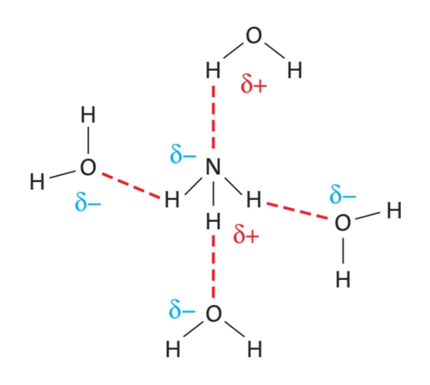
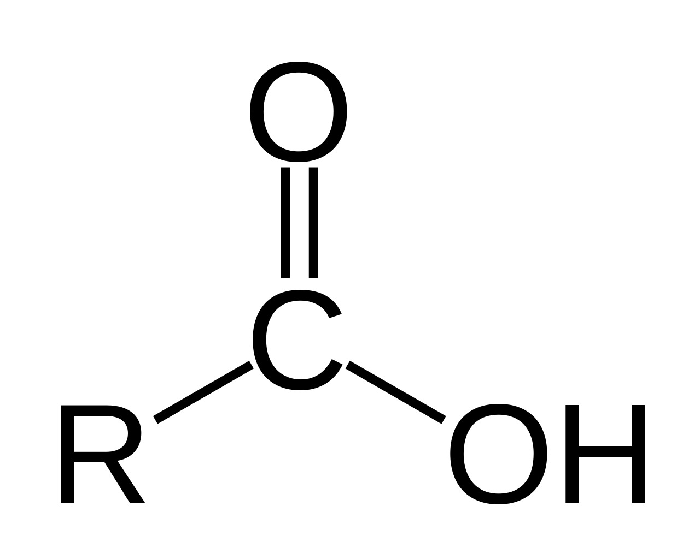
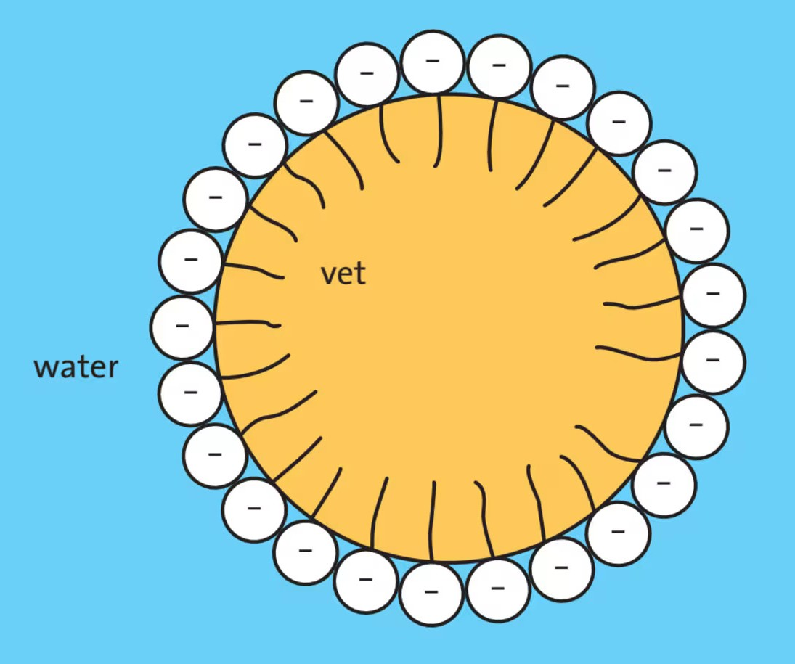
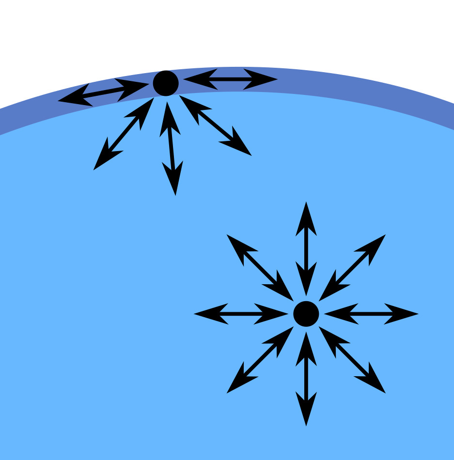

# Scheikunde: Hoofdstuk 5 (Mengen en oplossen)

## Atomen en moleculen

Er zijn 3 soorten krachten tussen atomen: metaalbindingen (bij metalen), ionbindingen (bij zouten) en covalente bindingen (bij moleculaire stoffen). Een covalente binding ontstaat wanneer 2 atomen een elektronenpaar delen.  
Bij het verbreken van de krachten tussen atomen ontstaat een chemische reactie (want de atomen vormen nieuwe moleculen).

Als de krachten tussen moleculen verbreken, vindt een faseovergang plaats.  
Bij vaste stoffen vallen de moleculen uit elkaar, waardoor het een vloeistof wordt. Bij vloeistoffen worden de krachten tussen moleculen zo zwak dat de stof gasvormig wordt. Je kunt dus aan het kookpunt zien hoe sterk de krachten tussen moleculen zijn: hoe hoger het kookpunt, hoe sterker de krachten, want je hebt dan meer energie nodig om de krachten te verbreken.

## Polaire bindingen

Bij een covalente binding in $\ce{H2}$ wordt het elektronenpaar gelijk verdeeld. Maar in $\ce{HF}$ trekt fluor harder aan het gedeelde elektronenpaar dan waterstof, waardoor de binding verschuift. Fluor krijgt hierdoor een gedeeltelijke negatieve lading ($\delta^-$) en waterstof een positieve lading ($\delta^+$). Dit noem je **partiële ladingen**. Zo'n binding heet een **polaire (atoom)binding**.

Elementen die graag een elektron willen hebben zijn **elektronegatief**, zoals fluor, zuurstof, chloor, broom en jood (FONClBrI), die rechtsboven in het periodiek systeem staan.

> Let op! De elektronen zijn nog steeds gedeeld. Bij een ionbinding binnen een zout gaat er echt een elektron van het ene atoom naar het andere, maar hier blijft het een gedeeld elektronenpaar.

Bij waterstoffluoride ontstaat een **dipool**, want het molecuul heeft een positieve en een negatieve kant. Stoffen met dipoolmoleculen noem je **polaire stoffen**, en zonder dipoolmoleculen noem je **apolaire stoffen**.

> Alle alkanen zijn apolair, omdat de $\ce{C-H}$- en $\ce{C-C}$-bindingen geen polaire atoombindingen zijn. Water is wel polair vanwege de $\ce{O-H}$-binding.

## Dipool-dipoolbinding

Tussen moleculen is er de vanderwaalskracht, die sterker is naarmate het molecuul groter is.  
Bij polaire stoffen is er ook een dipool-dipoolbinding, waarbij de negatieve kant van het ene molecuul de positieve kant van een ander molecuul aantrekt. Deze kracht is sterker dan de vanderwaalskracht, waardoor polaire moleculen sterker aan elkaar gebonden zijn dan apolaire moleculen van dezelfde molecuulmassa.

## Ruimtelijke bouw

Ondanks dat $\ce{CO2}$ een elektronegatief element heeft, is het een apolaire stof, omdat de 2 polaire bindingen elkaar opheffen doordat de atomen op 1 lijn liggen.

Bij water liggen de atomen niet op 1 lijn, waardoor het wel polair is.

## Waterstofbruggen

Waterstofbruggen zijn sterke dipool-dipoolbindingen. Ze ontstaan als een waterstofatoom gebonden is aan een sterk elektronegatief atoom zoals zuurstof of stikstof; de ladingen zijn dan relatief groot, waardoor er een sterke aantrekkingskracht ontstaat. Waterstofbruggen komen voor tussen moleculen met $\ce{OH}$- of $\ce{NH}$-groepen. Een waterstofbrug gaat altijd van de $\ce{O}$ of $\ce{N}$ van een $\ce{OH}$- of $\ce{NH}$-groep naar een $\ce{H}$ van een $\ce{OH}$- of $\ce{NH}$-groep (of andersom).  
Het maximale aantal waterstofbruggen hangt af van de atomen in de groep:

|                                                | Max. aantal H-bruggen |
| ---------------------------------------------- | --------------------- |
| $\ce{H}$ van een $\ce{OH}$- of $\ce{NH}$-groep | 1                     |
| $\ce{O}$ van een $\ce{OH}$-groep               | 2                     |
| $\ce{N}$ van een $\ce{NH}$-groep               | 1                     |

De waterstofbrug is de sterkste kracht tussen moleculen.  
Waterstofbruggen teken je als stippellijntjes tussen de atomen.

## Oplossen en mengen

Om een stof op te lossen, moeten bindingen tussen de moleculen van het oplosmiddel worden verbroken, en moeten er nieuwe bindingen tussen het oplosmiddel en de stof worden gevormd.  
De regel is: gelijke stoffen lossen goed op in elkaar. Polaire stoffen lossen op in polaire oplosmiddelen, apolaire stoffen in apolaire oplosmiddelen, maar polaire en apolaire stoffen mengen niet goed.  
Polaire stoffen zijn **hydrofiel** (ze lossen goed op in water). Apolaire stoffen zijn **hydrofoob** (ze lossen slecht op in water).

Ethanol lost goed op in water doordat de $\ce{OH}$-groep waterstofbruggen vormt met water. Het apolaire deel ($\ce{C2H5}$) is relatief klein, waardoor het ook maar een klein effect heeft. In pentaan-1-ol is het apolaire deel groter, waardoor het minder goed mengt met water.

## Carbonzuren

Carbonzuren hebben een **carboxylgroep** ($\ce{COOH}$). Deze zuurgroep bestaat uit een koolstofatoom, een $\ce{OH}$-groep en een zuurstofatoom dat dubbel gebonden is aan koolstof.

Een **alkaanzuur** is een eenvoudig carbonzuur met een alkaanketen en 1 carboxylgroep. De algemene formule van een alkaanzuur is $\ce{C_{n-1}H_{2n-1}COOH}$. De systematische naam bestaat uit de stamnaam van de koolstofketen en het achtervoegsel *-zuur*, zoals ethaanzuur. Het koolstofatoom in de carboxylgroep telt ook mee voor de langste koolstofketen.  
Kleine carbonzuren zijn hydrofiel, maar naarmate de koolstofketen langer wordt, neemt de oplosbaarheid af.

## Aminozuren

Aminozuren bevatten zowel een $\ce{COOH}$-groep als een $\ce{NH2}$-groep. De meeste aminozuren zijn hydrofiel.

## Emulgatoren

Een **emulgator** zorgt dat twee stoffen die normaal niet mengen, toch mengen. Zo'n mengsel heet een **emulsie** (inclusief de emulgator zelf).  
De emulgator heeft een apolaire koolstofstaart en een polaire hydrofiele kop.

Een bekende emulgator is natriumstearaat. Deze emulgator wordt bijvoorbeeld in handzeep gebruikt. Het stearaation (zie afbeelding) is een emulgator.  
De apolaire staarten gaan het vet binnen, terwijl de polaire koppen in het water blijven. Zo ontstaan er bolletjes van vet met emulgator eromheen: **micellen**.  
Deze micellen zijn goed oplosbaar in water, want de koppen zijn wel polair.

Je kunt dit ook omgekeerd toepassen: als je een druppeltje water in een fles olie doet, en je voegt een emulgator toe, zullen de polaire koppen in het druppeltje water gaan zitten en de apolaire staarten steken naar buiten.

En als je natriumstearaat in water oplost, zullen de polaire koppen in het water gaan zitten, maar de hydrofobe apolaire staarten willen niet in het water. Die zullen daarom in de lucht steken.

## Oppervlaktespanning

Watermoleculen trekken elkaar sterk aan door waterstofbruggen. De bovenste watermoleculen hebben geen moleculen boven zich, waardoor ze naar binnen worden getrokken. Dit zorgt ervoor dat het wateroppervlak als een vlies aanvoelt: **oppervlaktespanning**.

## Hydratatie

Als je een zout oplost, worden de afzonderlijke ionen door watermoleculen omringd: **hydratatie**. Water kan zowel negatieve als positieve ionen hydrateren, omdat water een dipool is.  
Bij een slecht oplosbaar zout lukt het de watermoleculen niet om het ionrooster te verbreken en de ionen te hydrateren.

## Kristalwater

Sommige zouten kunnen water opnemen in hun ionrooster. Er ontstaat dan **kristalwater**. Zouten die kristalwater bevatten heten **hydraten**. Je noteert dit met een punt in de formule.

$$\ce{FeSO4 + 7\~H2O -> FeSO4 * 7\~H2O}$$

In dit geval heeft elke mol ijzersulfaat 7 mol water in zijn ionrooster opgenomen.  
Het numerieke voorvoegsel voor 7 is *hepta*, dus de systematische naam van de stof $\ce{FeSO4 * 7\~H2O}$ is ijzersulfaatheptahydraat.

> Hoeveel mol water per mol zout in het rooster past, kun je vinden in Binas 45B en 65B.

Je kunt door te verwarmen ook het water weer uit het rooster halen:

$$\ce{FeSO4 * 7\~H2O ->[\text{warmte}] FeSO4 + 7\~H2O }$$

Zouten die water in hun ionrooster kunnen opnemen kunnen gebruikt worden om water uit een andere stof te halen.
