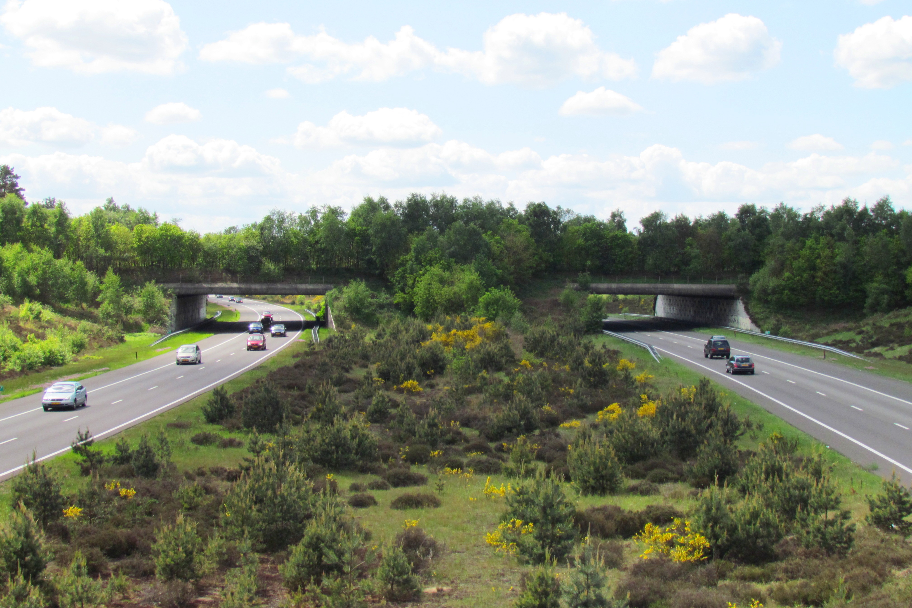

# Biologie: Hoofdstuk 6 (Soorten en populaties)

## Soorten en verwantschap

De definitie van een **soort** was de overeenkomst in uiterlijke kenmerken en de mogelijkheid om vruchtbare nakomelingen te krijgen. Tegenwoordig wordt DNA gebruikt om de indeling van soorten te bepalen.
Soms is de grens tussen soorten niet duidelijk, zoals bij **hybriden**: levensvatbare kruisingen tussen verschillende soorten. Hybriden zijn vaak niet vruchtbaar.

Alle soorten worden ingedeeld op basis van verwantschap met andere soorten (**taxonomie**). De taxonomie plaatst organisme in steeds grotere groepen (**taxa**): **organismen** $ \rightarrow $ **soorten** $ \rightarrow $ **geslachten** $ \rightarrow $ **families** $ \rightarrow $ **orden** $ \rightarrow $ **klassen** $ \rightarrow $ **afdelingen** $ \rightarrow $ **rijken** $ \rightarrow $ **domeinen**. Hoe minder verwant 2 organismen aan elkaar zijn, hoe minder taxa ze delen.

Er zijn 3 domeinen: **archaea**, **bacteriën** en **eukaryoten**. De archaea zijn net als bacteriën eencelligen zonder kernmembraan. Hun cirkelvormig DNA ligt los in het grondplasma en het celmembraan bestaat uit 1 laag. Elk domein heeft een eigen type rRNA (ribosomaal RNA).

> "Er zijn 3 domeinen" is een eigenlijk beetje kort door de bocht. Wij leren de indeling van de Amerikaanse bioloog Carl Woese (dus archaea, bacteriën en eukaryoten), maar de indeling van domeinen, rijken, "supergroepen" en nog meer, is niet helemaal waterdicht, best wel verschillend en vooral heel verwarrend, maar "er zijn 3 domeinen" dekt (voor nu) de lading.

Elke beschreven soort krijgt een **wetenschappelijke naam** volgens de **binominale nomenclatuur** *(bi-nominaal = twee namen)*. Die bestaat uit 2 delen: de geslachtsnaam (met een hoofdletter) en de soortnaam (met een kleine letter), zoals *Pygoscelis papua* (ezelspinguïn). Soms staat er achter deze 2 delen nog een naam voor een **ondersoort** (een afgescheiden onderverdeling), zoals *Canis lupus familiaris* (hond). Variaties binnen soorten (rassen) maken geen deel uit van de taxonomie.

## Populaties

Een **populatie** is een groep organismen van dezelfde soort in een bepaald gebied.
Er zijn verschillende manieren om een populatiegrootte te schatten:

- **Tellen**
  Vooral toepasbaar bij kleine populaties
- **Schatten**
  Zoals bij planten, je bepaalt dan het aantal bloemen per representatieve oppervlakte-eenheid en vervolgens de totale oppervlakte waar de plant groeit
- **Vangst-terugvangstmetode**
  Een aantal dieren vangen, die van een merkteken voorzien en vrijlaten ($n_1$). Na een tijdje worden er weer een aantal dieren gevangen ($n_2$), waarvan er een aantal een merkteken zullen hebben ($n_3$). Vervolgens kun je de totale populatiegrootte ($N$) schatten met de formule $N = \frac{n_1 \cdot n_2 }{n_3}$.

De populatiegrootte kan erg verschillen. Veranderingen van de populatiegrootte komen vooral door **geboorte**, **immigratie**, **sterfte** en **emigratie**.

Natuurlijke factoren hebben ook veel invloed op de populatiegrootte. Er is altijd 1 factor die de groei van een populatie het meest belemmert: de **beperkende factor**.

De maximale capaciteit van een gebied om voldoende voedsel en schuil- en nestplaatsen te leveren (waardoor de populatiegrootte constant blijft) is de **draagkracht** van een gebied.

## Natuurbeheer

**Natuurbeheer** is het beheren van natuurgebieden. Een van de doelen van natuurbeheer is het voorkomen van het uitsterven van soorten, en dus van de afname van de **soortensamenstelling**. Door de mens worden meer dan een miljoen soorten met uitsterven bedreigd.

Door menselijk handelen zijn veel leefgebieden van elkaar geïsoleerd: **versnippering**. Maatregelen als ecoducten (zie afbeelding) kunnen gebieden weer **ontsnipperen**.

Ook kunnen dieren worden uitgezet om de natuur te beheren. Zo kunnen grazers (dieren die planten eten) worden ingezet om de leefomgeving aantrekkelijker te maken voor andere soorten. Een te groot aantal grazers kan echter voor een **verstoring** (een snelle en blijvende verandering in een ecosysteem) zorgen.

Natuurbeheerders proberen soms soorten die waren verdwenen uit een gebied te **herintroduceren**: door uitzetting proberen een nieuwe populatie proberen te maken.

## Soorten en hun omgeving

Invloeden uit de levende natuur op organismen noem je **biotische factoren**, zoals roofdieren en planten. Invloeden die niet gekoppeld zijn aan organismen noem je **abiotische factoren**, zoals temperatuur, water en zonlicht.

Een leefomgeving die voldoet aan de specifieke biotische en abiotische eisen van een bepaalde soort, noem je een **habitat** (voor planten kan ook het begrip **standplaats** worden gebruikt).

Voor iedere abiotische factor heeft elke soort **tolerantiegrenzen** (een soort maximum en minimum). Buiten deze grenzen blijft geen enkel individu in leven. Veel organismen hebben, naast de tolerantiegrenzen, ook een **optimumgebied** voor abiotische factoren.
De tolerantiegrenzen en het optimumgebied kun je weergeven in een **tolerantiecurve**.

De **niche** van een soort is de omschrijving hoe die soort de omgeving gebruikt en beïnvloedt.
Een **adaptatie** is een erfelijke aanpassing aan het uiterlijk of het gedrag die ontstaan door langdurige selectieprocessen. Deze adaptaties kunnen ontstaan door mutaties in het genoom.

## Relaties tussen soorten

Als een soort een andere eet, spreek je van een **voedselrelatie**. Voedselrelaties kun je in een **voedselketen** zetten. Een voedselketen begint altijd met een producent (een plant of alg). Daarna komt de **consument van de eerste orde**, daarna de **consument van de tweede orde** enz.

De pijlen binnen de voedselketen volgen de organische stoffen: dus van wat gegeten wordt naar door wat het wordt gegeten.
Je kunt ook meerdere voedselketens aan elkaar koppelen. Je krijgt dan een **voedselweb**.

> Een voedselketen is dus gewoon van het ene organisme naar het andere, terwijl een voedselweb een overzicht is van alle onderlinge voedselrelaties.

**Herbivoren** zijn planteneters. De meeste planten overleven de schade die wordt aangericht door herbivoren. **Carnivoren**, vleeseters, moeten aan hun voedsel komen door **predatie** (het vangen en doden van prooi). **Omnivoren** zijn alleseters.

De relatie tussen een prooi en zijn natuurlijke vijand (**predator**) is een **predator-prooirelatie**. Prooien proberen te overleven door bijvoorbeeld camouflage, het leven in groepen, snelle voortplanting enz.

Naast de voedselrelaties komen er ook langdurige relaties voor: **symbiose**. In de tabel zie je de verschillende vormen van symbiose.

|          | Voordeel          | Neutraal                     | Nadeel          |
|:--------:|:-----------------:|:----------------------------:|:---------------:|
| Voordeel | **Mutualisme**    | **Commensalisme**            | **Parasitisme** |
| Neutraal | **Commensalisme** | **Epifytisme** (bij planten) | -               |
| Nadeel   | **Parasitisme**   | -                            | -               |

> Een neutraal-nadeel relatie bestaat eigenlijk wel: **amensalisme**, en bij een nadeel-nadeel relatie spreek je van **concurrentie** (hoef je niet te weten, maar misschien vind je het interessant)

Ziektes kunnen voedselketens verstoren. Als bijvoorbeeld een groot gedeelte van een bepaalde populatie sterft, zullen de predatoren van die soort weggaan. Ook gifstoffen kunnen voedselketens verstoren. **Accumulatie** van gifstoffen is het ophopen van die stoffen. De concentratie gif neemt bij elke schakel in de voedselketen toe. Sommige gifstoffen zijn **persistent**: ze kunnen jarenlang dieren blijven vergiftigen.

> Voorbeeld: er zit gif op planten tegen insecten. Die insecten krijgen een beetje gif in hun lichaam. Vervolgens worden de insecten opgegeten door een muizen. En de muizen worden opgegeten door roofvogels. Maar omdat de roofvogels meerdere muizen eten, en die muizen ook weer meerdere insecten eten, krijgt de roofvogel het gif binnen van veel insecten: accumulatie.

## Nieuwe populaties

**Fitness** is het vermogen om bepaalde allelen door te geven aan de volgende generatie. Als een populatie erg klein is, waardoor er binnen met familieleden gepaard moet worden, kan **inteelt** voor een gebrek aan genetische variatie zorgen.

Het toenemen of afnemen van de frequentie van een bepaald allel heet **genetic drift**.

Na een ramp waarbij het aantal individuelen sterk is afgenomen, zal ook de allelensamenstelling sterk afnemen: het **flessenhalseffect**.

Als er een nieuwe populatie ontstaat (kolonisatie), is de allelensamenstelling binnen de nieuwe groep minder gevarieerd dan de oorspronkelijke populatie: het **stichtereffect**.

Er is een verband tussen de grootte van een eiland, de afstand tot het vasteland en de soortenrijkdom. De **eilandtheorie** beschrijft dit verband ($ \Rightarrow $ Binas 93C ) Grote eilanden bieden meer niches en er kunnen meer soorten leven dan op kleine eilanden. Nabijgelegen eilanden ontvangen sneller nieuwe soorten dan afgelegen eilanden.
Op sommige punten ontstaat er dan een evenwicht tussen de immigratie en de sterfte.

