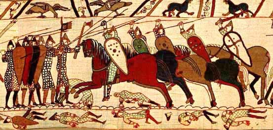

# Engelse taal en literatuur: Literatuurgeschiedenis (Middeleeuwen)

## History of the English language

There were multiple varieties of the English language throughout history:

- **Proto-English**: 0th-5th century
- **Old English** (also known as **Anglo-Saxon**): 5th-12th century
- **Middle English**: 12th- 16th century

### Old English

Old English was heavily influenced by 2 invasions/settlements:

- The **Anglo-Saxon invasions** (around the year 400) by 3 tribes from North Europe: The **Saxons**, the **Jutes** and the **Angles**.
- The **Viking invasions** (around the year 800) **brought about** many new words (such as \[sk-\] sounds: skill, sky, ...) and new grammar (such as them/their/they).

Old English displayed (*verdrong*) 2 languages that were spoken at the time on the British Isles: Britannic **Celtic** and **Latin**.

### Middle English

Middle English was mainly influenced by the Norman Conquest of 1066.

  
<a href="https://commons.wikimedia.org/wiki/File:Normans_Bayeux.jpg">Dan Koehl</a>, <a href="http://creativecommons.org/licenses/by-sa/3.0/">CC BY-SA 3.0</a>, via Wikimedia Commons

> This image, depicting the Battle of Hastings (one of the most important battles during the Norman Conquest), is from the *Bayeux Tapestry*, which is a very cool 70(!!!) meter long embroidered cloth depicing all kinds of events around the Norman Conquest.

During the Norman Conquest, thousands of Norman, French, Flemish and Breton invaded big parts of the British Isles.  
After this conquest, many kings and other high-ranking nobles spoke Anglo-Norman (French).  
With the addition of Anglo-Norman, there were 4 languages used on the British Isles:

- (Middle) English: used for daily life
- Anglo-Norman (French): used in government, law, church, ...
- Celtic: used by original locals in Scotland, Ireland and Wales
- Latin: used for learning, science, history, ...

The increased use of English was caused by 2 factors: intermarriage between people with different languages and by the invention of the printing press (allowing for much quicker communication)

## Medieval literature

### Beowulf

Beowulf is an **epic**: a long narrative (*voorgelezen*) poem. The most important characteristics of an epic are:

- It's about a hero
- The hero does good deeds
- The hero goes on adventure
- The story starts in the middle
- The story includes supernatural elements

Beowulf is one of the most important works of **Old English** literature. The story is set in Scandinavia in the 5th and 6th centuries.

#### Literary terms

| Term             | Definition                                                                                      |
| ---------------- | ----------------------------------------------------------------------------------------------- |
| Kenning          | Term that describes a noun in a metaphorical and figurative way, e.g. "Big rock" for mountain   |
| Tone             | Feeling/attitude of the author/story                                                            |
| Universal themes | Ideas/messages that can be found in stories from all over the world, and that apply to everyone |
| Setting          | Where and when                                                                                  |
| Plot             | The complete sequence of events in the entire story                                             |
| Alliteration     | Repetition of a letter or sound                                                                |

#### Summary

> Fun fact: the first word in Beowulf ("hwæt") doesn't actually have a perfect translation. For a long time, historians thought it was kind of an interjection to grab the reader's attention. That's why it was often translated as "hear me," "listen," or "indeed." But this theory is quite debated, so there are also other translations of *hwæt*, and seriously, [this translation](https://www.historytoday.com/archive/review/beowulf-bro) went with "bro."

Hrotgar is the current king of the Danes. He built a great mead hall (mead is a drink made from honey) named Herod.  
In the night, when all Hrotgar's men are asleep, the monster Grendel kills a few of them, because he can't stand the celebrations in Herot. He has done this for 12 years. The Danes try everything, but they can't get rid of him.

When Beowulf, "the strongest of the Geats", heard about Grendel, he decided to help Hrotgar. He goes to Denmark with 14 men.

When they arrive at Herot Beowulf leaves a few of his warriors outside. Then he and the rest take off their weapons and enter Herot to speak with King Hrothgar. Beowulf brags about his experience and strength and asks King Hrothgar for permission to fight Grendel all by himself. Hrothgar invites Beowulf to a feast in his honor, where Danes and Geats celebrate together.

During the meal, Unferth (Ecglaf's son) tells a story about a swimming match between Beowulf and Brecca. Beowulf lost this match against Brecca. He does this because he is jealous of Beowulf and tries to intimidate him.  
Beowulf replies by telling Unferth he's drunk (he is) and that his story is incorrect. Beowulf did indeed lose, but that's because he had to fight underwater monsters (and won), and Brecca did not. Then Beowulf exposes that Unferth killed his own brothers.  
All men go to sleep. In the night, Grendel visits Herot again. He kills one of the Geats. He then tries to kill Beowulf, but his is actually awake, and he fights Grendel with his bare hands.  
The other Geats wake up and try to hurt Grendel, but they can't hurt him with their swords, because he had bewitched the swords.  
Beowulf rips off Grendel's arm, and Grendel escapes, but his bleeds to death in his swamp.  
Beowulf hangs Grendel's arm from the ceiling of Herot.  
Some warriors trace Grendel's blood traces to find out that he had died in a lake.

Grendel's mother attacks Herot because of her grief for her son. She kills one man (Hrothgar's closest friend), and she takes Grendel's arm with her. Beowulf is awakened and asked to help. Beowulf goes to the lake where Grendel's mother lives. He takes the sword called Hrunting with him.  
Beowulf dives in and then sinks for hours. Grendel's mother tries to kill Beowulf, but his chain mail (*maliënkolder*) armor saves him. She has taken Beowulf to an underwater battle hall, and other monsters are looking at the fight. Beowulf tries to hit her with his sword, but her skin is just as bewitched as Grendel's was. She bites holes in his helmet, which then breaks. Beowulf threw Grendel's mother on the floor, but she quickly gets up, and she tries to kill him with a dagger, but the chainmail saves him once again.  
Then Beowulf saw a heavy sword hanging on the wall. He grabs it, and he chops her head off. He does the same thing to Grendel's body (which was there in the lake).

50 years later, Beowulf has to fight a dragon. The dragon is angry because a thief stole a jeweled cup, and Beowulf needs to protect his people. 

> Not yet finished!
