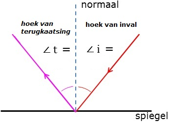
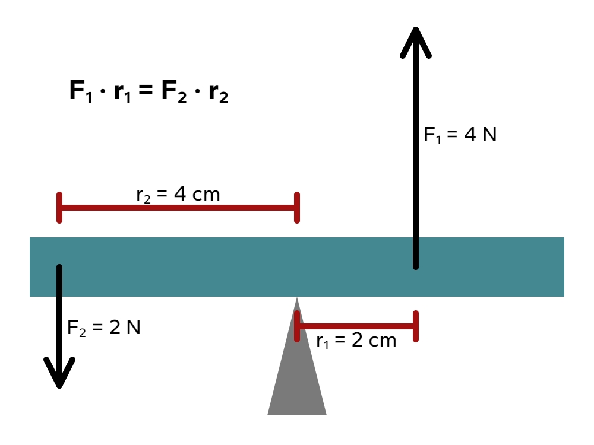
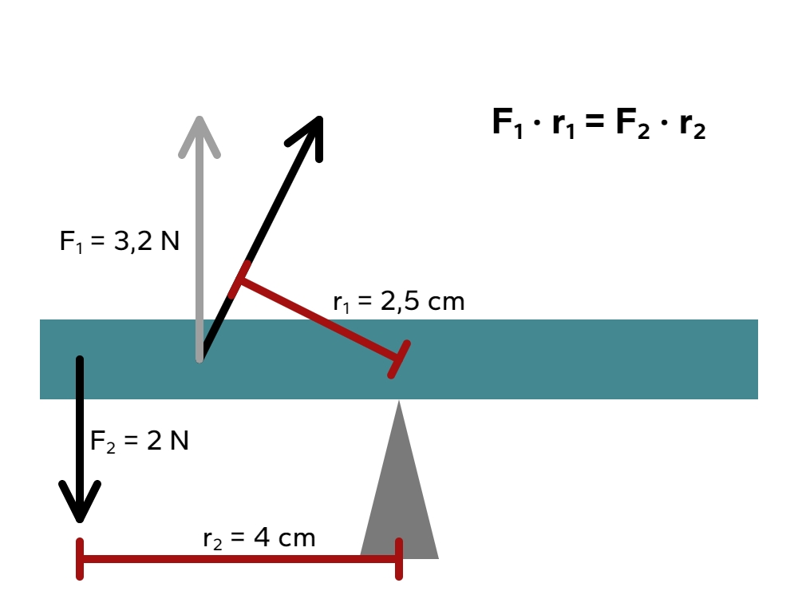

# Natuurkunde: Hoofdstuk 4 (Krachten) + Biofysica (Ogen/lenzen & Hefbomen)

## Krachten

### Verschillende krachten

Een kracht is een **vectorgrootheid**: het heeft een grootte, richting en aangrijpingspunt. Eigenlijk moet je een kracht noteren als $\vec{F}$, maar in de praktijk laat je het pijltje vaak weg.

Een kracht is altijd een wisselwerking tussen 2 voorwerpen. Als een auto tegen een boom rijdt, dan oefent de auto een kracht op de boom uit (**actiekracht**), maar de boom voert ook een kracht op de auto uit (**reactiekracht**).  
De twee krachten van een wisselwerking zijn precies even groot en werken in de tegengestelde richting, maar ze kunnen elkaar echter niet opheffen, omdat ze niet op hetzelfde voorwerp werken.  
Deze eigenschappen van een wisselwerking worden de **derde wet van Newton** genoemd:

$$\overrightarrow{F_{AB}}=-\overrightarrow{F_{BA}}$$
Hierin is $\overrightarrow{F_{AB}}$ de kracht van A op B (in $\text{N}$) en $\overrightarrow{F_{BA}}$ de kracht van B op A (in $\text{N}$).

Er zijn veel soorten krachten:

- **Spierkracht** ($F_\text{spier}$)  
  De kracht vanuit je spieren op andere voorwerpen.
- **Veerkracht** ($F_\text{v}$)  
  Voor de veerkracht geldt:  
  $F_\text{v}=C \cdot u$  
  Hierin is $F_\text{v}$ de veerkracht (in $\text{N}$), $u$ de uitrekking (in $\text{m}$) en $C$ de veerconstante (in $\text{N}/\text{m}$). Voor de veerconstante geldt: hoe groter de veerconstante, hoe stugger de veer.  
  
  De veerkracht werkt altijd in de richting van de veer.
- **Spankracht** ($F_\text{s}$)  
  De kracht van een touw op een voorwerp doordat er aan het touw wordt getrokken. De spankracht werkt altijd in de richting van het touw.
- **Zwaartekracht** ($F_\text{z}$)  
  De zwaartekracht is de kracht tussen de aarde en een massa. Voor de zwaartekracht geldt:  
  $F_\text{z}=m \cdot g$  
  Hierin is $F_\text{z}$ de zwaartekracht (in $\text{N}$), $m$ de massa (in $\text{kg}$) en $g$ de valversnelling (in $\text{N}/\text{kg}$ of $\text{m}/\text{s}^2$).  
  
  De valversnelling hangt af van de planeet. Op aarde is de gemiddelde valversnelling $9,81~\text{m}/\text{s}^2$.  
  De zwaartekracht grijpt altijd aan in het **zwaartepunt** van een voorwerp.
- **Normaalkracht** ($F_\text{n}$) en **gewicht** ($F_\text{gewicht}$)  
  Als de zwaartekracht een object naar beneden trekt, oefent het een kracht uit op de grond: het **gewicht**. Volgens de derde wet van Newton moet op deze actiekracht een reactiekracht zijn. Deze reactiekracht is de kracht van de grond die het object omhoog duwt: de **normaalkracht**. Deze staat altijd loodrecht op het oppervlak.  
  Op een horizontale ondergrond is de zwaartekracht even groot als de normaalkracht. Als je omhoog springt, duw je tegen de grond (met $F_\text{spier}$), wat de normaalkracht vergroot. Hierdoor wordt deze groter dan de zwaartekracht en kom je van de grond af.  
- **Schuifwrijvingskracht** ($F_\text{w,s}$)  
  Deze hangt af van hoe hard de oppervlakten tegen elkaar worden gedrukt en hoe ruw de oppervlakten zijn.  
  Er kan ook een schuifwrijving zijn als er nog geen bewering is. Als je bijvoorbeeld duwt tegen een zware kast, beweegt hij niet, terwijl je er wel een kracht op uitoefent. Er moet dus een reactiekracht aanwezig zijn: de schuifwrijving. Deze schuifwrijving past zich aan de actiekracht aan, maar niet boven de **maximale schuifwrijving** ($F_\text{w,s,max}$). Om de kast te verplaatsen heb je dus een uitwendige kracht nodig die gelijk is aan (of groter dan) de maximale schuifwrijving.  
  
  Voor de maximale schuifwrijving geldt:  
  $F_\text{w,s,max} = f \cdot F_\text{n}$  
  Hierin is $F_\text{w,s,max}$ de maximale schuifwrijvingskracht (in $\text{N}$), f de **wrijvingscoëfficiënt** (zonder eenheid) en $F_\text{n}$ de normaalkracht (in $\text{N}$).
- **Rolweerstandskracht** ($F_\text{w,r}$)  
  De grootte van deze kracht hangt af van de vervorming van het voorwerp dat rolt (zoals een band).
- **Luchtweerstandskracht** ($F_\text{w,l}$)  
  De grootte van deze kracht hangt af van de snelheid, de frontale oppervlakte, hoe gestroomlijnd het voorwerp is en de dichtheid van de lucht. In een formule:  
  $F_\text{w,l}=\frac{1}{2} \cdot \rho \cdot A \cdot c_w \cdot v^2$  
  Hierin is $F_\text{w,l}$ de luchtweerstandskracht (in $\text{N}$), $\rho$ de luchtdichtheid (in $\text{kg}/\text{m}^3$), $A$ de frontale oppervlakte (in $\text{m}^2$), $c_w$ de stroomlijnfactor (zonder eenheid) en $v$ de snelheid (in $\text{m}/\text{s}$).

### Krachten samenstellen

Van 2 schuine krachten kun je de somkracht bepalen met de **parallellogrammethode**. De 2 krachten vormen dan de zijdes van het parallellogram, en de diagonale krachtpijl is de somkracht. Als de hoek tussen de krachten 90 graden is, kun je de stelling van Pythagoras gebruiken om de grootte van de somkracht te bepalen.

Als 2 krachten niet op hetzelfde punt aangrijpen, kun je de krachten verschuiven langs hun **werklijn**: de lijn in het verlengde van de kracht.

Als je van 2 krachten alleen de richting en de somkracht weet, kun je de **omgekeerde parallellogrammethode** uitvoeren om de groottes van de krachten te bepalen.

Bij een versnelde of vertraagde beweging geldt dat de richting van de versnelling hetzelfde is als de richting van de somkracht. In een formule:

$$\vec{F}_\text{res} = \sum_i \vec{F}_i=m \cdot \vec{a}$$

Het $\sum$-teken betekent dat de krachten moeten worden samengesteld via de parallellogrammethode.

### Krachten splitsen

Een kracht kun je ontbinden in 2 **krachtcomponenten**.

In de afbeelding hieronder zie je een bewegend blokje op een helling. De zwaartekracht is getekend. De zwaartekracht heeft ook een effect in de bewegingsrichting. Om dit effect duidelijk te maken kun je de zwaartekracht ontbinden in 2 krachten, waarbij 1 kracht in de bewegingsrichting werkt ($F_\text{z,x}$) en 1 kracht loodrecht op de helling ($F_\text{z,y}$).

De steilheid van een helling hangt af van de hellingshoek ($\alpha$). Soms wordt in plaats van de hellingshoek het hellingspercentage gegeven. Je kunt van hellingshoek naar hellingspercentage rekenen met de tangens:

Als je $F_\text{z,x}$ wil berekenen in de figuur van het blokje, kun je de hoeken gebruiken van de helling.  
$F_\text{z,x}=F_\text{z}\cdot \sin(\alpha)$

Als je $F_\text{z,y}$ wil berekenen in de figuur van het blokje, kun je weer de hoeken gebruiken van de helling.  
$F_\text{z,y}=F_\text{z}\cdot \cos(\alpha)$

> Tip: leer niet deze formules voor deze specefieke situaties uit je hoofd, maar kijk of je een driehoek kan maken, welke je hoeken je dan hebt en pas vervolgens SOS-CAS-TOA toe.

## Ogen en lenzen

### Lichtstralen

**Lichtbundels** komen in 3 soorten voor: **parallel**, **divergent** (gaan uit elkaar) en **convergent** (gaan naar elkaar toe).  

Je kunt voorwerpen uit de omgeving zien, doordat ze licht weerkaatsen en jouw oog dat opvangt. Een spiegel weerkaatst licht in 1 richting, maar de meeste voorwerpen weerkaatsen licht in alle richtingen (**diffuse weerkaatsing**), zoals in de afbeelding hieronder. Weerkaatst licht vormt een divergente bundel.

Spiegels weerkaatsen volgens de spiegelwet: $\angle i = \angle t$ (hoek van inval = hoek van terugkaatsing). De hoeken zijn de hoeken met de normaal: een denkbeeldige lijn, loodrecht op het oppervlakte waar de lichtstraal invalt.

### Lenzen

Lenzen veranderen de richting van lichtstralen (**lichtbreking**). Positieve lenzen zijn dikker in het midden dan aan de randen. Ze maken lichtbundels convergenter (of minder divergent). Negatieve lenzen zijn dikker aan de randen dan in het midden. Ze maken lichtbundels divergenter (of minder convergent).

Lenzen kun je vereenvoudigd tekenen. Je verwaarloost dan de dikte van de lens en tekent deze als een lijn. De **optische as** is een gestippelde lijn loodrecht door het midden van de lens. Het midden van de lens is het **optisch midden** ($O$). Op de optische as staan 2 brandpunten ($F$). De afstand van het optisch midden tot de brandpunten is de brandpuntsafstand ($f$).

De sterkte van de lens hangt enkel af van de brandpuntsafstand:

$$S=\frac{1}{f}$$
Hierin is $S$ de sterkte van de lens (in $\text{dpt}=\text{m}^{-1}$) en $f$ de brandpuntsafstand (in $\text{m}$).

Een **voorwerpspunt** geef je aan met een $V$, de grootte (vaak lengte) van een voorwerp is de **voorwerpsgrootte** ($L_\text{v}$) en de afstand van het voorwerp tot de lens is de **voorwerpsafstand** ($v$).  
Door gebruik te maken van constructiestralen kun je bepalen waar een **beeldpunt** ($B$) zich bevindt. Ook kun je dan de **beeldgrootte** ($L_\text{b}$) en de **beeldafstand** ($b$) bepalen.

De regels voor constructie bij een positieve lens zijn:

- Een straal door het optisch midden verandert niet.
- Een straal die voor de lens door het brandpunt gaat, loopt na de lens parallel aan de optische as.
- Een straal die voor de lens parallel aan de optische as loopt, gaat na de lens door het brandpunt.

De regels voor constructie bij een negatieve lens zijn:

- Een straal door het optisch midden verandert niet.
- Een straal die voor de lens richting het tweede brandpunt gaat, loopt na de lens parallel aan de optische as.
- Een straal die voor de lens parallel aan de optische as loopt, lijkt na de lens uit het eerste brandpunt te komen.

Bij een negatieve lens ontstaat er geen beeld na de lens, maar als je de lichtstralen die na de lens onstaan zijn terugschetst, ontstaat er wel een (virtueel) beeld voor de lens.

#### Formules

Bij lenzen is er sprake van een **lineare vergroting**:

$$N=\frac{L_\text{b}}{L_\text{v}}=\frac{b}{v}$$
Hierin is $N$ de lineare vergroting (zonder eenheid, het is een verhouding), $L_\text{b}$ de beeldgrootte (in $\text{m}$), $L_\text{v}$ de voorwerpgrootte (in $\text{m}$), $b$ de beeldafstand (in $\text{m}$) en $v$ de voorwerpsafstand (in $\text{m}$).

De lenzenwet luidt:

$$S=\frac{1}{f}=\frac{1}{v}+\frac{1}{b}$$
Hierin is $S$ de sterkte van de lens (in $\text{dpt}=\text{m}^{-1}$), $f$ de brandpuntsafstand (in $\text{m}$), $v$ de voorwerpsafstand (in $\text{m}$) en $b$ de beeldafstand (in $\text{m}$).

### In het oog

In je oog moeten divergente lichtstralen convergent worden gemaakt, zodat ze mooi op 1 punt op het netvlies vallen. Je ooglens is dus positief.
Elk voorwerpspunt correspondeert met 1 beeldpunt op het netvlies.

De beeldafstand is gelijk aan de oogboldiameter. Deze varieert niet zo veel tussen mensen en is ongeveer 17 mm. De voorwerpsafstanden waar je ogen mee te maken variëren echter heel erg. Daarom moet de sterkte van je ooglens aanpasbaar zijn. Rond je ooglens zitten spieren die de lens wat boller kunnen maken: **accommoderen**. De sterkte van je ooglens kan variëren van ongeveer 65 dpt tot 59 dpt.  
Als je erg dicht bij moet kijken, moet je oog de lichtstralen het sterkst breken, dus dan is je oog geaccommodeerd. Voor grote voorwerpsafstanden is het oog ongeaccommodeerd. Als je "in de verte kijkt" is de voorwerpsafstand zo groot dat $\frac{1}{v}$ verwaarloosbaar klein is (in formules mag je zeggen dat $v=\infty$, ook al is dit eigenlijk niet correct).  
De kleinste afstand waarop je scherp kunt zien is de **nabijheidsafstand**. De grootste afstand waarop je scherp kunt zien is de **verteafstand**.

Hoe goed je ogen kunnen accommoderen neemt af met toenemende leeftijd. Oudere mensen kunnen daarom niet meer goed dichtbij kijken: ze zijn **oudziend** en hebben een leesbril nodig. Zo'n bril heeft positieve lenzen, zodat de lichtbundel minder divergent wordt. De sterkte van zo'n lens is simpelweg het verschil tussen wat er nodig is en wat het oog kan halen.

> Een leesbril verlaagt dus de nabijheidsafstand, maar verlaagt ook verteafstand, dus als een oudziende in de verte wil kijken, moet hij zijn leesbril af zetten!

Bij een **bijziende** zijn de ooglenzen juist te sterk. Hij kan wel goed van dichtbij zien, maar niet goed van veraf. Negatieve lenzen (in een bril of contactlenzen) kunnen hierbij helpen. Deze maken de bundel divergenter.

Bij een **verziende** zijn de ooglenzen te zwak. Positieve lenzen kunnen hierbij helpen.

> Het verschil tussen de verziende en de oudziende is dat de verziende bij kijken in de verte alsnog moet accomoderen, omdat zijn lens anders te zwak is.

## Bewegen en heffen

Binnen de natuurkunde noem je een draaibaar en onbuigbaar voorwerp een **hefboom**, zoals een slagboom, een deur, maar ook delen van je lichaam. Je lichaam is een verzameling hefbomen die ten opzichte van elkaar draaien. Ze zitten aan elkaar vast met **scharniergewrichten** (eenassig), **zadelgewrichten** (tweeassig) en **kogelgewrichten** (drieassig). Een beweging kun je dan omschrijven als een serie houdingen van deze hefbomen. De hefbomen bewegen door spieren.

Voor de "neiging tot draaiing" van een hefboom zijn 2 dingen belangrijk: de grootte van de kracht en de aangrijping van de kracht op de hefboom. Het krachtmoment is een grootheid voor deze "neiging tot draaiing".

$$M=F\cdot r$$
Hierin is $M$ het krachtmoment (in $\text{Nm}$), $F$ de kracht (in $\text{N}$) en $r$ de arm (in $\text{m}$). De arm is de **LOODRECHTE** afstand van het draaipunt ($S$) tot de **WERKLIJN** van de kracht.

  
In deze situatie zijn de momenten even groot

  
In deze situatie zijn de momenten ook even groot. De zwarte kracht bij $F_1$ is de origine kracht en de grijze kracht is de verticale component.

Als een hefboom niet of eenparig draait, geldt de **hefboomwet**:

$M_\text{L}=M_\text{R}$  
dus  
$F_\text{L}\cdot r_\text{L}=F_\text{R}\cdot r_\text{R}$  
Hierin is $M_\text{L}$ het linksdraaiend moment (in $\text{Nm}$), $M_\text{R}$ het rechtsdraaiend moment (in $\text{Nm}$), $F_\text{L}$ en $F_\text{R}$ zijn de krachten (in $\text{N}$) en $r_\text{L}$ en $r_\text{R}$ zijn de bijbehorende armen (in $\text{m}$).

> Om te kijken of een kracht een links- of rechtsdraaiend moment heeft moet je kijken in welke richting de kracht de hefboom laat draaien:  
> Rechtsdraaiend moment = met de klok mee  
> Linksdraaiend moment = tegen de klok in  
> Dus een kracht aan de rechterkant betekent niet een kracht met een rechtsdraaiend moment!

Als er meer dan 2 krachten een moment uitoefenen op de hefboom, moet er een evenwicht zijn tussen alle linksdraaiende momenten en alle rechtsdraaiende momenten:  

$$\sum_{M_\text{L}}=\sum_{M_\text{R}}$$

Naast de hefboomwet geldt als evenwichtsvoorwaarde dat $F_\text{res}=0$.

De kracht die de as op een hefboom uitoefent noem je de **draaipuntkracht**.
