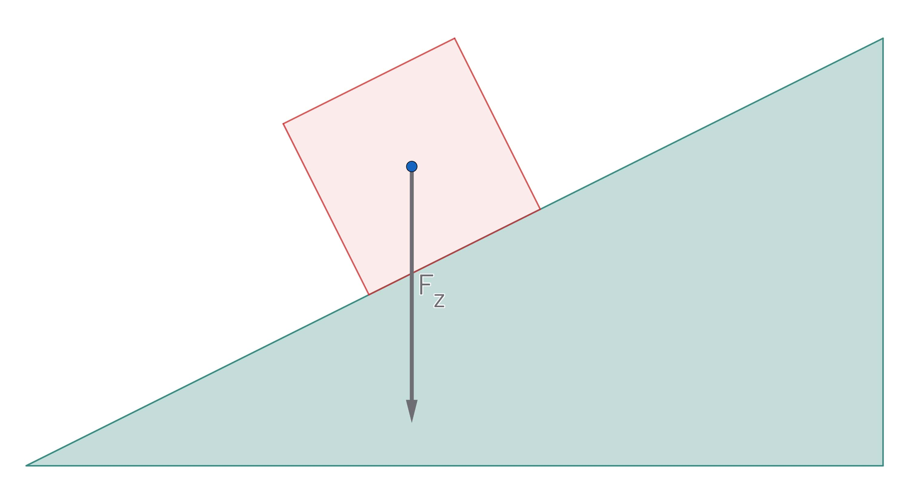
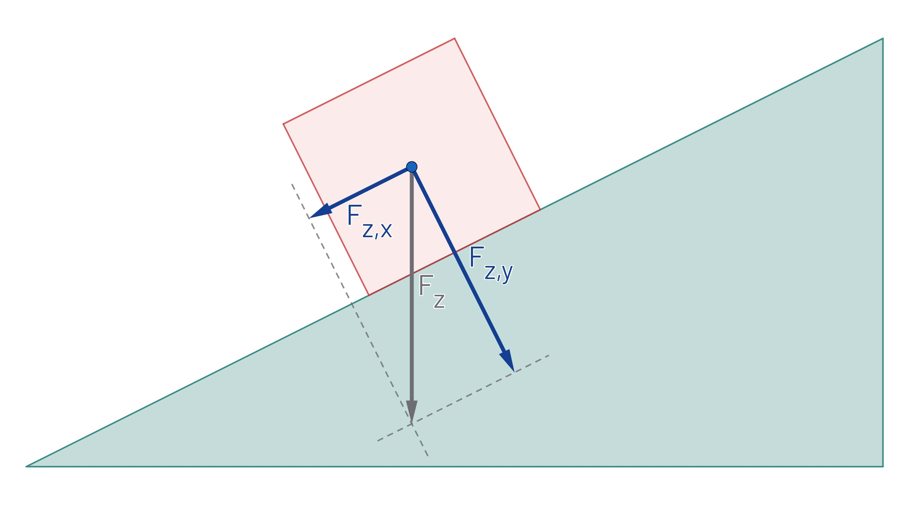
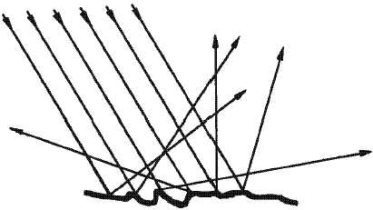

# Natuurkunde: Hoofdstuk 4 (Krachten) + Biofysica (Ogen/lenzen & Hefbomen)

## Krachten

### Verschillende krachten

Een kracht is een **vectorgrootheid**: het heeft een grootte, richting en aangrijpingspunt. Eigenlijk moet je een kracht altijd noteren als $\vec{F}$, maar in de praktijk laat je het pijltje vaak weg.

Een kracht is altijd een wisselwerking tussen 2 voorwerpen. Als een auto tegen een boom rijdt, dan oefent de auto een kracht op de boom uit (**actiekracht**), maar de boom voert ook een kracht op de auto uit (**reactiekracht**).  
De twee krachten van een wisselwerking zijn precies even groot en werken in de tegengestelde richting, maar ze kunnen elkaar echter niet opheffen, omdat ze niet op hetzelfde voorwerp werken.  
Deze eigenschappen van een wisselwerking worden de **derde wet van Newton** genoemd:
$$\overrightarrow{F_{AB}}=-\overrightarrow{F_{BA}}$$
Er zijn veel soorten krachten:

- **Spierkracht** ($F_\text{spier}$)  
  De kracht vanuit je spieren op andere voorwerpen.
- **Veerkracht** ($F_\text{v}$)  
  Voor de veerkracht geldt:  
  $F_\text{v}=C \cdot u$
  Hierin is $F_\text{v}$ de veerkracht (in $\text{N}$), $u$ de uitrekking (in $\text{m}$) en $C$ de veerconstante (in $\text{N}/\text{m}$). Voor de veerconstante geldt: hoe groter de veerconstante, hoe stugger de veer.  
  De veerkracht werkt altijd in de richting van de veer.
- **Spankracht** ($F_\text{s}$)
  De kracht van een touw op een voorwerp doordat er aan het touw wordt getrokken. De spankracht werkt altijd in de richting van het touw.
- **Zwaartekracht** ($F_\text{z}$)  
  De zwaartekracht is de kracht tussen de aarde en een massa. Voor de zwaartekracht geldt:  
  $F_\text{z}=m \cdot g$  
  Hierin is $F_\text{z}$ de zwaartekracht (in $\text{N}$), $m$ de massa (in $\text{kg}$) en $g$ de valversnelling (in $\text{N}/\text{kg}$ of $\text{m}/\text{s}^2$).  
  De valversnelling hangt af van de planeet. Op aarde is de gemiddelde valversnelling 9,81 $\text{m}/\text{s}^2$.  
  De zwaartekracht grijpt altijd aan in het **zwaartepunt** van een voorwerp.
- **Normaalkracht** ($F_\text{n}$) en **gewicht** ($F_\text{gewicht}$)  
  Als de zwaartekracht een object naar beneden trekt, oefent het een kracht uit op de grond: het **gewicht**. Volgens de derde wet van Newton moet op deze actiekracht een reactiekracht zijn. Deze reactiekracht is de kracht van de grond die het object omhoog duwt: de **normaalkracht**. Deze staat altijd loodrecht op het oppervlak.  
  Op een horizontale ondergrond is de zwaartekracht even groot als de normaalkracht. Als je omhoog sprint, duw je tegen de grond (met $F_\text{spier}$), wat de normaalkracht vergroot. Hierdoor wordt deze groter dan de zwaartekracht en kom je van de grond af.  
- **Schuifwrijvingskracht** ($F_\text{w,s}$)  
  Deze hangt af van hoe hard de oppervlakten tegen elkaar worden gedrukt en hoe ruw de oppervlakten zijn.  
  Er kan ook een schuifwrijving zijn als er nog geen bewering is. Als je bijvoorbeeld duwt tegen een zware kast, beweegt hij niet, terwijl je er wel een kracht op uitoefent. Er moet dus een reactiekracht aanwezig zijn: de schuifwrijving. Deze schuifwrijving past zich aan de actiekracht aan, maar niet boven de **maximale schuifwrijving** ($F_\text{w,s,max}$). Om de kast te verplaatsen heb je dus een uitwendige kracht nodig die gelijk is aan (of groter dan) de maximale schuifwrijving.  
  Voor de maximale schuifwrijving geldt:  
  $F_\text{w,s,max} = f \cdot F_\text{n}$  
  Hierin is $F_\text{w,s,max}$ de maximale schuifwrijvingskracht (in $\text{N}$), f de **wrijvingscoëfficiënt** (zonder eenheid) en $F_\text{n}$ de normaalkracht (in $\text{N}$).
- **Rolweerstandskracht** ($F_\text{w,r}$)  
  De grootte van deze kracht hangt af van de vervorming van het voorwerp dat rolt (zoals een band).
- **Luchtweerstandskracht** ($F_\text{w,l}$)  
  De grootte van deze kracht hangt af van de snelheid, de frontale oppervlakte, hoe gestroomlijnd het voorwerp is en de dichtheid van de lucht. In een formule:  
  $F_\text{w,l}=\frac{1}{2} \cdot \rho \cdot A \cdot c_w \cdot v^2$  
  Hierin is $F_\text{w,l}$ de luchtweerstandskracht (in $\text{N}$), $\rho$ de luchtdichtheid (in $\text{kg}/\text{m}^3$), $A$ de frontale oppervlakte (in $\text{m}^2$), $c_w$ de stroomlijnfactor (zonder eenheid) en $v$ de snelheid (in $\text{m}/\text{s}$).

### Krachten samenstellen

Van 2 schuine krachten kun je de somkracht bepalen met de **parallellogrammethode**. De 2 krachten vormen dan de zijdes van het parallellogram, en de diagonale krachtpijl is de somkracht. Als de hoek tussen de krachten 90 graden is, kun je de stelling van Pythagoras gebruiken om de grootte van de somkracht te bepalen.

Als 2 krachten niet op hetzelfde punt aangrijpen, kun je de krachten verschuiven langs hun **werklijn**: de lijn in het verlengde van de kracht.

Als je van 2 krachten alleen de richting en de somkracht weet, kun je de **omgekeerde parallellogrammethode** uitvoeren om de groottes van de krachten te bepalen.

Bij een versnelde of vertraagde beweging geldt dat de richting van de versnelling hetzelfde is als de richting van de somkracht. In een formule:

$$\vec{F}_\text{res} = \sum_{i} \vec{F}_i=m \cdot \vec{a}$$

Het $\sum$-teken betekent dat de krachten moeten worden samengesteld via de parallellogrammethode.

### Krachten splitsen

Een kracht kun je ontbinden in 2 **krachtcomponenten**.

In de afbeelding hieronder zie je een bewegend blokje op een helling. De zwaartekracht is getekend. De zwaartekracht heeft ook een effect in de bewegingsrichting. Om dit effect duidelijk te maken kun je de zwaartekracht ontbinden in 2 krachten, waarbij 1 kracht in de bewegingsrichting werkt ($F_\text{z,x}$) en 1 kracht loodrecht op de helling ($F_\text{z,y}$).

De steilheid van een helling hangt af van de hellingshoek ($\alpha$). Soms wordt in plaats van de hellingshoek het hellingspercentage gegeven. Je kunt van hellingshoek naar hellingspercentage rekenen met de tangens.

Als je $F_\text{z,x}$ wil berekenen in de figuur van het blokje, kun je de hoeken gebruiken van de helling.  
$F_\text{z,x}=F_\text{z}\cdot \sin(\alpha)$

Als je $F_\text{z,y}$ wil berekenen in de figuur van het blokje, kun je weer de hoeken gebruiken van de helling.  
$F_\text{z,y}=F_\text{z}\cdot \cos(\alpha)$

> Tip: leer niet deze formules voor deze specefieke situaties uit je hoofd, maar kijk of je een driehoek kan maken, welke je hoeken je dan hebt en pas vervolgens SOS-CAS-TOA toe.

## Ogen en lenzen

**Lichtbundels** komen in 3 soorten voor: **parallel**, **divergent** (gaan uit elkaar) en **convergent** (gaan naar elkaar toe).  
Lenzen veranderen de richting van lichtstralen (**lichtbreking**). Positieve lenzen zijn dikker in het midden dan aan de randen. Ze maken lichtbundels convergenter (of minder divergent). Negatieve lenzen zijn dikker aan de randen dan in het midden. Ze maken lichtbundels divergenter (of minder convergent).

Je kunt voorwerpen uit de omgeving zien, doordat ze licht weerkaatsen en jouw oog dat opvangt. Een spiegel weerkaatst licht in 1 richting, maar de meeste voorwerpen weerkaatsen licht in alle richtingen (**diffuse weerkaatsing**). Weerkaatst licht vormt een divergente bundel.

In je oog moeten divergente lichtstralen convergent worden gemaakt, zodat ze mooi op 1 punt op het netvlies vallen.

> Nog niet af!
