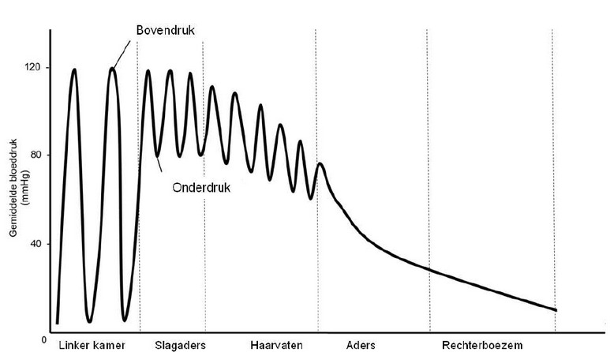
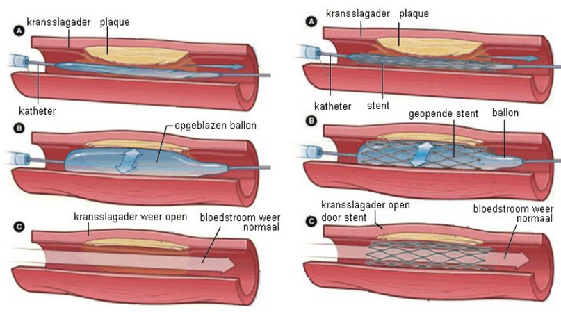

# Natuur, leven en technologie: Leef met je hart!

## Hart en vaten

De biologie kent verschillende organisatieniveaus: **molecuul**, **organel** (onderdeel van een cel), **cel**, **weefsel**, **orgaan**, **orgaanstelsel**, **organisme**, **populatie** (groep van 1 soort in 1 gebied), **levensgemeenschap** (alle organismen met relaties in een gebied), **ecosysteem** (gebied met relaties tussen organismen en natuur) en **systeem Aarde** (alle ecosystemen, chemische en biologische processen en de onderlinge interacties).

**Orgaanstelsels** bestaan uit verschillende organen met ongeveer dezelfde functie.

**Homeostase** is de eigenschap van het lichaam om inwendig in balans en stabiel te blijven.

Het **hart** is de pomp die het bloed door alle bloedvaten pompt. Het hart ligt bij de mens in de borstholte, boven het middenrif. Het hart is een **holle spier**, die uit 4 holtes bestaat. De 2 onderste holtes zijn de grotere **hartkamers** (of **ventrikels**). De bovenste holtes zijn de kleinere **boezems** (of **atria**). De boezems en kamers zijn van elkaar gescheiden met de **hartkleppen**.

De mens heeft een dubbele bloedsomloop:

- In de **kleine bloedsomloop** gaat het zuurstofarme bloed van de rechterkamer, via de longslagader naar de longen toe. Hier wordt het zuurstofrijk. Dit zuurstofrijke bloed gaat vervolgens via de longader naar de linkerkamer van het hart.
- In de **lange bloedsomloop** gaat het bloed van het hart naar de organen (en terug naar het hart). Vanuit het hart gaat het zuurstofrijke bloed uit de linkerkamer, via de aorta, slagaders en slagadertjes naar haarvaten toe. Hier geeft het zuurstof en voedingsstoffen af, en neemt het afvalstoffen op. Dit bloed gaat vervolgens via een adertje, ander en een holle ader terug naar het hart.

Om het bloed rond te pompen, trekt de hartspier zich samen in een bepaalde volgorde.

- Eerst trekken de boezems zich samen: **boezemsystole**; het bloed gaat naar de hartkamers toe. De hartkleppen zijn geopend en de halvemaanvormige kleppen zijn gesloten.
- Vervolgens trekken de kamers zich samen: **kamersystole**; het bloed wordt de longslagader en de aorta in gepompt. De hartkleppen zijn gesloten en de halvemaanvormige kleppen zijn geopend.
- Tenslotte ontspant het hart zich: **diastole**; alle kamers en boezems zijn ontspannen. De boezems vullen zich met bloed.

De bloedvaten vertakken zich steeds. Vanuit de aorta $ \rightarrow $ een slagader $ \rightarrow $ een slagadertje $ \rightarrow $ haarvaten (waar de stofwisseling plaatsvindt) $ \rightarrow $ een adertje $ \rightarrow $ een ader $ \rightarrow $ een holle ader. De druk in de slagaders is veel hoger dan in de aders.

Om met deze verschillen in druk om te kunnen gaan, zijn de slagaders, aders en haarvaten anders gebouwd. Aan de binnenkant van **elk vat** zit de endotheel: een eencellig bedekkend laagje. 

De slagaders hebben een dikke wand, met veel elastisch weefsel en veel glad spierweefsel. Haarvaten hebben alleen een endotheel, want anders zou er geen stofwisseling kunnen plaatsvinden.

Zodra het hart bloed in de slagader heeft gepompt zet de slagader uit. Omdat de slagader elastisch is, wil deze graag terug naar zijn originele vorm. Hierdoor zal het bloed worden weggeduwd. Dit kan alleen maar richting de organen, want de halvemaanvormige klep is inmiddels gesloten.

## Bloeddruk

De **bloeddruk** die door het hart wordt gemaakt is aan het begin van de slagaders het hoogst. De bloeddruk neemt af naarmate het bloed verder door de bloedsomloop stroomt door wrijving met de vaatwand.

Bloeddruk zou je kunnen meten in een normale eenheid, maar vrijwel iedereen gebruikt **millimeterkwikdruk** (mmHg). De **bovendruk** is de hoogste druk, dus tijdens een kamersystole. De **onderdruk** is de laagste druk, dus tijdens kamerdiastole.

Je kunt de bloeddruk meten. Er wordt dan een manchet om de bovenarm of pols gewikkeld. Deze wordt zo opgeblazen dat er net geen bloed meer kan stromen. Dit kan worden bepaald met een stethoscoop (als je niets meer hoort stromen). De druk op dat moment in de manchet is gelijk aan de bovendruk. Vervolgens wordt de manchet zo ontspannen dat er geen kloppend geluid meer is te horen (dan stroomt het bloed weer normaal). De druk op dat moment in de manchet is gelijk aan de onderdruk.

Om de bloeddruk aan te geven wordt vaak zowel de boven als onderdruk aangegeven. Je kunt ook de **MAP** (Mean Arterial Pressure) gebruiken. De map is niet het gemiddelde, want er wordt rekening gehouden met de duur van de diastole en de systole.

$$MAP = \frac{2 \cdot onderdruk + bovendruk}{3}$$

Je kunt de MAP ook op een andere manier berekenen:

$$MAP = cardiac\: output \cdot perifere\: weerstand$$

Je ziet dus dat de MAP afhangt van de *cardiac output* (dus de hoeveelheid bloed per slag) en de perifere weerstand (de weerstand die het bloed ondervindt in de slagaders).

## Slagaderverkalking

**Slagaderverkalking** is een langzaam proces waarbij geleidelijk cholesterol in de wand van slagaders wordt afgezet, waardoor de slagaders vernauwen.

De vetachtige stof **cholesterol** is belangrijk voor de bouw van cellen, maar slecht oplosbaar in het bloedplasma. Daarom bindt cholesterol zich aan bepaalde eiwitten voor het transport: **HDL** (high-density lipoprotein) en **LDL** (low-density lipoprotein). Als deze eiwitten zich aan cholesterol binden spreek je van HDL-cholesterol of LDL-cholesterol. Een te hoge hoeveelheid HDL-cholesterol is niet erg, omdat het in de lever kan worden afgebroken. Een te hoge hoeveelheid LDL-cholesterol is wel ernstig, omdat het zich in de vaten kan afzetten: er kunnen **plaques** ontstaan.

Een plaque begint als beschadiging van de binnenwand van slagaders. Vervolgens dringen cholesterol en andere stoffen de vaatwand in. Witte bloedcellen reageren hierop door grote hoeveelheden cholesterol op te nemen: ze worden **schuimcellen**. In de wand van een slagader kan een ophoping van schuimcellen ontstaan: een **fatty streak**.

Een fatty streak kan zich gaan verdikken, waardoor er nog minder bloed door de slagader kan stromen.

Bij een kwetsbare plaque is er slechts een dun weefsel tussen de plaque-cellen en het stromende bloed. Als deze weefsellaag openbarst, kan er een groot stolsel ontstaan, waardoor een slagader kan worden afgesloten.

Het verschil tussen een stabiele en kwetsbare plaque is dus ook de dikte van dit weefsel.

## Hartinfarct

Bij een **hartinfarct** (of **hartaanval**) krijgt een deel van de hartspier geen zuurstof meer. Het hart is zelf een spier, en deze heeft dus ook bloed nodig. Dit bloed krijgt hij via de **kransslagader**. Als hier een vernauwing ontstaat is dat dus erg gevaarlijk.

**Reanimeren** is het overnemen van de bloedsomloop door hartmassage en beademing. Reanimatie kan schade aan organen door zuurstofgebrek voorkomen, maar kan niet het hart opnieuw laten starten. Er is een **AED** nodig om het hart opnieuw "aan te zetten". Zo'n apparaat geeft een gecontroleerde schok aan het hart.

Na een hartinfarct wordt het afgestorven hartspierweefsel vervangen door bindspierweefsel. Dit weefsel is echter veel slechter in het rondpompen van het bloed. Daarom is het belangrijk om het hartinfarctgebied zo beperkt mogelijk te houden.

In de toekomst kan met **stamceltherapie** mogelijk dit probleem worden opgelost.

Een **dotterbehandeling** is een manier om een kransslagader te verwijden. De arts schuift via de liesslagader met een catheter een ballonnetje naar de plek van de vernauwing. Dit ballonetje wordt vervolgens opgeblazen, zodat de vaatwand en de plaque naar buiten worden gedrukt.

Er kan hierbij ook nog een **stent** geplaatst worden: een soort metalen roostertje die de kransslagader ook open houdt.

Als dotteren niet effectief genoeg is, kan er een **bypassoperatie** worden uitgevoerd. Er wordt een stukje ader (een ader uit het lichaam waarvan je een stukje kunt missen) om de vernauwing heen geleid. De vernauwing wordt dus niet weggehaald.

De inspanning die het hart moet leveren wordt bepaald door het rondgepompte bloedvolume en de gemiddelde bloeddruk (MAP). De MAP wordt bepaald door de *cardiac output* (dus de hoeveelheid bloed per slag) en de perifere weerstand (de weerstand die het bloed ondervindt in de slagaders). De *cardiac output* wordt bepaald door het slagvolume en de hartfrequentie.

## Medicijnen

Hier een overzicht van medicijnen die invloed hebben op de werking van het hart en/of vaten.

- **Bloedverdunners**
  
  - **Stollingsremmers** zorgen ervoor dat het bloed minder snel stolt.
  
  - **Plaatjesremmers** zorgen ervoor dat de bloedplaatjes minder goed hun werk doen, waardoor trombose of embolie kan optreden.

- **Cholesterolverlagers**
  
  - **Statine** remt de aanmaak van cholesterol in de lever, en vertraagt dus ook het slagaderverkalkingsproces.

- **Hartritmebeïnvloeders**
  
  - **Digoxine** vergroot de pompkracht van het hart, verlaagt het hartritme en laat de zuurstofconsumptie van het hart toenemen.
  
  - **Bètablokkers** verlagen de hartfrequentie en verminderen de zuurstofbehoefte van het hart. Ook verlagen ze de bloeddruk.

- **Plaspillen**
  
  - **Diuretica** zorgen voor veel vochtafvoer via urine, waardoor het bloedvolume afneemt, waardoor de bloeddruk afneemt.

- **Vaatverwijdingsmedicijnen**
  
  - **ACE-remmers** zorgen voor een verlaging van de perifere weerstand, wat voor een verlaging van de MAP (dus van de bloeddruk) zorgt.
  
  - **Angiotensine II-receptorantagonisten** blokkeren de werking van het bloeddrukverhogende hormoon **angiotensine** door de receptoren van **angiotensine II** te blokkeren met **antagonisten**, waardoor de bloeddruk daalt.
  
  - **Calciumantagonisten** remmen de werking van calciumionen waardoor spiercellen zich minder goed kunnen samentrekken, waardoor de kracht van elke hartslag en de hartfrequentie wordt verminderd. Bovendien wordt de perifere weerstand verlaagd.
  
  - **Nitraten** en **nitrieten** verslappen de gladde spieren van slagaders en aders waardoor de bloedvaten wijder worden, waardoor zowel de bloeddruk als de perifere weerstand daalt.

## Preventie

Er zijn een aantal risicofactoren die invloed hebben op het krijgen van een hartinfarct.

- **Overgewicht** of **obesitas** (ernstig overgewicht) zorgt voor een hoog LDL-cholesterolgehalte (hogere kans op slagaderverkalking) en voor een hogere bloeddruk (sneller verslijten vaten). Overgewicht gaat ook gepaard met verminderde glucose-tolerantie, wat zorgt voor een verhoogde afscheiding van insuline, wat een risicofactor is voor het onstaan van Diabetes type II, wat een risicofactor is voor het krijgen van hart- en vaatziekten.
  
  $$BMI = \frac{gewicht}{lengte^2}$$

- **Erfelijkheid**

- **Roken** zorgt voor beschadiging van de vaatwant. Bovendien verdringt de hogere concentratie $CO_2$ zuurstof. Nicotine verhoogt de hartslag en de bloeddruk.

- **Stress** heeft vooral invloed op het gedrag van mensen, waardoor ze bijvoorbeeld gaan roken, veel eten, drinken, minder bewegen enz.
