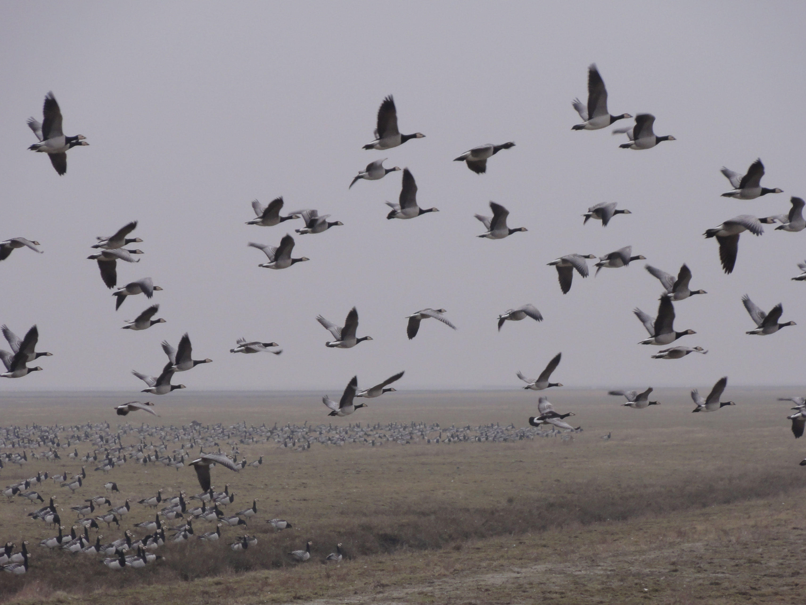

# Biologie: Hoofdstuk 8 (Kenmerken van ecosystemen)

## Organisch en anorganisch

Ecosystemen functioneren dankzij de **kringlopen** van stoffen.

Elke voedselketen begint met een **producent** die **anorganische stoffen** omzet in **organische stoffen**. Planten doen dit via **fotosynthese**. Ze gebruiken daarvoor de lichtenergie van de zon; het zijn dus **foto-autotrofe** organismen.  
Ook sommige bacteriën zijn producenten. Bepaalde bacteriën in de grond maken gebruik van **chemosynthese**: ze bouwen organische stoffen op met energie die vrijkomt bij chemische reacties. Deze bacteriën zijn **chemo-autotroof**.  
Door **voortgezette assimilatie** ontstaan andere organische stoffen. Hiervoor zijn stoffen uit de bodem nodig, zoals stikstof en fosfor.

De **consumenten** eten producenten of andere consumenten, waardoor organische stoffen zich door de voedselketen verplaatsen. Deze organismen zijn **heterotroof**: ze gebruiken organische stoffen van andere organismen.  
Dode resten van planten en dieren zijn voedsel voor **detrituseters**. Alle overgebleven restjes uit de voedselketens komen uiteindelijk bij de **reducenten** terecht: bacteriën en schimmels. Zij zetten organische stoffen weer om in anorganische stoffen.

### Grondlagen & composteren

De bovenste bodemlaag bestaat uit houtstof en cellulose: de **strooisellaag**. Samen met de uitwerpselen van detrituseters vormt deze laag de **humuslaag**. Deze laag is een belangrijke voedselbron voor bacteriën.

De **ecologische voetafdruk** is de totale oppervlakte land en water die een mens gebruikt als leefruimte, productieruimte en voor het verwerken van afval.

**Composteren** is het gecontroleerd afbreken van organische stoffen door reducenten. De snelheid daarvan hangt af van verschillende factoren:

- **Temperatuur**  
  Hoe hoger de temperatuur, hoe sneller de compostering verloopt.
- **Eigenschappen van de reducenten**  
  Elke schimmel- en bacteriesoort heeft een eigen leefgebied. Bij veel $\ce{O2}$ hebben **aerobe** soorten een voordeel. **Anaerobe** soorten (die geen zuurstof nodig hebben) werken meestal langzamer.
- **Samenstelling van het afval**
- **Koolstof/stikstof-verhouding**  
  Reducenten gebruiken afval als energiebron, maar hebben ook stikstof nodig voor eiwitsynthese. Te weinig stikstof beperkt de bacteriegroei en vertraagt de compostering.

## Energie

Energie uit zonlicht is de belangrijkste energiebron voor vrijwel elk ecosysteem op Aarde.

**Consumenten van de eerste orde** (C1) zijn de consumenten die direct producenten opeten. De **consumenten van de tweede orde** (C2) eten vervolgens de C1, enzovoort.

**Herbivoren** zijn planteneters. **Carnivoren**, vleeseters, moeten aan hun voedsel komen door het vangen en doden van prooi. **Omnivoren** zijn alleseters.

De plaats van een organisme in een voedselketen noem je het **trofisch niveau**. Alle producenten vormen het eerste trofische niveau. De consumenten van de eerste orde vormen het tweede trofische niveau, enzovoort.

De eerste stap in de voedselketen is de **bruto primaire productie** (**BPP**). Dit is de hoeveelheid organische stoffen die autotrofe organismen (zoals planten) per jaar produceren uit anorganische stoffen. Een deel van deze energie wordt door de producenten zelf verbruikt. Wat er verder overblijft, noem je de **netto primaire productie** (**NPP**), en dit is de energie die beschikbaar is voor de volgende trofische niveaus.

Trofische relaties in ecosystemen zijn moeilijk in kaart te brengen vanwege de enorme aantallen organismen. Aantallen geven bovendien geen goed beeld van de hoeveelheid energie. Daarom gebruiken biologen **biomassa**: de massa aan energierijke organische stoffen. Een **piramide van biomassa** is een momentopname van de verdeling van biomassa in een ecosysteem. Het jaargemiddelde hiervan levert een **piramide van productiviteit** op.

Een **energiestroomschema** toont op trofisch niveau wat er met de biomassa gebeurt.

- De *intake* (**I**) is de hoeveelheid energierijke stoffen die het organisme binnenkrijgt  
- De *feces* (**F**) is het onverteerbare deel van de voeding dat als ontlasting het lichaam verlaat  
- Deel **A** is de hoeveelheid energierijke stoffen die aan het bloed wordt afgegeven  
- Deel **P** is de hoeveelheid organische stoffen die als **bouwstof** worden gebruikt  
- Deel **R** is de hoeveelheid organische stoffen die als **brandstof** worden gebruikt  

### De Waddenzee

Het beheer van de Waddenzee is complex vanwege botsende belangen tussen natuurbeheerders en vissers. Vissers wijzen vaak naar zeehonden als oorzaak van visafname, terwijl onderzoekers vooral milieufactoren als waterstromen, bodemschade en verminderde voedingsstoffen noemen.

De primaire productie (groei van fytoplankton) wordt beïnvloed door:

- **Licht**  
  In de Waddenzee is de lichtvoorziening goed geregeld.
- **Voedingsstoffen**  
  Vroeger zorgde **eutrofiëring** (verrijking met voedingsstoffen) voor een explosieve groei van bepaalde soorten. Sinds er strengere milieuregels voor het lozen van nitraat en fosfaat gelden, is de primaire productie gedaald.
- **Temperatuur**  
  Hogere temperaturen veroorzaken een eerdere groei van plankton en vissen, waardoor de voedselketen verstoord wordt.

## Kringlopen

### Koolstofkringloop

De **snelle koolstofkringloop** bestaat uit alle voedselketens. Planten gebruiken koolstofdioxide uit de atmosfeer om glucose te maken. Consumenten eten deze planten, waarna reducenten de consumenten afbreken. Door **dissimilatie** (het afbreken van organische stoffen) door producenten, consumenten en reducenten komt koolstofdioxide weer vrij in de atmosfeer.

Onder hoge druk kunnen niet-afgebroken plantenresten veranderen in bruin- en steenkool: **fossiele brandstoffen**. Door het verbranden van deze brandstoffen komt de opgeslagen koolstof weer vrij in de atmosfeer: de **langzame koolstofkringloop**.  
Een opslagplaats van koolstof heet een **sink**. Een plaats waar koolstof vrijkomt, noem je een **source**.

### Stikstofkringloop

Producenten gebruiken stikstof uit nitraat om aminozuren te vormen. Deze plantaardige eiwitten worden in de voedselketen omgezet in dierlijke eiwitten.

Bij de afbraak van eiwitten door consumenten ontstaat onder andere **ureum**. **Urobacteriën** zetten ureum om in ammoniak.  
**Rottingsbacteriën** breken eiwitten en andere organische resten af tot ammoniak. Dit proces heet **rotting**.  
Samen heten deze processen **ammonificatie**.

Ammoniak reageert in de bodem met water tot ammonium-ionen ($\ce{NH4^+}$). Vervolgens zetten chemo-autotrofe **nitrietbacteriën** ammonium om in nitriet, en **nitraatbacteriën** zetten nitriet om in nitraat. Dit proces heet **nitrificatie**. Het nitraat is weer beschikbaar voor het vormen van aminozuren.

Daarnaast zijn er manieren waarop de hoeveelheid stikstof in een ecosysteem toe- of afneemt:

- **Stikstoffixerende bacteriën** halen stikstofgas ($\ce{N2}$) uit de lucht en zetten het om in ammoniak ($\ce{NH3}$).
- Tijdens onweer reageren zuurstof en stikstof in de atmosfeer tot $\ce{NO_x}$ (zoals $\ce{NO2}$ of $\ce{NO3}$).
- **Uitspoeling** is het wegspoelen van stikstof uit het ecosysteem naar het grondwater, bijvoorbeeld bij langdurige regen.
- **Denitrificatie** zet nitraat om in stikstofgas, dat weer vrijkomt in de atmosfeer.

### Rioolwaterzuivering

In een **rioolwaterzuiveringsinstallatie** (RWZI) spelen bacteriën een grote rol. Bacteriën breken koolstofverbindingen af tot $\ce{CO2}$. Rottings- en urobacteriën zetten stikstofverbindingen om in ammoniak en uiteindelijk ammonium. Ammonium wordt vervolgens omgezet in nitriet en nitraat. Daarna halen **denitrificerende bacteriën** het nitraat uit het water door het om te zetten in stikstofgas.

Het gezuiverde water mag daarna het oppervlaktewater in.

Het kraanwater komt niet direct uit RWZI's. Drinkwater in Nederland wordt gewonnen uit grond- en oppervlaktewater. Eerst worden afvalstoffen verwijderd. Voor de **waterzuivering** slaan drinkwaterbedrijven het water op in spaarbekkens, waar veel verontreiniging naar de bodem zinkt. Ook wordt het water gefilterd, bijvoorbeeld via duinen of fijne zeven. Tot slot wordt het water gedeïoniseerd en worden bacteriën verwijderd.

## Ecosystemen

We onderscheiden 2 **stadia van successie**:

In het **pioniersstadium** zijn er weinig soorten. **Pionierssoorten** groeien snel, leven kort en produceren veel zaden. Concurrentie tussen deze soorten is minimaal. Door hun aanwezigheid neemt het organisch materiaal in de bodem toe, waardoor nieuwe soorten kunnen ontstaan. In dit stadium hebben abiotische factoren een grote invloed.

In het **climaxstadium** neemt het aantal soorten toe, terwijl het aantal individuen per soort juist afneemt. De totale biomassa is groter dan in het pioniersstadium. Er ontstaan veel onderlinge relaties tussen soorten en de invloed van abiotische factoren neemt af.

**Successie** is het proces waarbij een gebied zich ontwikkelt van kale bodem tot natuurgebied.

- **Primaire successie** start op kale grond.  
- **Secundaire successie** begint op een plek waar eerder natuur was, maar door verstoring is verdwenen. Dit gaat sneller omdat er al een humuslaag is.

Soms blijft de successie steken in een **subclimaxstadium** door het gedrag van dieren.

Op de afbeelding zie je brandganzen in een *kwelder*. Hun eetgedrag remt de successie omdat er te weinig organisch materiaal in de bodem komt.

### Exoten

**Exoten** zijn soorten die zich door menselijk handelen in een ecosysteem vestigen. Soms zijn ze ongewenst en verdringen ze bestaande soorten. Dan noemen we ze **plaagorganismen**.
