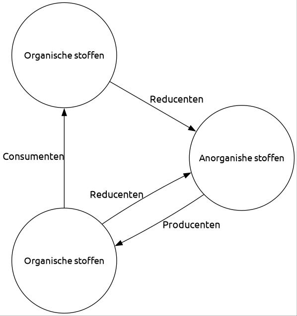

# Biologie: Hoofdstuk 8 (Kenmerken van ecosystemen)

## Organish en anorganish

Ecosystemen functioneren dankzij de **kringlopen** van stoffen.

Elke voedselketen begint met een **producent** die **anorganische stoffen** omzet in **organische stoffen**. Planten doen dit via **fotosynthese**. Ze gebruiken daarvoor de lichtenergie van de zon; het zijn dus **foto-autotrofe** organismen.  
Ook sommige bacteriën zijn producenten. Bepaalde bacteriën in de grond maken gebruik van **chemosynthese**: ze bouwen organische stoffen op met energie die vrijkomt bij chemische reacties. Deze bacteriën zijn **chemo-autotroof**.  
Door **voortgezette assimilatie** ontstaan andere organische stoffen. Hiervoor zijn stoffen uit de bodem nodig, zoals stikstof en fosfor.

De **consumenten** eten producenten of andere consumenten, waardoor organische stoffen zich door de voedselketen verplaatsen. Deze organismen zijn **heterotroof**: ze gebruiken organische stoffen van andere organismen.  
Dode resten van planten en dieren zijn voedsel voor **detrituseters**. Alle overgebleven restjes uit de voedselketens komen uiteindelijk bij de **reducenten** terecht: bacteriën en schimmels. Zij zetten organische stoffen weer om in anorganische stoffen.

### Grondlagen & composteren

De bovenste bodemlaag bestaat uit houtstof en cellulose: de **strooisellaag**. Samen met de uitwerpselen van detrituseters vormt deze laag de **humuslaag**. Deze laag is een belangrijke voedselbron voor bacteriën.

De **ecologische voetafdruk** is de totale oppervlakte land en water die een mens gebruikt als leefruimte, productieruimte en voor het verwerken van afval.

**Composteren** is het gecontroleerd afbreken van organische stoffen door reducenten. De snelheid daarvan hangt af van verschillende factoren:

- **Temperatuur**  
  Hoe hoger de temperatuur, hoe sneller de compostering verloopt.
- **Eigenschappen van de reducenten**  
  Elke schimmel- en bacteriesoort heeft een eigen leefgebied. Bij veel $\ce{O2}$ hebben **aerobe** soorten een voordeel. **Anaerobe** soorten (die geen zuurstof nodig hebben) werken meestal langzamer.
- **Samenstelling van het afval**
- **Koolstof/stikstof-verhouding**  
  Reductenten gebruiken afval als energiebron, maar hebben ook stikstof nodig voor eiwitsynthese. Te weinig stikstof beperkt de bacteriegroei en vertraagt de compostering.

## Energie

Energie uit zonlicht is de belangrijkste energiebron voor vrijwel elk ecosysteem op Aarde.

**Consumenten van de eerste orde** (C1) zijn de consumenten die direct producenten opeten. De **consumenten van de tweede orde** (C2) eten vervolgens de C1, enzovoort.

**Herbivoren** zijn planteneters. **Carnivoren**, vleeseters, moeten aan hun voedsel komen door het vangen en doden van prooi. **Omnivoren** zijn alleseters.

De plaats van een organisme in een voedselketen noem je het **trofisch niveau**. Alle producenten vormen het eerste trofische niveau. De consumenten van de eerste orde vormen het tweede trofische niveau, enzovoort.

De eerste stap in de voedselketen is de **bruto primaire productie** (**BPP**). Dit is de hoeveelheid organische stoffen die autotrofe organismen (zoals planten) per jaar produceren uit anorganische stoffen. Een deel van deze energie wordt door de producenten zelf verbruikt. Wat er verder overblijft, noem je de **netto primaire productie** (**NPP**), en dit is de energie die beschikbaar is voor de volgende trofische niveaus.

Trofische relaties in ecosystemen zijn moeilijk in kaart te brengen vanwege de enorme aantallen organismen. Aantallen geven bovendien geen goed beeld van de hoeveelheid energie. Daarom gebruiken biologen **biomassa**: de massa aan energierijke organische stoffen. Een **piramide van biomassa** is een momentopname van de verdeling van biomassa in een ecosysteem. Het jaargemiddelde hiervan levert een **piramide van productiviteit** op.

Een **energiestroomschema** toont op trofisch niveau wat er met de biomassa gebeurt.

- De *intake* (**I**) is de hoeveelheid energierijke stoffen die het organisme binnenkomt  
- De *feces* (**F**) is het onverteerbare deel van de voeding dat als ontlasting het lichaam verlaat  
- Deel **A** is de hoeveelheid energierijke stoffen die aan het bloed wordt afgegeven  
- Deel **P** is de hoeveelheid organische stoffen die als **bouwstof** worden gebruikt  
- Deel **R** is de hoeveelheid organische stoffen die als **brandstof** worden gebruikt  

### De waddenzee

Het beheren van de Waddenzee is complex door botsende belangen tussen natuurbeheerders en vissers. Vissers wijzen op zeehonden als oorzaak van visafname, maar onderzoekers wijzen op milieufactoren zoals waterstromen, bodemschade en minder voedingsstoffen.

De primaire productie (groei van fytoplankton) wordt beïnvloed door:

- **Licht**  
  Dit is in de Waddenzee al goed geregeld.
- **Voedingsstoffen**  
  Vroeger leidde **eutrofiering** (vereikking met voedingsstoffen) tot een explosieve toename van sommige soorten. Sinds er strengere milieuregels zijn rond het lozen van nitraat en fosfaat is de primaire productie gedaald.
- **Temperatuur**  
  Hogere temperaturen zorgen voor een eerdere groei van plankton en vissen, waardoor de voedselketen wordt verstoord.

## Kringlopen

### Koolstofrkingloop

De **snelle koolstofkringloop** bestaat uit alle voedselketens. Koolstofdioxide uit de atmosfeer wordt door planten gebruikt om glucose te maken. De consumenten eten dit op, waarna consumenten weer door reducenten worden afgebroken. Door **dissimilatie** (het afbreken van stoffen) gedaan door zowel producentne, consumenten als reducenten komt er weer koolstofdioxide in de atmosfeer.

Bij hoge druk kunnen niet afgebroken plantenresten veranderen in bruin- en steenkool (**fossiele brandstoffen**). Door fossiele branstoffen miljoenen jaren later weer te verbranden, komt deze koolstof weer vrij in de atmosfeer: de **langzame koolstofkringloop**.  
De opslaglplaats van koolstofverbindingen noem je een **sink**. Een plaats waar opgeslagen koolstof vrijkomt, noem je een **source**.

### Stikstofkringloop

Producenten gebruiken het stikstof uit nitraat om aminozuren te vormen. De aminozuren uit deze plantaardige eiwitten worden vervolgens in de voedselketens gebruikt om dierlijke eiwitten te bouwen.

Bij de afbraak van eiwitten door consumenten ontstaat onder andere **ureum**. De **urobacteriën** verwerken het ureum tot ammoniak.  
De **rottingsbacterien** breken eiwitten en andere organische restmaterialen af tot ammoniak: **rotting**.  
Deze twee processen noem je **ammonificatie**.

Het ammoniak reageert in de bodem met water tot ammonium-ionen ($\ce{NH4^+}$). Vervolgens zetten chemo-autotrofe **nitraatbacterien** ammonium om in nitriet. **Nitriaatbacterien** zetten nitriet vervolgens in nitraat. Dit proces heet **nitrificatie**. Dit nitraat is vervolgens weer beschikbaar voor het bouwen van aminozuren.

Er zijn ook nog een aantal manieren waarop stikstof kan toe- en afnamen in een ecosysteem:

- **Stikstoffixerende bacterien** halen stikstofgas ($\ce{N2}$) uit de lucht en zetten het om tot ammoniak ($\ce{NH3}$).
- Tijdens onweer kan in de atmosfeer zuurstof en stikstof reageren tot $\ce{NO_x}$ (dus bijvoorbeeld $\ce{NO2}$ of $\ce{NO3}$).
- **Uitspoeling** is het wegspoelen van stikstof uit het ecosysteem naar het grondwater. Dit kan gebeuren bij langdurige regen.
- **Denitrificatie** is het omzetten van nitraat naar stikstofgas dat vrijomt in de atmosfeer.
