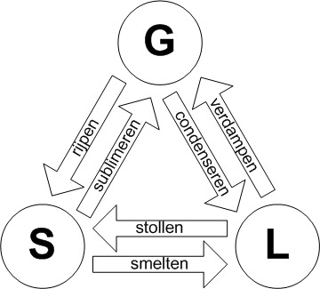

# Natuurkunde: Hoofdstuk 3 (Materialen) + Hoofdstuk 5 (Ioniserende straling)

## Moleculen

Elke stof bestaat uit zijn eigen soort **moleculen**, opgebouwd uit **atomen**. Er zijn meer dan 100 atoomsoorten (**elementen**). Atomen hebben een kleine, zware kern met daaromheen lichte elektronen.

Stoffen kunnen voorkomen in drie **fasen**: vast, vloeibaar of gas. In een vaste stof zitten moleculen in een rooster, in een vloeistof bewegen ze langs elkaar, en in een gas bewegen ze vrij door de ruimte en nemen ze zoveel mogelijk volume in.

De **dichtheid** van een stof geeft de massa per volume-eenheid aan:  
$\rho = \frac{m}{V}$  
Hierin is $\rho$ de dichtheid (in $\text{kg/m^3}$), $m$ de massa (in $\text{kg}$) en $V$ het volume (in $\text{m^3}$).

## Luchtdruk

De druk van een gas of vloeistof geeft de kracht aan die het gas per oppervlakte-eenheid uitvoert.  
$p=\frac{F}{A}$
Hierin is $p$ de druk (in $\text{Pa}$ of $\text{N/m^2}$), $F$ de kracht (in $\text{N}$) en $A$ de oppervlakte (in $\text{m^2}$).

De druk van afgesloten lucht stijgt bij hogere dichtheid en temperatuur. Dit wordt verklaard met het **gasmodel**:

- Gasdeeltjes zijn klein en nemen verwaarloosbaar weinig ruimte in.
- Gasdeeltjes bewegen kriskras en botsen veerkrachtig tegen de wand.
- Gasdeeltjes hebben verschillende snelheden door botsingen.
- De gemiddelde snelheid van de gasdeeltjes bepaalt de temperatuur.

Druk ontstaat door de botsingen van gasdeeltjes tegen de wand. Verdubbel je het aantal deeltjes per volume-eenheid, dan verdubbelt de druk doordat het aantal botsingen per seconde ook verdubbelt. Druk is dus evenredig met het aantal deeltjes.  
De **wet van Boyle** beschrijft dit verband tussen druk en volume bij een constante temperatuur:  
$pV = c$  
Hierin is $p$ de druk (in $\text{Pa}$), $V$ het volume (in $\text{m^3}$) en $c$ een constante afhankelijk van de temperatuur en hoeveelheid gas.

De druk van een gas is alleen evenredig als de druk bij 0 kelvin ook 0 pascal is. Daarom gebruik je de eenheid kelvin, waarbij 0 kelvin het **absolute nulpunt** is (de laagst mogelijke temperatuur). Bij deze temperatuur zouden de deeltjes stils staan.
$T_\text{celcius} = T_\text{kelvin} - 273$
Bij hogere temperatuur bewegen de deeltjes sneller, waardoor de botsingen krachtiger zijn.  
De **drukwet van Gay-Lussac** geeft het verband tussen druk en absolute temperatuur bij een constante hoeveelheid gas:  
$\frac{p}{T} = c$  
Hierin is $p$ de druk (in $\text{Pa}$), $T$ de absolute temperatuur (in $\text{K}$) en $c$ een constante afhankelijk van de dichtheid.

De combinatie van Boyle en Gay-Lussac levert de **algemene gaswet**:  
$pV = nRT$  
Hierin is $p$ de druk (in $\text{Pa}$), $V$ het volume (in $\text{m^3}$), $n$ de hoeveelheid gas (in $\text{mol}$), $R$ de gasconstante ($\approx 8{,}31\ \text{J/(mol\cdot K)}$) en $T$ de absolute temperatuur (in $\text{K}$).

Bij druk wordt vaak de eenheid **bar** gebruikt: $1 \~ \text{bar} = 1 \cdot 10^5 \~ \text{Pa}$.
