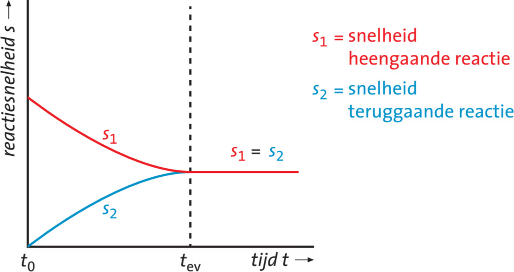

# Scheikunde: Hoofdstuk 6 (Evenwichten & Reactiesnelheid)

## Reactiesnelheid

De reactiesnelheid geeft aan hoe snel producten gevormd worden en hangt af van:

- Soort stoffen
- Temperatuur
- Verdelingsgraad (hoe goed de stof verdeeld is, dus het contactoppervlakte)
- Concentratie
- Aanwezigheid katalysator

Deze factoren verklaren we met het **botsende-deeltjesmodel**. Hierin botsen deeltjes met elkaar, waarbij soms bindingen kunnen breken. Botsingen met genoeg energie om een binding te kunnen breken noem je **effectieve botsingen**. En het breken van bindingen is precies wat je nodig hebt voor een reactie. Dus hoe meer effectieve botsingen je hebt, hoe efficiënter je reactie verloopt.

Bij een hogere temperatuur bewegen de deeltjes sneller, waardoor er meer effectieve botsingen ontstaan. De vuistregel is dat elke 10 °C erbij zorgt voor een 2 keer zo sneller reactie.  
Bij een hogere verdelingsgraad zijn er meer deeltjes "beschikbaar" om te botsen. Bij een concentratie ook.  
Als er een katalysator aanwezig is zijn meer botsingen effectief.

## Evenwichten

**Statisch evenwicht**: niks verandert, denk aan een wipwap.
**Dynamisch evenwicht**: er verandert wel iets, maar netto blijft alles gelijk. Denk aan een huis dat je verwarmt: er ontstaat constant hitte en er gaat constant hitte weg, maar de temperatuur binnen blijft constant. Scheikundige evenwichten zijn altijd dynamisch.

Tot nu toe hebben we alleen gewerkt met **aflopende reacties**: de reactie gaat in 1 richting en stopt als een van de beginstoffen op is.  
Bij een **evenwichtsreactie** kunnen producten terugreageren. Er vinden dan dus 2 reacties plaats. Uiteindelijk ontstaat er een **evenwicht**: beide reacties gaan dan even snel. Je noteert dat met een dubbele pijl:  
$\ce{2\~NO2 (g) <--> N2O4 (g)}$

- **Homogeen evenwicht**: alle stoffen hebben dezelfde fase  
- **Heterogeen evenwicht**: er zijn verschillende fasen

De heengaande reactie begint snel, en neemt af tot het punt waar de reactiesnelheden gelijk aan elkaar zijn. De teruggaande reactie begint op 0, omdat er nog geen stoffen aan de rechterkant zijn. Vanaf de **insteltijd** ($t_{ev}$) gaan de reacties even snel: er is een evenwicht ontstaan.

## Rekenen aan evenwichten

De **evenwichtsconstante** $K$ laat zien waar het evenwicht ligt.

$K = \frac{\ce{[C]}^q \ce{[D]}^r}{\ce{[A]}^m \ce{[B]}^n}$  
Voor de reactie $\ce{m\~A + n\~B <--> q\~C + r\~D}$

**Let op**: vaste stoffen en vloeistoffen (die hebben een concentratie van 1) tellen niet mee in deze formule!

- Grote $K$: evenwicht rechts (meer producten)  
- Kleine $K$: evenwicht links (meer beginstoffen)

Om makkelijk te rekenen met evenwichten kun je gebruik maken van een **BOEC-schema**: begin, omzetting, evenwicht en concentratie.

Voor de reactie $\ce{N2 (g) + 3\~H2 (g) <--> 2\~NH3 (g)}$ met als gegeven dat op t = 0 er 5 mol $\ce{N2}$, 8 mol $\ce{3\~H}$ is, dat er 2 mol $\ce{N2}$ wordt omgezet en dat het volume van het reactievat 3 liter is, ziet het BOEC-schema er zo uit:

| Alles in mol, tenzij anders aangegeven | $\ce{N2}$       | $\ce{3\~H2}$          | $\ce{2\~NH3}$         |
| -------------------------------------- | --------------- | --------------------- | --------------------- |
| **B**egin                              | 5               | 8                     | 0                     |
| **O**mzetting                          | -2              | $3\cdot 2\implies -2$ | $2\cdot 2\implies +4$ |
| **E**venwicht                          | 3               | 6                     | 4                     |
| **C**oncentratie (M)                   | $\frac{3}{3}=1$ | $\frac{6}{3}=2$       | $\frac{4}{3}=1,3$     |

> Hoe is dit ingevuld?  
> Je weet dat op t=0 (dus begin) er geen van de stoffen aan de linker kant zijn, want die stoffen moeten nog ontstaan.  
> Het aantal mol van de andere stoffen kun je berekenen met een simpele molverhouding (dit is immers een chemische reactie).

## Evenwichten verschuiven

Evenwicht verschuift bij veranderingen in:

- **Druk**  
  Bij een hogere druk verschuift het evenwicht naar de kant met de **minste deeltjes**.  
  Voor $\ce{2\~NO2 (g) <--> N2O4 (g)}$ verschuift het evenwicht dus naar $\ce{N2O4}$ bij een hogere druk.
- **Temperatuur**  
  Bij een hogere temperatuur is de **endotherme** reactie in voordeel, en bij een lagere temperatuur is de **exotherme** reactie in het voordeel.
- **Aflopend maken**  
  Verwijder je stoffen van 1 kant, dan kan reactie nog maar 1 kant op, dus dan geen evenwicht meer.
