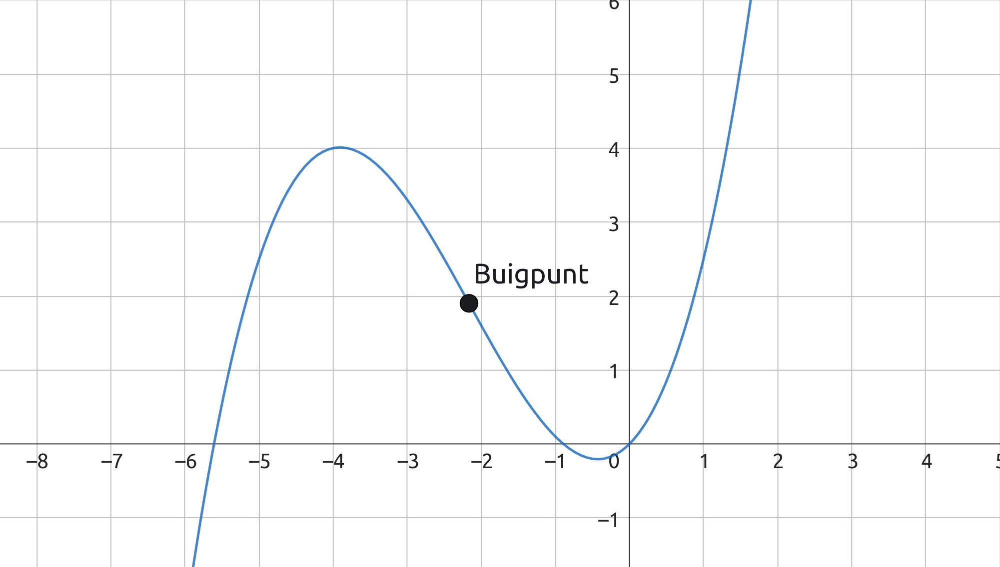

## De afgeleide

De afgeleide geeft voor elke $x$ de richtingscoëfficiënt van de raaklijn aan de grafiek in dat punt.

Het berekenen van de afgeleide heet **differentiëren**.

De definitie van de afgeleide van een functie $f(x)$ is $f'(x) = \lim_{h \to 0} \frac{f(x+h) - f(x)}{h}$, maar er zijn een aantal standaardregels:

- $f(x) = a$ geeft $f'(x) = 0$
- $f(x) = ax$ geeft $f'(x) = a$
- $f(x) = ax^n$ geeft $f'(x) = anx^{n-1}$ (voor elk reëel getal $n$)
- $f(x) = c \cdot g(x)$ geeft $f'(x) = c \cdot g'(x)$
- $s(x) = f(x) + g(x)$ geeft $s'(x) = f'(x) + g'(x)$ (somregel)
- $v(x) = f(x) - g(x)$ geeft $v'(x) = f'(x) - g'(x)$ (verschilregel)
- $p(x) = f(x) \cdot g(x)$ geeft $p'(x) = f'(x) \cdot g(x) + f(x) \cdot g'(x)$ (productregel)
- $q(x) = \frac{t(x)}{n(x)}$ geeft $q'(x) = \frac{t'(x) \cdot n(x) - t(x) \cdot n'(x)}{n(x)^2}$ (quotiëntregel)

Als de functie als breuk staat, schrijf je de afgeleide ook als breuk. Dit geldt ook voor functies met negatieve exponenten.

## Extreme waarden

Bij een extreme waarde is de raaklijn aan de grafiek horizontaal, dus de raaklijn heeft een helling van 0. Omdat de afgeleide de helling van de raaklijn geeft, bepaal je de extreme waarden door de afgeleide gelijk te stellen aan 0 en die vergelijking op te lossen.

> Controleer met je GR (en een schets) of het om een maximum of minimum gaat.

Een **buigpunt** is een punt op de grafiek waar de richtingscoëfficiënt van de raaklijn verandert, bijvoorbeeld van toenemend stijgend naar afnemend stijgend.

Op een buigpunt heeft de afgeleide een extreme waarde, omdat de helling daar tijdelijk stopt met toenemen of afnemen; het bereikt een maximum of minimum. Om de coördinaten van een buigpunt te bepalen, gebruik je daarom de tweede afgeleide (notatie: $f''(x)$).

De raaklijn in een buigpunt heet de **buigraaklijn**.

## Kettingregel

De functie $f(x) = (2x^2 - 8x)^6$ is een **samengestelde functie**, opgebouwd uit de schakels $v(x) = 2x^2 - 8x$ en $u(v) = v^6$.

Een functie die uit een keten van zulke schakels bestaat, heet een **kettingfunctie**. Hiervoor geldt de **kettingregel**:

$$f(x) = u(v(x)) \implies f'(x) = u'(v(x)) \cdot v'(x)$$

Voor $f(x) = (2x^2 - 8x)^6$ is de afgeleide dus $f'(x) = 6(2x^2 - 8x)^5 \cdot (4x - 8)$.

> Onthoud:  
> $g(x) = \sqrt{x}$ geeft $g'(x) = \frac{1}{2\sqrt{x}}$

## Kromme door toppen

De toppen van de grafieken van de functie $f_p(x) = -\frac{1}{3}x^3 + 1\frac{1}{2}x^2 + p x - 5$ liggen op een kromme. De formule van deze kromme vind je door bij de afgeleide $f_p'(x) = 0$ de parameter $p$ uit te drukken in $x$. Omdat deze waarde van $p$ geldt voor alle toppen, kun je die vervolgens invullen in de originele functie.

$f_p'(x) = -x^2 + 3x + p = 0 \implies p = x^2 - 3x$  
Invullen in de originele functie geeft:  
$y = -\frac{1}{3}x^3 + 1\frac{1}{2}x^2 + (x^2 - 3x) \cdot x - 5 = \frac{2}{3}x^3 - 1\frac{1}{2}x^2 - 5$  
Dit is dus de vergelijking van de kromme waarop alle toppen liggen.

## Raken en snijden

De grafieken van $f(x)$ en $g(x)$ **raken** elkaar in het punt $A$ als de $x$-coördinaat van $A$ voldoet aan $f(x) = g(x) \land f'(x) = g'(x)$.  
Dat wil zeggen: $f$ en $g$ hebben dezelfde $y$-waarde en dezelfde richtingscoëfficiënt van de raaklijn in dat punt.

Twee lijnen $k$ en $l$ snijden elkaar loodrecht als de richtingscoëfficiënten $\mathrm{rc}_k$ en $\mathrm{rc}_l$ voldoen aan: $\mathrm{rc}_k \cdot \mathrm{rc}_l = -1$ (voor $\mathrm{rc}_k\neq 0$ en $\mathrm{rc}_l\neq 0$).  
De grafieken van $f(x)$ en $g(x)$ **snijden** elkaar loodrecht in punt $A$ als: $f(x) = g(x) \land f'(x) \cdot g'(x) = -1$.
