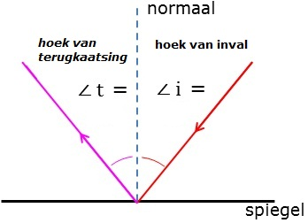

## Lichtstralen

**Lichtbundels** komen in 3 soorten voor: **parallel**, **divergent** (gaan uit elkaar) en **convergent** (gaan naar elkaar toe).

Je kunt voorwerpen uit de omgeving zien, doordat ze licht weerkaatsen en jouw oog dat opvangt. Een spiegel weerkaatst licht in 1 richting, maar de meeste voorwerpen weerkaatsen licht in alle richtingen (**diffuse weerkaatsing**), zoals in de afbeelding hieronder. Weerkaatst licht vormt een divergente bundel.

Spiegels weerkaatsen volgens de spiegelwet: $\angle i = \angle t$ (hoek van inval = hoek van terugkaatsing). De hoeken zijn de hoeken met de normaal: een denkbeeldige lijn, loodrecht op het oppervlakte waar de lichtstraal invalt.

## Lenzen

Lenzen veranderen de richting van lichtstralen (**lichtbreking**). Positieve lenzen zijn dikker in het midden dan aan de randen. Ze maken lichtbundels convergenter (of minder divergent). Negatieve lenzen zijn dikker aan de randen dan in het midden. Ze maken lichtbundels divergenter (of minder convergent).

Lenzen kun je vereenvoudigd tekenen. Je verwaarloost dan de dikte van de lens en tekent deze als een lijn. De **optische as** is een gestippelde lijn loodrecht door het midden van de lens. Het midden van de lens is het **optisch midden** ($O$). Op de optische as staan 2 brandpunten ($F$). De afstand van het optisch midden tot de brandpunten is de brandpuntsafstand ($f$).

De sterkte van de lens hangt enkel af van de brandpuntsafstand:

$$S=\frac{1}{f}$$
Hierin is $S$ de sterkte van de lens (in $\mathrm{dpt}=\mathrm{m}^{-1}$) en $f$ de brandpuntsafstand (in $\mathrm{m}$).

Een **voorwerpspunt** geef je aan met een $V$, de grootte (vaak lengte) van een voorwerp is de **voorwerpsgrootte** ($L_\mathrm{v}$) en de afstand van het voorwerp tot de lens is de **voorwerpsafstand** ($v$).
Door gebruik te maken van constructiestralen kun je bepalen waar een **beeldpunt** ($B$) zich bevindt. Ook kun je dan de **beeldgrootte** ($L_\mathrm{b}$) en de **beeldafstand** ($b$) bepalen.

De regels voor constructie bij een positieve lens zijn:

- Een straal door het optisch midden verandert niet.
- Een straal die voor de lens door het brandpunt gaat, loopt na de lens parallel aan de optische as.
- Een straal die voor de lens parallel aan de optische as loopt, gaat na de lens door het brandpunt.

De regels voor constructie bij een negatieve lens zijn:

- Een straal door het optisch midden verandert niet.
- Een straal die voor de lens richting het tweede brandpunt gaat, loopt na de lens parallel aan de optische as.
- Een straal die voor de lens parallel aan de optische as loopt, lijkt na de lens uit het eerste brandpunt te komen.

Bij een negatieve lens ontstaat er geen beeld na de lens, maar als je de lichtstralen die na de lens onstaan zijn terugschetst, ontstaat er wel een (virtueel) beeld voor de lens.

### Formules

Bij lenzen is er sprake van een **lineare vergroting**:

$$N=\frac{L_\mathrm{b}}{L_\mathrm{v}}=\frac{b}{v}$$
Hierin is $N$ de lineare vergroting (zonder eenheid, het is een verhouding), $L_\mathrm{b}$ de beeldgrootte (in $\mathrm{m}$), $L_\mathrm{v}$ de voorwerpgrootte (in $\mathrm{m}$), $b$ de beeldafstand (in $\mathrm{m}$) en $v$ de voorwerpsafstand (in $\mathrm{m}$).

De lenzenwet luidt:

$$S=\frac{1}{f}=\frac{1}{v}+\frac{1}{b}$$
Hierin is $S$ de sterkte van de lens (in $\mathrm{dpt}=\mathrm{m}^{-1}$), $f$ de brandpuntsafstand (in $\mathrm{m}$), $v$ de voorwerpsafstand (in $\mathrm{m}$) en $b$ de beeldafstand (in $\mathrm{m}$).

## In het oog

In je oog moeten divergente lichtstralen convergent worden gemaakt, zodat ze mooi op 1 punt op het netvlies vallen. Je ooglens is dus positief.
Elk voorwerpspunt correspondeert met 1 beeldpunt op het netvlies.

De beeldafstand is gelijk aan de oogboldiameter. Deze varieert niet zo veel tussen mensen en is ongeveer 17 mm. De voorwerpsafstanden waar je ogen mee te maken variëren echter heel erg. Daarom moet de sterkte van je ooglens aanpasbaar zijn. Rond je ooglens zitten spieren die de lens wat boller kunnen maken: **accommoderen**. De sterkte van je ooglens kan variëren van ongeveer 65 dpt tot 59 dpt.
Als je erg dicht bij moet kijken, moet je oog de lichtstralen het sterkst breken, dus dan is je oog geaccommodeerd. Voor grote voorwerpsafstanden is het oog ongeaccommodeerd. Als je "in de verte kijkt" is de voorwerpsafstand zo groot dat $\frac{1}{v}$ verwaarloosbaar klein is (in formules mag je zeggen dat $v=\infty$, ook al is dit eigenlijk niet correct).
De kleinste afstand waarop je scherp kunt zien is de **nabijheidsafstand**. De grootste afstand waarop je scherp kunt zien is de **verteafstand**.

Hoe goed je ogen kunnen accommoderen neemt af met toenemende leeftijd. Oudere mensen kunnen daarom niet meer goed dichtbij kijken: ze zijn **oudziend** en hebben een leesbril nodig. Zo'n bril heeft positieve lenzen, zodat de lichtbundel minder divergent wordt. De sterkte van zo'n lens is simpelweg het verschil tussen wat er nodig is en wat het oog kan halen.

> Een leesbril verlaagt dus de nabijheidsafstand, maar verlaagt ook verteafstand, dus als een oudziende in de verte wil kijken, moet hij zijn leesbril af zetten!

Bij een **bijziende** zijn de ooglenzen juist te sterk. Hij kan wel goed van dichtbij zien, maar niet goed van veraf. Negatieve lenzen (in een bril of contactlenzen) kunnen hierbij helpen. Deze maken de bundel divergenter.

Bij een **verziende** zijn de ooglenzen te zwak. Positieve lenzen kunnen hierbij helpen.

> Het verschil tussen de verziende en de oudziende is dat de verziende bij kijken in de verte alsnog moet accomoderen, omdat zijn lens anders te zwak is.

## Bewegen en heffen

Binnen de natuurkunde noem je een draaibaar en onbuigbaar voorwerp een **hefboom**, zoals een slagboom, een deur, maar ook delen van je lichaam. Je lichaam is een verzameling hefbomen die ten opzichte van elkaar draaien. Ze zitten aan elkaar vast met **scharniergewrichten** (eenassig), **zadelgewrichten** (tweeassig) en **kogelgewrichten** (drieassig). Een beweging kun je dan omschrijven als een serie houdingen van deze hefbomen. De hefbomen bewegen door spieren.

Voor de "neiging tot draaiing" van een hefboom zijn 2 dingen belangrijk: de grootte van de kracht en de aangrijping van de kracht op de hefboom. Het krachtmoment is een grootheid voor deze "neiging tot draaiing".

$$M=F\cdot r$$
Hierin is $M$ het krachtmoment (in $\mathrm{Nm}$), $F$ de kracht (in $\mathrm{N}$) en $r$ de arm (in $\mathrm{m}$). De arm is de **LOODRECHTE** afstand van het draaipunt ($S$) tot de **WERKLIJN** van de kracht.

In deze situatie zijn de momenten even groot

In deze situatie zijn de momenten ook even groot. De zwarte kracht bij $F_1$ is de origine kracht en de grijze kracht is de verticale component.

Als een hefboom niet of eenparig draait, geldt de **hefboomwet**:

$M_\mathrm{L}=M_\mathrm{R}$
dus
$F_\mathrm{L}\cdot r_\mathrm{L}=F_\mathrm{R}\cdot r_\mathrm{R}$
Hierin is $M_\mathrm{L}$ het linksdraaiend moment (in $\mathrm{Nm}$), $M_\mathrm{R}$ het rechtsdraaiend moment (in $\mathrm{Nm}$), $F_\mathrm{L}$ en $F_\mathrm{R}$ zijn de krachten (in $\mathrm{N}$) en $r_\mathrm{L}$ en $r_\mathrm{R}$ zijn de bijbehorende armen (in $\mathrm{m}$).

> Om te kijken of een kracht een links- of rechtsdraaiend moment heeft moet je kijken in welke richting de kracht de hefboom laat draaien:
> Rechtsdraaiend moment = met de klok mee
> Linksdraaiend moment = tegen de klok in
> Dus een kracht aan de rechterkant betekent niet een kracht met een rechtsdraaiend moment!

Als er meer dan 2 krachten een moment uitoefenen op de hefboom, moet er een evenwicht zijn tussen alle linksdraaiende momenten en alle rechtsdraaiende momenten:

$$\sum_{M_\mathrm{L}}=\sum_{M_\mathrm{R}}$$

Naast de hefboomwet geldt als evenwichtsvoorwaarde dat $F_\mathrm{res}=0$.

De kracht die de as op een hefboom uitoefent noem je de **draaipuntkracht**.
