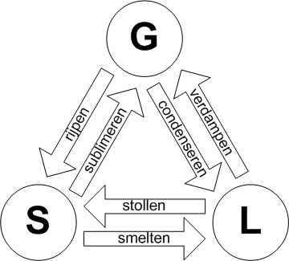

## Moleculen

Elke stof bestaat uit zijn eigen soort **moleculen**, opgebouwd uit **atomen**. Er zijn meer dan 100 atoomsoorten (**elementen**). Atomen hebben een kleine, zware kern met daaromheen lichte elektronen.

Stoffen kunnen voorkomen in drie **fasen**: vast, vloeibaar of gas. In een vaste stof zitten moleculen in een rooster, in een vloeistof bewegen ze langs elkaar, en in een gas bewegen ze vrij door de ruimte en nemen ze zoveel mogelijk volume in.

De **dichtheid** van een stof geeft de massa per volume-eenheid aan:

$$\rho = \frac{m}{V}$$

Hierin is $\rho$ de dichtheid (in $\text{kg}/\text{m}^3$), $m$ de massa (in $\text{kg}$) en $V$ het volume (in $\text{m}^3$).

## Luchtdruk

De druk van een gas of vloeistof geeft de kracht aan die het gas per oppervlakte-eenheid uitvoert.

$$p=\frac{F}{A}$$

Hierin is $p$ de druk (in $\text{Pa}$), $F$ de kracht (in $\text{N}$) en $A$ de oppervlakte (in $\text{m}^2$).

De druk van afgesloten lucht stijgt bij hogere dichtheid en temperatuur. Dit wordt verklaard met het **gasmodel**:

- Gasdeeltjes zijn klein en nemen verwaarloosbaar weinig ruimte in.
- Gasdeeltjes bewegen kriskras en botsen veerkrachtig tegen de wand.
- Gasdeeltjes hebben verschillende snelheden door botsingen.
- De gemiddelde snelheid van de gasdeeltjes bepaalt de temperatuur.

Druk ontstaat door de botsingen van gasdeeltjes tegen de wand. Verdubbel je het aantal deeltjes per volume-eenheid, dan verdubbelt de druk doordat het aantal botsingen per seconde ook verdubbelt. Druk is dus evenredig met het aantal deeltjes.  
De **wet van Boyle** beschrijft dit verband tussen druk en volume bij een constante temperatuur:

$$pV = c$$

Hierin is $p$ de druk (in $\text{Pa}$), $V$ het volume (in $\text{m}^3$) en $c$ een constante afhankelijk van de temperatuur en hoeveelheid gas.

De druk van een gas is alleen evenredig als de druk bij 0 kelvin ook 0 pascal is. Daarom gebruik je de eenheid kelvin, waarbij 0 kelvin het **absolute nulpunt** is (de laagst mogelijke temperatuur). Bij deze temperatuur zouden de deeltjes stils staan.

$$T_\text{celcius} = T_\text{kelvin} - 273$$

Bij hogere temperatuur bewegen de deeltjes sneller, waardoor de botsingen krachtiger zijn.  
De **drukwet van Gay-Lussac** geeft het verband tussen druk en absolute temperatuur bij een constante hoeveelheid gas:

$$\frac{p}{T} = c$$

Hierin is $p$ de druk (in $\text{Pa}$), $T$ de absolute temperatuur (in $\text{K}$) en $c$ een constante afhankelijk van de dichtheid.

De combinatie van de wetten van Boyle en Gay-Lussac levert de **algemene gaswet**:

$$pV = nRT$$

Hierin is $p$ de druk (in $\text{Pa}$), $V$ het volume (in $\text{m}^3$), $n$ de hoeveelheid gas (in $\text{mol}$), $R$ de gasconstante ($\approx 8{,}31\ \text{J} \ \text{mol}^{-1} \ \text{K}^{-1}$) en $T$ de absolute temperatuur (in $\text{K}$).

Bij druk wordt vaak de eenheid **bar** gebruikt: $1 \ \text{bar} = 1 \cdot 10^5 \ \text{Pa}$.

Omdat de gasconstante constant is, kun je met de algemene gaswet ook veranderingen in druk, volume, temperatuur of checmische hoeveelheid berekenen. Je krijgt dan:

$$\frac{p_1 V_1}{T_1 n_1}=\frac{p_2 V_2}{T_2 n_2}$$

## Warmte en energie

De eigenschappen van een stof verschillen per fase, door de verschillende wisselwerkingen tussen moleculen in elke fase. In het deeltjesmodel voor de vaste en vloeibare fase moet je daarom rekening houden met een aantrekkende kracht tussen de deeltjes.

Bij verdamping ontsnappen buitengewoon snelle deeltjes aan de aantrekkende krachten van de andere deeltjes. Bij een hogere temperatuur gebeurt dit vaker.  
Condensatie van damp vindt plaats doordat deeltjes die het vloeistofoppervlak raken worden "gevangen".

**Temperatuur** is de gemiddelde bewegingsenergie van een deeltje in een stof. Als een materiaal een bepaalde temperatuur heeft, hebben alle deeltjes gemiddeld evenveel bewegingsenergie.  
**Warmte** is de hoeveelheid energie die aan een voorwerp wordt toegevoegd of die door een voorwerp wordt afgegeven.

### Warmtetransport

Er zijn 3 vormen van warmtetransport:

- **Geleiding** (vaste stoffen)  
  Binnen vaste stoffen is warmtetransport het **doorgeven van trillingsenergie** van deeltje op deeltje. Bij een temperatuurverschil trillen de deeltjes aan de ene kant harder dan aan de andere. Hierdoor ontstaat een transport van energie: geleiding.  
  Bij sommige stoffen zijn de onderlinge krachten tussen de deeltjes zwak. Hierdoor zijn deze stoffen goede isolatoren (want ze kunnen energie dus moeilijk doorgeven).  
  Bij metalen kunnen de vrije elektronen hun lading en extra bewegingsenergie heel goed doorgeven.
- **Stroming** (vloeistoffen en gassen)  
  Bij stroming wordt warmte getransporteerd door bewegende deeltjes, denk aan de centrale verwarming die water verwarmt en door het huis pompt of warme lucht die ontstaat bij een radiator.
- **Straling**  
  Warmtetransport door straling heeft geen tussenstof nodig. Deze vorm past niet in het deeltjesmodel dat we nu behandelen.

### Soortelijke warmte

De **soortelijke warmte** van een stof is de hoeveelheid energie die nodig is om 1 kg van een stof 1 K te verwarmen.

$$Q=cm\Delta T$$

Hierin is $Q$ de warmte (in $\text{J}$), $c$ de soortelijke warmte (in $\text{J} \ \text{kg}^{-1} \ \text{K}^{-1}$), $m$ de massa van de stof (in $\text{kg}$) en $\Delta T$ het temperatuurverschil (in $\text{K}$).

Hoe zwaarder de deeltjes van een stof, hoe groter de dichtheid en hoe kleiner de soortelijke warmte.

### Warmtestroom

Stoffen die warmte slecht doorlaten noem je **isolatoren**.  
De **warmtestroom** geeft aan hoeveel energie er per seconde naar buiten stroomt door een materiaal.

$$P=\lambda A \frac{\Delta T}{d}$$

Hierin is $P$ de warmtestroom (in $\text{W}$), $\lambda$ de warmtegeleidingscoëfficiënt (in $\text{W} \ \text{m}^{-1} \ \text{K}^{-1}$), $A$ de oppervlakte van de stof (in $\text{m}^2$), $\Delta T$ het temperatuurverschil tussen weerzijden van de stof (in $\text{K}$) en $d$ de dikte van de stof (in $\text{m}$).  
De **warmtegeleidingscoëfficiënt** geeft aan hoe groot de warmtestroom is door een oppervlakte van 1 vierkante meter bij een dikte van 1 meter en bij een temperatuursverschil van 1 kelvin.

Naast geleiding door muren speelt ook stroming in spouwmuren (holle laag tussen muren) en uitstraling een rol bij warmteverlies bij huizen.

## Vervorming

Veel vaste stoffen zijn, tot een bepaalde waarde, veerkrachtig. De onderlinge krachten tussen de deeltjes lijken ook een beetje op veertjes.  
Als je aan een voorwerp trekt, worden de afstanden tussen de deeltjes in de trekrichting iets groter, waardoor er de kracht tussen deeltjes in de trekrichting iets groter wordt.  
Bij sommige stoffen neemt de kracht tussen deeltjes minder snel toe als je er aan trekt, waardoor die stoffen rekbaarder zijn dan andere stoffen.

Als een materiaal helemaal terugveert als de trekkracht wordt opgeven, is er sprake van **elastische vervorming**. Na een bepaalde kritische waarde treedt er **plastische vervorming** op: het materiaal vervormt.

### Uitzetting

Bij een hogere temperatuur trillen de deeltjes verder heen en weer, waardoor de onderlinge afstand iets groter wordt. Hierdoor zet een stof uit.

### Rekenen met vervorming

De **relative rek** is de verhouding tussen de uitrekking en de beginlengte:

$$\epsilon=\frac{\Delta l}{l_0}$$

Hierin is $\epsilon$ de relatieve rek (zonder eenheid), $\Delta l$ de uitrekking en $l_0$ de beginlengte (beide in dezelfde eenheid).

De **spanning** is de trekkracht per oppervlakte-eenheid:

$$\sigma=\frac{F}{A}$$

Hierin is $\sigma$ de spanning (in $\text{Pa}=\text{N}/\text{m}^2$), $F$ de uitgeoefende kracht (in $\text{N}$) en $A$ de oppervlakte van de dwarsdoorsnede (in $\text{m}^2$).

In een **spanning,rek-diagram** is de spanning uitgezet tegen de relatieve rek. Tot aan de **elasticiteitsgrens** is de vervorming elastisch. Daarna is de vervorming plastisch.  
De **treksterkte** van een materiaal is de maximale spanning.

De **elasticiteitsmodulus** is de spanning in het materiaal bij een uitrekking van 100%. Makkelijk uitrekbare stoffen hebben een kleine elasticiteitsmodulus.

$$E=\frac{\sigma}{\epsilon}$$

Hierin is $E$ de elasticiteitsmodulus (in $\text{Pa}=\text{N}/\text{m}^2$), $\sigma$ de spanning (in $\text{Pa}=\text{N}/\text{m}^2$) en $\epsilon$ de relatieve rek (zonder eenheid).

**Let op!** Deze formule geldt alleen in het gebied waar de spanning evenredig is met de relatieve rek (in het spanning,rek-diagram is dat een rechte lijn). Dus bij een plastische vervorming kun je deze formule sowieso niet gebruiken.
