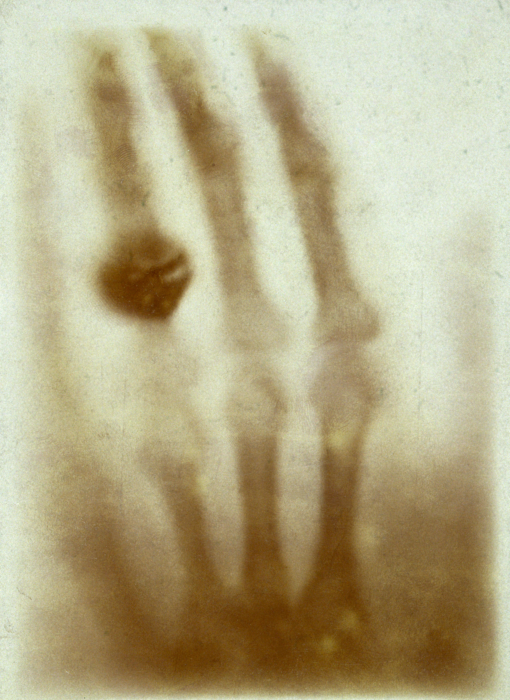

## Röntgenstraling

**Röntgenstraling** is een vorm van elektromagnetische straling. Net als zichtbaar licht bestaat het uit **fotonen** (energiepakketjes). Door de hoge frequentie heeft röntgenstraling relatief veel energie en kan het dwars door je lichaam heen gaan.

De fotonenergie is evenredig met de frequentie:

$$E_f = hf$$

Hierin is $E_f$ de fotonenergie (in $\mathrm{J}$), $h$ de constante van Planck ($\approx 6{,}626 \cdot 10^{-34} \ \mathrm{J} \ \mathrm{s}$) en $f$ de frequentie (in $\mathrm{Hz}$).  
Soms wordt **elektronvolt** ($\mathrm{eV}$) gebruikt als eenheid voor energie: $1 \ \mathrm{eV}= 1{,}6 \cdot 10^{-19} \ \mathrm{J}$.

Het **ioniserend vermogen** is het vermogen om elektronen uit atomen los te maken.  
Het **doordringend vermogen** is het gemak waarmee straling door huid en weefsel dringt.

Op röntgenfoto's zie je donkere en lichte gebieden. Donkere gebieden ontstaan door **transmissie** (veel straling doorgelaten), lichte gebieden door **absorptie** (veel straling geabsorbeerd).

Bij absorptie van fotonen wordt de energie gebruikt om atomen te ioniseren.  
Hoeveel straling wordt geabsorbeerd, hangt af van het materiaal en de dikte.

### Halveringsdikte

De **intensiteit** is de hoeveelheid energie die per seconde door 1 vierkante meter gaat.

De **halveringsdikte** ($d_{1/2}$) is de materiaaldikte die **de helft van de straling doorlaat**. Deze hangt af van de stof en van de stralingsenergie.

Een laag met dikte $d_{1/2}$ laat dus 50% door. Een laag van 2 keer $d_{1/2}$ laat 25% door, want eerst blijft de helft over. Bij 3 keer $d_{1/2}$ is dat nog 12,5%, enzovoort.

De doorgelaten intensiteit na $n$ halveringsdiktes is:

$$I = I_0 \cdot \left(\frac{1}{2}\right)^n$$

Hierin is $I$ de doorgelaten intensiteit, $I_0$ de invallende intensiteit, en $n$ het aantal halveringsdiktes.  
De intensiteit staat vaak in $\mathrm{W}/\mathrm{m}^2$, maar soms in procenten.

$n$ is het aantal keren dat de dikte $d$ in $d_{1/2}$ past:

$$n = \frac{d}{d_{1/2}}$$

Invullen geeft:

$$I = I_0 \cdot \left(\frac{1}{2}\right)^{d/d_{1/2}}$$

## Kernstraling

Sommige stoffen zijn **radioactief**. Er zijn verschillende soorten **kernstraling** (straling afkomstig uit atoomkernen van radioactieve stoffen): $\alpha$-straling, $\beta$-straling en $\gamma$-straling.

|                       | $\alpha$-straling                          | $\beta$-straling                                          | $\gamma$-straling                          |
| --------------------- | ------------------------------------------ | --------------------------------------------------------- | ------------------------------------------ |
| Bestaat uit...        | 2 protonen en 2 neutronen (heliumkern)     | Elektronen of positronen                                  | Fotonen                                    |
| Doordringend vermogen | Klein (wordt al tegengehouden door papier) | Matig (wordt al tegengehouden door een dun laagje metaal) | Groot (kan zelfs door een dikke loodplaat) |
| Ioniserend vermogen   | Groot                                      | Matig                                                     | Klein                                      |

## Verval en activiteit

Bij het **vervallen** van een (instabiele) kern wordt er een $\alpha$-deeltje, een $\beta$-deeltje of een $\gamma$-foton uitgezonden (**emissie**).  
De **activiteit** van een radioactieve bron is het aantal kernen dat per seconde vervalt (eenheid: **becquerel** = vervallen kernen per seconde). De activiteit daalt na verloop van tijd omdat er steeds minder instabiele kernen zijn.

Dit verval is een toevalsproces; in werkelijkheid schommelt de activiteit een beetje.

De tijdsduur waarin de activiteit halveert, noem je de **halveringstijd** ($t_{1/2}$). De halveringstijd is een eigenschap van een isotoop.  
Aan de hand van de halveringstijd kun je de activiteit van een radioactieve bron na $n$ halveringstijden berekenen:

$$A=A_0 \cdot \left(\frac{1}{2}\right)^n$$

Hierin is $A$ de activiteit (in $\mathrm{Bq}$), $A_0$ de beginactiviteit (in $\mathrm{Bq}$), en $n$ het aantal halveringstijden.  

$n$ is dus hoe vaak de tijd in de halveringstijd past:

$$n=\frac{t}{t_{1/2}}$$

Hierin is $t$ het tijdstip en $t_{1/2}$ de halveringstijd (in dezelfde eenheid).  
Invullen geeft:

$$A = A_0 \cdot \left(\frac{1}{2}\right)^{t/t_{1/2}}$$

## Isotopen

De atomen van radioactieve stoffen hebben **instabiele** atoomkernen.  
Het **atoomnummer** ($Z$) is het aantal protonen in de kern en geeft dus ook de lading van de kern aan. Het **massagetal** ($A$) is het totaal aantal kerndeeltjes.

Bij radioactief verval gelden 2 **behoudswetten**: behoud van massa (massagetal) en behoud van elektrische lading (atoomnummer).

Je noteert een kern als $\ce{^{A}\_{Z}X}$, bijvoorbeeld: $\ce{^{131}\_{53}I}$.

Atomen van hetzelfde element met een verschillend aantal neutronen heten **isotopen**.

## Vervalvergelijkingen

In een **vervalvergelijking** staat de verandering die plaatsvindt bij radioactief verval.

- **Alfaverval**: de kern zendt een $\ce{^{4}\_{2}He}$-deeltje uit:  
  $\ce{^{238}\_{92}U -> ^{234}\_{90}Th + ^{4}_{2}He}$

- **Bètaverval**:

  - Bij $\beta ^+$-verval ontstaat uit een proton een neutron en een **positron**.  
    $\ce{^{1}\_{1}p -> ^{1}\_{0}n + ^{0}_{1}e}$  
    $\beta ^+$-verval komt voor bij kernen met te weinig neutronen en een overschot aan protonen.

    $\ce{^{11}\_{6}C -> ^{11}\_{5}B + ^{0}_{1}e}$

    > Een positron is het **antideeltje** van het elektron: het heeft dezelfde massa en lading, maar die lading is positief. Positronen bestaan vaak maar heel kort. Als het uitgestoten positron op een elektron botst, vindt er **annihilatie** plaats: er ontstaan 2 fotonen in tegengestelde richting. Ook kunnen antideeltjes ontstaan uit materie en antimaterie (**paarvorming**).

  - Bij $\beta ^-$-verval ontstaat uit een neutron een proton en een elektron.  
    $\ce{^{1}\_{0}n -> ^{1}\_{1}p + ^{0}_{-1}e}$  
    $\beta ^-$-verval komt voor bij kernen met te weinig protonen en een overschot aan neutronen.

    $\ce{^{14}\_{6}C -> ^{14}\_{7}N + ^{0}_{-1}e}$

- **Gammastraling**: hierbij wordt een foton uitgezonden. De samenstelling van de kern verandert niet.

Ook **kernreacties** kun je beschrijven met een vergelijking.  

- Bij **protonenstraling** ontstaan protonen, bijvoorbeeld bij het botsen van stikstof-14 en een $\alpha$-deeltje:  
  $\ce{^{14}\_{7}N + ^{4}\_{2}He -> ^{17}\_{8}O + ^{1}\_{1}p}$  
- Bij **neutronenstraling** ontstaan juist neutronen:  
  $\ce{^{9}\_{4}Be + ^{4}\_{2}He -> ^{12}\_{6}C + ^{1}\_{0}n}$

## Aantal instabiele kernen

Voor het aantal instabiele kernen op tijdstip $t$ geldt bijna dezelfde formule als voor de activiteit, want het aantal kernen en de activiteit nemen op dezelfde manier af.

$$N = N_0 \cdot \left(\frac{1}{2}\right)^{t/t_{1/2}}$$

Hierin is $N$ het aantal kernen, $N_0$ het aantal kernen op $t=0$, $t$ het tijdstip en $t_{1/2}$ de halveringstijd (beide in dezelfde eenheid).

De activiteit van een radioactieve bron is het aantal instabiele atoomkernen dat per seconde vervalt. Dat is dus gelijk aan de helling van een N,t-diagram, want het gaat om de afname op dat moment.  
De activiteit is dus gelijk aan de helling van de raaklijn (of de afgeleide) van een N,t-diagram.

$$A = -\left(\frac{\Delta N}{\Delta t}\right)_{\mathrm{raaklijn}}$$  
$$A = -\frac{dN}{dt}$$  
$$A_{\mathrm{gem}} = -\frac{\Delta N}{\Delta t}$$

Je kunt de afgeleide ook uitschrijven als:

$$A = \frac{\ln(2) \cdot N}{t_{1/2}}$$

Hierin is $A$ de activiteit (in $\mathrm{Bq}$), $\ln(2)$ is de natuurlijke logaritme van 2 ($\approx 0{,}693$), $N$ het aantal instabiele atoomkernen en $t_{1/2}$ de halveringstijd (in $\mathrm{s}$).

### Atoommassa's

Soms moet je de massa van 1 enkel atoom van een element weten. In Binas zie je de atoommassa in de **atomaire massa-eenheid** ($\mathrm{u}$). $1 \ \mathrm{u} = 1{,}66 \cdot 10^{-27} \ \mathrm{kg}$.

## Dosis

UV-straling, röntgenstraling en gammastraling kunnen door hun ioniserend vermogen schadelijk zijn voor het lichaam. Hetzelfde geldt voor $\alpha$-straling en $\beta$-straling.  
De **stralingsenergie** van ioniserende straling wordt in het lichaam opgenomen.  
De **dosis** is de geabsorbeerde stralingsenergie per kg van het voorwerp, gemeten in **gray** ($\mathrm{Gy} = \mathrm{J} \ \mathrm{kg}^{-1}$).  

$$D = \frac{E_{\mathrm{str}}}{m}$$

Hierin is $D$ de dosis (in $\mathrm{Gy}$), $E_{str}$ de stralingsenergie (in $\mathrm{J}$) en $m$ de massa van het voorwerp (in $\mathrm{kg}$).

Maar niet elke soort straling doet evenveel schade. Om "schade" te meten kun je beter de **equivalente dosis** gebruiken, gemeten in **sievert** ($\mathrm{Sv} = \mathrm{J} \ \mathrm{kg}^{-1}$).

$$H = w_R \cdot D$$

Hierin is $H$ de equivalente dosis (in $\mathrm{Sv}$), $w_R$ de **stralingsweegfactor** (zonder eenheid) en $D$ de dosis (in $\mathrm{Gy}$).

> Ook al zijn zowel $\mathrm{Sv}$ als $\mathrm{Gy}$ in principe gelijk aan $\mathrm{J} \ \mathrm{kg}^{-1}$, betekenen ze dus niet hetzelfde!

De stralingsweegfactor (zie ook Binas 27D3) verschilt per type straling:

| Soort             | $w_R$ |
| ----------------- | ----- |
| $\alpha$-straling | 20    |
| $\beta$-straling  | 1     |
| $\gamma$-straling | 1     |
| röntgenstraling   | 1     |

Bij een hoge equivalente dosis is het effect van ioniserende straling vrijwel direct meetbaar. Bij een lagere equivalente dosis is er kans op tumorvorming op langere termijn.

## Stralingsbelasting

De **achtergrondstraling** bestaat uit **kosmische straling** (uit het heelal) en straling van radioactieve stoffen op aarde, in lucht en in (bouw)materialen.

In Nederland hebben we wettelijke **stralingsbeschermingsnormen** (**dosislimieten**) voor ioniserende straling (Binas 27D2). Deze normen geven aan welke **effectieve totale lichaamsdoses** (dus de equivalente dosis voor het hele lichaam) voor verschillende bevolkingsgroepen aanvaardbaar is.

**Uitwendige bestraling** komt van bronnen buiten het lichaam.  
**Inwendige bestraling** ontstaat door opname van radioactieve stoffen. Dan is er sprake van **besmetting**.

Het risico dat je loopt door straling hangt onder andere af van de soort straling:

- **Alfa**- en **bètastraling**  
  Deze soorten straling geven bij elke botsing met een deeltje een beetje energie af, totdat de deeltjes uiteindelijk stilstaan. De afstand die $\alpha$- en $\beta$-deeltjes afleggen, noem je **dracht**.
- **Röntgen**- en **gammastraling**  
  De fotonen van röntgen- en $\gamma$-straling kunnen niet worden afgeremd. Een foton kan worden geabsorbeerd door een atoom. De absorptie van röntgen- en $\gamma$-straling is nooit volledig.
- **Uitwendige bestraling**  
  Hierbij is $\alpha$-straling vrijwel ongevaarlijk. Ze geven hun energie al af in de hoornlaag van je huid. De $\beta$-deeltjes dringen al iets dieper door, maar het zijn toch echt de $\gamma$-deeltjes die de meeste schade kunnen veroorzaken.
- **Inwendige bestraling**  
  $\alpha$-deeltjes zijn hier wel erg gevaarlijk, omdat ze gemakkelijk atomen in vitale organen kunnen ioniseren.

Er zijn 3 belangrijke manieren om je tegen uitwendige straling te beschermen: **tijd**, **afstand** en **afscherming**.  
Er zijn ook een aantal maatregelen tegen besmetting met radioactieve stoffen, zoals **grondig wassen**, **isolatie** (van een besmet persoon) en **evacuatie**.

## Medische beeldvorming

Ioniserende straling (en soms ook andere vormen van straling of golven) wordt gebruikt om het lichaam van binnen te bekijken.

### Röntgenfoto

Maakt gebruik van röntgenstraling. Straling gaat makkelijker door zachte weefsels dan door botten, waardoor een beeld ontstaat.

- **Toepassing**: botbreuken, tanden, bloedvaten (met contrastmiddel)
- **Voordelen**: snel, goedkoop, weinig straling
- **Nadelen**: weinig detail, zachte weefsels slecht zichtbaar

### CT-scan

Eigenlijk een geavanceerde röntgenfoto. Door veel opnames te nemen wordt een 3D-beeld gevormd.

- **Toepassing**: longen, botten, bloedvaten, tumoren
- **Voordelen**: veel details, doorsnedes mogelijk
- **Nadelen**: duur, hogere stralingsdosis

### Scintigrafie

Een radioactieve stof (tracer) wordt ingespoten en zendt een $\gamma$-foton uit. Een gammacamera vangt deze straling op en maakt een 2D-beeld.

- **Toepassing**: werking van organen zichtbaar maken
- **Voordelen**: laat processen in het lichaam zien
- **Nadelen**: duur, ingewikkeld door gebruik van radioactieve stoffen

### SPECT-scan

Een 3D-versie van scintigrafie. De gammacamera draait om de patiënt heen.

- **Toepassing**: werking van organen
- **Voordelen**: tracerverdeling in 3D zichtbaar
- **Nadelen**: lage resolutie, weinig details

### PET-scan

De positronen die vrijkomen bij het verval van een $\beta^+$-tracer annihileren snel met elektronen. Daarbij ontstaan 2 $\gamma$-fotonen, die precies tegengesteld worden uitgezonden. Deze $\gamma$-fotonen worden gedetecteerd, en vervolgens wordt de precieze plek van uitzending berekend.

- **Toepassing**: precieze locatie van processen in het lichaam, vaak gebruikt voor hersenonderzoek
- **Voordelen**: tracerverdeling is heel precies zichtbaar
- **Nadelen**: isotopen vervallen snel, dus alles moet snel gebeuren (duur en complex)

### Echografie

Maakt geen gebruik van straling, maar van **ultrasoon geluid**. De uitgezonden geluidsgolven kaatsen terug op grenzen tussen verschillende weefsels. Die echo's worden opgevangen en verwerkt tot een beeld.

- **Toepassing**: o.a. zwangerschappen
- **Voordelen**: goedkoop, veilig, zacht weefsel goed zichtbaar
- **Nadelen**: interpretatie van beelden kan lastig zijn

### MRI-scan

Een MRI-scan maakt gebruik van sterke magnetische velden en radiogolven. De patiënt ligt in een tunnel met een krachtig magneetveld, dat invloed uitoefent op de waterstofatomen in het lichaam.  
De kernen van waterstofatomen (protonen) gedragen zich als kleine magneetjes. In het sterke magneetveld gaan deze kernen zich uitlijnen: sommige in de richting van het veld, anderen ertegenin. Dit zorgt voor twee energieniveaus.  
Vervolgens wordt een korte radiogolf uitgezonden, die precies afgestemd is op het verschil tussen die energieniveaus. De waterstofkernen nemen de energie van deze puls op en gaan trillen: **resonantie**. Na de puls vallen de kernen terug naar hun oorspronkelijke stand. Tijdens dit terugvallen (**relaxatie**) zenden ze een klein beetje radiostraling uit. Deze signalen worden opgevangen door antennes en verwerkt tot een beeld.  
De **relaxatietijd** is de tijd waarin ongeveer 63% van de atomen is teruggekeerd naar hun oorspronkelijke toestand. De manier waarop en hoe snel de waterstofatomen terugvallen, verschilt per type weefsel. Omdat verschillende weefsels andere relaxatietijden hebben, kunnen ze van elkaar worden onderscheiden op de beelden.

- **Toepassing**: hersenen, hart, longen en andere weefsels
- **Voordelen**: hoge detailgraad, geen straling
- **Nadelen**: lang, duur, veel lawaai
