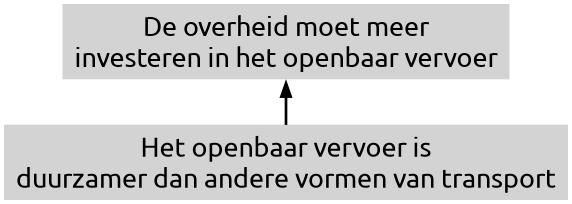

## Standpunt en argument

De essentie van een overtuigende tekst is het **standpunt**. Dit is een mening, gedachte, visie of idee die de auteur wil overbrengen. Een standpunt kun je herkennen aan signaalwoorden als *volgens mij*, *daarom*, *dus* etc.  
Een standpunt staat niet altijd expliciet in de tekst.

> *Het is niet te rechtvaardigen dat leerlingen zo veel naar school moeten*  
> Standpunt: **leerlingen moeten minder naar school**

Een **argument** is een onderbouwing (of ontkrachting) van een standpunt.  
Argumenten kunnen **feitelijk** of **waarderend** zijn.

- **Feitelijke argumenten** kun je controleren.  
  > *De overheid moet meer investeren in het openbaar vervoer, **want dit leidt tot minder uitstoot en filevorming**.*
- **Waarderende argumenten** bevatten een subjectieve beoordeling van iets. Niet iedereen zal het ermee eens zijn.  
  > *De overheid moet meer investeren in het openbaar vervoer, **want iedereen moet vervoer kunnen betalen**.*

Waarderende argumenten worden soms onderbouwd met feitelijke **subargumenten**:  
> *De overheid moet meer investeren in het openbaar vervoer, want iedereen moet vervoer kunnen betalen, **en in Nederland is meer dan 50% van de huishoudens afhankelijk van het openbaar vervoer**.*

**Tegenargumenten** ontkrachten een standpunt of argument. Je kunt een tegenargument ook weer ontkrachten: een **weerlegging**.

## Argumentatiestructuren

Argumenten kunnen op verschillende manieren het standpunt ondersteunen. Zo'n **argumentatiestructuur** kun je weergeven in een **blokjesschema**.

> Als je van boven naar beneden leest, betekenen de pijltjes **want**.  
> Als je van beneden naar boven leest, betekenen de pijltjes **dus**.

- **Enkelvoudige argumentatie**  
  Er is 1 argument dat het standpunt onderbouwt.

  

- **Onderschikkende argumentatie**  
  Het argument wordt zelf ondersteund door ten minste 1 **subargument**.

  

- **Nevenschikkende argumentatie met onafhankelijke argumenten**  
  Het standpunt wordt ondersteund door meerdere argumenten die **los van elkaar te gebruiken zijn**.

  

- **Nevenschikkende argumentatie met afhankelijke argumenten**  
  Het standpunt wordt ondersteund door meerdere argumenten die **niet los van elkaar te gebruiken zijn**. De argumenten werken alleen in combinatie met elkaar.

  

Je kunt ook een combinatie hebben van deze argumentatiestructuren, zoals een **onder- en nevenschikkende argumentatie**, dus met meerdere argumenten en met (een) subargument(en).

## Argumentatieschema's

Een **argumentatieschema** geeft het verband aan tussen een standpunt en het argument.

- **Argumentatie op basis van autoriteit**  
  De argumentatie is gebaseerd op iemand of iets met gezag of status.

  > *Volgens klimaatwetenschapper professor Kuijpers stijgt de zeespiegel sneller dan verwacht, daarom moeten we nu actie ondernemen.*

- **Argumentatie op basis van kenmerk of eigenschap**  
  Een kenmerk of eigenschap van een bepaalde groep wordt uitgelicht.

  > *Studenten zijn vaak creatief en flexibel, daarom zijn ze geschikt voor banen in de creatieve sector.*

- **Argumentatie op basis van oorzaak en gevolg**  
  Een feit of gebeurtenis zal leiden tot een ander feit of een andere gebeurtenis.

  > *Als we meer bomen kappen, neemt de luchtvervuiling toe.*

- **Argumentatie op basis van vergelijking**  
  Er wordt een vergelijking gemaakt en een overeenkomst vastgesteld (het is bij het ene geval zo, dus het zal bij het andere geval ook zo zijn).

  > *In Nederland is het rookverbod in cafés succesvol, daarom zal een rookverbod op terrassen ook goed werken.*

- **Argumentatie op basis van voor- en nadelen**  
  De voordelen worden afgezet tegen de nadelen, waarna er een oordeel wordt gegeven.

  > *Elektrisch autorijden vermindert de uitstoot van broeikasgassen en geluidsoverlast, maar de batterijen zijn milieubelastend om te produceren. Omdat batterijen maar één keer geproduceerd hoeven te worden, is het wel voordelig om over te stappen op elektrische auto's.*

- **Argumentatie op basis van voorbeelden**  
  Er worden voorbeelden gegeven om het standpunt te ondersteunen.

  > *Veel bedrijven zoals Tesla, Google en Apple investeren in duurzame energie, daarom is duurzaamheid een belangrijke trend in de technologie-industrie.*
