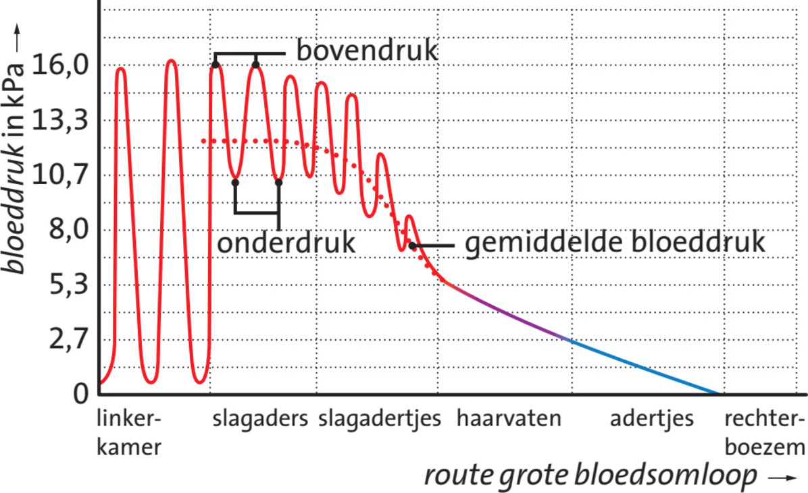
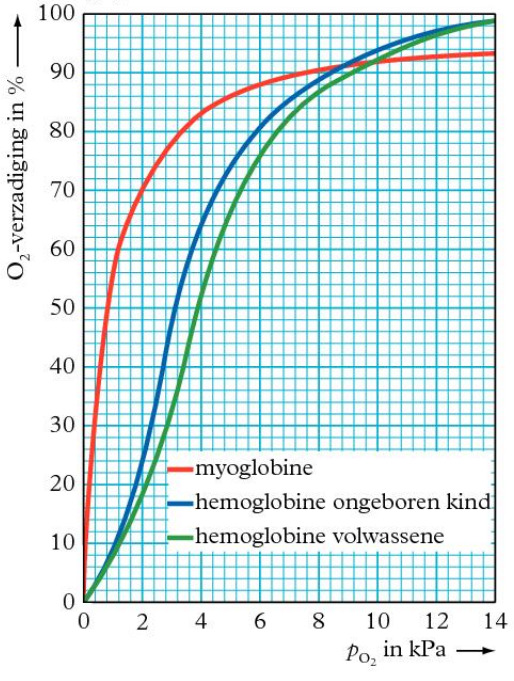

# Biologie: Hoofdstuk 10 (Bloedsomloop)

## Bloedsomloop

Insecten hebben een **open circulatiesysteem**. Hun bloedvatenstelsel bestaat uit 1 groot dorsaal bloedvat, de **hartbuis**, met gespierde segmenten die het bloed door het lichaam pompen. Eenmaal uit de hartbuis stroomt het bloed vrij door het lichaam. Het bloed van insecten vervoert geen zuurstof en bevat geen bloedcellen. Zuurstof wordt opgenomen via **tracheeën**, luchtgevulde buisjes.

Vissen, amfibieën, reptielen, vogels en zoogdieren hebben een **gesloten bloedsomloop**, waarbij bloed door bloedvaten stroomt.  
Vissen hebben een **enkele bloedsomloop**: het bloed stroomt per circulatie slechts 1 keer door het hart.

Amfibieën, reptielen, vogels en zoogdieren hebben een **dubbele bloedsomloop**, waarbij het bloed per circulatie twee keer door het hart stroomt. De harthelften zijn gescheiden.

- De **rechterkamer** pompt zuurstofarm bloed via de **longslagader** naar de longen. Hier neemt het bloed zuurstof op en geeft koolstofdioxide af. Het zuurstofrijke bloed stroomt via de **longaders** naar de **linkerboezem**. Dit is de **kleine bloedsomloop**.
- Vanuit de linkerboezem stroomt het bloed naar de **linkerkamer**, die het via de **aorta** en andere **slagaders** naar de organen pompt. In de **haarvaten** geeft het bloed zuurstof af en neemt afvalstoffen op. Het bloed keert via **aders** terug naar de **rechterboezem**. Dit is de **grote bloedsomloop**.

De benaming van aders en slagaders is meestal gebaseerd op het orgaan waar ze bloed van of naar vervoeren, zoals de armader of leverslagader. Uitzonderingen zijn de **poortader** (tussen darmen en lever), de **bovenste en onderste holle aders** (naar de rechterboezem), **kransslagaders en -aders** (van/naar het hart zelf) en de **aorta**.

De dubbele bloedsomloop maakt het mogelijk snel en gericht zuurstofrijk bloed naar organen te pompen.

## Het hart

Het hart bestaat uit twee helften, elk met een **kamer** en een **boezem**. Tussen boezems en kamers zitten **hartkleppen**. Tussen kamers en de slagaders bevinden zich de **slagaderkleppen** (of **halvemaanvormige kleppen**).

Het hart pompt bloed door ritmische samentrekkingen:

- **Boezemsystole**: de boezems trekken samen en persen bloed naar de kamers. Hartkleppen zijn open, halvemaanvormige kleppen gesloten.  
- **Kamersystole**: de kamers trekken samen en pompen bloed de longslagader en aorta in. Hartkleppen zijn gesloten, halvemaanvormige kleppen open.  
- **Diastole**: het hart ontspant; alle boezems en kamers vullen zich met bloed.

Beide harthelften pompen evenveel bloed, maar de linkerhelft doet dit met hogere druk.

## Embryonale bloedsomloop

Bij een embryo spelen de longen nog geen rol. Zuurstof en voedingsstoffen komen via de **placenta** en de **navelstreng**. Het zuurstofrijke bloed uit de navelstrengader mengt zich met zuurstofarm bloed in de onderste holle ader. Embryo's hebben dus **gemengd bloed**.

Omdat de longen nog niet functioneren, hebben embryo's twee speciale verbindingen: het **foramen ovale** (tussen de rechter- en linkerboezem) en de **ductus Botalli** (tussen de longslagader en de aorta). Hierdoor kan bloed de longen deels overslaan en rechtstreeks in de aorta of linkerboezem stromen.

Na de geboorte scheiden de grote en kleine bloedsomloop zich. De longen vullen zich met lucht (ipv met vruchtwater). Hierdoor stijgt de druk in de linkerharthelft boven die van de rechterharthelft, waardoor het foramen ovale en de ductus Botalli zich sluiten.

## Bloeddruk

De **bloeddruk** ontstaat door het samentrekken van de kamers. De druk in de slagaders stijgt bij het samentrekken van de kamers: de **systolische druk** (**bovendruk**). Tijdens de **diastole** daalt de druk: dit is de **diastolische druk** (**onderdruk**). Het verschil tussen beide wordt kleiner naarmate het bloed verder van het hart stroomt, omdat het pomp-effect afneemt.

Bloeddruk wordt officieel gemeten in Pascal (Pa), maar meestal in millimeter kwik (mm Hg).

> Millimeter kwik als eenheid voor bloeddruk is volkomen achterhaald. We hebben een universele eenheid voor druk, maar nee, we blijven lekker meten met een stukje vloeibaar metaal uit de 18e eeuw.

Om bloeddruk te meten gebruik je een **manchet** en een **stethoscoop**. De manchet wordt opgeblazen en sluit de armslagader af. Bij het langzaam laten ontsnappen van lucht hoort de arts eerst het bloed stromen (dit is dan debovendruk) en later wanneer het ongehinderd doorstroomt (en dit is de onderdruk).

## Elektrische activiteit

Het samentrekken van het hart wordt geregeld door het **prikkelgeleidingssysteem**. De elektrische prikkels beginnen in de **sinusknoop**, een groepje spiercellen in de rechterboezem, die een vast ritme aangeeft dat kan versnellen of vertragen. Door deze prikkels trekken de rechter- en linkerboezem samen.  

Bij de overgang van boezems naar kamers komt de prikkel bij de **AV-knoop** (atrioventriculaire knoop). Deze geeft de prikkel met een korte vertraging door, zodat de kamers iets later samentrekken dan de boezems.  

Vanuit de AV-knoop loopt de prikkel via de **bundel van His** naar de hartpunt, en via de **purkinjevezels** naar de hartwand, waardoor de kamers samentrekken.

De hartactiveit past zich aan, bijvoorbeeld bij inspanning of stress. Je **hartminuutvolume** (hoeveel liter je hart wegpompt per minuut) kan dus flink verschillen. Je lichaam gaat slim om met een hogere capaciteit door de verdeling van het bloed over de verschillende organen aan te passen. Dit gebeurt door kleine kringspiertjes die om slagadertjes zitten.

## Stoffentransport

De meeste stoffen die het bloed vervoert, zijn opgelost in het **bloedplasma**. Het bloedplasma bevat voedingsstoffen, afvalstoffen, hormonen, etc. De **rode bloedcellen** transporteren zuurstof en koolstofdioxide. De **witte bloedcellen** zijn betrokken bij de afweer tegen ziekteverwekkers. **Bloedplaatjes** zijn geen cellen, maar kleine celdeeltjes die een rol spelen bij de bloedstolling.

Zuurstof wordt voor een klein deel (max. 3 mL per liter) opgelost in het bloedplasma, maar voornamelijk door de rode bloedcellen (max. 200 mL zuurstof per liter) vervoerd.  
Rode bloedcellen hebben geen kern en minder organellen. Ze bevatten wel 200 tot 300 miljoen moleculen **hemoglobine**.

Hemoglobine ($\ce{Hb}$) bestaat uit vier eiwitketens met elk een **heemgroep**. Deze heemgroep bevat een ijzer(II)-ion.  
Zodra zuurstof aan hemoglobine bindt, ontstaat oxihemoglobine (oxiHb, $\ce{HbO2}$). Deze bindingsreactie is een [evenwichtsreactie](../../4VWO/TW4/schk_h6#evenwichten):  
$\ce{Hb + O2 <--> HbO2}$

Elke heemgroep kan 1 zuurstofmolecuul binden. Aan de **zuurstofverzadigingsdiagrammen** (Binas 83D) kun je zien hoe sterk hemoglobine zuurstof bindt, afhankelijk van de aanwezige zuurstofconcentratie. De **affiniteit** van hemoglobine voor zuurstof neemt toe naarmate meer zuurstofmoleculen gebonden zijn. Hierdoor kan hemoglobine efficiënt zuurstof opnemen in de longen en afgeven in de organen.

Naast hemoglobine kan ook **myoglobine** ($\ce{Mb}$) zuurstof binden. Dit eiwit bevindt zich in hart- en skeletspieren. Myoglobine kan zuurstof opslaan als reservevoorraad, waardoor spieren een buffer hebben. Myoglobine heeft een hogere affiniteit voor zuurstof dan hemoglobine, waardoor het zuurstof langer vasthoudt. Het is dus geschikt voor opslag, maar niet voor transport, omdat het pas bij zeer lage zuurstofspiegels zuurstof afgeeft.

Het hemoglobine van een ongeboren kind heeft een iets hogere affiniteit dan dat van volwassenen, zodat er in de placenta een efficiënte overdracht van zuurstof kan plaatsvinden.

Koolstofdioxide kan op drie manieren door het bloed worden vervoerd:

1. Opgelost in het bloedplasma (ongeveer 5% van het gevormde koolstofdioxide).
2. Gebonden aan hemoglobine als carbaminohemoglobine ($\ce{HbCO2}$) (ongeveer 25%).
3. Omgezet tot koolzuur ($\ce{H2CO3}$) met behulp van het enzym **koolzuuranhydrase**. Het $\ce{H2CO3}$ splitst vervolgens in $\ce{HCO3^-}$ en $\ce{H^+}$. De $\ce{H^+}$ bindt aan hemoglobine tot $\ce{HbH}$, terwijl $\ce{HCO3^-}$ het bloedplasma binnendiffundeert. Om het ladingsverschil te compenseren, stroomt $\ce{Cl^-}$ de cel in.

De pH van het bloed moet relatief constant blijven, omdat sommige enzymen anders minder goed functioneren. Daarom zijn er pH-buffers, zoals hemoglobine.

De verzadiging van hemoglobine met zuurstof hangt af van de zuurstofdruk. In de longen is hemoglobine ongeveer 96% verzadigd. In weefsels daalt dit naar 75%, waardoor 21% van de zuurstof wordt afgegeven.

Bij inspanning daalt de zuurstofdruk in de spieren verder en stijgt de koolstofdioxidedruk en temperatuur, waardoor hemoglobine tot 15% verzadigd kan zijn en veel extra zuurstof afgeeft. Koolstofdioxide beïnvloedt het oxihemoglobinegehalte op twee manieren: door de pH te verlagen en door zuurstof van hemoglobine te verdringen. Door hogere koolstofdioxidedruk, lagere pH en hogere temperatuur wordt er meer zuurstof afgegeven: het **Bohr-effect**.

