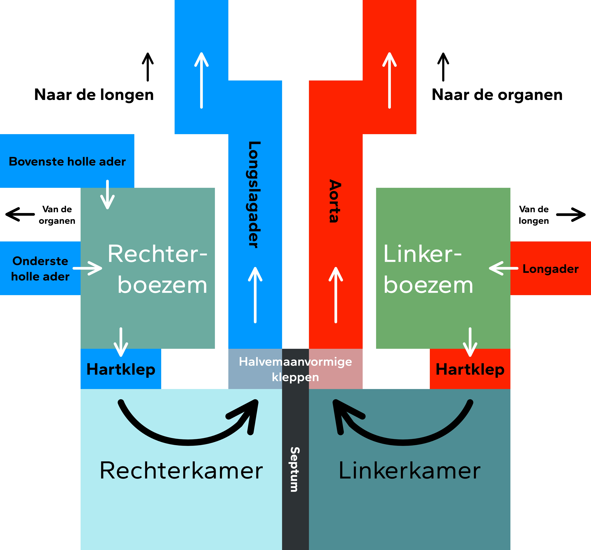

# Biologie: Hoofdstuk 10 (Bloedsomloop)

## Bloedsomloop

Insecten hebben een **open circulatiesysteem**. Hun bloedvatenstelsel bestaat uit 1 groot dorsaal bloedvat, de **hartbuis**, met gespierde segmenten die het bloed door het lichaam pompen. Eenmaal uit de hartbuis stroomt het bloed vrij door het lichaam. Het bloed van insecten vervoert geen zuurstof en bevat geen bloedcellen. Zuurstof wordt opgenomen via **tracheeën**, luchtgevulde buisjes.

Vissen, amfibieën, reptielen, vogels en zoogdieren hebben een **gesloten bloedsomloop**, waarbij bloed door bloedvaten stroomt.  
Vissen hebben een **enkele bloedsomloop**: het bloed stroomt per circulatie slechts 1 keer door het hart.

Amfibieën, reptielen, vogels en zoogdieren hebben een **dubbele bloedsomloop**, waarbij het bloed per circulatie twee keer door het hart stroomt. De harthelften zijn gescheiden.

- De **rechterkamer** pompt zuurstofarm bloed via de **longslagader** naar de longen. Hier neemt het bloed zuurstof op en geeft koolstofdioxide af. Het zuurstofrijke bloed stroomt via de **longaders** naar de **linkerboezem**. Dit is de **kleine bloedsomloop**.
- Vanuit de linkerboezem stroomt het bloed naar de **linkerkamer**, die het via de **aorta** en andere **slagaders** naar de organen pompt. In de **haarvaten** geeft het bloed zuurstof af en neemt afvalstoffen op. Het bloed keert via **aders** terug naar de **rechterboezem**. Dit is de **grote bloedsomloop**.

De benaming van aders en slagaders is meestal gebaseerd op het orgaan waar ze bloed van of naar vervoeren, zoals de armader of leverslagader. Uitzonderingen zijn de **poortader** (tussen darmen en lever), de **bovenste en onderste holle aders** (naar de rechterboezem), **kransslagaders en -aders** (van/naar het hart zelf) en de **aorta**.

De dubbele bloedsomloop maakt het mogelijk snel en gericht zuurstofrijk bloed naar organen te pompen.

## Het hart

Het hart bestaat uit twee helften, elk met een **kamer** en een **boezem**. Tussen boezems en kamers zitten **hartkleppen**. Tussen kamers en de slagaders bevinden zich de **slagaderkleppen** (of **halvemaanvormige kleppen**).

Het hart pompt bloed door ritmische samentrekkingen:

- **Boezemsystole**: de boezems trekken samen en persen bloed naar de kamers. Hartkleppen zijn open, halvemaanvormige kleppen gesloten.  
- **Kamersystole**: de kamers trekken samen en pompen bloed de longslagader en aorta in. Hartkleppen zijn gesloten, halvemaanvormige kleppen open.  
- **Diastole**: het hart ontspant; alle boezems en kamers vullen zich met bloed.

Beide harthelften pompen evenveel bloed, maar de linkerhelft doet dit met hogere druk.

## Embryonale bloedsomloop

Bij een embryo spelen de longen nog geen rol. Zuurstof en voedingsstoffen komen via de **placenta** en de **navelstreng**. Het zuurstofrijke bloed uit de navelstrengader mengt zich met zuurstofarm bloed in de onderste holle ader. Embryo's hebben dus **gemengd bloed**.

Omdat de longen nog niet functioneren, hebben embryo's twee speciale verbindingen: het **foramen ovale** (tussen de rechter- en linkerboezem) en de **ductus Botalli** (tussen de longslagader en de aorta). Hierdoor kan bloed de longen deels overslaan en rechtstreeks in de aorta of linkerboezem stromen.

Na de geboorte scheiden de grote en kleine bloedsomloop zich. De longen vullen zich met lucht (ipv met vruchtwater). Hierdoor stijgt de druk in de linkerharthelft boven die van de rechterharthelft, waardoor het foramen ovale en de ductus Botalli zich sluiten.
