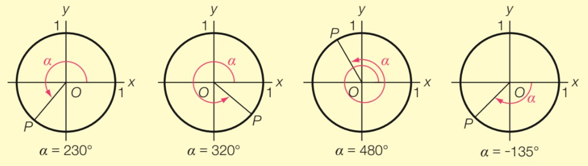
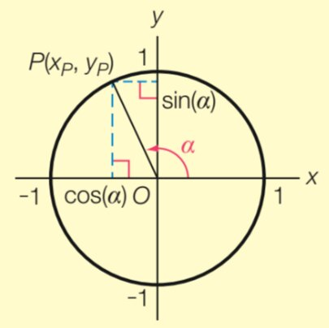
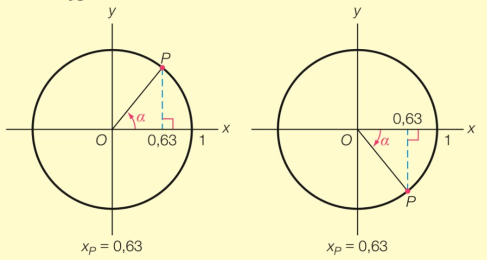
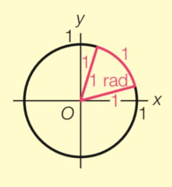
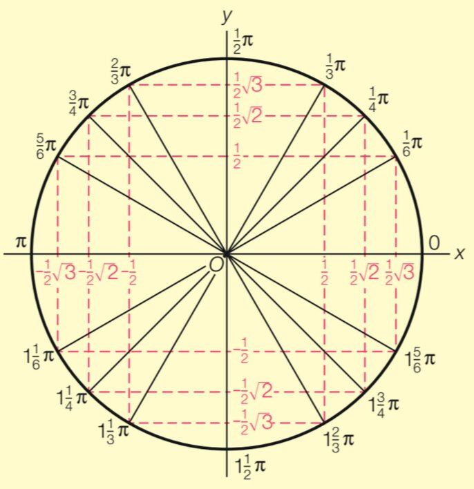
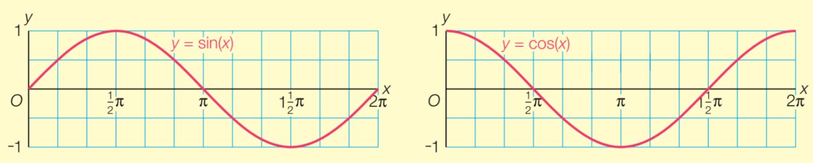

## Lijnen

Stelsels kun je op [verschillende manieren oplossen](../../4VWO/P3/wisb_h4#getallenparen-en-stelsels).

Voor de lijnen $ax+by=c$ en $px+qy=r$ geldt:

| Soort stelsel     | Voorwaarde                                     | Oplossingen   | Lijnen       |
| ----------------- | ---------------------------------------------- | ------------- | ------------ |
| **Strijdig**      | $$\frac{a}{p} = \frac{b}{q} \neq \frac{c}{r}$$ | Geen          | Evenwijdig   |
| **Afhankelijk**   | $$\frac{a}{p} = \frac{b}{q} = \frac{c}{r}$$    | Oneindig veel | Vallen samen |
| **Onafhankelijk** | $$\frac{a}{p} \neq \frac{b}{q}$$               | 1             | Snijden      |

De lijn door de punten $(a, 0)$ en $(0, b)$ met $a \neq 0 \land b \neq 0$ heeft de vergelijking: $\frac{x}{a}+\frac{y}{b}=1$

## Hoeken

Een **richtingshoek** van een lijn is de hoek waarmee je de $x$-as moet draaien om deze lijn te laten samenvallen met de as. We nemen altijd de hoek waarvoor geldt $-90^{\circ} < \alpha \leq 90^{\circ}$.

Voor de richtingshoek $\alpha$ van de lijn $k$ geldt: $\tan (\alpha) = \mathrm{rc}_k \land -90^{\circ} < \alpha \leq 90^{\circ}$

De hoek tussen 2 lijnen vind je door hun richtingshoeken van elkaar af te trekken. We nemen altijd de hoek waarvoor geldt $0^{\circ} \leq \varphi \leq 90^{\circ}$.

Voor de hoek $\varphi$ tussen 2 lijnen met richtingshoeken $\alpha$ en $\beta$, waarbij $\alpha > \beta$, geldt:

- $\varphi = \alpha - \beta$ als $\alpha - \beta \leq 90^{\circ}$
- $\varphi = 180^{\circ} - (\alpha - \beta)$ als $\alpha - \beta > 90^{\circ}$

## Afstanden

### Afstand tussen 2 punten

De afstand tussen 2 punten bereken je met de stelling van Pythagoras. Hierbij is de afstand de schuine zijde, en de verschillen in coördinaten zijn de lengtes van de rechthoekszijden.

Voor de afstand tussen de punten $A(x_A, y_A)$ en $B(x_B, y_B)$ geldt:
$$d(A, B) = \sqrt{(x_B-x_A)^2 + (y_B-y_A)^2}$$

De coördinaten van het midden $M$ van het lijnstuk $AB$ zijn het gemiddelde van de coördinaten van $A$ en $B$:
$$x_M = \frac{1}{2}(x_A + x_B) \quad\quad y_M = \frac{1}{2}(y_A + y_B)$$

### Loodrechte lijnen

Voor 2 lijnen die loodrecht op elkaar staan geldt: $\mathrm{rc}_k \cdot \mathrm{rc}_l = -1$.

Voor de lijn $ax+by=c$ met $b \neq 0$ geldt: $\mathrm{rc} = -\tfrac{a}{b}$.

Voor de lijn $bx - ay = d$ met $a \neq 0$ geldt: $\mathrm{rc} = \tfrac{b}{a}$.

Hieruit volgt dat de lijnen $ax+by=c$ en $bx-ay=d$ loodrecht op elkaar staan.

### Afstand van een punt tot een lijn

Bij de afstand van een punt tot een lijn speelt de **loodrechte projectie** een rol. Dit is de lijn vanuit het punt die loodrecht op de gegeven lijn staat. De afstand van een punt $P$ tot de lijn $l$ is de afstand van $P$ tot zijn loodrechte projectie $P'$ op $l$.

De afstand kan sneller worden berekend met de **afstandsformule**. Voor een punt $P(x_P, y_P)$ en een lijn $k: ax + by = c$ geldt:
$$d(P, k) = \frac{\lvert ax_P + by_P - c \rvert}{\sqrt{a^2 + b^2}}$$

## Cirkelvergelijkingen

De cirkel met middelpunt $M(x_M, y_M)$ en straal $r$ heeft vergelijking:
$$(x - x_M)^2 + (y - y_M)^2 = r^2$$

Als de lijn $k$ de cirkel $c$ met middelpunt $M$ en straal $r$ raakt in punt $A$, dan geldt: $MA \perp k$ en $d(M, k) = r$.

Bij raaklijnen van cirkels is het dus belangrijk dat de afstand van het middelpunt tot de lijn gelijk is aan de straal.

## Eenheidscirkel

De **eenheidscirkel** is de cirkel met middelpunt $O(0,0)$ en straal 1. Het punt $P$ beweegt over de eenheidscirkel en begint in $A(1,0)$. De hoek $\angle AOP$ noemen we de **draaiingshoek** van $P$, en we geven deze aan met $\alpha$.

Voor de draaiingshoek $\alpha$ van het punt $P(x_P,y_P)$ op de eenheidscirkel geldt:

- $\sin(\alpha) = y_P$
- $\cos(\alpha) = x_P$
- $\tan(\alpha) = \frac{y_P}{x_P}$

Als je van $y_P$ of $x_P$ terug naar $\alpha$ wilt rekenen, moet je vaak 2 antwoorden opschrijven (terwijl de GR slechts 1 antwoord geeft). Dit komt doordat er meerdere punten op de cirkel zijn met dezelfde $x$- of $y$-coördinaat.

In de afbeelding zie je dat er voor $x_P = 0{,}63$ meerdere hoeken mogelijk zijn, omdat er 2 punten op de cirkel zijn waar $x_P = 0{,}63$.

## Radialen

Voor de punten $P$ en $Q$ op een cirkel met middelpunt $O$ is de hoek $\angle POQ$ de **middelpuntshoek**. Met behulp van de middelpuntshoek kunnen we de hoekeenheid **radiaal** definiëren.

**De middelpuntshoek in de eenheidscirkel die hoort bij een cirkelboog met lengte 1 is een hoek van 1 radiaal.**

De hele cirkel heeft een booglengte van $2\pi$ (de omtrek van een cirkel met straal 1), dus $2\pi \mathrm{~rad} = 360^{\circ}$. Hieruit volgt dat $\pi \mathrm{~rad} = 180^{\circ}$. Bij een hoek in radialen mag je de eenheid weglaten.

## Exacte-waarden-cirkel

Voor bepaalde hoeken kun je de waarden van sinus, cosinus en tangens exact opschrijven. Leer onderstaande tabel uit je hoofd.

| hoek    | $0$ | $\frac{1}{6}\pi$ (30°) | $\frac{1}{4}\pi$ (45°) | $\frac{1}{3}\pi$ (60°) | $\frac{1}{2}\pi$ (90°) |
| ------- | --- | ---------------------- | ---------------------- | ---------------------- | ---------------------- |
| sinus   | $0$ | $\frac{1}{2}$          | $\frac{1}{2}\sqrt{2}$  | $\frac{1}{2}\sqrt{3}$  | $1$                    |
| cosinus | $1$ | $\frac{1}{2}\sqrt{3}$  | $\frac{1}{2}\sqrt{2}$  | $\frac{1}{2}$          | $0$                    |
| tangens | $0$ | $\frac{1}{3}\sqrt{3}$  | $1$                    | $\sqrt{3}$             | -                      |

In de kwart eenheidscirkel hierboven zijn de sinus en de cosinus van de hoeken uit de tabel verwerkt.

Als je deze spiegelt over beide assen, krijg je de **exacte-waarden-cirkel** met alle exacte waarden voor alle kwadranten.

In de andere kwadranten worden sommige waarden negatief (afhankelijk van of $x_P$ of $y_P$ negatief is).

## Goniometrische functies

De grafiek van de **goniometrische functie** $f(x) = \sin(x)$ is een **sinusoïde**.

De grafiek is periodiek met een **periode** van $2\pi$ (de grafiek herhaalt zich elke $2\pi$). De **evenwichtsstand** is $0$ en de **amplitude** is $1$.

Een **beginpunt** van de functie $f(x) = \sin(x)$ is een punt waar de grafiek stijgend door de evenwichtsstand gaat.
Een **beginpunt** van de functie $g(x) = \cos(x)$ is een hoogste punt van de grafiek.

### Transformaties

Door transformaties kun je andere **sinusoïden** krijgen.

| transformatie                | beeldgrafiek          |
| ---------------------------- | --------------------- |
| translatie $(d,a)$           | $y = a + \sin(x - d)$ |
| verm. x-as met $b$           | $y = b\sin(x)$        |
| verm. y-as met $\frac{1}{c}$ | $y = \sin(cx)$        |

Voor de algemene vorm $y = a + b\sin(c(x-d))$ geldt:

- **Evenwichtsstand** = $a$
- **Amplitude** = $|b|$
- **Periode** = $\frac{2\pi}{c}$
- **Beginpunt** = $(d, a)$

Voor de algemene vorm $y = a + b\cos(c(x-d))$ geldt:

- **Evenwichtsstand** = $a$
- **Amplitude** = $|b|$
- **Periode** = $\frac{2\pi}{c}$
- **Beginpunt** = $(d, a + b)$

|       | $y = a + b\sin(c(x-d))$ | $y = a + b\cos(c(x-d))$       |
| ----- | ----------------------- | ----------------------------- |
| $b>0$ | stijgend door beginpunt | beginpunt is een hoogste punt |
| $b<0$ | dalend door beginpunt   | beginpunt is een laagste punt |

## Goniometrische vergelijkingen

De vergelijking $\sin(A) = 0$ heeft oneindig veel oplossingen: $A = ..., -3\pi, -2\pi, -\pi, 0, \pi, 2\pi, 3\pi, ...$. Dit kun je noteren als $A = k \cdot \pi$, waarin $k$ een geheel getal is.

Met behulp van de eenheidscirkel kun je standaardvergelijkingen oplossen:

- $\sin(A) = 0$ geeft $A = k \cdot \pi$
- $\sin(A) = 1$ geeft $A = \frac{1}{2}\pi + k \cdot 2\pi$
- $\sin(A) = -1$ geeft $A = 1\frac{1}{2}\pi + k \cdot 2\pi$
- $\cos(A) = 0$ geeft $A = \frac{1}{2}\pi + k \cdot \pi$
- $\cos(A) = 1$ geeft $A = k \cdot 2\pi$
- $\cos(A) = -1$ geeft $A = \pi + k \cdot 2\pi$

De vergelijkingen $\sin(A) = C$ en $\cos(A) = C$ waarbij $C$ een van de exacte waarden is uit de exacte-waarden-cirkel $\left(-\frac{1}{2}\sqrt{3}, -\frac{1}{2}\sqrt{2}, -\frac{1}{2}, \frac{1}{2}, \frac{1}{2}\sqrt{2}, \frac{1}{2}\sqrt{3}\right)$ los je op door eerst 1 oplossing $B$ af te lezen uit de exacte-waarden-cirkel.

Er geldt dan (waarbij $B$ de afgelezen oplossing uit de exacte-waarden-cirkel is):

- $\sin(A) = C$ geeft $A = B + k \cdot 2\pi \lor A = \pi - B + k \cdot 2\pi$
- $\cos(A) = C$ geeft $A = B + k \cdot 2\pi \lor A = -B + k \cdot 2\pi$

Als je twee sinussen of twee cosinussen aan elkaar gelijk stelt, geldt:

- $\sin(A) = \sin(B)$ geeft $A = B + k \cdot 2\pi \lor A = \pi - B + k \cdot 2\pi$
- $\cos(A) = \cos(B)$ geeft $A = B + k \cdot 2\pi \lor A = -B + k \cdot 2\pi$

## Tangens

Voor het punt $P$ op de eenheidscirkel met draaiingshoek $\alpha$ geldt $\tan(\alpha) = \frac{y_P}{x_P}$. Bij $\alpha = \frac{1}{2}\pi$ zou dan gelden $\tan(\frac{1}{2}\pi) = \frac{1}{0}$, maar delen door 0 kan niet. Daarom heeft de tangensgrafiek **asymptoten** (verticale lijnen die de grafiek benaderen maar nooit raken).
Deze asymptoten liggen op $x = \frac{1}{2}\pi + k \cdot \pi$ (alle plekken waar $\cos(x) = 0$).

De tangensfunctie heeft een periode van $\pi$ (niet $2\pi$!). De vergelijking $\tan(A) = \tan(B)$ geeft daarom:
$$A = B + k \cdot \pi$$

## Herleiden

Bij het vereenvoudigen van goniometrische vergelijkingen kun je de volgende identiteiten gebruiken.

De notatie $\sin^2(A)$ betekent $(\sin(A))^2$.

- $\sin(-A) = -\sin(A)$ (spiegeling in de y-as)
- $\cos(-A) = \cos(A)$ (spiegeling in de y-as)
- $-\sin(A) = \sin(A + \pi)$ (verschuiving over $\pi$)
- $-\cos(A) = \cos(A + \pi)$ (verschuiving over $\pi$)
- $\sin(A) = \cos(A - \frac{1}{2}\pi)$
- $\cos(A) = \sin(A + \frac{1}{2}\pi)$
- $\sin^2(A) + \cos^2(A) = 1$ (stelling van Pythagoras in de eenheidscirkel)
- $\tan(A) = \frac{\sin(A)}{\cos(A)}$

## Differentiëren (goniometrie)

De afgeleide van goniometrische functies:

- $f(x) = \sin(x)$ geeft $f'(x) = \cos(x)$
- $f(x) = \cos(x)$ geeft $f'(x) = -\sin(x)$
- $f(x) = \tan(x)$ geeft $f'(x) = \frac{1}{\cos^2(x)} = 1 + \tan^2(x)$

Bij het differentiëren van samengestelde goniometrische functies moet je ook de kettingregel toepassen.

## Logaritmes

De **logaritme** is de omgekeerde bewerking van machtsverheffen. ${}^g\!\log(x)$ geeft antwoord op de vraag 'tot welke macht moet ik $g$ verheffen om $x$ te krijgen?'.

$${}^g\!\log(x) = a \iff g^a = x$$

Bijvoorbeeld: ${}^2\!\log(8) = 3$ omdat $2^3 = 8$.

Hieruit volgen twee eigenschappen: ${}^g\!\log(g^a) = a$ en $g^{{}^g\!\log(x)} = x$.

Voor logaritmes gelden de volgende rekenregels (met $g > 0$, $g \neq 1$, $a > 0$ en $b > 0$):

- ${}^g\!\log(a) + {}^g\!\log(b) = {}^g\!\log(a \cdot b)$
- ${}^g\!\log(a) - {}^g\!\log(b) = {}^g\!\log\left(\frac{a}{b}\right)$
- $p \cdot {}^g\!\log(a) = {}^g\!\log(a^p)$
- ${}^g\!\log(a) = \frac{{}^p\!\log(a)}{{}^p\!\log(g)}$ (waarbij $p$ elk getal kan zijn)
- ${}^{\frac{1}{g}}\!\log(a) = -^g\!\log(a)$

Als er geen grondtal bij de logaritme staat, mag je uitgaaan van ${}^{10}\!\log$.

Bij het oplossen van **logaritmische vergelijkingen** werk je naar een vorm waarin beide zijden een logaritme met hetzelfde grondtal zijn. Dan geldt ${}^g\!\log(A) = {}^g\!\log(B) \implies A = B$.

Let op: de input van een logaritme moet altijd positief zijn, dus je moet goed checken of je uitkomst voldoet!

## Exponentiële groei

Bij **exponentiële groei** wordt de hoeveelheid per tijdseenheid met een vaste **groeifactor** $g$ vermenigvuldigd. Hierbij hoort de formule $N = b \cdot g^t$, waarin $b$ de beginhoeveelheid is, $g$ de groeifactor per tijdseenheid en $t$ de tijd. Als $g > 1$ is er sprake van groei, als $0 < g < 1$ van afname.

De groeifactor per $n$ tijdseenheden is $g^n$.

De **verdubbelingstijd** $T$ vind je door $g^T = 2$ op te lossen: $T = {}^g\!\log(2)$.
De **halveringstijd** vind je door $g^T = \frac{1}{2}$ op te lossen: $T = {}^g\!\log\left(\tfrac{1}{2}\right)$.

## Het getal e en de natuurlijke logaritme

Het getal $e$ ontstaat uit de limiet:

$$e = \lim_{n \to \infty} \left(1 + \frac{1}{n}\right)^n \approx 2{,}718$$

Het getal $e$ heeft de bijzondere eigenschap dat de afgeleide van $e^x$ gelijk is aan zichzelf: $f(x) = e^x$ geeft $f'(x) = e^x$.

De logaritme met grondtal $e$ heet de **natuurlijke logaritme**: $\ln(x) = {}^e\!\log(x)$. De functie $y = \ln(x)$ is de inverse van $y = e^x$. De grafiek is stijgend met de $y$-as als verticale asymptoot, domein $(0, \rightarrow)$ en bereik $\mathbb{R}$.

Elke exponentiële functie kun je schrijven met grondtal $e$: $g^x = e^{\ln(g) \cdot x}$.

## Differentiëren (exponentieel & logaritmisch)

Voor exponentiële functies geldt:

- $f(x) = e^x$ geeft $f'(x) = e^x$
- $f(x) = g^x$ geeft $f'(x) = g^x \cdot \ln(g)$

Voor logaritmische functies geldt:

- $f(x) = \ln(x)$ geeft $f'(x) = \frac{1}{x}$
- $f(x) = {}^g\!\log(x)$ geeft $f'(x) = \frac{1}{x \cdot \ln(g)}$
