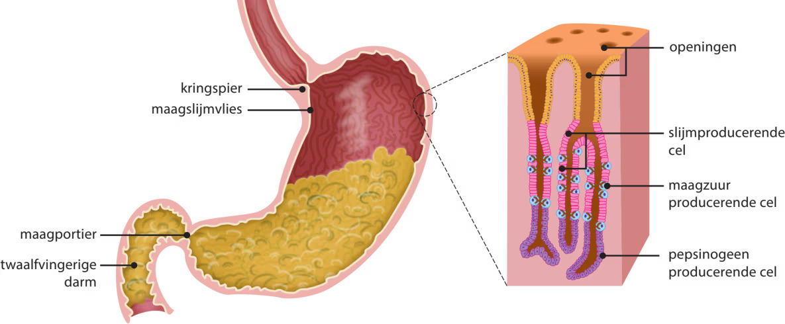
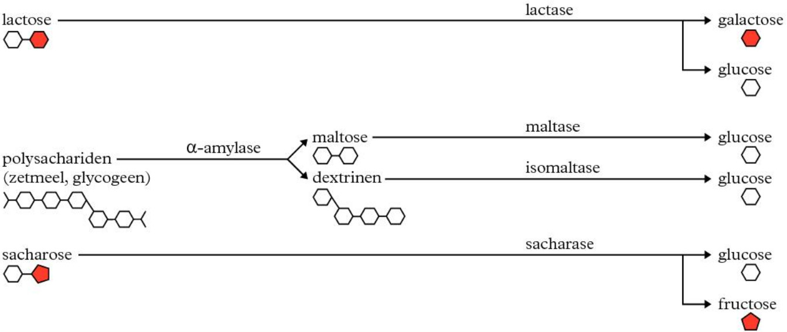
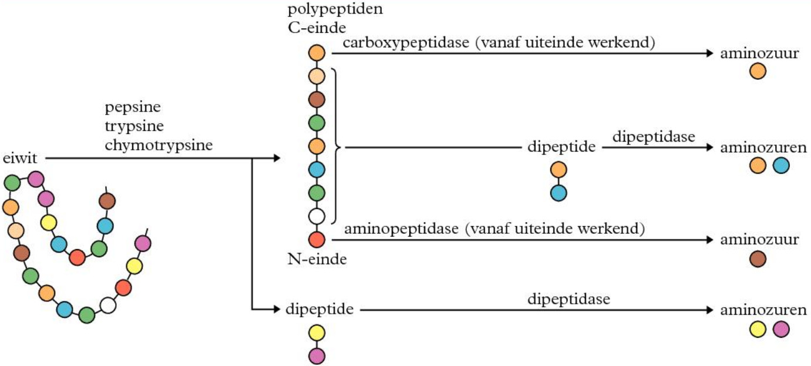

## Eetpatronen en voedingsstoffen

Bij een gezond voedingspatroon is de voeding afgestemd op het energiegebruik en op de hoeveelheid voedingsstoffen die mensen nodig hebben. Als die afstemming ontbreekt, kunnen **welvaartziekten** (door te veel voedingsstoffen) of **gebreksziekten** (door te weinig (van bepaalde) voedingsstoffen) ontstaan.

De bouwstenen voor het opbouwen van de eiwitten, koolhydraten, DNA en vetten in je lichaam haal je uit voedingsstoffen.

Er zijn 6 groepen **voedingsstoffen**:

| Voedingsstof     | Functies                                                                                                                                | Voorbeelden                                                     |
| ---------------- | --------------------------------------------------------------------------------------------------------------------------------------- | --------------------------------------------------------------- |
| **Koolhydraten** | Brandstof<!-- (o.a. voor energie als ATP) -->, bouwstof<!-- (o.a. binnen cellen) -->, reservestof<!-- (o.a. als opslag van energie) --> | Aardappelen, granen, brood, pasta's                             |
| **Vetten**       | Brandstof, bouwstof<!-- (o.a. voor membranen en hormonen, warmte-isolatie) -->, reservestof<!-- (o.a. onder de huid) -->                | Olijfolie, slaolie, boter, noten                                |
| **Eiwitten**     | Bouwstof<!-- (o.a. als spiereiwitten) -->, brandstof                                                                                    | Vlees, vis, eieren                                              |
| **Water**        | Bouwstof<!-- (o.a. voor cellen) -->, transportmiddel, oplosmiddel, warmtebuffer                                                         | Groenten, fruit, soep                                           |
| **Mineralen**    | Bouwstof<!-- (o.a. in zouten) -->, regelstof<!-- (helpen bij werking van je lichaam) -->                                                | Calcium (melk), ijzer (vlees), natrium (zout), kalium (bananen) |
| **Vitaminen**    | Regelstof, beschermende stof                                                                                                            | Vitamine C (sinaasappels), vitamine D (zonlicht) (Binas 82A)    |

**Voedingsvezels** zijn onverteerbare plantaardige koolhydraten. Ze hebben 2 belangrijke functies: het stimuleren van de **darmperistaltiek** en het opnemen van water (zodat de ontlasting soepel blijft). Darmperistaltiek is het samentrekken van lengte- en kringspieren in het hele **maag-darmkanaal** (alle organen van het spijsverteringsstelsel, van slokdarm tot anus), waardoor voedsel wordt voortbewogen.

**Additieven** zijn stoffen die zijn toegevoegd om het voedingsmiddel aantrekkelijker of langer houdbaar te maken. Additieven kunnen in grote hoeveelheden schadelijk zijn voor je lichaam, maar je hebt additieven vaak helemaal niet nodig.

## Problemen met voedingsmiddelen

Er kunnen op verschillende manieren problemen ontstaan met voedingsmiddelen. Meestal gaat je lichaam er goed mee om, maar soms gaat het fout.

- Bij een **voedselvergiftiging** word je ziek van gifstoffen die door micro-organismen zijn geproduceerd. Deze gifstoffen kunnen al in het voedsel aanwezig zijn of worden later in de darmen geproduceerd.
- Bij een **voedselinfectie** wordt de darmwand aangetast door micro-organismen die in voedingsmiddelen zitten.
- Bij een **voedselallergie** reageert het immuunsysteem (heel) sterk op bepaalde voedingsmiddelen. Er komt dan vaak histamine vrij in het lichaam, waardoor slijmvliezen zich opzetten en bloedvaten verwijden.
- Bij een **voedselintolerantie** kan het lichaam bepaalde voedingsstoffen niet goed verteren.

## Vertering

Kiezen malen je voedingsmiddelen in kleine stukjes: **mechanische verkleining**. Hierdoor wordt het oppervlakte vergroot, wat de vertering versnelt.
**Chemische vertering** is de afbraak van grote moleculen tot opneembare moleculen door **enzymen** in **verteringssappen**.

Er zijn veel organen (Binas 82C) en veel verteringssappen en enzymen (Binas 82E & 82F) betrokken bij de vertering.

De vertering begint in de **mond**. Hierbij speelt ook speeksel een rol (Binas 82F). Speeksel bevat het enzym amylase dat zetmeel afbreekt. Daarnaast bevat het slijm dat het doorslikken vergemakkelijkt en eiwitten die sommige bacteriën en schimmels doden.  
Tijdens het doorslikken duwt de tong het voedsel naar achteren, de huig sluit de neusholte af en het strottenklepje sluit de luchtpijp af. Het voedsel gaat vervolgens de **slokdarm** in.

Na de slokdarm komt het voedsel in de **maag** terecht. De maag kneed de voedselbrokken en vermengt ze met maagsap (afkomstig uit de **maagsapklieren**).

Maagsap bevat 3 belangrijke stoffen (Binas 82F):

- **Zoutzuur** (ook "maagzuur") laat eiwitten opzwellen waardoor enzymen effectiever kunnen werken, en doodt bacteriën.
- **Pepsinogeen** is een inactief **pro-enzym** dat onder invloed van zoutzuur omgezet wordt in **pepsine**. Pepsine breekt eiwitten af tot polypeptiden.
- **Slijm** beschermt de maagwand tegen het zoutzuur en de enzymen.

De **maagportier** sluit de maag af van de **twaalfvingerige darm**. De maagportier ontspant regelmatig om de maaginhoud de twaalfvingerige darm in te laten stromen. In de twaalfvingerige darm mondt de gezamenlijke afvoerbuis van de **lever/galblaas** en de **alvleesklier** uit.

Het **alvleessap** bevat waterstofcarbonaat (om de pH te verhogen), amylase, trypsine, lipase, nucleasen en nog andere verteringsenzymen. Deze enzymen breken grote koolhydraten, eiwitten, vetten en nucleïnezuren (DNA en RNA) af. Voor de vertering van vet is ook **gal** erg belangrijk.

Na de twaalfvingerige darm komt het voedsel terecht in de **dunne darm**. Hier wordt de vertering voltooid. De darmsapklieren produceren veel verschillende enzymen die koolhydraten (Binas 82G), polypeptiden en nucleïnezuren zoals DNA en RNA afbreken. Hierdoor ontstaan moleculen die klein genoeg zijn om celmembranen te passeren. Al deze stoffen die worden opgenomen zijn de **verteringsproducten**.

Aan het einde van de dunne darm is er nog een waterige brei van niet-verteerd voedsel, voedingsvezels, bacteriën en water. Via de **blindedarm** gaat de brei de **dikke darm** in. In de dikke darm wordt veel water opgenomen, waardoor de brei steeds 'vaster' wordt. In de **endeldarm** wordt de ontlasting opgeslagen.

## Darmbacterien

Veel **darmbacteriën** beïnvloeden je lichaam positief, zoals bij het aanmaken van vitamines, het stimuleren van de ontlasting of het afbreken van vezels. Om die bacteriën niet kwijt te raken na bijvoorbeeld een diarree-aanval, blijven ze aanwezig in de blindedarm en de **appendix**. Zo kunnen ze de dikke darm snel herbevolken. De soortensamenstelling van je darmbacteriepopulatie verschilt per mens en is niet constant.

## Enzymen

Enzymen zijn eiwitten en **katalysatoren** bij vrijwel elke chemische reactie in je lichaam. Vaak kun je aan de naam zien welke stof het enzym omzet, zoals lipase (lipiden) en lactase (lactose).

De afbraak van macromoleculen uit je voeding kost energie om te starten (**activeringsenergie**). Zonder enzymen zou deze activeringsenergie te hoog zijn voor de temperatuur in je lichaam.

Een reactie met een enzym verloopt altijd in dezelfde stappen.

1. Het **substraat** (beginstof) bindt aan de actieve plaats van het enzym, samen vormen ze een **enzymsubstraatcomplex**.
2. Op de actieve plaats worden atoombindingen in het substraat verbroken.
3. De losse delen komen los van het enzym, waarna het enzym weer beschikbaar is voor een volgende reactie.

Enzymen zijn **substraatspecifiek**: ze kunnen maar aan 1 soort substraat binden.
Omdat enzymen zelf niet verbruikt worden, kan je lichaam ze heel vaak inzetten. Daardoor heb je maar een relatief kleine hoeveelheid nodig.

Vaak speelt water ook nog een rol in het afbreken (hydrolyse) of opbouwen (condensatie) van stoffen.

## Effectiviteit van enzymen

Enzymen zijn eiwitten, en kunnen dus **denatureren** bij hogere temperaturen (zoals bij koorts). Enzymen werken bij hogere temperaturen wel sneller, maar er zijn er ook minder die kunnen reageren (want een deel is gedenatuureerd). Daarom is de optimumtemperatuur een compromis tussen zo snel mogelijke reacties en zo weinig mogelijk denaturatie.
Naast de temperatuur beïnvloedt ook de zuurgraad de effectiviteit. Dit verschilt per soort enzym.

## Macromoleculen verteren

Door het verteren van macromoleculen uit voedingsstoffen ontstaan bruikbare bouwstoffen (Binas 82G).

### Koolhydraten verteren

Er zijn verschillende typen enzymen voor de koolhydraatvertering. Tijdens het kauwen breekt amylase de **polysacharide** zetmeel via hydrolyse af tot de **disacharide** maltose (Binas 82G). De afbraak stopt in de maag (vanwege de zure omgeving), maar gaat verder in de twaalfvingerige darm (daar wordt extra amylase toegevoegd). In de dunne darm zet maltase de maltose om in twee glucosemoleculen, de **monosacharide** glucose.  
In de dunne darm worden ook andere disachariden afgebroken tot monosachariden.

Niet alle koolhydraten kunnen door mensen verteerd worden, zoals cellulose, omdat we geen cellulase hebben. Cellulose is wel belangrijk als voedingsvezel.

### Eiwitten verteren

Eiwitten zijn lange ketens van aminozuren. Ook de vertering hiervan bestaat uit een aantal vaste stappen (Binas 82GN).

In de maag knipt pepsine eiwitten in kleinere **polypeptiden** en **oligopeptiden** (korte ketens van een paar aminozuren). Door de hogere pH in de twaalfvingerige darm (door het waterstofcarbonaat) stopt pepsine met werken.

De alvleesklier produceert de niet-actieve enzymen **trypsinogeen** en **chymotrypsinogeen**, die actief worden in de twaalfvingerige darm. **Trypsine** en **chymotrypsine** breken vervolgens eiwitten en polypeptiden verder af. De splitsing gebeurt altijd bij een peptidebinding. Daarom noemen we deze enzymen ook wel **peptasen**.

**Exopeptidasen** knippen aan de uiteinden van de polypeptide een aminozuur af. **Aminopeptidasen** doen dit aan de $\ce{N}$-kant, **carboxypeptidasen** aan de $\ce{C}$-kant.  
**Endopeptidasen** knippen midden in de polypeptide. Daarbij ontstaan onder andere dipeptiden, die weer worden afgebroken door **dipeptidase** tot losse aminozuren.

Nucleasen (enzymen uit het alvleessap en dunnedarmsap) breken DNA en RNA uit je eten af door midden in de nucleotideketen te knippen of aan het einde een nucleotide af te splitsen. In de rest van de dunne darm splitsen andere enzymen de nucleotiden op in de basen A, C, T, G en U, fosfaten, ribose en deoxyribose.
