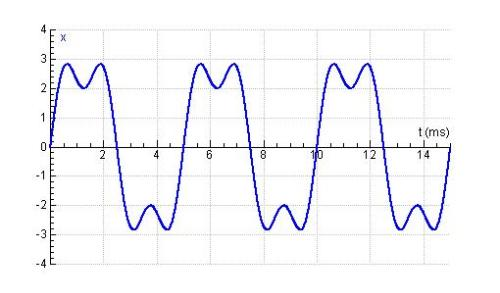
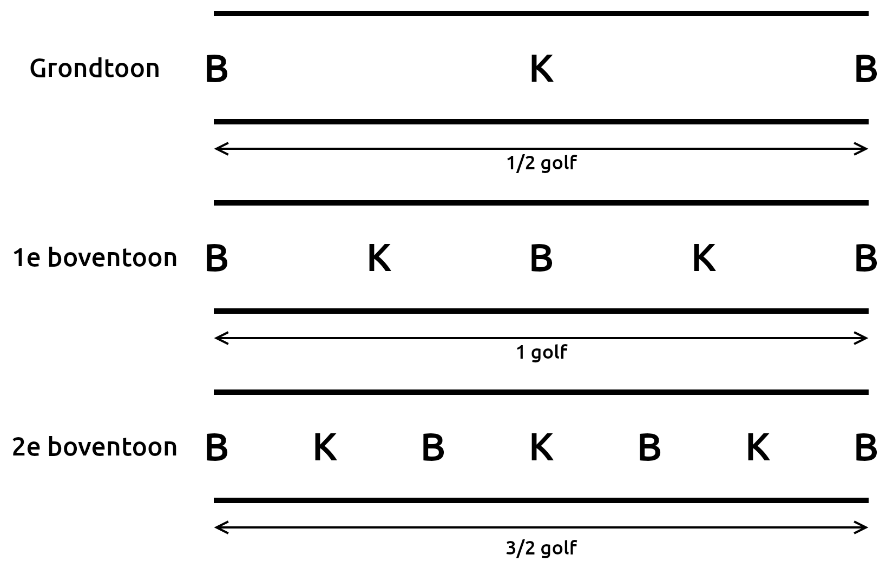
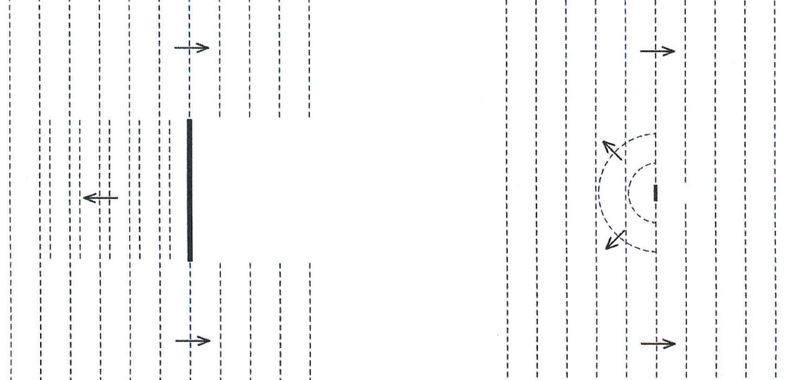

## Golven

Golven hebben een aantal eigenschappen:

- **Frequentie ($f$)**: het aantal trillingen per seconde.
- **Periode / trillingstijd ($T$)**: de tijd waarin precies 1 trilling plaatsvindt.
- **Amplitude ($A$)**: de maximale uitwijking van een golf.
- **Golflengte ($\lambda$)**: de afstand die een golf in 1 periode aflegt.
- **Golfsnelheid ($v_\mathrm{golf}$)**: de snelheid waarmee de golf zich voortplant.

De golflengte hangt af van de frequentie en de golfsnelheid. In een formule:
$$\lambda = \frac{v}{f}$$
Hierin is $\lambda$ de golflengte (in $\mathrm{m}$), $v$ de golfsnelheid (in $\mathrm{m}/\mathrm{s}$) en $f$ de frequentie (in $\mathrm{Hz}$).

De frequentie hangt samen met de periode (de tijd van 1 trilling):
$$f = \frac{1}{T}$$
Hierin is $f$ de frequentie (in $\mathrm{Hz}$) en $T$ de trillingstijd/periode (in $\mathrm{s}$).

## Geluid

**Geluidsgolven** ontstaan door een trillend onderdeel in een geluidsbron.
De snelheid van geluid verschilt per stof. Hoe sterker de binding tussen moleculen, hoe sneller het geluid. In lucht is de geluidssnelheid ongeveer $343~\mathrm{m}/\mathrm{s}$ (bij kamertemperatuur).

Geluid heeft 2 belangrijke eigenschappen: de **frequentie** (bepaalt de toonhoogte) en de **amplitude** (maximale uitwijking, bepaalt de geluidssterkte).

Een **klankkast** versterkt geluid door mee te trillen met de bron (bijvoorbeeld een stemvork). De lucht in de klankkast gaat dan mee trillen, waardoor het geluid harder wordt.

**Resonantie** is het mee trillen van een object met een trillende bron. Dit gebeurt alleen als het object en de bron dezelfde eigenfrequentie hebben.

## Trillingen weergeven

Een trilling kun je weergeven in een **oscillogram** (een u,t-diagram). In dit diagram zie je voor **1 bepaald punt** hoe de **uitwijking** verandert in de tijd. Je kunt hieruit de periode van de trilling aflezen.

Een **zuivere toon** bestaat uit 1 losse trilling (met dus ook 1 frequentie). Het u,t-diagram van een zuivere toon ziet eruit als een sinuslijn.

De formule die hoort bij het u,t-diagram van een zuivere toon is:
$$u(t)=A \cdot \sin(\frac{2 \pi}{T} \cdot t)$$
Hierin is $u$ de uitwijking (in $\mathrm{m}$), $A$ de amplitude (in $\mathrm{m}$), $T$ de trillingstijd (in $\mathrm{s}$) en $t$ de tijd (in $\mathrm{s}$).

De maximale snelheid van een trillend punt treedt op bij de evenwichtsstand, waar de helling van het u,t-diagram het grootst is. Er geldt:
$$v_\mathrm{max} = \frac{2 \pi \cdot A}{T}$$
Hierin is $v_\mathrm{max}$ de maximale snelheid (in $\mathrm{m}/\mathrm{s}$), $A$ de amplitude (in $\mathrm{m}$) en $T$ de trillingstijd (in $\mathrm{s}$).

Een **samengestelde toon** is een samenstelling van meerdere trillingen met verschillende frequenties. De toonhoogte van een samengestelde toon wordt bepaald door de frequentie van de laagste toon (de **grondtoon**). Het u,t-diagram van een samengestelde golf heeft nog wel een herhalend patroon, maar het is geen sinuslijn.

## Massa-veersysteem

Een **massa-veersysteem** (een massa aan een veer) voert een **harmonische trilling** uit als je de massa uitwijkt en loslaat. Deze trilling noem je de **eigentrilling** (de trilling die ontstaat zonder externe krachten). De frequentie wordt bepaald door de massa en de veerconstante.

De trillingstijd van een massa-veersysteem wordt gegeven door:
$$T = 2\pi \sqrt{\frac{m}{C}}$$
Hierin is $T$ de trillingstijd (in $\mathrm{s}$), $m$ de massa (in $\mathrm{kg}$) en $C$ de veerconstante (in $\mathrm{N}/\mathrm{m}$).

De veerkracht wordt gegeven door:
$$\vec{F}_\mathrm{v} = -C \cdot \vec{u}$$
Hierin is $\vec{F}_\mathrm{v}$ de veerkracht (in $\mathrm{N}$), $C$ de veerconstante (in $\mathrm{N}/\mathrm{m}$) en $\vec{u}$ de uitwijking van de veer (in $\mathrm{m}$).

**Snaren** kunnen trillen op hun eigenfrequentie. Deze hangt af van de massa van de snaar en de spanning erop. Je kunt de massa van het trillende deel aanpassen door de snaar korter of langer te maken (denk aan hoe je je vinger op verschillende plekken op een gitaarsnaar zet). Een snaar gedraagt zich vergelijkbaar met een massa-veersysteem.

## Lopende golven

Een **lopende golf** beweegt zich door een tussenstof. De toppen en dalen van zo'n golf verplaatsen zich dus in de tussenstof.

Er zijn 2 soorten lopende golven:

- **Transversale golven** bewegen op en neer. De trillingsrichting is dan loodrecht op de voortplantingsrichting, zoals golven in water.
- **Longitudinale golven** zijn drukgolven: ze bewegen heen en weer door uit te rekken en samen te trekken. De trillingsrichting is dan hetzelfde als de voortplantingsrichting, zoals geluidsgolven (zie animatie).

In lucht zijn alleen longitudinale golven mogelijk, omdat de deeltjes niet aan elkaar vast zitten.

## u,x-diagrammen

Naast u,t-diagrammen kun je ook u,x-diagrammen maken. Bij een u,t-diagram zie je van **1 punt** de uitwijking door de tijd heen. Bij een u,x-diagram zie je de uitwijking van alle punten op 1 tijdstip. Een u,x-diagram is dus een 'foto' van de golf.

In een u,t-diagram kun je op de x-as de periode bepalen. In een u,x-diagram kun je op de x-as de golflengte bepalen.

## Dopplereffect

Het **dopplereffect** treedt op als de geluidsbron en de waarnemer naar elkaar toe of van elkaar af bewegen. Als de bron naar de waarnemer toe beweegt, hoort de waarnemer een hogere frequentie, omdat de geluidsgolven worden "samengedrukt". Als de bron van de waarnemer weg beweegt, worden de geluidsgolven "uitgerekt", waardoor de frequentie lager klinkt.

## Fase

Als je 2 stemvorken met net een iets andere frequentie beide aanslaat, hoor je steeds dezelfde toonhoogte, maar de geluidssterkte varieert. Dit afwisselend luider en zachter worden van het geluid noem je **zweven**.

Om zweven uit te leggen moeten we kijken naar **fase**. De fase ($\varphi$) is het aantal trillingen dat een punt heeft gemaakt. De gereduceerde fase $\varphi_\mathrm{red}$ is het deel van de trilling binnen de huidige periode (dus een getal tussen 0 en 1). Je kijkt dan dus niet naar de volledige trillingen ervoor.

Door de verschillende frequenties bij zweven komen de golven soms **in fase** aan en soms **uit fase**. Als de golven in fase ($\Delta \varphi_\mathrm{red} = 0$) aankomen, versterken ze elkaar. Als de golven uit fase ($\Delta \varphi_\mathrm{red} = \frac{1}{2}$) aankomen, heffen ze elkaar op. Doordat de frequenties van de twee stemvorken niet gelijk zijn, wisselen de momenten waarop de golven in fase en uit fase zijn steeds af.

Voor het verschil in fase van 1 punt tussen 2 tijdstippen geldt:
$$\Delta \varphi = \frac{\Delta t}{T}$$
Hierin is $\Delta \varphi$ het faseverschil, $\Delta t$ het tijdsverschil (in $\mathrm{s}$) en $T$ de trillingstijd (in $\mathrm{s}$).

Het faseverschil tussen 2 punten bij een lopende golf is constant. Er geldt:
$$\Delta \varphi = \frac{\Delta x}{\lambda}$$
Hierin is $\Delta \varphi$ het faseverschil, $\Delta x$ het afstandsverschil tussen de punten (in $\mathrm{m}$) en $\lambda$ de golflengte (in $\mathrm{m}$).

## Interferentie

Volgens het **superpositiebeginsel** mag je 2 golven die elkaar kruisen op dat punt optellen.

Als je twee **coherente** puntbronnen naast elkaar zet, kunnen de golven met elkaar interfereren. Coherente bronnen hebben dezelfde frequentie en een constant faseverschil. De golven overlappen, en op elk punt in de ruimte tellen de uitwijkingen van beide golven zich op.

Op sommige plekken komen twee toppen of twee dalen tegelijk aan. Dan versterken de golven elkaar maximaal, en ontstaat er een extra hoge top of een extra diep dal. Op andere plekken komt een top van de ene bron tegelijk aan met een dal van de andere bron. Dan doven de golven elkaar (gedeeltelijk) uit.

Door dit verschijnsel ontstaat een **interferentiepatroon** met **buiklijnen** (lijnen met extra hoge pieken en dalen) en **knooplijnen** (lijnen waar de golven elkaar (gedeeltelijk) uitdoven). Op de buiklijnen zijn de golven uit beide bronnen in fase (faseverschil = 0), en op de knooplijnen in tegenfase (faseverschil = $\frac{1}{2}$).

Om te bepalen of een punt op een buiklijn of knooplijn ligt, moet je kijken naar het **weglengteverschil**: het verschil in afstand van beide bronnen tot het punt.

Als het weglengteverschil een geheel aantal keer de golflengte is ($0\lambda$, $1\lambda$, $2\lambda$, ...), ligt het punt op een buiklijn. De golven komen dan in fase aan: de ene golf heeft precies 1 golflengte (of 2, 3, enzovoort) meer afgelegd dan de andere, waardoor beide golven op hetzelfde punt in hun trilling zijn. Ze komen tegelijk aan met een top (of tegelijk met een dal).

Voor een **buiklijn** geldt:
$$\Delta x = n \cdot \lambda$$
Hierin is $\Delta x$ het weglengteverschil (in $\mathrm{m}$), $n$ een geheel getal en $\lambda$ de golflengte (in $\mathrm{m}$).

Als het weglengteverschil een oneven aantal halve golflengtes is ($\frac{1}{2}\lambda$, $1\frac{1}{2}\lambda$, $2\frac{1}{2}\lambda$, ...), ligt het punt op een knooplijn. De golven komen dan in tegenfase aan: de ene golf heeft een halve trilling meer gemaakt dan de andere. Als de ene golf aankomt met een top, komt de andere aan met een dal, en ze doven elkaar uit.

Voor een **knooplijn** geldt:
$$\Delta x = n \cdot \lambda + \frac{1}{2}\lambda$$
Hierin is $\Delta x$ het weglengteverschil (in $\mathrm{m}$), $n$ een geheel getal en $\lambda$ de golflengte (in $\mathrm{m}$).

Als je de bronnen dichter naar elkaar toe brengt, worden de weglengteverschillen kleiner. Hierdoor divergeren de buik- en knooplijnen (gaan verder uit elkaar). Als je de bronnen uit elkaar beweegt, convergeren de buik- en knooplijnen (gaan dichter bij elkaar staan).

Op knooplijnen is de amplitude echter niet altijd helemaal nul. Dat kan alleen als de amplitude van beide golven op dat punt precies even groot is, wat alleen geldt als de golven dezelfde afstand hebben afgelegd (de amplitude neemt af naarmate de golf zich voortplant).

## Staande golven

Een **staande golf** ontstaat door interferentie van twee lopende golven met dezelfde frequentie, golflengte en amplitude die in tegengestelde richting bewegen.

In de animatie zie je 2 lopende golven die met elkaar interfereren. Op sommige punten versterken de golven elkaar maximaal (daar komen twee pieken of twee dalen samen). Deze punten noem je **buiken**. Op andere punten doven de golven elkaar volledig uit. Deze punten noem je **knopen**.

Een staande golf staat dus stil.

## Staande golven in buizen

Blaasinstrumenten werken met staande golven in een buis. In de buis zit een **luchtkolom** die gaat trillen door een geluidsbron (bijvoorbeeld je adem bij een fluit). De luchtkolom resoneert alleen bij frequenties die passen bij de lengte van de buis. Als de golflengte niet klopt, versterken de heen- en weergaande golven elkaar niet, en ontstaat er geen staande golf.

### Open buis

Bij een **open buis** (beide uiteinden open) ontstaan aan de uiteinden altijd buiken, omdat de lucht daar vrij kan bewegen. De eenvoudigste staande golf is de **grondtoon**: dan ontstaat in het midden van de buis een knoop. Er past dan precies een halve golf in de buis (van buik naar buik). Bij de grondtoon is de golflengte dus twee keer de lengte van de buis.

Naast de grondtoon kunnen er ook **boventonen** ontstaan. Bij de eerste boventoon past er precies 1 golf in de buis (met 2 knopen). Bij de tweede boventoon passen er 1,5 golven in de buis (met 3 knopen). Bij elke boventoon komt er een knoop en een buik bij.

Voor een open buis geldt:
$$l = n \cdot \frac{1}{2}\lambda$$
Hierin is $l$ de lengte van de buis (in $\mathrm{m}$), $n$ een geheel getal (waarbij $n=1$ voor de grondtoon, $n=2$ voor de eerste boventoon, etc.) en $\lambda$ de golflengte (in $\mathrm{m}$).

Bij elke boventoon komt er een halve golflengte bij in de buis. Bij de grondtoon past er $\frac{1}{2}\lambda$ in de buis, bij de eerste boventoon $1\lambda$ (twee keer zoveel), bij de tweede boventoon $1\frac{1}{2}\lambda$ (drie keer zoveel), enzovoort. Omdat er steeds meer golf in dezelfde buis past, wordt de golflengte steeds korter.

De frequentie hangt samen met de golflengte: $f = \frac{v}{\lambda}$. Als de golflengte korter wordt, wordt de frequentie dus hoger. De frequenties hebben daarom de volgende verhoudingen:
$$f_0 : f_1 : f_2 : f_3 = 1 : 2 : 3 : 4$$
De boventonen hebben dus steeds een frequentie die 2x, 3x, 4x, enzovoort zo hoog is als de grondtoon.

> **Snaren** gedragen zich hetzelfde als open buizen, maar dan met knopen in plaats van buiken aan de uiteinden (omdat de snaar daar is vastgemaakt en niet kan bewegen). Bij de grondtoon ontstaat in het midden een buik.

### Eenzijdig gesloten buis

Bij een **eenzijdig gesloten buis** ontstaat bij de gesloten kant altijd een knoop (de lucht kan daar niet bewegen), en bij de open kant ontstaat altijd een buik. Bij de grondtoon past er dan een kwart golflengte in de buis. De golflengte van de grondtoon is dus 4 keer zo groot als de lengte van de buis.

Voor een eenzijdig gesloten buis geldt:
$$l = (2n - 1) \cdot \frac{1}{4}\lambda$$
Hierin is $l$ de lengte van de buis (in $\mathrm{m}$), $n$ een geheel getal (waarbij $n=1$ voor de grondtoon, $n=2$ voor de eerste boventoon, etc.) en $\lambda$ de golflengte (in $\mathrm{m}$).

Bij een gesloten buis kunnen alleen bepaalde boventonen ontstaan, omdat er aan de gesloten kant altijd een knoop moet zitten en aan de open kant altijd een buik. Bij de grondtoon past er $\frac{1}{4}\lambda$ in de buis, bij de eerste boventoon $\frac{3}{4}\lambda$ (drie keer zoveel), bij de tweede boventoon $\frac{5}{4}\lambda$ (vijf keer zoveel), enzovoort. Je ziet dat alleen de oneven veelvouden mogelijk zijn.

De frequentie hangt samen met de golflengte: $f = \frac{v}{\lambda}$. Omdat de golflengte steeds korter wordt, wordt de frequentie hoger. De frequenties hebben daarom de volgende verhoudingen:
$$f_0 : f_1 : f_2 : f_3 = 1 : 3 : 5 : 7$$
De frequentie van de eerste boventoon is dus 3x de frequentie van de grondtoon, de tweede boventoon 5x, enzovoort.

## Buiging

Wanneer een golf door een opening in een scherm gaat, kan deze **buigen** (uitwaaieren). Of dit gebeurt hangt af van de verhouding tussen de golflengte en de grootte van de opening. **Sterke buiging treedt op wanneer de opening ongeveer even groot is als (of kleiner dan) de golflengte**. Bij een veel grotere opening buigt de golf nauwelijks.

Een golfbundel waaiert tijdens het voortplanten steeds verder uit. De snelheid waarmee dit gebeurt hangt af van de verhouding tussen golflengte en bundelbreedte: een grotere golflengte zorgt voor sneller uitwaaieren.

### Reflectie en obstakels

Als een golf tegen een obstakel aankomt in plaats van door een opening te gaan, krijg je **reflectie** (weerkaatsing). Het gedrag is vergelijkbaar met buiging, maar dan omgekeerd.

Als het obstakel groot is ten opzichte van de golflengte (linker figuur), ontstaat er achter het obstakel een "schaduw": de golven buigen niet om het obstakel heen. De gereflecteerde golf kaatst terug alsof het obstakel een vlakke spiegel is. Als het obstakel klein is ten opzichte van de golflengte (rechter figuur), buigen de golven wel om het obstakel heen. De gereflecteerde golf is dan bolvormig, alsof het obstakel een puntbron is geworden.

Ook hier geldt: **hoe groter de golflengte en hoe kleiner het obstakel, hoe meer buiging**.
