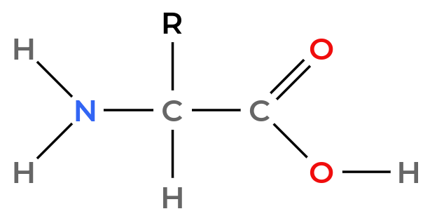
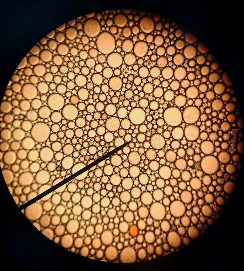
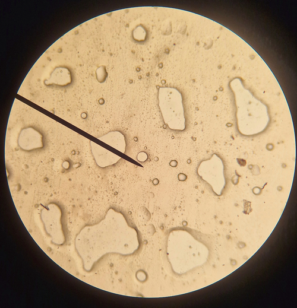

## Voedingsstoffen

Er zijn 5 belangrijke (soorten) voedingsstoffen: water, mineralen, koolhydraten, eiwitten en vetten. Koolhydraten, eiwitten en vetten zijn het belangrijkste van deze 5.

**Essentiële voedingsstoffen** zijn voedingsstoffen die het lichaam niet zelf kan maken.

### Koolhydraten (suikers)

**Koolhydraten** zijn verbindingen die bestaan uit koolstof-, waterstof- en zuurstofatomen. Alle koolhydraten bevatten meerdere $\ce{OH}$-groepen.

**Monosachariden** (enkelvoudige suikers) (Binas 67F1) zijn de simpelste koolhydraten. Ze bestaan uit een koolstofring met daaraan $\ce{OH}$-groepen die naar boven of beneden kunnen staan. Je kunt de verschillende monosachariden dus onderscheiden op basis van de "richting" van de $\ce{OH}$-groepen. Je telt dan vanaf het zuurstofatoom in de ring naar de koolstofstaart.

**Disachariden** (dubbele suikers) (Binas 67F2) bestaan uit twee monosachariden die aan elkaar zijn gekoppeld. Hierbij wordt water afgesplitst. De reactie van disacharide naar monosacharide is een **hydrolyse**. Voorbeelden van disachariden zijn sacharose (gewone tafelsuiker) en lactose (melksuiker).

**Polysachariden** (meervoudige suikers) zijn lange ketens van monosachariden. Voorbeelden van polysachariden zijn zetmeel en cellulose.

### Vetten

Vetten en oliën bestaan uit 2 belangrijke beginstoffen: **vetzuren** (Binas 67G2) en **glycerol** (propaan-1,2,3-triol).  
Vetzuren bestaan uit een lange koolstofketen met een zuurgroep. Glycerol is een alcohol.

Bij het maken van een vet of olie reageren drie vetzuren met glycerol (Binas 67G1). Hierbij wordt water afgesplitst. Het gevormde vet of olie is een **triglyceride** (of een **ester**).

De binding die ontstaat tussen het vetzuur en glycerol is een **estergroep** (de $\ce{COO}$-groep). Bij vetten zie je deze groep drie keer, omdat drie vetzuren aan glycerol zijn gebonden.

De omgekeerde reactie, waarbij een vet wordt gesplitst in glycerol en vetzuren door toevoeging van water, is een **hydrolyse**. Dit proces vindt plaats bij de vertering van vetten in je lichaam.

**Verzadigde vetzuren** hebben geen dubbele bindingen in de koolstofstaart, **onverzadigde vetzuren** wel.

Een verzadigd vetzuur herken je aan de algemene formule van de koolstofstaart: $\ce{C_nH_{2n+1}}$. Bij onverzadigde vetzuren zijn er minder waterstofatomen door de dubbele bindingen. Het aantal dubbele bindingen kun je berekenen door het aantal 'ontbrekende' waterstoffen te delen door 2.

Een triglyceride met **3 verzadigde vetzuren** is een **vet** (vast bij kamertemperatuur). Als er 1 of meer **onverzadigde vetzuren** aanwezig zijn, is het een **olie** (vloeibaar bij kamertemperatuur).

### Eiwitten

**Eiwitten** bestaan uit **aminozuren** (Binas 67H1). Deze stoffen bestaan uit een **aminegroep** en een **organisch zuur**. In de afbeelding zie je de basis van alle aminozuren. De aminozuren verschillen alleen door de verschillende restgroepen.

Als 2 aminozuren reageren, ontstaat er water en een **peptidebinding** tussen $\ce{C}$ en $\ce{N}$. Daarom noem je een verbinding tussen 2 aminozuren een **dipeptide**.

Een eiwit is dus een **polypeptide**, want het is een keten van heel veel aminozuren.  
Zo'n keten kun je makkelijk opschrijven met de 3-letterige afkortingen van de aminozuren. Dan krijg je bijvoorbeeld *Cys-Gli-Thr-Val*. Let op! De volgorde maakt hier uit, dus *Ala-Gly* is niet hetzelfde als *Gly-Ala*.

Net als bij vetten en koolhydraten kun je met hydrolyse een polypeptideketen weer afbreken in aminozuren. In je lichaam worden aminozuren afgebroken tot **ureum**.

Als je elk aminozuur meerdere keren kunt gebruiken is het aantal mogelijke combinaties gelijk aan $\text{aantal aminozuren}^{\text{ketenlengte}}$.  
Als elk aminozuur 1 keer gebruikt moet worden is het aantal mogelijke combinaties gelijk aan $\text{aantal aminozuren}!$. (*De $!$ is de **faculteit**: $5! = 5 \cdot 4 \cdot 3 \cdot 2 \cdot 1$.*)

## Sensorisch onderzoek

Bij dit onderzoek kijk je naar **geur**, **smaak** en **textuur**. Maar je kunt ook kijken naar de **verpakking**, de **prijs** en het **verhaal achter het product**.

Bij dit onderzoek is het belangrijk dat je geen vooroordelen vormt. Zo moet je de samples niet nummeren in oplopende volgorde, maar je moet willekeurige 3-cijferige codes gebruiken die ook geen betekenis hebben, zoals de codes 538, 404, 112, 911, 123 of 420.

## Emulsies

**Emulsies** zijn mengsels van 2 stoffen die onder normale omstandigheden niet goed met elkaar kunnen mengen. Zonder **emulgator** is een emulsie dus geen stabiel mengsel. Als je een emulgator toevoegt wordt het wel een stabiel mengsel.

Een emulgator is een molecuul met een hydrofiele kop en een hydrofobe staart. Deze moleculen vormen **micellen**: de emulgator plaatst zich rondom druppeltjes van de ene stof, waardoor kleine stabiele belletjes in de andere stof kunnen blijven zweven.

 

## Schuim (dataverwerking)

Schuim in een biertje zakt langzaam in. Hierbij kun je de halfwaardetijd van het inzakken van het schuim berekenen.

**Stap 1:** Bereken de **genormeerde waarde** voor elke meting. Dit doe je door van alle waardes de waarde van de laatste meting af te trekken. Eigenlijk bereken je dus het verschil met de eindmeting, zodat je grafiek op 0 eindigt.

**Stap 2:** Maak een grafiek met op de x-as de tijd en op de y-as de natuurlijke logaritme van de genormeerde waarde ($\ln(\text{genormeerde waarde})$).

**Stap 3:** Bepaal de richtingscoëfficiënt (rc) van de rechte lijn in deze grafiek.

**Stap 4:** Bereken de halfwaardetijd met de formule: $t_{\frac{1}{2}} = \frac{\ln (\frac{1}{2})}{\text{rc}}$.
