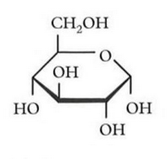
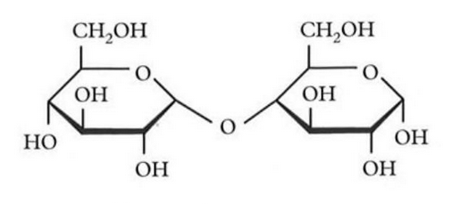
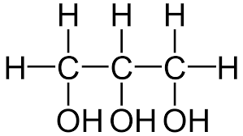
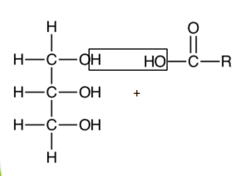

## Voedingsstoffen

Er zijn 5 belangrijke (soorten) voedingsstoffen: water, mineralen, koolhydraten, eiwitten en vetten. Koolhydraten, eiwitten en vetten zijn het belangrijkste van deze 5.

### Koolhydraten (suikers)

**Koolhydraten** zijn verbindingen die bestaan uit koolstof-, waterstof- en zuurstofatomen. Alle koolhydraten bevatten meerdere $\ce{OH}$-groepen.

**Monosachariden** (enkelvoudige suikers) (Binas 67F1) zijn de simpelste koolhydraten. Ze bestaan uit een koolstofring met daaraan $\ce{OH}$-groepen die naar boven of beneden kunnen staan. Je kunt de verschillende monosachariden dus onderscheiden op basis van de "richting" van de $\ce{OH}$-groepen. Je telt dan vanaf het zuurstofatoom in de ring naar de koolstofstaart.

**Disachariden** (dubbele suikers) (Binas 67F2) bestaan uit twee monosachariden die aan elkaar zijn gekoppeld. Hierbij wordt water afgesplitst. De reactie van discharide naar monosacharide is een **hydrolyse**. Voorbeelden van disachariden zijn sacharose (gewone tafelsuiker) en lactose (melksuiker).

**Polysachariden** (meervoudige suikers) zijn lange ketens van monosachariden. Voorbeelden van polysachariden zijn zetmeel en cellulose.

### Vetten

Vetten en olien bestaan uit 2 belangrijke beginstoffen: **vetzuren** en **glycerol** (propaan-1,2,3-triol).  
Vetzuren bestaan uit een lange koolstofketen met een zuurgroep.

Bij het maken van een vet of olie reageren drie vetzuren met glycerol. Hierbij wordt water afgesplitst. Het gevormde vet of olie is een **ester** (of een **triglyceride**).

De binding die ontstaat tussen het vetzuur en glycerol is een **estergroep** (de $\ce{COCO}$-groep). Bij vetten zie je deze groep drie keer, omdat drie vetzuren aan glycerol zijn gebonden.

De omgekeerde reactie, waarbij een vet wordt gesplitst in glycerol en vetzuren door toevoeging van water, is een **hydrolyse**. Dit proces vindt plaats bij de vertering van vetten in je lichaam.

**Verzadigde vetzuren** hebben geen dubbele bindingen in de koolstofstaart, **onverzadigde vetzuren** wel.

Een verzadigd vetzuur herken je aan de algemene formule van de koolstofstaart: $\ce{C_nH_{2n+1}}$. Bij onverzadigde vetzuren zijn er minder waterstofatomen door de dubbele bindingen.

Een triglyceride met **3 verzadigde vetzuren** is een **vet** (vast bij kamertemperatuur). Als er 1 of meer **onverzadigde vetzuren** aanwezig zijn, is het een **olie** (vloeibaar bij kamertemperatuur).
