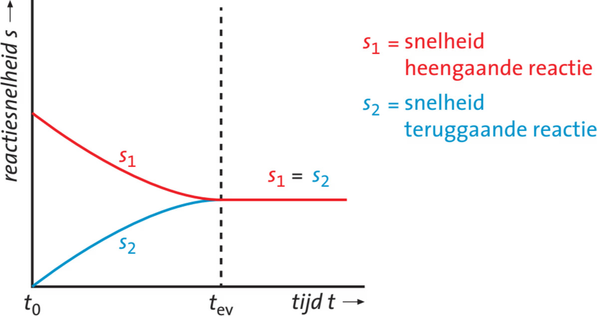
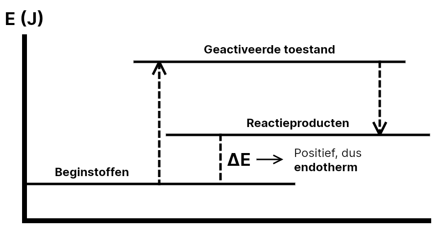
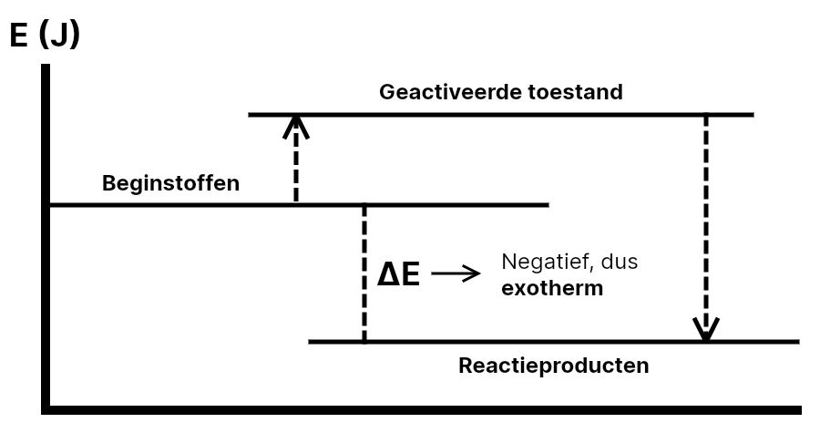

## Chemisch rekenen

### Significantie & wetenschappelijke notatie

**Significante cijfers** geven de nauwkeurigheid van een meting aan. Alle cijfers zijn significant, behalve nullen aan het begin van een getal.

Bij optellen en aftrekken rond je af op het minste aantal decimalen. Bij vermenigvuldigen en delen rond je af op het minste aantal significante cijfers. Coëfficiënten in reactievergelijkingen tellen niet mee voor significantie.

De **wetenschappelijke notatie** schrijft getallen als $a \cdot 10^n$, waarbij $1 \leq a < 10$. Soms moet je de wetenschappelijke notatie gebruiken om het juiste aantal significante cijfers aan te geven.

### Dichtheid

De **dichtheid** ($\rho$) geeft de relatie tussen massa en volume:

$$\rho = \frac{m}{V}$$

Hierin is $\rho$ de dichtheid (in $\mathrm{g}/\mathrm{mL}$ of $\mathrm{kg}/\mathrm{m}^3$), $m$ de massa (in $\mathrm{g}$ of $\mathrm{kg}$) en $V$ het volume (in $\mathrm{mL}$ of $\mathrm{m}^3$).

Voor metalen, legeringen, vaste stoffen en vloeistoffen (Binas 8-11) staan de dichtheden in $\mathrm{g}/\mathrm{mL}$, zonder de vermenigvuldigingsfactor die bovenaan de kolom staat. Voor gassen (Binas 12) staan de dichtheden in $\mathrm{g}/\mathrm{L}$.

### Chemische hoeveelheid

De **chemische hoeveelheid** ($n$) geeft aan hoeveel mol van een stof aanwezig is:

$$n = \frac{m}{M}$$

Hierin is $n$ de chemische hoeveelheid (in $\mathrm{mol}$), $m$ de massa (in $\mathrm{g}$) en $M$ de molaire massa (in $\mathrm{g}/\mathrm{mol}$).

De **molaire massa** vind je in Binas tabel 98 of 99. Bij samengestelde stoffen tel je de molaire massa's van alle atomen bij elkaar op.

Bij **gassen** kun je het **molair volume** ($V_m$) gebruiken om van mol naar volume te rekenen:

- Bij 0 °C (273 K): $V_m = 22{,}4~\mathrm{dm}^3/\mathrm{mol}$
- Bij 25 °C (298 K): $V_m = 24{,}5~\mathrm{dm}^3/\mathrm{mol}$

### Concentratie

De **concentratie** ($c$) geeft aan hoeveel mol stof per liter oplossing aanwezig is:

$$c = \frac{n}{V}$$

Hierin is $c$ de concentratie (in $\mathrm{mol}/\mathrm{L} = \mathrm{M}$), $n$ de chemische hoeveelheid (in $\mathrm{mol}$) en $V$ het volume (in $\mathrm{L}$).

Je kunt concentratie ook noteren met vierkante haken: $[\ce{CO2}]$.

### Rekenen met reactievergelijkingen

De coëfficiënten in een reactievergelijking geven de molverhouding aan. Er is geen wet van behoud van mol (het aantal mol voor de pijl hoeft niet gelijk te zijn aan het aantal mol na de pijl), maar er geldt wel een wet van behoud van massa.

Om tussen verschillende stoffen te rekenen, moet je eerst naar mol rekenen, daarna de molverhouding uit de reactievergelijking gebruiken, en vervolgens weer verder rekenen naar massa, volume of concentratie.

## Evenwichten & reactiesnelheid

### Reactiesnelheid

De **reactiesnelheid** geeft aan hoe snel een reactie verloopt. De reactiesnelheid hangt af van 5 factoren:

- Soort stoffen
- Temperatuur
- Verdelingsgraad (hoe goed de stof verdeeld is, dus de contactoppervlakte)
- Concentratie
- Aanwezigheid van een katalysator

Deze factoren verklaren we met het **botsende-deeltjesmodel**. Hierin botsen deeltjes met elkaar, waarbij soms bindingen kunnen breken. Botsingen met genoeg energie om een binding te breken noem je **effectieve botsingen**. Het breken van bindingen is precies wat je nodig hebt voor een reactie. Dus hoe meer effectieve botsingen, hoe sneller de reactie verloopt.

Bij een hogere temperatuur bewegen de deeltjes sneller, waardoor er meer effectieve botsingen ontstaan. De vuistregel is dat elke 10 °C temperatuurstijging zorgt voor een 2 keer zo snelle reactie.  
Bij een hogere verdelingsgraad zijn er meer deeltjes "beschikbaar" om te botsen, en bij een hogere concentratie ook.  
Als er een katalysator aanwezig is, zijn meer botsingen effectief.

### Evenwichten

Bij een **statisch evenwicht** verandert er niets. Bij een **dynamisch evenwicht** verandert er wel iets, maar netto blijft alles gelijk. Scheikundige evenwichten zijn altijd dynamisch.

Tot nu toe hebben we alleen gewerkt met **aflopende reacties**: de reactie gaat in 1 richting en stopt als een van de beginstoffen op is.  
Bij een **evenwichtsreactie** kunnen producten terugreageren. Er vinden dan dus 2 reacties plaats. Uiteindelijk ontstaat er een **evenwicht**: beide reacties gaan dan even snel. Je noteert dat met een dubbele pijl:
$\ce{2 \ NO2 (g) <--> N2O4 (g)}$

- **Homogeen evenwicht**: alle stoffen hebben dezelfde fase
- **Heterogeen evenwicht**: verschillende fasen

De heengaande reactie begint snel en neemt af. De teruggaande reactie begint bij 0 omdat er nog geen producten zijn. Vanaf de **insteltijd** ($t_\text{ev}$) gaan beide reacties even snel en is er een evenwicht ontstaan.

### Evenwichtsconstante

De **evenwichtsconstante** $K$ laat zien waar het evenwicht ligt. Voor de reactie $\ce{m A + n B <--> q C + r D}$ geldt:

$$K = \frac{[\ce{C}]^q [\ce{D}]^r}{[\ce{A}]^m [\ce{B}]^n}$$

> Let op: vaste stoffen en vloeistoffen tellen niet mee in deze formule.

- Bij een grote $K$ ligt het evenwicht rechts (veel producten)
- Bij een kleine $K$ ligt het evenwicht links (veel beginstoffen)

### BOEC-schema's

Om te rekenen met evenwichten gebruik je een **BOEC-schema**: Begin, Omzetting, Evenwicht en Concentratie.

> Voorbeeld: voor de reactie $\ce{N2 (g) + 3 H2 (g) <--> 2 NH3 (g)}$ met $V = 3~\mathrm{L}$. De omzetting bereken je met de molverhouding uit de reactievergelijking.
>
> |                      | $\ce{N2}$ | $\ce{3 H2}$ | $\ce{2 NH3}$ |
> | -------------------- | --------- | ----------- | ------------ |
> | **B**egin (mol)      | 5         | 8           | 0            |
> | **O**mzetting (mol)  | -2        | -6          | +4           |
> | **E**venwicht (mol)  | 3         | 2           | 4            |
> | **C**oncentratie (M) | 1         | 0,7         | 1,3          |

### Evenwichten verschuiven

Het evenwicht verschuift bij veranderingen in:

- **Druk**  
  Bij een **hogere druk** verschuift het evenwicht naar de kant met de **minste deeltjes**.  
  Voor $\ce{2\ NO2 (g) <--> N2O4 (g)}$ verschuift het evenwicht dus naar $\ce{N2O4}$ bij een hogere druk.
- **Temperatuur**  
  Bij een hogere temperatuur is de **endotherme** reactie in het voordeel, bij een lagere temperatuur is de **exotherme** reactie in het voordeel.
- **Stoffen toevoegen**  
  Als je stoffen toevoegt aan de ene kant, verschuift het evenwicht naar de andere kant, omdat de reactie naar de andere kant dan sneller verloopt.
- **Stoffen weghalen**  
  Als je stoffen weghaalt aan de ene kant, verschuift het evenwicht ook naar die kant, omdat de reactie naar de andere kant minder snel verloopt, terwijl de reactie naar die kant onverhinderd doorgaat. Als je een stof helemaal weglaat, kan de reactie zelfs weer aflopend worden.

## Energie

### Energieniveau's

Alle reacties hebben energie nodig om te starten: de **activeringsenergie** ($E_\mathrm{act}$). De **geactiveerde toestand** is in een energiediagram het hoogste punt en wordt vaak geschreven met een sterretje, bijvoorbeeld $\ce{CO2^*}$.

De **reactiewarmte** ($\Delta E$) geeft aan hoeveel energie een reactie netto opneemt of afgeeft.

- Bij een **exotherme** reactie is $\Delta E < 0$: de producten hebben een lager energieniveau dan de beginstoffen, dus er komt energie vrij aan de omgeving.
- Bij een **endotherme** reactie is $\Delta E > 0$: de producten hebben een hoger energieniveau dan de beginstoffen, dus de reactie neemt energie op uit de omgeving.

### Vormingswarmten

Bij een chemische reactie worden alle beginstoffen afgebroken tot **niet-ontleedbare stoffen**, en alle reactieproducten worden opgebouwd uit deze niet-ontleedbare stoffen.  
De **vormingswarmte** van een stof is de energie die nodig is om die stof te vormen uit niet-ontleedbare stoffen (niet-ontleedbare stoffen hebben dus een vormingswarmte van nul). De vormingswarmte wordt vaak gegeven in joule per mol: het aantal joule dat je nodig hebt om 1 mol stof te maken.

Als de vormingswarmte negatief is, komt er warmte vrij bij het maken van de stof.

Met de vormingswarmte kun je de reactiewarmte ($\Delta E$) berekenen:

1. Zoek voor alle **beginstoffen** de vormingswarmte op in Binas 57A/57B. Doe dit getal keer **-1**. Dit doe je omdat je de beginstoffen afbreekt in plaats van opbouwt. Vermenigvuldig dit met de coëfficiënt uit de reactievergelijking (de vormingswarmte is in joule per mol, en de coëfficiënt laat zien hoeveel mol je hebt).
2. Zoek voor alle **producten** de vormingswarmte op in Binas 57A/57B. Vermenigvuldig deze met de coëfficiënt uit de reactievergelijking.
3. Tel alle waarden uit stap 1 en stap 2 bij elkaar op.

### Katalysatoren

Een **katalysator** is een stof die een reactie sneller laat verlopen, zonder zelf verbruikt te worden. Een katalysator verlaagt de **activeringsenergie** door het energieniveau van de **geactiveerde toestand** te verlagen. Hierdoor zijn meer botsingen effectief, en verloopt de reactie sneller.

Een katalysator verandert niets aan de reactiewarmte ($\Delta E$) of aan de ligging van het evenwicht. Het evenwicht wordt alleen sneller bereikt.
