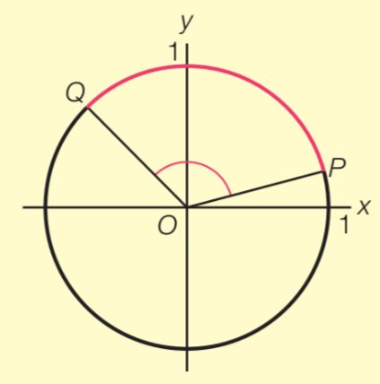
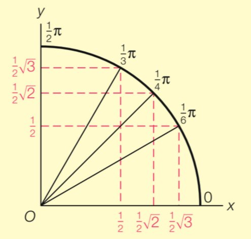
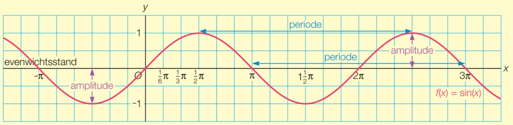

## Eenheidscirkel

De **eenheidscirkel** is de cirkel met middelpunt $O(0,0)$ en straal 1. Het punt $P$ beweegt over de eenheidscirkel en begint in $A(1,0)$. De hoek $\angle AOP$ noemen we de **draaiingshoek** van $P$, en we geven deze aan met $\alpha$.

Voor de draaiingshoek $\alpha$ van het punt $P(x_P,y_P)$ op de eenheidscirkel geldt:

- $\sin(\alpha) = y_P$
- $\cos(\alpha) = x_P$
- $\tan(\alpha) = \frac{y_P}{x_P}$

Als je van $y_P$ of $x_P$ terug naar $\alpha$ wilt rekenen, moet je vaak 2 antwoorden opschrijven (terwijl de GR slechts 1 antwoord geeft). Dit komt doordat er meerdere punten op de cirkel zijn met dezelfde $x$- of $y$-coördinaat.

In de afbeelding zie je dat er voor $x_P = 0{,}63$ meerdere hoeken mogelijk zijn, omdat er 2 punten op de cirkel zijn waar $x_P = 0{,}63$.

## Radialen

Voor de punten $P$ en $Q$ op een cirkel met middelpunt $O$ is de hoek $\angle POQ$ de **middelpuntshoek**. Met behulp van de middelpuntshoek kunnen we de hoekeenheid **radiaal** definiëren.

**De middelpuntshoek in de eenheidscirkel die hoort bij een cirkelboog met lengte 1 is een hoek van 1 radiaal.**

De hele cirkel heeft een booglengte van $2\pi$ (de omtrek van een cirkel met straal 1), dus $2\pi \mathrm{~rad} = 360^{\circ}$. Hieruit volgt dat $\pi \mathrm{~rad} = 180^{\circ}$. Bij een hoek in radialen mag je de eenheid weglaten.

## Exacte-waarden-cirkel

Voor bepaalde hoeken kun je de waarden van sinus, cosinus en tangens exact opschrijven. Leer onderstaande tabel uit je hoofd.

| hoek    | $0$ | $\frac{1}{6}\pi$ (30°) | $\frac{1}{4}\pi$ (45°) | $\frac{1}{3}\pi$ (60°) | $\frac{1}{2}\pi$ (90°) |
| ------- | --- | ---------------------- | ---------------------- | ---------------------- | ---------------------- |
| sinus   | $0$ | $\frac{1}{2}$          | $\frac{1}{2}\sqrt{2}$  | $\frac{1}{2}\sqrt{3}$  | $1$                    |
| cosinus | $1$ | $\frac{1}{2}\sqrt{3}$  | $\frac{1}{2}\sqrt{2}$  | $\frac{1}{2}$          | $0$                    |
| tangens | $0$ | $\frac{1}{3}\sqrt{3}$  | $1$                    | $\sqrt{3}$             | -                      |

In de kwart eenheidscirkel hierboven zijn de sinus en de cosinus van de hoeken uit de tabel verwerkt.

Als je deze spiegelt over beide assen, krijg je de **exacte-waarden-cirkel** met alle exacte waarden voor alle kwadranten.

In de andere kwadranten worden sommige waarden negatief (afhankelijk van of $x_P$ of $y_P$ negatief is).

## Goniometrische functies

De grafiek van de **goniometrische functie** $f(x) = \sin(x)$ is een **sinusoïde**.

De grafiek is periodiek met een **periode** van $2\pi$ (de grafiek herhaalt zich elke $2\pi$). De **evenwichtsstand** is $0$ en de **amplitude** is $1$.

Een **beginpunt** van de functie $f(x) = \sin(x)$ is een punt waar de grafiek stijgend door de evenwichtsstand gaat.  
Een **beginpunt** van de functie $g(x) = \cos(x)$ is een hoogste punt van de grafiek.

### Transformaties

Door transformaties kun je andere **sinusoïden** krijgen.

| transformatie                | beeldgrafiek          |
| ---------------------------- | --------------------- |
| translatie $(d,a)$           | $y = a + \sin(x - d)$ |
| verm. x-as met $b$           | $y = b\sin(x)$        |
| verm. y-as met $\frac{1}{c}$ | $y = \sin(cx)$        |

Voor de algemene vorm $y = a + b\sin(c(x-d))$ geldt:

- **Evenwichtsstand** = $a$
- **Amplitude** = $|b|$
- **Periode** = $\frac{2\pi}{c}$
- **Beginpunt** = $(d, a)$

Voor de algemene vorm $y = a + b\cos(c(x-d))$ geldt:

- **Evenwichtsstand** = $a$
- **Amplitude** = $|b|$
- **Periode** = $\frac{2\pi}{c}$
- **Beginpunt** = $(d, a + b)$

|       | $y = a + b\sin(c(x-d))$ | $y = a + b\cos(c(x-d))$       |
| ----- | ----------------------- | ----------------------------- |
| $b>0$ | stijgend door beginpunt | beginpunt is een hoogste punt |
| $b<0$ | dalend door beginpunt   | beginpunt is een laagste punt |

## Goniometrische vergelijkingen

De vergelijking $\sin(A) = 0$ heeft oneindig veel oplossingen: $A = ..., -3\pi, -2\pi, -\pi, 0, \pi, 2\pi, 3\pi, ...$. Dit kun je noteren als $A = k \cdot \pi$, waarin $k$ een geheel getal is.

Met behulp van de eenheidscirkel kun je standaardvergelijkingen oplossen:

- $\sin(A) = 0$ geeft $A = k \cdot \pi$
- $\sin(A) = 1$ geeft $A = \frac{1}{2}\pi + k \cdot 2\pi$
- $\sin(A) = -1$ geeft $A = \frac{3}{2}\pi + k \cdot 2\pi$
- $\cos(A) = 0$ geeft $A = \frac{1}{2}\pi + k \cdot \pi$
- $\cos(A) = 1$ geeft $A = k \cdot 2\pi$
- $\cos(A) = -1$ geeft $A = \pi + k \cdot 2\pi$

De vergelijkingen $\sin(A) = C$ en $\cos(A) = C$ waarbij $C$ een van de exacte waarden is uit de exacte-waarden-cirkel $\left(-\frac{1}{2}\sqrt{3}, -\frac{1}{2}\sqrt{2}, -\frac{1}{2}, \frac{1}{2}, \frac{1}{2}\sqrt{2}, \frac{1}{2}\sqrt{3}\right)$ los je op door eerst 1 oplossing $B$ af te lezen uit de exacte-waarden-cirkel.

Er geldt:

- $\sin(A) = C$ geeft $A = B + k \cdot 2\pi \lor A = \pi - B + k \cdot 2\pi$
- $\cos(A) = C$ geeft $A = B + k \cdot 2\pi \lor A = -B + k \cdot 2\pi$

Als je twee sinussen of twee cosinussen aan elkaar gelijk stelt, geldt:

- $\sin(A) = \sin(B)$ geeft $A = B + k \cdot 2\pi \lor A = \pi - B + k \cdot 2\pi$
- $\cos(A) = \cos(B)$ geeft $A = B + k \cdot 2\pi \lor A = -B + k \cdot 2\pi$

## Tangens

Voor het punt $P$ op de eenheidscirkel met draaiingshoek $\alpha$ geldt $\tan(\alpha) = \frac{y_P}{x_P}$. Bij $\alpha = \frac{1}{2}\pi$ zou dan gelden $\tan(\frac{1}{2}\pi) = \frac{1}{0}$, maar delen door 0 kan niet. Daarom heeft de tangensgrafiek **asymptoten** (verticale lijnen die de grafiek benaderen maar nooit raken).
Deze asymptoten liggen op $x = \frac{1}{2}\pi + k \cdot \pi$ (alle plekken waar $\cos(x) = 0$).

De tangensfunctie heeft een periode van $\pi$ (niet $2\pi$!). De vergelijking $\tan(A) = \tan(B)$ geeft daarom:
$$A = B + k \cdot \pi$$

## Herleiden

Bij het vereenvoudigen van goniometrische vergelijkingen kun je de volgende identiteiten gebruiken.

De notatie $\sin^2(A)$ betekent $(\sin(A))^2$.

- $\sin(-A) = -\sin(A)$ (spiegeling in de y-as)
- $\cos(-A) = \cos(A)$ (spiegeling in de y-as)
- $-\sin(A) = \sin(A + \pi)$ (verschuiving over $\pi$)
- $-\cos(A) = \cos(A + \pi)$ (verschuiving over $\pi$)
- $\sin(A) = \cos(A - \frac{1}{2}\pi)$
- $\cos(A) = \sin(A + \frac{1}{2}\pi)$
- $\sin^2(A) + \cos^2(A) = 1$ (stelling van Pythagoras in de eenheidscirkel)
- $\tan(A) = \frac{\sin(A)}{\cos(A)}$

## Differentieren

De afgeleide van goniometrische functies:

- $f(x) = \sin(x)$ geeft $f'(x) = \cos(x)$
- $f(x) = \cos(x)$ geeft $f'(x) = -\sin(x)$
- $f(x) = \tan(x)$ geeft $f'(x) = \frac{1}{\cos^2(x)} = 1 + \tan^2(x)$

Bij het differentiëren van samengestelde goniometrische functies moet je ook de kettingregel toepassen.
