## Inwendig milieu

Een **regelkring** houdt een bepaalde waarde rond een **norm** (gewenste waarde). Dit zorgt voor **homeostase**: een dynamisch evenwicht in het lichaam.

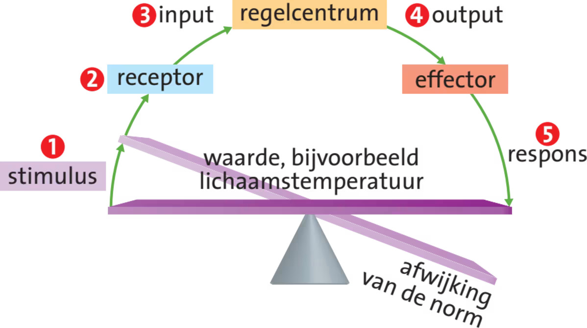

Regelkringen bestaan uit **receptoren** (die waarden meten), een **regelcentrum** (dat effectoren aanstuurt) en **effectoren** (klieren of spieren die de afwijking corrigeren).

Regelkringen werken vaak met **negatieve terugkoppeling**: een afwijking zet een proces in gang dat die afwijking tegengaat. Er zijn ook regelkringen met **positieve terugkoppeling**, waarbij een verandering juist wordt versterkt. Twee stoffen met tegengestelde werking noem je **antagonisten**.

### Temperatuurregulatie

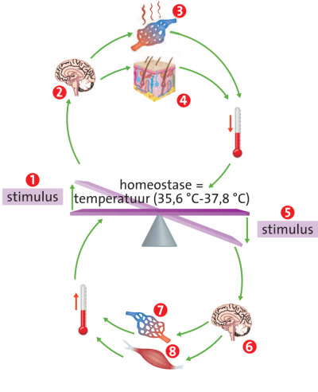

De **temperatuurregulatie** is een regelkring. Je **kerntemperatuur** (in het centrale deel van je lichaam) is ongeveer 37 °C. De **hypothalamus** meet de kerntemperatuur, is het regelcentrum en bevat de norm. De **schiltemperatuur** (in de buitenste lagen) wordt door andere receptoren gemeten en door andere hersendelen gereguleerd.

Bij een dalende kerntemperatuur stuurt de hypothalamus signalen naar de effectoren. Kringspieren in de slagadertjes naar de huid trekken samen, zodat er minder bloed naar de schil stroomt en er meer warm bloed bij de kern blijft.

Bij koorts is de norm voor de kerntemperatuur verhoogd, waardoor de effectoren reageren alsof er onderkoeling dreigt. De kerntemperatuur kan oplopen tot 41 °C. Koorts is meestal een reactie op een infectie: immuuncellen werken beter en ziekteverwekkers delen slechter bij een hogere temperatuur.

Door regelkringen voor zaken als glucoseniveau, osmotische waarde en zoutconcentratie blijft je **inwendig milieu** in balans.

## De lever

De lever krijgt veel bloed binnen via de **poortader** vanuit de darmen.

Een aantal functies van de lever:

- **Verwarming**: de lever is de belangrijkste bron van warmte in je lichaam
- **Rode bloedcellen opruimen**: de lever en de milt ruimen afgestorven bloedcellen op. IJzer (uit Hb) wordt opgeslagen als **ferritine**. Uit hemoglobine ontstaat hierbij de afvalstof **biliverdine**, die wordt omgezet in **bilirubine**.
- **Ontgiften**: de lever breekt giftige stoffen af (**detoxificatie**). Alcohol wordt met alcoholdehydrogenase omgezet in ethanal, wat vervolgens met aldehydedehydrogenase wordt omgezet in azijnzuur (acetaat). Acetaat kan in vet worden omgezet, waardoor leververvetting kan ontstaan. Overmatig alcoholgebruik kan levercellen doden. Bindweefsel vervangt deze dode levercellen dan: **levercirrose**.
- **Stoffen opslaan**: de lever slaat ijzer, glycogeen, vitamines en mineralen op
- **Bloed leveren**: de lever is een bloedreservoir en kan extra bloed leveren aan de bloedsomloop.
- **Gal vormen**

### Koolhydraatstofwisseling

Na een koolhydraatrijke maaltijd stijgt de **bloedsuikerspiegel** (glucoseconcentratie in het bloed). **Insuline** zorgt ervoor dat weefsels glucose opnemen en omzetten in **glycogeen**: **glycogenese**. Insuline wordt gemaakt in de eilandjes van Langerhans (in de alvleesklier). Insulinemoleculen binden aan receptoren in het celmembraan, waardoor er een cascade van reacties ontstaat. Hierdoor ontstaan blaasjes met glucosepoorten die versmelten met het celmembraan, waardoor er meer glucosemoleculen de cel binnenkomen.

Spieren dissimileren glucose. Na inspanning is de bloedsuikerspiegel te laag, waardoor de alvleesklier wordt gestimuleerd om **glucagon** te produceren. De lever zet onder invloed van glucagon glycogeen om in glucose. Is het glycogeen op, dan wordt glucose gemaakt uit aminozuren en vetten: **gluconeogenese**.

Insuline heeft niet op alle cellen effect: hersencellen bijvoorbeeld nemen ook zonder insuline glucose op uit het bloed. In lever- en spiercellen stimuleert insuline niet alleen de opname van glucose, maar ook de vorming van glycogeen uit glucose.

**Adrenaline** wordt gemaakt door het bijniermerg. Je lever- en spiercellen zetten onder invloed van adrenaline glycogeen om in glucose. Door adrenaline verslappen de spieren in de slagaderwanden naar de skeletspieren, en trekken de spieren in de slagaderwanden van de darmen samen. Het bloed stroomt daardoor naar je spieren. Adrenaline laat je hart sneller kloppen en verdiept je ademhaling.

#### Diabetes

De eilandjes van Langerhans van een diabetespatiënt maken weinig of geen insuline aan, of de receptoren van insuline werken niet goed. Het bloed bevat dan hoge concentraties glucose. Veel glucose komt dan terecht in de voorurine, maar de nefronen kunnen deze overmaat niet uit de voorurine terughalen.

Bij **diabetes type 1** maken de eilandjes van Langerhans geen insuline aan. Patiënten moeten dan zelf insuline inspuiten.

**Diabetes type 2** komt veel vaker voor. Het lichaam reageert dan niet meer goed op insuline, doordat het aantal insulinereceptoren afneemt en/of doordat de receptoren minder gevoelig zijn voor insuline.

### Vetstofwisseling

De lever kan ongeschikte vetzuren ombouwen tot nuttige vetzuren. **Essentiële vetzuren** kan de lever niet maken, dus die moet je via voedsel binnenkrijgen.

### Eiwitstofwisseling

**Niet-essentiële aminozuren** kan de lever ombouwen door **transaminering**: de aminogroep wordt 'geruild' met de ketongroep van een ketozuur. Andere aminozuren worden afgebroken.

Het afbreken begint met **deaminering**: het verwijderen van de aminogroep. De lever koppelt de vrijgekomen ammoniak aan $\ce{CO2}$ tot **ureum**, dat via het bloed en de nieren in de urine terechtkomt.

De rest van het aminozuur dient als brandstof of voor omzetting in vet of glucose.

## Longen

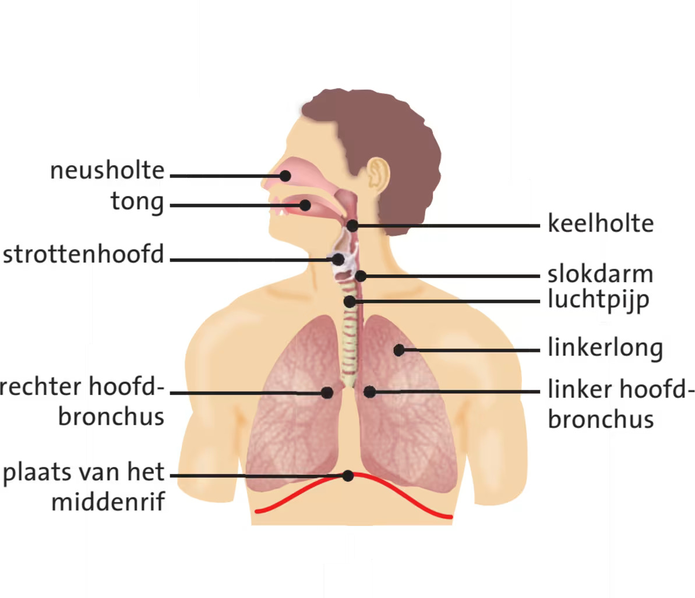

Bij het inademen gaat de lucht via de neus of mond, de keelholte, **luchtpijp**, **hoofdbronchus**, **bronchus** en **bronchiolus** naar een **longblaasje**. De **(hoofd)bronchiën** hebben kraakbeenringen om dichtklappen te voorkomen. Bronchiolen hebben deze niet. De kleinste bronchiolen hebben glad spierweefsel.

In de longblaasjes diffundeert $\ce{O2}$ naar het bloed en $\ce{CO2}$ andersom: **gaswisseling**. De gassen gaan door 2 cellagen heen: de wand van het longblaasje en de wand van het haarvat.

De diffusiesnelheid staat beschreven in de **wet van Fick**:

$$n=DA\frac{\Delta c}{\Delta x}$$

Hierin is $n$ het aantal mol dat per seconde diffundeert, $D$ de diffusiecoëfficiënt (afhankelijk van de temperatuur, maar wel constant in de longblaasjes), $A$ het diffusieoppervlak, $\Delta c$ het concentratieverschil en $\Delta x$ de diffusieafstand.

Bij neusademhaling vangen slijmvliezen ziektekiemen en stofdeeltjes op. De langere weg maakt de lucht warmer en vochtiger, waardoor de longblaasjes minder snel uitdrogen.

Het slijmvlies in de luchtpijp, de bronchiën en de bronchiolen bevat trilhaarcellen en slijmcellen. De trilharen bewegen het slijm omhoog naar de keelholte, waar je het doorslikt.

### Astma en COPD

**Astma** is een chronische longziekte waarbij de slijmvliezen in de bronchiolen ontstoken raken, waardoor er meer slijm ontstaat (grotere diffusieafstand). Tijdens een astma-aanval trekken de spieren rond de bronchiolen samen, waardoor de lucht moeilijker in de longblaasjes komt (kleiner concentratieverschil).

**COPD** (Chronic Obstructive Pulmonary Disease) is een verzamelnaam voor chronische bronchitis en longemfyseem, vaak veroorzaakt door roken.
Bij chronische bronchitis hoopt slijm zich op, waardoor de lucht moeilijker in de longblaasjes komt.
Bij longemfyseem zijn longblaasjes kapot, waardoor het diffusieoppervlak kleiner wordt.

## Ademhaling

**Longventilatie** is het verversen van lucht in je longen door **ventilatiebewegingen**.

De longen zijn omgeven door het **longvlies**. Het middenrif en de borstwand zijn omgeven door het **borstvlies**. Tussen deze vliezen zit de **interpleurale ruimte** met een dunne laag vloeistof. De onderdruk houdt de vliezen bij elkaar. De vloeistof in deze ruimte werkt als smeermiddel zodat ze soepel langs elkaar schuiven.

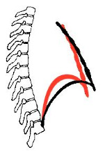

Bij een rustige inademing trekken de **middenrifspieren** en de **buitenste tussenribspieren** samen. De borstkas gaat omhoog en naar voren en het middenrif wordt platter (zie de zwarte lijn in de afbeelding).

Bij een diepe inademing gebruik je ook de nekspieren en de kleine borstspier.

Bij een rustige uitademing ontspannen deze spieren, waardoor het middenrif omhoog komt en het borstbeen omlaag zakt (zwaartekracht). Het longvolume neemt af, en de lucht wordt naar buiten geperst.

Bij een diepe uitademing gebruik je ook de **binnenste tussenribspieren**.

Het **ademvolume** is de hoeveelheid lucht die je per ademhaling in rust ververst. De **vitale capaciteit** is het maximum dat je kunt in- en uitademen. De **totale longcapaciteit** is alles wat in je longen past. Het **restvolume** is de lucht die na het volledig uitademen achterblijft. *Zie Binas 83B.*

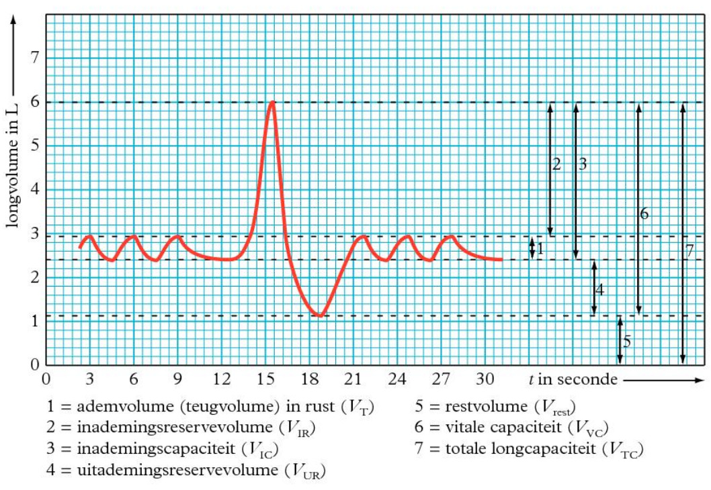

Niet alle lucht doet mee aan gaswisseling: ongeveer 150 mL blijft in de luchtwegen (**dode ruimte**).

Het **ademhalingscentrum** in de hersenstam regelt de ademhaling en bevat de normen voor de $p\ce{CO2}$ en de $p\ce{O2}$. **Chemoreceptoren** (in de halsslagaders) en **drukreceptoren** (in de aorta) meten deze waarden. Bij een hoge $p\ce{CO2}$, een lage pH of een zeer lage $p\ce{O2}$ geven ze signalen om sneller en dieper te ademen. De $p\ce{CO2}$ is hierbij de belangrijkste factor.

## Nieren

De **nieren** filteren afvalstoffen en overtollige stoffen uit je bloed. Per dag maken ze ongeveer 180 L **voorurine**, waarvan 99% teruggaat naar het bloed. Wat overblijft is de **urine**.

### Bouw

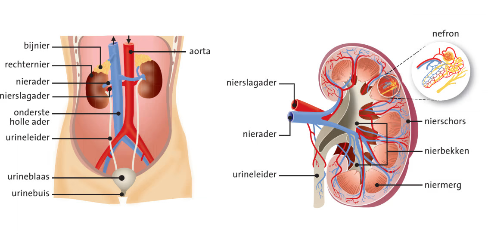

Een nier bestaat uit de **nierschors** (buiten) en het **niermerg** (binnen). De urine gaat via het **nierbekken** en de **urineleider** naar de **urineblaas**, en verlaat via de **urinebuis** het lichaam.

De nier is opgebouwd uit **nefronen**. Elk nefron bestaat uit het **kapsel van Bowman** (met daarin de **glomerulus**), het **eerste gekronkelde nierbuisje**, de **lis van Henle**, het **tweede gekronkelde nierbuisje** en een **verzamelbuisje**. Langs het nierbuisje lopen overal haarvaten.

### Urinevorming

Bij **terugresorptie** worden stoffen teruggehaald naar het bloed. Dit gebeurt via passief transport, actief transport, gefaciliteerd transport en osmose. Bij **cotransport** lift een stof mee op het actieve transport van een andere stof. Gaan beide stoffen dezelfde kant op, dan heet dit **sympoort**. Gaan ze tegenovergesteld, dan heet dit **antipoort**.

De vorming van urine gaat in de volgende stappen:

1. **Ultrafiltratie** (in de glomerulus): door de hoge bloeddruk wordt plasma door de poreuze wand van de haarvaten geperst. Grote eiwitten passen niet door de poriën en blijven in het bloed. Water, zouten, glucose en afvalstoffen komen wel in de voorurine.
2. **Eerste gekronkelde nierbuisje**: nuttige stoffen (glucose, aminozuren, ionen) worden actief teruggeresorbeerd naar het bloed. Doordat de ionenconcentratie in het bloed stijgt, stroomt er ook water vanuit de voorurine naar het bloed door osmose. De wandcellen voegen ammoniak ($\ce{NH3}$) toe aan de voorurine.
3. **Dalend been van de lis van Henle**: de wand is alleen doorlaatbaar voor water. Het niermerg heeft een hoge osmotische waarde (veel $\ce{Na+}$ en $\ce{Cl-}$), waardoor water vanuit de voorurine door osmose naar het niermerg stroomt en daar wordt opgenomen door de haarvaten. De voorurine wordt daardoor geconcentreerder.
4. **Stijgend been van de lis van Henle**: de wand is alleen doorlaatbaar voor ionen. $\ce{Na+}$ en $\ce{Cl-}$ gaan vanuit de voorurine naar het niermerg (passief in het dunne deel, actief in het dikke deel).
5. **Tweede gekronkelde nierbuisje**: $\ce{H+}$-ionen gaan vanuit het bloed naar de voorurine en $\ce{HCO3-}$-ionen gaan vanuit de voorurine naar het bloed. Hierdoor blijft de pH van het bloed constant.
6. **Verzamelbuisje**: het hormoon **ADH** maakt de wand doorlaatbaarder voor water. Door de hoge osmotische waarde van het niermerg stroomt er water vanuit de voorurine naar het niermerg door osmose, waar het wordt opgenomen door de haarvaten. De urine wordt daardoor geconcentreerder.

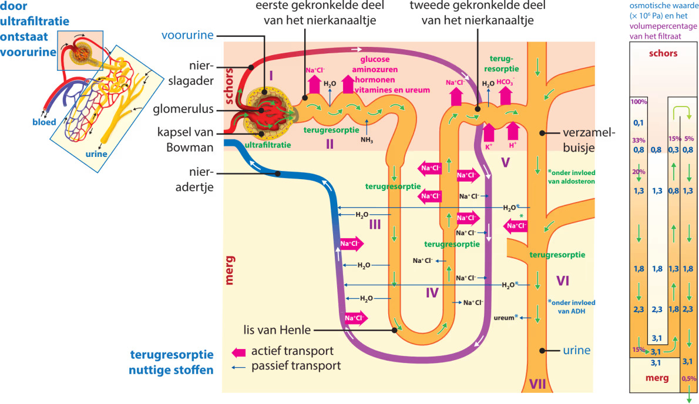

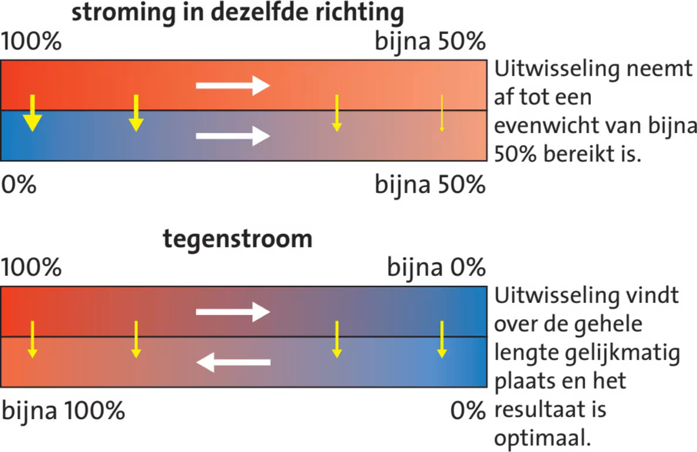

De bloedstroom rond de lis van Henle loopt tegengesteld aan de voorurine. Dit heet het **tegenstroomprincipe**. Doordat de stromen tegengesteld zijn, blijft er een concentratieverschil bestaan en verloopt de uitwisseling optimaal.

## Hormonen

Hormonen zijn **signaalstoffen**. **Hormoonklieren** zijn **endocriene klieren**: ze geven hun producten af aan het **inwendig milieu**. **Exocriene klieren** geven hun producten juist af aan het **uitwendig milieu**, zoals zweetklieren. Hormonen komen overal in je bloed terecht, maar ze hebben alleen invloed op hun **doelwitorgaan**, omdat alleen cellen met een passende receptor voor dat hormoon erop reageren.

### De hypofyse

De **hypofyse** is de centrale hormoonklier en krijgt informatie vanuit de **hypothalamus**. De hypofyse vormt de verbinding tussen het zenuwstelsel en het hormoonstelsel. De hypofyse bestaat uit de **neurohypofyse** (achterkwab, zenuwweefsel) en de **adenohypofyse** (voorkwab, klierweefsel).

De hypothalamus geeft **releasing hormones** (RH's) af die de adenohypofyse stimuleren, en **inhibiting hormones** (IH's) die de productie remmen.

### Soorten hormonen

**Steroïdhormonen** (zoals testosteron) zijn hydrofoob en apolair, gemaakt uit cholesterol. Ze gaan door het celmembraan en hechten aan een **hormoonreceptor** in het grondplasma. Samen vormen ze een **hormoon-receptorcomplex**, dat een gen in het DNA activeert.

**Tyrosinehormonen** zijn ook hydrofoob, gemaakt van het aminozuur tyrosine. Ze binden aan receptoren in het grondplasma of in het celmembraan.

**Peptidehormonen** zijn hydrofiel en polair, gemaakt van aminozuren. Ze binden aan receptoren in het celmembraan. Soms ontstaat er een **second messenger**: een stof die de boodschap van het hormoon overneemt.

### Groeihormoon en ACTH

De hypothalamus geeft **GHRH** af, wat zorgt voor de afgifte van **GH** (groeihormoon) door de hypofyse. GH stimuleert de aanmaak van **IGF** (insulin-like growth factor) in de lever. Bij kinderen werkt IGF op de groeischijven van de pijpbeenderen. Na de puberteit blijft GH aanwezig voor andere functies, zoals het aanzetten van vetcellen tot afbraak van vetten.

De hypothalamus geeft ook **CRH** af, wat leidt tot de afgifte van **ACTH** (adrenocorticotroop hormoon) door de hypofyse. ACTH stimuleert de bijnierschors tot de afgifte van onder andere het stresshormoon **cortisol**.

### Hormonen en de nieren

**ADH** (uit de hypofyse) wordt afgegeven bij een te hoge osmotische waarde van het bloed. ADH maakt de wand van de verzamelbuisjes doorlaatbaarder voor water, waardoor de urine geconcentreerder wordt.

**Aldosteron** (uit de bijnierschors) wordt afgegeven bij een te lage $\ce{Na+}$-concentratie. Het zorgt voor meer terugresorptie van $\ce{Na+}$ en meer uitscheiding van $\ce{K+}$. Door de hogere $\ce{Na+}$-concentratie stroomt er ook meer water naar het bloed door osmose.

Bij een lage bloeddruk of lage $\ce{Na+}$-concentratie geven de nieren **renine** af. Renine zet angiotensinogeen om tot angiotensine II, dat zorgt voor de afgifte van aldosteron en vaatvernauwing.

### Schildklierhormonen en temperatuur

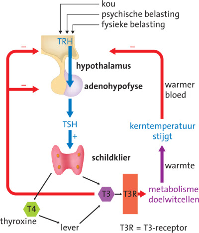

Als je het koud krijgt, geeft je hypothalamus **TRH** af, wat de afgifte van **TSH** door de adenohypofyse stimuleert. TSH stimuleert de schildklier tot de afgifte van de **schildklierhormonen** T4 en T3. T3 is het werkzame hormoon (levercellen zetten T4 om in T3).

T3-moleculen passeren het celmembraan, koppelen aan een receptoreiwit en activeren een gen in het DNA. Hierdoor ontstaan eiwitten die de glucose- en vetverbranding stimuleren. T3 heeft een negatieve terugkoppeling met TRH.

### Calciumhuishouding en botvorming

$\ce{Ca^{2+}}$ wordt gebruikt als second messenger, bij de overdracht van zenuwimpulsen en bij spiersamentrekking. Bij een te lage $\ce{Ca^{2+}}$-concentratie haalt het lichaam $\ce{Ca^{2+}}$ uit de botten: **botontkalking**.

De **schildklier** en de **bijschildklieren** regelen de $\ce{Ca^{2+}}$-concentratie:

- Bij een **te hoge concentratie** geeft de schildklier **calcitonine** af. Dit stimuleert botcellen om $\ce{Ca^{2+}}$ op te nemen en vermindert de terugresorptie van $\ce{Ca^{2+}}$ uit de voorurine.
- Bij een **te lage concentratie** geven de bijschildklieren **PTH** af. Dit stimuleert de afgifte van $\ce{Ca^{2+}}$ uit de botten en vergroot de terugresorptie van $\ce{Ca^{2+}}$ uit de voorurine. PTH stimuleert ook de vorming van actief vitamine D in de nieren, wat de darmcellen aanzet om extra $\ce{Ca^{2+}}$ uit voedsel op te nemen. Je huidcellen maken inactief vitamine D (een prohormoon).

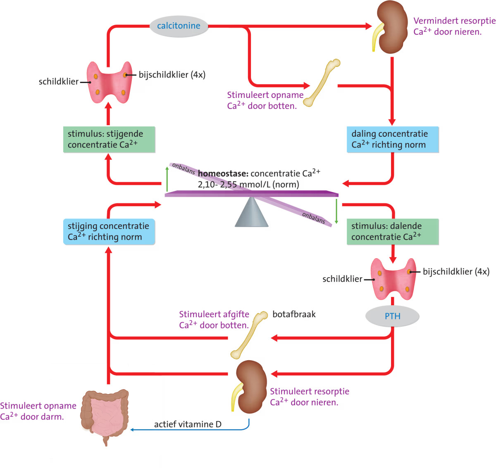

Het groeihormoon activeert de **osteoblasten** (botvormende cellen). Onder invloed van PTH maken osteoblasten groeifactoren aan, die de ontwikkeling van **osteoclasten** (botafbrekende cellen) stimuleren.

Oestrogenen remmen de botafbraak door de productie van groeifactoren en de activiteit van osteoclasten te remmen. Testosteron heeft een vergelijkbare werking. Bij mannen neemt testosteron op latere leeftijd minder sterk af dan oestrogenen bij vrouwen, waardoor **osteoporose** bij mannen minder vaak voorkomt.

### Hormonen en voedselvertering

Voor een maaltijd maken de maagwand en alvleesklier **ghreline**. Dit stimuleert via **NPY** het eetcentrum in de hypothalamus, waardoor je trek krijgt. Na het eten maakt de alvleesklier **leptine**, waardoor NPY wordt afgeremd. Insuline remt het eetcentrum ook.

Het verteringshormoon **gastrine** (uit de maag) stimuleert de maagzuurproductie. **Secretine** (uit de alvleesklier) stimuleert de afgifte van $\ce{HCO3-}$, waardoor de maagzuurproductie wordt geremd.

### Zuurstoftekort en EPO

Bij **bloedarmoede** zijn er te weinig rode bloedcellen om de zuurstofdruk op peil te houden. Je lichaam maakt dan **EPO** aan (in de nierschors), wat stamcellen aanzet om te delen en te differentiëren tot rode bloedcellen.

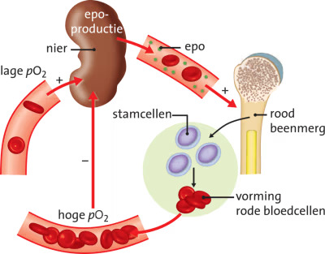
