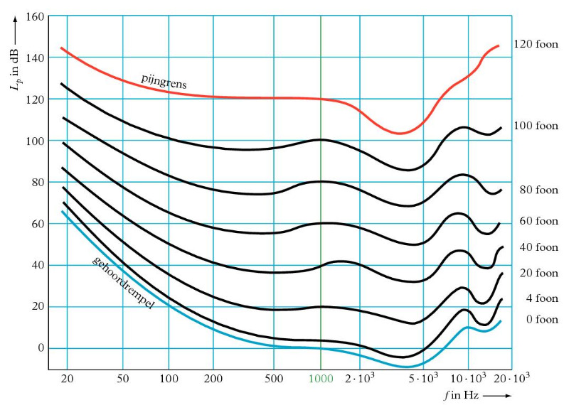
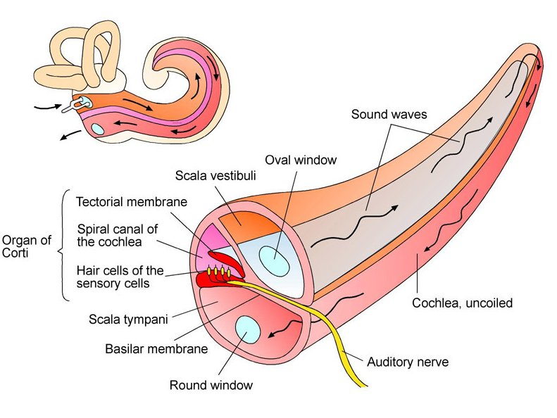
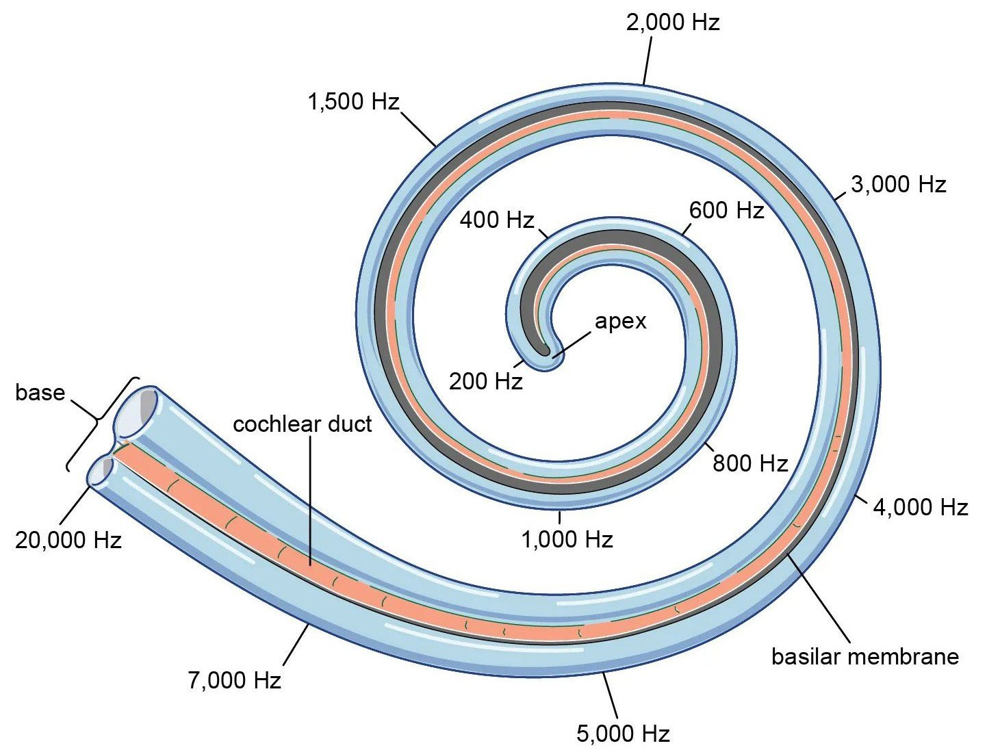

## Geluid

Geluid is trillingsenergie die zich voortplant door een medium. De **geluidsintensiteit** is de hoeveelheid trillingsenergie die per seconde door een vierkante meter gaat:

$$I = \frac{P}{A}$$

Hierin is $I$ de geluidsintensiteit (in $\mathrm{W}/\mathrm{m}^2$), $P$ het vermogen van de geluidsbron (in $\mathrm{W}$) en $A$ het oppervlak waar het geluid doorheen gaat (in $\mathrm{m}^2$).

Bij een puntvormige geluidsbron verspreidt het geluid zich in alle richtingen. Op een afstand $r$ van de bron verdeelt het geluid zich over een boloppervlak van $4\pi r^2$. Hieruit volgt de **kwadratenwet**: als je $n$ keer zo ver van de bron af staat, wordt de intensiteit $n^2$ keer zo klein.

## Het oor

Het menselijk oor is heel gevoelig. We kunnen intensiteiten van $10^{-12}\,\mathrm{W}/\mathrm{m}^2$ (de gehoordrempel) tot $10\,\mathrm{W}/\mathrm{m}^2$ (de pijngrens) waarnemen. Daarom gebruiken we de eenheid **bel**, vaak als **decibel** (dB).

De dB-schaal is niet lineair maar logaritmisch. Een verdubbeling van de geluidsintensiteit betekent een toename van 3 dB. Bij een verdubbeling van de afstand tot de geluidsbron daalt de geluidssterkte met 6 dB.

$$L_p = 10 \cdot {^{10}\log}\left(\frac{I_p}{I_0}\right)$$

Hierin is $L_p$ het geluidsniveau (in $\mathrm{dB}$), $I_p$ de waargenomen intensiteit (in $\mathrm{W}/\mathrm{m}^2$) en $I_0$ de gehoordrempel ($10^{-12}\,\mathrm{W}/\mathrm{m}^2$).

Ons oor is echter niet even gevoelig voor elke frequentie. Bij lage en hoge frequenties horen we minder goed dan bij middenfrequenties (rond 1000-4000 Hz). Dit kun je zien in een **audiogram** (Binas 27C1): een grafiek die laat zien hoeveel dB je nodig hebt om een toon van een bepaalde frequentie te kunnen horen.

## Anatomie van het oor

Het gehoororgaan bestaat uit het **buitenoor**, het **middenoor** en het **binnenoor**.

### Buitenoor

Het buitenoor bestaat uit de oorschelp en de gehoorgang. De oorschelp heeft meerdere functies: geluid versterken, de richting van geluid bepalen en beter horen in de wind.

We kunnen de richting van geluid bepalen doordat we 2 oren hebben. Als er een geluidsbron rechts van je staat, komt het geluid eerder en harder je rechteroor binnen dan je linkeroor.

Het **trommelvlies** vormt de scheiding tussen het buitenoor en het middenoor. Het beschermt ook tegen vuil en bacteriën. In de gehoorgang zitten oorsmeerkliertjes die het trommelvlies soepel houden.

### Middenoor

Het middenoor bestaat uit de gehoorbeentjes, de middenoorspiertjes en de buis van Eustachius. De belangrijkste functie is de aanpassing van het geluid voor optimale waarneming. Dit gebeurt op 2 manieren:

- **Focussering**: het trommelvlies heeft een groter oppervlak dan het ovale venster (de opening naar het slakkenhuis). Hierdoor worden de geluidstrillingen versterkt.
- **Hefboomwerking**: de keten van gehoorbeentjes (hamer, aambeeld en stijgbeugel) werkt als een hefboom.

In totaal wordt de kracht op het ovale venster zo'n 22 keer zo groot als op het trommelvlies. Het middenoor is een passief systeem en voegt dus geen energie toe, maar past de druk aan.

Om deze versterking goed te laten werken moet de luchtdruk in het middenoor gelijk zijn aan de buitenluchtdruk. Dit regelt de **buis van Eustachius**: de verbinding met de keelholte. In het middenoor bevinden zich ook 2 spiertjes die zich aanspannen bij te hard geluid, om het binnenoor te beschermen.

### Binnenoor

Het binnenoor bestaat uit het **slakkenhuis** en het evenwichtsorgaan.

De stijgbeugel voert druk uit op het **ovale venster**. Het slakkenhuis is gevuld met vloeistof. Omdat deze vloeistof niet samendrukbaar is, wordt het **ronde venster** bij de uitgang naar buiten gedrukt als het ovale venster naar binnen beweegt.

Het slakkenhuis bestaat uit 3 spiraalvormige buizen. De trilling gaat na het ovale venster via de **voorhoofstrap** naar de top van het slakkenhuis. Vervolgens gaat de trilling via de **trommelholtetrap** naar het ronde venster. Tussen de voorhoofstrap en de trommelholtetrap zit de **middentrap**. Daarin bevindt zich het **orgaan van Corti**, dat vastzit aan het **basilair membraan**. Het basilair membraan bevat 1 rij **binnenste haarcellen** en 3 rijen **buitenste haarcellen**.

Door de drukgolf in de vloeistof gaat het basilair membraan trillen, waardoor de haartjes buigen. Dit buigen zorgt ervoor dat de binnenste haarcel een elektrisch signaal produceert dat naar de hersenen wordt gestuurd.

Afhankelijk van de frequentie van het geluid worden de haarcellen op bepaalde plaatsen op het basilair membraan in beweging gebracht. Dit komt door **resonantie**: de breedte van het membraan varieert over de lengte. Aan het begin (bij het ovale venster) is het membraan smal en stijf, waardoor het resoneert bij hoge frequenties. Aan het einde (de **apex**) is het membraan juist breed en slap, waardoor het resoneert bij lage frequenties. Zo worden de hoogste tonen geregistreerd aan het begin van het slakkenhuis en de laagste tonen aan het einde.

Bij een lage toon ontstaan er impulsen die in de hersenen worden vertaald als lage tonen. Bij een hard geluid ontstaat een hoge **impulsfrequentie** (veel impulsen) in de gehoorzenuw.

## De stem

Bij het spreken wordt lucht vanuit de longen omhoog geperst. De stembanden sluiten de luchtweg gedeeltelijk af, waardoor de luchtdruk eronder stijgt. Als de druk hoog genoeg is, worden de stembanden opengedrukt. Dit proces herhaalt zich snel, waardoor de stembanden trillen en geluid ontstaat.

De **toonhoogte** hangt af van de trillingsfrequentie van de stembanden. Door de stembanden strakker aan te spannen, trillen ze sneller, waardoor een hogere toon ontstaat. Bij ontspannen stembanden is de frequentie lager en klinkt de toon lager. Langere stembanden trillen langzamer en produceren dus lagere tonen. Mannen hebben langere stembanden en spreken daardoor lager (~100 Hz) dan vrouwen (~220 Hz) en kinderen (~300 Hz).

Het **volume** hangt af van de amplitude. Meer luchtdruk zorgt voor een grotere uitwijking van de stembanden en dus harder geluid.

### Resonantie

De keelholte, mondholte en neusholte werken als resonatoren. Net als bij een half-open buis ontstaan er staande golven die bepaalde frequenties versterken. Door de vorm van deze holtes aan te passen (met tong, lippen, kaak) veranderen de vorm en lengte van de holtes en dus de resonantiefrequenties, waardoor we verschillende klanken kunnen maken.

> Je moet de theorie van [H7](../TW1/nat_h7.md#staande-golven-in-buizen) hierover, en dan vooral de formules kennen.
