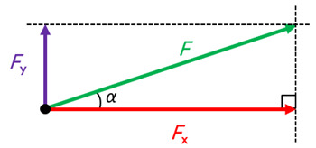

## Arbeid

**Arbeid** is de hoeveelheid energie die door een kracht wordt overgedragen bij een verplaatsing. Een kracht verricht alleen arbeid als het voorwerp waarop die kracht werkt ook daadwerkelijk beweegt.

$$W = F \cdot s$$

Hierin is $W$ de arbeid (in $\mathrm{J}$), $F$ de kracht (in $\mathrm{N}$) en $s$ de verplaatsing (in $\mathrm{m}$).

Alleen krachten in de richting van de beweging (of tegengesteld daaraan) verrichten arbeid. Bij een schuine kracht kijk je naar de component van de kracht in de bewegingsrichting.

Voor een kracht onder een hoek $\alpha$ met de bewegingsrichting geldt:

$$W = F \cdot s \cdot \cos(\alpha)$$

> Dit verklaart waarom alleen krachten in de bewegingsrichting arbeid verrichten: bij een hoek van $90^\circ$ (loodrecht op de beweging) is de arbeid 0, want $\cos(90^\circ) = 0$.

Je kunt de arbeid ook aflezen uit een F,s-diagram: de arbeid is de oppervlakte onder de grafiek.

Krachten verrichten **positieve arbeid** als (een component van) de kracht in de bewegingsrichting werkt. Dit zorgt voor een toename van de kinetische energie.  
Krachten verrichten **negatieve arbeid** als (een component van) de kracht tegen de bewegingsrichting in werkt. Dit zorgt voor een afname van de kinetische energie.

Wrijvingskrachten verrichten **wrijvingsarbeid**: ze zetten kinetische energie om in warmte. Om een beweging in stand te houden ondanks wrijving, is er dus voortdurend energie nodig.

Bij een eenparige beweging op een horizontale weg is de arbeid van de voortstuwende krachten gelijk aan de wrijvingsarbeid:

$$\sum E_\text{in} = \sum E_\text{uit}$$

Hierin is $\sum E_\text{in}$ de energie die wordt toegevoerd door de motor (in $\mathrm{J}$) en $\sum E_\text{uit}$ de energie die verloren gaat door wrijving (in $\mathrm{J}$).

## Chemische energie

In brandstoffen is chemische energie opgeslagen. De **verbrandingswarmte** is de energie die per hoeveelheid brandstof vrijkomt bij verbranding.

$$E_\text{ch} = r_\text{v} \cdot V$$
$$E_\text{ch} = r_\text{m} \cdot m$$

Hierin is $E_\text{ch}$ de chemische energie (in $\mathrm{J}$), $r_\text{v}$ de verbrandingswarmte per volume (in $\mathrm{J}/\mathrm{m}^3$), $V$ het volume (in $\mathrm{m}^3$), $r_\text{m}$ de verbrandingswarmte per massa (in $\mathrm{J}/\mathrm{kg}$) en $m$ de massa (in $\mathrm{kg}$).

## Rendement

De **nuttige energie** is de energie die daadwerkelijk wordt gebruikt voor het gewenste doel (bijvoorbeeld beweging). Het **rendement** geeft aan welk deel van de toegevoerde energie wordt omgezet in nuttige energie.

$$\eta = \frac{E_\text{nut}}{E_\text{in}}$$

Hierin is $\eta$ het rendement (als factor of percentage), $E_\text{nut}$ de nuttige energie (in $\mathrm{J}$) en $E_\text{in}$ de totale toegevoerde energie (in $\mathrm{J}$). Het rendement wordt vaak als percentage uitgedrukt.

De verbrandingsmotoren van bijvoorbeeld benzineauto's hebben een rendement van ongeveer 30% tot 35%. Voor je spieren is dat maximaal 25% en voor een elektromotor ongeveer 90% tot 95%.

Om zuiniger te rijden kunnen ontwerpers:

- een meer gestroomlijnde auto maken
- lichtere materialen gebruiken (minder energie voor versnellen en minder rolweerstand)
- een efficiëntere motor maken

Het energieverbruik van een auto wordt gegeven in kWh per 100 km voor elektrische auto's en liter per 100 km voor auto's met een verbrandingsmotor. Het energieverbruik hangt af van de energiebron, het rendement van de motor en de grootte van de tegenwerkende kracht.

## Soorten energie

### Kinetische energie

De **kinetische energie** ($E_\text{k}$) is de energie die een voorwerp bezit door zijn beweging. De kinetische energie hangt af van de massa en de snelheid: een voorwerp met grotere massa of snelheid heeft meer kinetische energie.

$$E_\text{k} = \frac{1}{2} m v^2$$

Hierin is $E_\text{k}$ de kinetische energie (in $\mathrm{J}$), $m$ de massa (in $\mathrm{kg}$) en $v$ de snelheid (in $\mathrm{m}/\mathrm{s}$).

### Zwaarte-energie

Als je een voorwerp optilt, voeg je energie toe aan dat voorwerp: er zit in een opgetild voorwerp meer energie dan in een voorwerp dat op de grond staat. Deze opgeslagen energie is **zwaarte-energie** ($E_\text{z}$). Deze energie kan weer vrijkomen als kinetische energie wanneer je het voorwerp laat vallen.

$$E_\text{z} = m \cdot g \cdot h$$

Hierin is $E_\text{z}$ de zwaarte-energie (in $\mathrm{J}$), $m$ de massa (in $\mathrm{kg}$), $g$ de valversnelling ($9{,}81\,\mathrm{m}/\mathrm{s}^2$) en $h$ de hoogte (in $\mathrm{m}$).

Deze formule geldt ongeacht de richting van de afgelegde weg: alleen het hoogteverschil telt.

Zwaarte-energie is een vorm van **potentiële energie**: energie die is opgeslagen door de werking van een kracht.

Bij een **vrije val** zonder luchtweerstand wordt tijdens de val de zwaarte-energie omgezet in kinetische energie. Dat geeft de volgende **energievergelijking**:

$$E_\text{z,boven} = E_\text{k,beneden} \rightarrow m \cdot g \cdot h = \frac{1}{2} m v^2 \rightarrow g \cdot h = \frac{1}{2} v^2$$

### Veerenergie

Om een veer te spannen is er een kracht nodig die arbeid verricht op de veer. Een gespannen veer bevat opgeslagen **veerenergie**. De veerenergie hangt af van de veerconstante en de uitrekking:

$$E_\text{v} = \frac{1}{2} C u^2$$

Hierin is $E_\text{v}$ de veerenergie (in $\mathrm{J}$), $C$ de veerconstante (in $\mathrm{N}/\mathrm{m}$) en $u$ de uitrekking (in $\mathrm{m}$).

## Behoud van energie

Volgens de **wet van behoud van energie** kun je energie niet creëren of vernietigen, alleen omzetten. De totale hoeveelheid energie (van alle energiesoorten) blijft altijd gelijk:

$$\sum E_\text{begin} = \sum E_\text{eind}$$

Aan de hand van de wet van behoud van energie kun je **energievergelijkingen** opstellen: je past dan de wet toe op twee verschillende tijdstippen.

De grootte van de arbeid die een kracht verricht is gelijk aan de hoeveelheid energie die door die arbeid wordt omgezet. De verandering van de kinetische energie is dus gelijk aan de arbeid van de resulterende kracht:

$$\sum W = \Delta E_\text{k}$$

Hierin is $\sum W$ de totale arbeid van alle krachten (in $\mathrm{J}$) en $\Delta E_\text{k}$ de verandering in kinetische energie (in $\mathrm{J}$).

### Remmen en botsen

De energievergelijking bij remmen en botsen is dezelfde: $\sum W = \Delta E_\text{k}$. Als de eindsnelheid 0 is, kun je deze vergelijking schrijven als:

$$F_\text{rem} \cdot s = \frac{1}{2} m v_\text{begin}^2$$

Uit deze formule volgt dat de krachten bij botsingen kleiner zijn naarmate de botsafstand groter is. Daarom zijn veel veiligheidsmaatregelen bedoeld om de botsafstand te vergroten, zoals airbags, kreukelzones en de autogordel.

## Vermogen en snelheid

**Vermogen** ($P$) is de arbeid die per seconde wordt verricht.

$$P = \frac{W}{t}$$

Hierin is $P$ het vermogen (in $\mathrm{W}$), $W$ de arbeid (in $\mathrm{J}$) en $t$ de tijd (in $\mathrm{s}$).

Bij een grotere snelheid is een grotere arbeid nodig, en dus een groter vermogen. Bij een grotere snelheid zijn de weerstandskrachten namelijk groter, en de afstand die per seconde wordt afgelegd ook. Het vermogen dat de motor levert neemt dus snel toe bij een hogere snelheid.

In de formule $P = \frac{W}{t}$ kun je de formule $W = F \cdot s$ invullen. Je krijgt dan:

$$P = \frac{F \cdot s}{t} = F \cdot v$$

Hierin is $F$ de kracht (in $\mathrm{N}$) en $v$ de snelheid (in $\mathrm{m}/\mathrm{s}$).

Het vermogen van een windmolen of zonnepaneel is de hoeveelheid elektrische energie die het apparaat per seconde levert.
