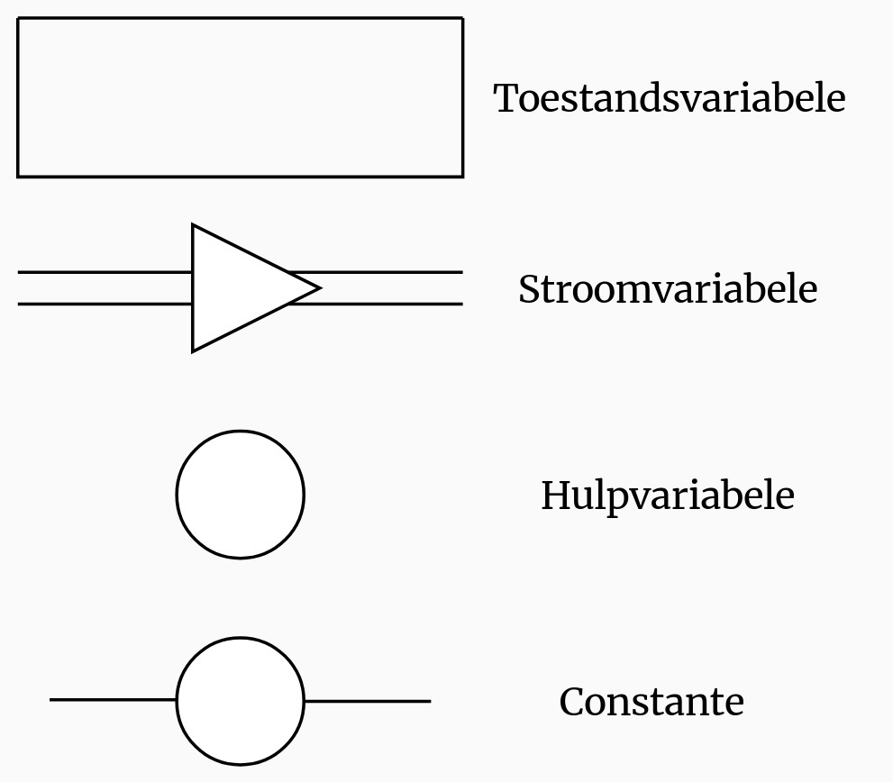

## Statische en dynamische modellen

Een **model** is een schematische weergave van de werkelijkheid. Modellen zijn handig omdat:

- Je experimenten eindeloos kunt herhalen
- Het minder tijd kost dan echte experimenten
- Het veiliger kan zijn
- Het goedkoper kan zijn
- Het ethischer kan zijn (je hoeft bijvoorbeeld geen proefdieren te gebruiken)

Bij een **statisch model** hangen de variabelen niet af van de tijd, zoals bij een maquette of een molecuulmodel. Bij een **dynamisch model** hangen de variabelen wel af van de tijd, zoals bij een weermodel of een ecosysteemmodel.

In een **numeriek model** bereken je steeds de veranderingen van grootheden in kleine tijdstapjes. Een **schaalmodel** is een vergrote of verkleinde versie van de werkelijkheid. Een **fysiek model** is een fysieke nabootsing van een situatie.

### Voorbeelden

Een **planetarium** is een dynamisch schaalmodel van ons zonnestelsel. Er zijn zowel mechanische als digitale planetaria. Het model is ook een **simulatie**: het heeft overeenkomsten met de werkelijkheid, waardoor je situaties kunt nabootsen die in het echt niet mogelijk zijn, zoals vooruit of achteruit gaan in de tijd.

De MONIAC is een hydraulische computer die geldstromen simuleert met water. Dit is een fysiek dynamisch model.

Bij onderzoek aan hart en bloedvaten kun je fysieke modellen maken om bloedstromen te analyseren, bijvoorbeeld met elektrische schakelingen die de weerstand van bloedvaten nabootsen.

Bij het simuleren van riviervorming kun je een schaalmodel gebruiken. Een voordeel hiervan is dat je de tijd sneller kunt laten verlopen dan in werkelijkheid.

## Dynamische numerieke modellen

Een dynamisch numeriek model rekent in kleine tijdstapjes. Je berekent steeds wat de waarde van een grootheid is op tijdstip $t$, met de waarde op het tijdstip daarvoor ($t - \Delta t$). Dit doe je door te berekenen wat erbij komt en eraf gaat.

$$\text{nieuwe waarde} = \text{oude waarde} + \text{verandering per tijdstap}$$

Neem een spaarrekening waar je begint met €100 ($B_0 = 100$), elke maand 2% rente krijgt en elke maand €50 inlegt.

Per maand komt er rente bij ($0{,}02 \cdot B$) en leg je €50 in. De verandering per maand is dus $0{,}02 \cdot B + 50$.

De formule voor het bedrag na 1 maand wordt dan: $B_1 = B_0 + (0{,}02 \cdot B_0 + 50)$.  
Voor 2 maanden: $B_2 = B_1 + (0{,}02 \cdot B_1 + 50)$.

De algemene formule voor tijdstap $\Delta t$ is: $B_t = B_{t - \Delta t} + (0{,}02 \cdot B_{t - \Delta t} + 50) \cdot \Delta t$.

Dit zijn **recursieve** formules: om $B_t$ te berekenen heb je $B_{t - \Delta t}$ nodig. Elke stap hangt dus af van de vorige.

### Tijdstap

De **tijdstap** ($\Delta t$) is de grootte van elk rekenstapje. In het voorbeeld hierboven is $\Delta t$ gelijk aan 1 maand. We gaan er dus vanuit dat er binnen een maand niets verandert aan het spaarbedrag.

Een kleinere tijdstap geeft nauwkeurigere resultaten, maar kost meer rekentijd. Hoe snel een grootheid verandert bepaalt hoe klein je tijdstap moet zijn.

### Recursief naar differentiaal

Je kunt een recursieve formule omzetten naar een differentiaalvergelijking. Bij een recursieve formule reken je in losse stappen, bij een differentiaalvergelijking verloopt de verandering vloeiend.

We beginnen met de recursieve formule:

$$B_t = B_{t-\Delta t} + (0{,}02 \cdot B_{t-\Delta t} + 50) \cdot \Delta t$$

Haal $B_{t-\Delta t}$ naar de linkerkant:

$$B_t - B_{t-\Delta t} = (0{,}02 \cdot B_{t-\Delta t} + 50) \cdot \Delta t$$

We kunnen zeggen dat $B_t - B_{t-\Delta t}$ hetzelfde is als $\Delta B$ (want het is het verschil in $B$):

$$\Delta B = (0{,}02 \cdot B + 50) \cdot \Delta t$$

Deel beide kanten door $\Delta t$:

$$\frac{B_t - B_{t-\Delta t}}{\Delta t} = 0{,}02 \cdot B + 50$$

Als we $\Delta t$ nu heel klein maken, krijg je de afgeleide:

$$\frac{dB}{dt} = 0{,}02 \cdot B + 50$$

Dit is een **differentiaalvergelijking**.

## Opbouw model

In een numeriek model gebruik je 4 soorten variabelen:

- **Toestandsvariabelen**: de grootheden die je wilt onderzoeken en die veranderen in de tijd
- **Stroomvariabelen**: de verandering per tijdstap ($\Delta t$) van een toestandsvariabele
- **Hulpvariabelen**: tussenwaarden die helpen bij het berekenen van de stroomvariabelen
- **Constanten**: waardes die de hele simulatie hetzelfde blijven

In het spaarrekening-voorbeeld is $B$ de toestandsvariabele, de verandering $(0{,}02 \cdot B + 50)$ de stroomvariabele, en de rente (0,02) en inleg (50) zijn constanten.

Je kunt deze variabelen grafisch weergeven en verbinden met relatiepijlen.

## Modelleercyclus

Bij modelleren maak je gebruik van de modelleercyclus:

1. **Onderzoeksvraag**: Wat wil je weten over de werkelijkheid?
2. **Probleem analyseren**: Welke factoren hebben invloed op de situatie?
3. **Conceptueel model**: Welke grootheden en relaties passen bij de situatie?
4. **Wiskundig model**: Zet het conceptuele model om door formules bij de variabelen te zetten en constanten in te vullen.
5. **Computermodel**: Zet het wiskundige model in software zoals Coach 7.
6. **Model controleren**: Dit gaat in 3 stappen:
   - **Verifiëren**: Check of er geen fouten in zitten en of je de verwachte resultaten krijgt.
   - **Kalibreren**: Pas constanten en beginwaardes aan om de werkelijkheid zo goed mogelijk te benaderen.
   - **Valideren**: Check of de resultaten logisch en realistisch zijn.
7. **Simuleren**: Voer het model uit met verschillende waardes voor de constanten.
8. **Concluderen**: Bekijk de resultaten en beantwoord de onderzoeksvraag.
