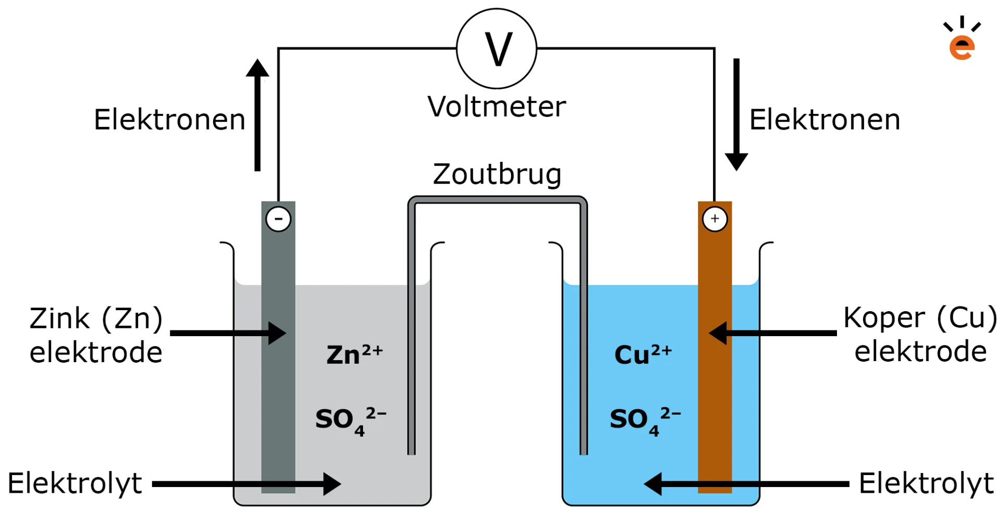
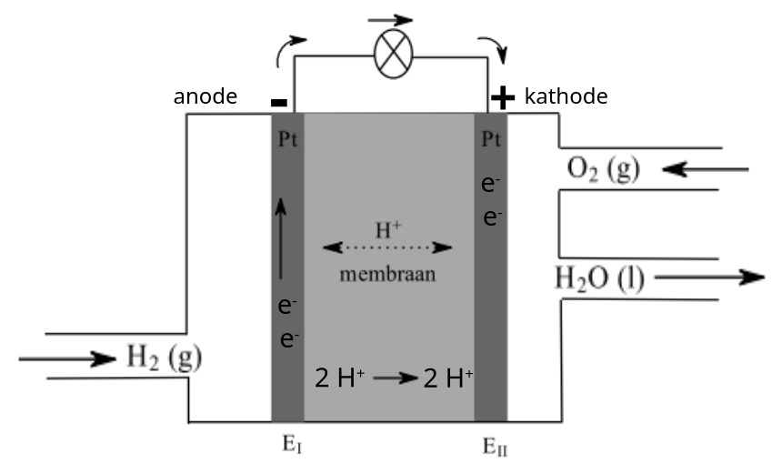
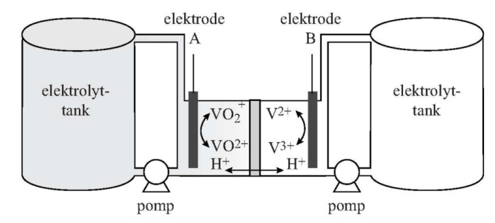

## Redoxreacties

Bij zuur-basereacties worden protonen ($\ce{H+}$) overgedragen. Bij **redoxreacties** worden elektronen overgedragen.

Een natriumatoom heeft 1 elektron "te veel" voor een stabiele configuratie. Natrium kan dit elektron afstaan:

$$\ce{Na -> Na+ + e-}$$

Dit is een **halfreactie**. Natrium is hier een **reductor**: een stof die elektronen afstaat.

Een chlooratoom mist juist 1 elektron. Chloor kan een elektron opnemen:

$$\ce{Cl + e- -> Cl-}$$

Chloor is hier een **oxidator**: een stof die elektronen opneemt.

Een **redoxreactie** is een reactie tussen een REDuctor en een OXidator. De halfreacties samen geven:

$$\ce{2 Na + Cl2 -> 2 NaCl}$$

### Metalen als reductor

Ongeladen metalen zijn altijd reductor, omdat metaalionen altijd positief geladen zijn. $\ce{Cr}$ kan dus nooit oxidator zijn, maar $\ce{Cr^{6+}}$ kan dat wel.

> Let op: $\ce{Cu}$ (roodbruin metaal) en $\ce{Cu^{2+}}$ (blauwe oplossing) zijn dus totaal verschillende stoffen. De lading maakt heel veel uit!

## Binas 48

De sterktes van oxidatoren en reductoren staan in Binas 48. Oxidatoren staan van sterk (boven) naar zwak, reductoren van zwak naar sterk. De sterkste oxidator ($\ce{F2}$) staat bovenaan, de sterkste reductor ($\ce{Li}$) onderaan.

Er vindt alleen een redoxreactie plaats als de oxidator **boven** de reductor staat, oftewel als $V_\mathrm{ox} > V_\mathrm{red}$ (zie de derde kolom).

### Redoxreacties opstellen

Voor het opstellen van een redoxreactie begin je met het zoeken van de sterkste oxidator en reductor, en controleer je of $V_\mathrm{ox} > V_\mathrm{red}$. Vervolgens stel je de halfreacties op uit Binas 48. Daarna vermenigvuldig je de coëfficiënten zodat het aantal elektronen in beide halfreacties gelijk is. Tot slot tel je de halfreacties bij elkaar op, waardoor de elektronen wegvallen (als het goed is).

> Voorbeeld: $\ce{Al}$ en $\ce{Cu^{2+}}$
>
> - $\ce{Cu^{2+} + 2 e- -> Cu}$ (x3)
> - $\ce{Al -> Al^{3+} + 3 e-}$ (x2)
>
> Geeft: $\ce{3 Cu^{2+} + 2 Al -> 3 Cu + 2 Al^{3+}}$

Controleer daarna of er nog een neerslagreactie of zuur-basereactie kan plaatsvinden.

## De Daniell-cel

Bij een gewone redoxreactie reageren stoffen direct met elkaar. In een **Daniell-cel** houden we ze gescheiden en laten we alleen de elektronen stromen via een draad.

De Daniell-cel bestaat uit twee metalen elektrodes, twee oplossingen van ionen, een **zoutbrug** en een draad.

In een Daniell-cel met zink en koper vindt bij de zinkstaaf de halfreactie $\ce{Zn -> Zn^{2+} + 2 e-}$ plaats (zink is de reductor), en bij de koperstaaf $\ce{Cu^{2+} + 2 e- -> Cu}$ ($\ce{Cu^{2+}}$ is de oxidator).

Elektronen stromen van de **minpool** naar de **pluspool**. De reductor is altijd de minpool, want die geeft elektronen af. De oxidator is altijd de pluspool, want die neemt elektronen op. In dit geval is zink dus de minpool en koper de pluspool.

### Zoutbrug en spanning

Aan de zinkkant ontstaan $\ce{Zn^{2+}}$-ionen (meer positief), aan de koperkant verdwijnen $\ce{Cu^{2+}}$-ionen (minder positief). De **zoutbrug** compenseert dit: positieve ionen gaan naar de koperkant, negatieve gaan naar de zinkkant.

Voor de spanning (voltage) die een batterij kan leveren geldt:

$$V_\mathrm{bat} = V_\mathrm{ox} - V_\mathrm{red}$$

## Batterijen

Alle batterijen werken op dezelfde manier als de Daniell-cel. Ze hebben drie onderdelen: een **anode** (minpool), **kathode** (pluspool) en **elektrolyt**.

Het elektrolyt heeft 3 functies:

- Het zorgt ervoor dat de kathode en anode niet direct met elkaar in contact staan
- Het werkt als ionengeleider (zoals de zoutbrug)
- Het kan meereageren in de redoxreactie

> Let op: zeg hier niet dat het elektrolyt de kathode en anode "gescheiden" houdt, want dat zou betekenen dat het een mengsel is.

Een batterij gaat leeg als een van de beginstoffen op is.

### Opladen

Bij een **oplaadbare batterij** keer je de reactie om door stroom in tegengestelde richting te zetten. Dit is een **gedwongen redoxreactie** ($V_\mathrm{ox} < V_\mathrm{red}$). De halfreacties draaien om.

Er zijn twee voorwaarden voor een oplaadbare batterij:

- De reactieproducten moeten in het systeem blijven (ze mogen niet ontsnappen als gas)
- Er mogen geen nevenreacties plaatsvinden bij het opladen

## Brandstofcel

De verbranding van waterstof ($\ce{2 H2 + O2 -> 2 H2O}$) is sterk exotherm. In een **brandstofcel** splits je deze reactie op in halfreacties om er stroom uit te halen:

- Anode: $\ce{H2 -> 2 H+ + 2 e-}$
- Kathode: $\ce{O2 + 4 H+ + 4 e- -> 2 H2O}$

De brandstofcel heeft platina-elektrodes en een **protonenmembraan** als elektrolyt. Dit membraan laat alleen $\ce{H+}$-ionen door, geen elektronen. Waterstof aan de anode-kant splitst in $\ce{H+}$ en elektronen. De elektronen moeten via de draad naar de kathode (dat is dus je daadwerkelijke stroom), de $\ce{H+}$-ionen gaan via het membraan (om het ladingsverschil te compenseren). Aan de kathode-kant reageert zuurstof met $\ce{H+}$ en elektronen tot water.

## Redox-flowbatterij

Bij een gewone batterij zitten de reagerende stoffen in de batterij zelf. Bij een **redox-flowbatterij** worden vloeibare elektrolyten vanuit externe tanks langs de elektrodes gepompt.

Een voorbeeld is de **vanadium-redox-flowbatterij (VRFB)**. Deze heeft twee tanks: één met $\ce{V^{2+}}$-ionen en één met $\ce{VO2+}$-ionen. De elektrolyten worden langs de elektrodes gepompt, met een $\ce{H+}$-membraan ertussen.

- Minpool: $\ce{V^{2+} -> V^{3+} + e-}$ (reductor)
- Pluspool: $\ce{VO2+ + 2 H+ + e- -> VO^{2+} + H2O}$ (oxidator)

Aan de minpool-kant staan $\ce{V^{2+}}$-ionen elektronen af. Deze elektronen gaan via de draad naar de pluspool, waar $\ce{VO2+}$-ionen ze opnemen. De $\ce{H+}$-ionen gaan door het membraan om het ladingsverschil te compenseren. Het handige aan vanadium is dat beide kanten hetzelfde element gebruiken, dus als de elektrolyten mengen is de batterij niet kapot.

