## H6

### Soorten en verwantschap

De definitie van een **soort** was voor een lange tijd de overeenkomst in uiterlijke kenmerken en de mogelijkheid om vruchtbare nakomelingen te krijgen. Tegenwoordig wordt DNA gebruikt om deze indeling te verifiëren.
Soms is de grens tussen soorten niet duidelijk, zoals bij **hybriden**: levensvatbare kruisingen tussen verschillende soorten. Hybriden zijn vaak niet vruchtbaar.

Alle soorten worden ingedeeld op basis van verwantschap met andere soorten (**taxonomie**), in steeds grotere groepen (**taxa**): **organismen** $\rightarrow$ **soorten** $\rightarrow$ **geslachten** $\rightarrow$ **families** $\rightarrow$ **orden** $\rightarrow$ **klassen** $\rightarrow$ **afdelingen** $\rightarrow$ **rijken** $\rightarrow$ **domeinen**. Hoe minder verwant 2 organismen aan elkaar zijn, hoe minder taxa ze delen.

Er zijn 3 domeinen: **archaea**, **bacteriën** en **eukaryoten**. Elk domein heeft een eigen type rRNA (ribosomaal RNA). De archaea zijn net als bacteriën eencelligen zonder kernmembraan. Hun cirkelvormig DNA ligt los in het grondplasma en het celmembraan bestaat uit 1 laag.

Elke beschreven soort krijgt een **wetenschappelijke naam** volgens de **binominale nomenclatuur** *(bi-nominaal = twee namen)*. Die bestaat uit 2 delen: de geslachtsnaam (met een hoofdletter) en de soortnaam (met een kleine letter), zoals *Pygoscelis papua* (ezelspinguïn). Soms staat er achter deze 2 delen nog een naam voor een **ondersoort** (een afgescheiden onderverdeling), zoals *Canis lupus familiaris* (hond). Variaties binnen soorten (rassen) maken geen deel uit van de taxonomie.

### Populaties

Een **populatie** is een groep organismen van dezelfde soort in een bepaald gebied.
Er zijn verschillende manieren om een populatiegrootte te schatten:

- **Tellen**  
  Vooral toepasbaar bij kleine populaties
- **Schatten**  
  Zoals bij planten, je bepaalt dan het aantal bloemen per representatieve oppervlakte-eenheid en vervolgens de totale oppervlakte waar de plant groeit
- **Vangst-terugvangstmetode**  
  Een aantal dieren vangen, die van een merkteken voorzien en vrijlaten ($n_1$). Na een tijdje worden er weer een aantal dieren gevangen ($n_2$), waarvan er een aantal een merkteken zullen hebben ($n_3$). Vervolgens kun je de totale populatiegrootte ($N$) schatten met de formule $N = \frac{n_1 \cdot n_2 }{n_3}$.

> Deze formule komt van het feit dat de verhouding tussen $n_2$ en $n_3$ (dus de verhouding van hoeveel dieren er gemarkeerd zijn van alle gevonden dieren) hetzelfde is als de verhouding tussen $N$ en $n_1$ (want toen zijn alle dieren gemarkeerd).

De populatiegrootte kan erg verschillen en wordt voornamelijk bepaald door **geboorte**, **immigratie**, **sterfte** en **emigratie**.  
Natuurlijke factoren hebben ook veel invloed op de populatiegrootte. Er is altijd 1 factor die de groei van een populatie het meest belemmert: de **beperkende factor**.  
De maximale capaciteit van een gebied om voldoende voedsel en schuil- en nestplaatsen te leveren (waardoor de populatiegrootte constant blijft) is de **draagkracht**.

### Natuurbeheer

**Natuurbeheer** is het beheren van natuurgebieden. Een van de doelen van natuurbeheer is voorkomen dat soorten uitsterven, en daarmee de afname van de **soortensamenstelling** tegengaan. Door de mens worden meer dan een miljoen soorten met uitsterven bedreigd.

Door menselijk handelen zijn veel leefgebieden van elkaar geïsoleerd: **versnippering**. Maatregelen als ecoducten (zie afbeelding) kunnen gebieden weer **ontsnipperen**.

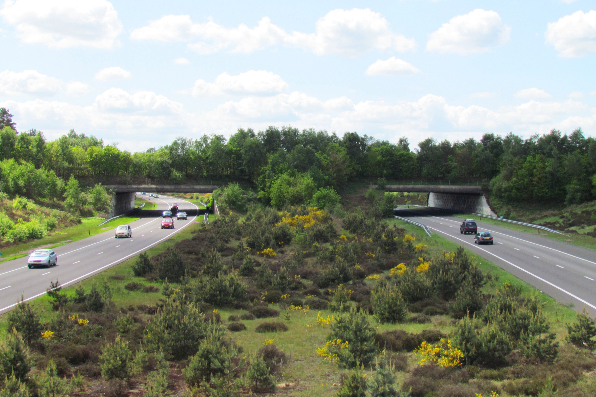  
Een ecoduct

Ook kunnen dieren worden **uitgezet** om de natuur te beheren. Zo kunnen grazers (dieren die planten eten) worden ingezet om de leefomgeving aantrekkelijker te maken voor andere soorten. Een te groot aantal grazers kan echter voor een **verstoring** (een snelle en blijvende verandering in een ecosysteem) zorgen.

Natuurbeheerders proberen soms soorten die uit een gebied waren verdwenen te **herintroduceren**: door uitzetting proberen ze een nieuwe populatie te maken.

### Soorten en hun omgeving

Invloeden uit de levende natuur op organismen noem je **biotische factoren**, zoals roofdieren en planten. Invloeden die niet gekoppeld zijn aan organismen noem je **abiotische factoren**, zoals temperatuur, water en zonlicht.

Een leefomgeving die voldoet aan de specifieke biotische en abiotische eisen van een bepaalde soort, noem je een **habitat** (voor planten kan ook het begrip **standplaats** worden gebruikt).

Voor iedere abiotische factor heeft elke soort **tolerantiegrenzen** (een soort maximum en minimum). Buiten deze grenzen blijft geen enkel individu in leven. Veel organismen hebben, naast de tolerantiegrenzen, ook een **optimumgebied** voor abiotische factoren.
Beide kun je weergeven in een **tolerantiecurve**.

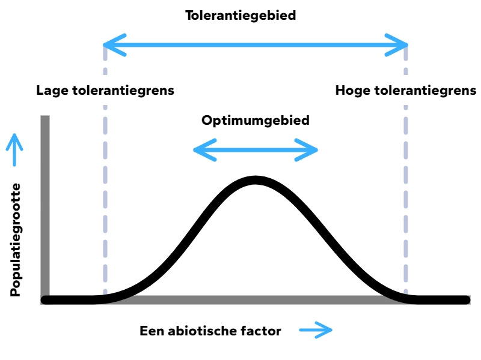  

De **niche** van een soort is een omschrijving van hoe die soort de omgeving gebruikt en beïnvloedt.  
Een **adaptatie** is een erfelijke aanpassing aan het uiterlijk of het gedrag die ontstaat door langdurige selectieprocessen. Deze adaptaties kunnen ontstaan door mutaties in het genoom. Als een adaptatie tot een hogere overlevingskans leidt, zal deze op den duur vaker voorkomen in een populatie, doordat die organismen zich ook meer kunnen voortplanten.

### Relaties tussen soorten

Als een soort een andere eet, spreek je van een **voedselrelatie**. Voedselrelaties kun je in een **voedselketen** zetten. Een voedselketen begint altijd met een producent (een plant of alg). Daarna komt de **consument van de eerste orde**, daarna de **consument van de tweede orde** enz.

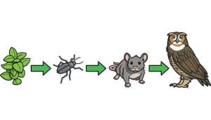

De pijlen binnen de voedselketen volgen de organische stoffen: dus van wat gegeten wordt naar wat het eet.  
Je kunt ook meerdere voedselketens aan elkaar koppelen. Je krijgt dan een **voedselweb**.

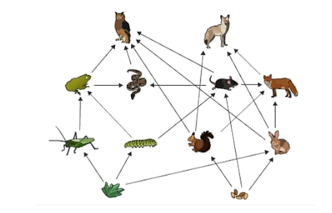

> Een voedselketen is dus gewoon van het ene organisme naar het andere, terwijl een voedselweb een overzicht is van alle onderlinge voedselrelaties.

**Herbivoren** zijn planteneters. De meeste planten overleven de schade die wordt aangericht door herbivoren. **Carnivoren**, vleeseters, moeten aan hun voedsel komen door **predatie** (het vangen en doden van prooi). **Omnivoren** zijn alleseters.

De relatie tussen een prooi en zijn natuurlijke vijand (**predator**) is een **predator-prooirelatie**. Prooien proberen te overleven door bijvoorbeeld camouflage, het leven in groepen en snelle voortplanting.

Naast de voedselrelaties komen er ook langdurige relaties voor: **symbiose**. In de tabel zie je de verschillende vormen van symbiose.

|          | Voordeel          | Neutraal                     | Nadeel          |
|:--------:|:-----------------:|:----------------------------:|:---------------:|
| Voordeel | **Mutualisme**    | **Commensalisme**            | **Parasitisme** |
| Neutraal | **Commensalisme** | **Epifytisme** (bij planten) | -               |
| Nadeel   | **Parasitisme**   | -                            | -               |

Epifytisme zit eigenlijk een beetje meer aan de voordeel-neutraal kant, maar het boek is hier redelijk vaag over.

> Een neutraal-nadeel relatie bestaat eigenlijk wel: **amensalisme**, en bij een nadeel-nadeel relatie spreek je van **concurrentie**

Ziektes kunnen voedselketens verstoren. Als bijvoorbeeld een groot gedeelte van een bepaalde populatie sterft, zullen de predatoren van die soort weggaan. Ook gifstoffen kunnen voedselketens verstoren. **Accumulatie** van gifstoffen is het ophopen van die stoffen. De gifconcentratie neemt bij elke schakel in de voedselketen toe. Sommige gifstoffen zijn **persistent**: ze kunnen jarenlang dieren blijven vergiftigen.

> Voorbeeld: er zit gif op planten tegen insecten. Die insecten krijgen een beetje gif in hun lichaam. Vervolgens worden de insecten opgegeten door muizen. En de muizen worden opgegeten door roofvogels. Maar omdat de roofvogels meerdere muizen eten, en die muizen ook weer meerdere insecten eten, krijgt de roofvogel het gif binnen van veel insecten: accumulatie.

### Nieuwe populaties

**Fitness** is het vermogen om bepaalde allelen door te geven aan de volgende generatie. Als een populatie erg klein is, waardoor er binnen met familieleden gepaard moet worden, kan **inteelt** voor een gebrek aan genetische variatie zorgen.

Het toenemen of afnemen van de frequentie van een bepaald allel heet **genetic drift**.

Na een ramp waarbij het aantal individuen sterk is afgenomen, zal ook de allelensamenstelling sterk afnemen: het **flessenhalseffect**.

Als er een nieuwe populatie ontstaat (kolonisatie), is de allelensamenstelling binnen de nieuwe groep minder gevarieerd dan die van de oorspronkelijke populatie: het **stichtereffect**.

Er is een verband tussen de grootte van een eiland, de afstand tot het vasteland en de soortenrijkdom. De **eilandtheorie** beschrijft dit verband ($\rightarrow$ Binas 93C). Grote eilanden bieden meer niches en er kunnen meer soorten leven dan op kleine eilanden. Nabijgelegen eilanden ontvangen sneller nieuwe soorten dan afgelegen eilanden. Dus hoe groter en hoe dichter bij het vasteland, hoe groter de soortenrijkdom.
Op sommige punten ontstaat er dan een evenwicht tussen immigratie en uitsterving.

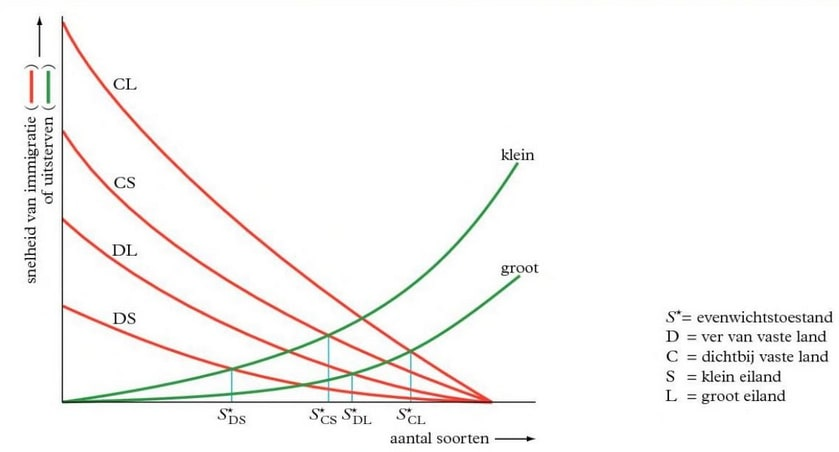

## H8

### Organisch en anorganisch

Ecosystemen functioneren dankzij de **kringlopen** van stoffen.

Elke voedselketen begint met een **producent** die **anorganische stoffen** omzet in **organische stoffen**. Planten doen dit via **fotosynthese**. Ze gebruiken daarvoor de lichtenergie van de zon en zijn daarmee **foto-autotrofe** organismen.  
Ook sommige bacteriën zijn producenten. Bepaalde bacteriën in de grond maken gebruik van **chemosynthese**: ze bouwen organische stoffen op met energie die vrijkomt bij chemische reacties. Deze bacteriën zijn **chemo-autotroof**.  
Door **voortgezette assimilatie** ontstaan andere organische stoffen. Hiervoor zijn stoffen uit de bodem nodig, zoals stikstof en fosfor.

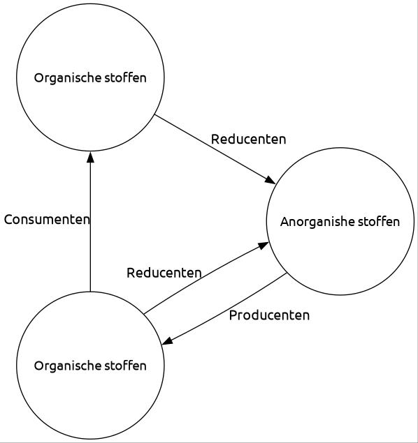

De **consumenten** eten producenten of andere consumenten, waardoor organische stoffen zich door de voedselketen verplaatsen. Deze organismen zijn **heterotroof**: ze gebruiken organische stoffen van andere organismen.  
Dode resten van planten en dieren zijn voedsel voor **detrituseters**. Alle overgebleven restjes uit de voedselketens komen uiteindelijk bij de **reducenten** terecht: bacteriën en schimmels. Zij zetten organische stoffen weer om in anorganische stoffen.

#### Grondlagen & composteren

De bovenste bodemlaag bestaat uit houtstof en cellulose: de **strooisellaag**. Samen met de uitwerpselen van detrituseters vormt deze laag de **humuslaag**. Deze laag is een belangrijke voedselbron voor bacteriën.

De **ecologische voetafdruk** is de totale oppervlakte land en water die een mens gebruikt als leefruimte, productieruimte en voor het verwerken van afval.

**Composteren** is het gecontroleerd afbreken van organische stoffen door reducenten. De snelheid daarvan hangt af van verschillende factoren:

- **Temperatuur**  
  Hoe hoger de temperatuur, hoe sneller de compostering verloopt.
- **Eigenschappen van de reducenten**  
  Elke schimmel- en bacteriesoort heeft een eigen leefgebied. Bij veel $\ce{O2}$ hebben **aerobe** soorten een voordeel. **Anaerobe** soorten (die geen zuurstof nodig hebben) werken meestal langzamer.
- **Samenstelling van het afval**
- **Koolstof/stikstof-verhouding**  
  Reducenten gebruiken afval als energiebron, maar hebben ook stikstof nodig voor eiwitsynthese. Te weinig stikstof beperkt de bacteriegroei en vertraagt de compostering.

### Energie

Energie uit zonlicht is de belangrijkste energiebron voor vrijwel elk ecosysteem op Aarde.

**Consumenten van de eerste orde** (C1) zijn de consumenten die direct producenten opeten. De **consumenten van de tweede orde** (C2) eten vervolgens de C1, enzovoort.

**Herbivoren** zijn planteneters. **Carnivoren**, vleeseters, moeten aan hun voedsel komen door het vangen en doden van prooi. **Omnivoren** zijn alleseters.

De plaats van een organisme in een voedselketen noem je het **trofisch niveau**. Alle producenten vormen het eerste trofische niveau. De consumenten van de eerste orde vormen het tweede trofische niveau, enzovoort.

De eerste stap in de voedselketen is de **bruto primaire productie** (**BPP**). Dit is de hoeveelheid organische stoffen die autotrofe organismen (zoals planten) per jaar produceren uit anorganische stoffen. Een deel van deze energie wordt door de producenten zelf verbruikt. Wat er verder overblijft, noem je de **netto primaire productie** (**NPP**), en dit is de energie die beschikbaar is voor de volgende trofische niveaus.

Trofische relaties in ecosystemen zijn moeilijk in kaart te brengen vanwege de enorme aantallen organismen. Aantallen geven bovendien geen goed beeld van de hoeveelheid energie. Daarom gebruiken biologen **biomassa**: de massa aan energierijke organische stoffen. Een **piramide van biomassa** is een momentopname van de verdeling van biomassa in een ecosysteem. Het jaargemiddelde hiervan levert een **piramide van productiviteit** op.

Een **energiestroomschema** toont op trofisch niveau wat er met de biomassa gebeurt.

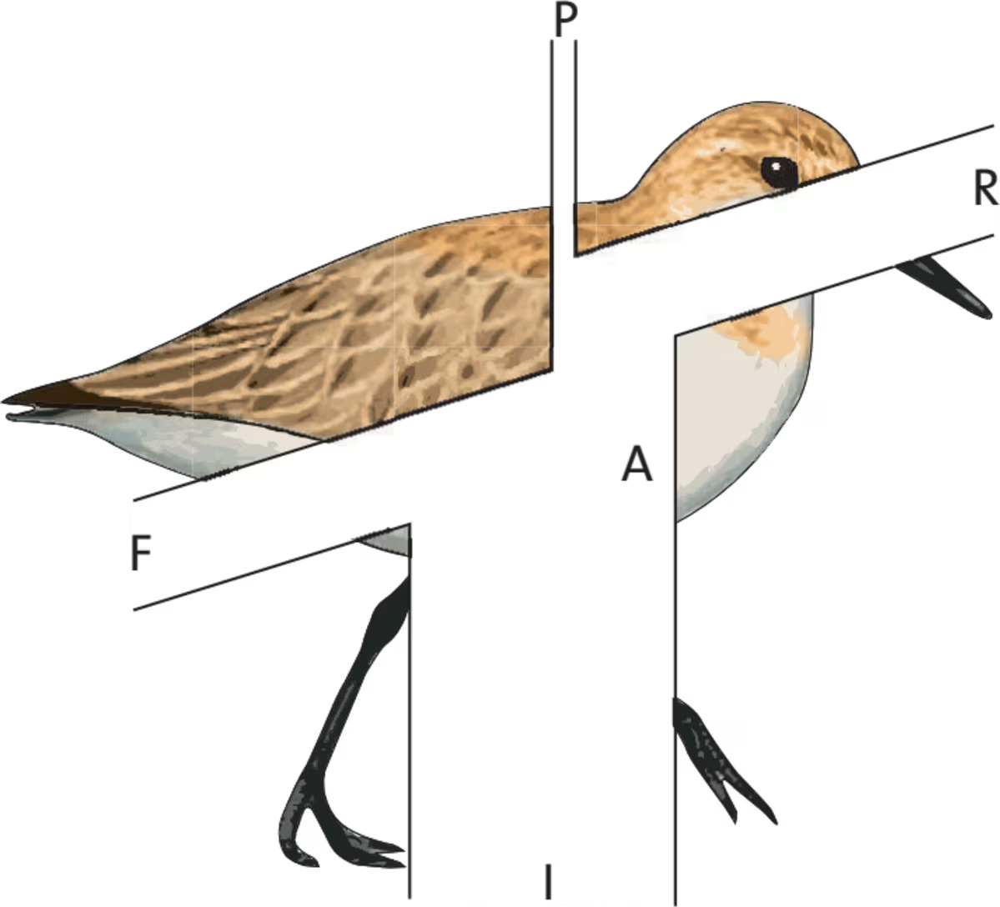

- De *intake* (**I**) is de hoeveelheid energierijke stoffen die het organisme binnenkrijgt  
- De *feces* (**F**) is het onverteerbare deel van de voeding dat als ontlasting het lichaam verlaat  
- Deel **A** is de hoeveelheid energierijke stoffen die aan het bloed wordt afgegeven  
- Deel **P** is de hoeveelheid organische stoffen die als **bouwstof** worden gebruikt  
- Deel **R** is de hoeveelheid organische stoffen die als **brandstof** worden gebruikt  

### Kringlopen

#### Koolstofkringloop

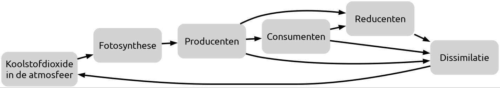

De **snelle koolstofkringloop** bestaat uit alle voedselketens. Planten gebruiken koolstofdioxide uit de atmosfeer om glucose te maken. Consumenten eten deze planten, waarna reducenten de consumenten afbreken. Door **dissimilatie** (het afbreken van organische stoffen) door producenten, consumenten en reducenten komt koolstofdioxide weer vrij in de atmosfeer.

Onder hoge druk kunnen niet-afgebroken plantenresten veranderen in bruin- en steenkool: **fossiele brandstoffen**. Door het verbranden van deze brandstoffen komt de opgeslagen koolstof weer vrij in de atmosfeer: de **langzame koolstofkringloop**.  
Een opslagplaats van koolstof heet een **sink**. Een plaats waar koolstof vrijkomt, noem je een **source**.

#### Stikstofkringloop

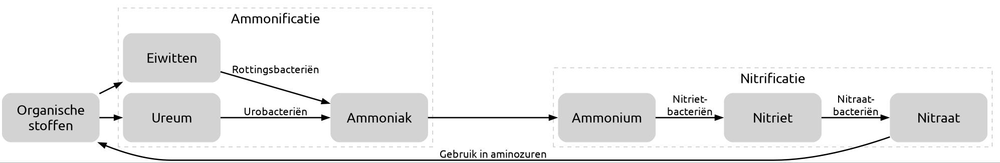

Producenten gebruiken stikstof uit nitraat om aminozuren te vormen. Deze plantaardige eiwitten worden in de voedselketen omgezet in dierlijke eiwitten.

Bij de afbraak van eiwitten door consumenten ontstaat onder andere **ureum**. **Urobacteriën** zetten ureum om in ammoniak.  
**Rottingsbacteriën** breken eiwitten en andere organische resten af tot ammoniak. Dit proces heet **rotting**.  
Samen heten deze processen **ammonificatie**.

Ammoniak reageert in de bodem met water tot ammonium-ionen ($\ce{NH4^+}$). Vervolgens zetten chemo-autotrofe **nitrietbacteriën** ammonium om in nitriet, en **nitraatbacteriën** zetten nitriet om in nitraat. Dit proces heet **nitrificatie**. Het nitraat is weer beschikbaar voor het vormen van aminozuren.

Daarnaast zijn er manieren waarop de hoeveelheid stikstof in een ecosysteem toe- of afneemt:

- **Stikstoffixerende bacteriën** halen stikstofgas ($\ce{N2}$) uit de lucht en zetten het om in ammoniak ($\ce{NH3}$).
- Tijdens onweer reageren zuurstof en stikstof in de atmosfeer tot $\ce{NO_x}$ (zoals $\ce{NO}$ of $\ce{NO2}$).
- **Uitspoeling** is het wegspoelen van stikstof uit het ecosysteem naar het grondwater, bijvoorbeeld bij langdurige regen.
- **Denitrificatie** zet nitraat om in stikstofgas, dat weer vrijkomt in de atmosfeer.

#### Rioolwaterzuivering

In een **rioolwaterzuiveringsinstallatie** (RWZI) spelen bacteriën een grote rol. Bacteriën breken koolstofverbindingen af tot $\ce{CO2}$. Rottings- en urobacteriën zetten stikstofverbindingen om in ammoniak en uiteindelijk ammonium. Ammonium wordt vervolgens omgezet in nitriet en nitraat. Daarna halen **denitrificerende bacteriën** het nitraat uit het water door het om te zetten in stikstofgas.

Het gezuiverde water mag daarna het oppervlaktewater in.

Het kraanwater komt niet direct uit RWZI's. Drinkwater in Nederland wordt gewonnen uit grond- en oppervlaktewater. Eerst worden afvalstoffen verwijderd. Voor de **waterzuivering** slaan drinkwaterbedrijven het water op in spaarbekkens, waar veel verontreiniging naar de bodem zinkt. Ook wordt het water gefilterd, bijvoorbeeld via duinen of fijne zeven. Tot slot wordt het water gedeïoniseerd en worden bacteriën verwijderd.

### Ecosystemen

We onderscheiden 2 **stadia van successie**:

In het **pioniersstadium** zijn er weinig soorten. **Pionierssoorten** groeien snel, leven kort en produceren veel zaden. Concurrentie tussen deze soorten is minimaal. Door hun aanwezigheid neemt het organisch materiaal in de bodem toe, waardoor nieuwe soorten kunnen ontstaan. In dit stadium hebben abiotische factoren een grote invloed.

In het **climaxstadium** neemt het aantal soorten toe, terwijl het aantal individuen per soort juist afneemt. De totale biomassa is groter dan in het pioniersstadium. Er ontstaan veel onderlinge relaties tussen soorten en de invloed van abiotische factoren neemt af.

**Successie** is het proces waarbij een gebied zich ontwikkelt van kale bodem tot natuurgebied.

- **Primaire successie** start op kale grond.  
- **Secundaire successie** begint op een plek waar eerder natuur was, maar door verstoring is verdwenen. Dit gaat sneller omdat er al een humuslaag is.

Soms blijft de successie steken in een **subclimaxstadium** door het gedrag van dieren.

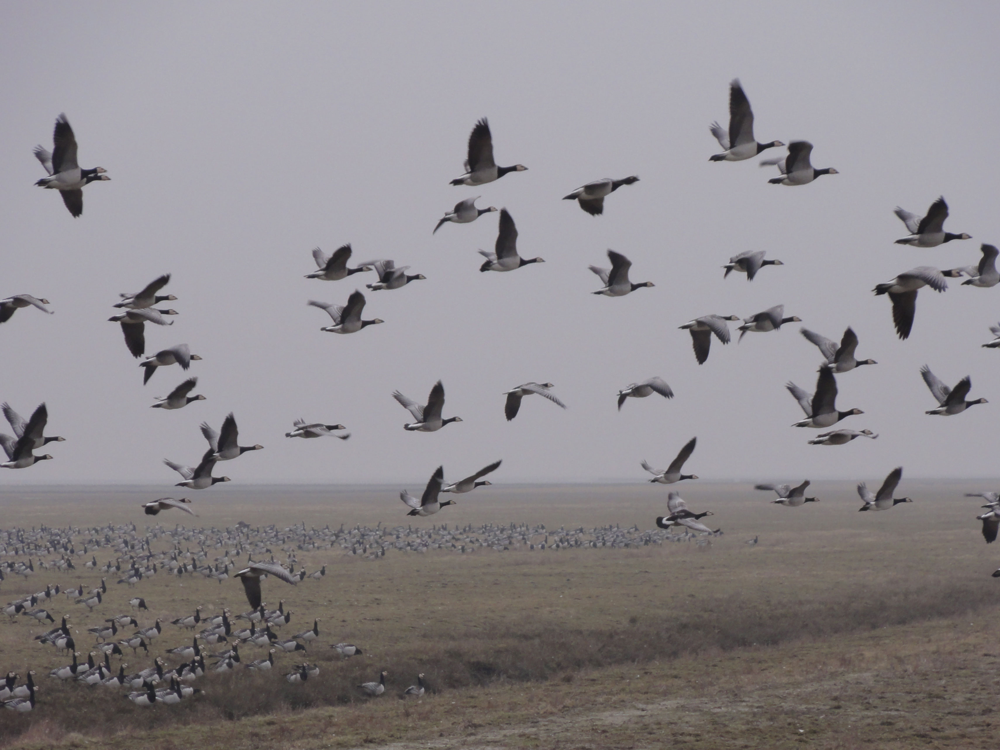

Op de afbeelding zie je brandganzen in een *kwelder*. Hun eetgedrag remt de successie omdat er te weinig organisch materiaal in de bodem komt.

#### Exoten

**Exoten** zijn soorten die zich door menselijk handelen in een ecosysteem vestigen. Soms zijn ze ongewenst en verdringen ze bestaande soorten. Dan noemen we ze **plaagorganismen**.

## H9

### Koolstof

Het **systeem Aarde** bevat verschillende **koolstofsinks** (opslagplaatsen van koolstof). De 3 belangrijkste onderdelen van de **langzame koolstofkringloop** zijn **fossiele brandstoffen** (bruin- en steenkool, aardolie en aardgas), **kalkgesteenten** (ontstaan door een reactie van $\ce{CO2}$ met $\ce{Ca^{2+}}$) en het **oceaansediment** (koolstof uit afgestorven plankton).

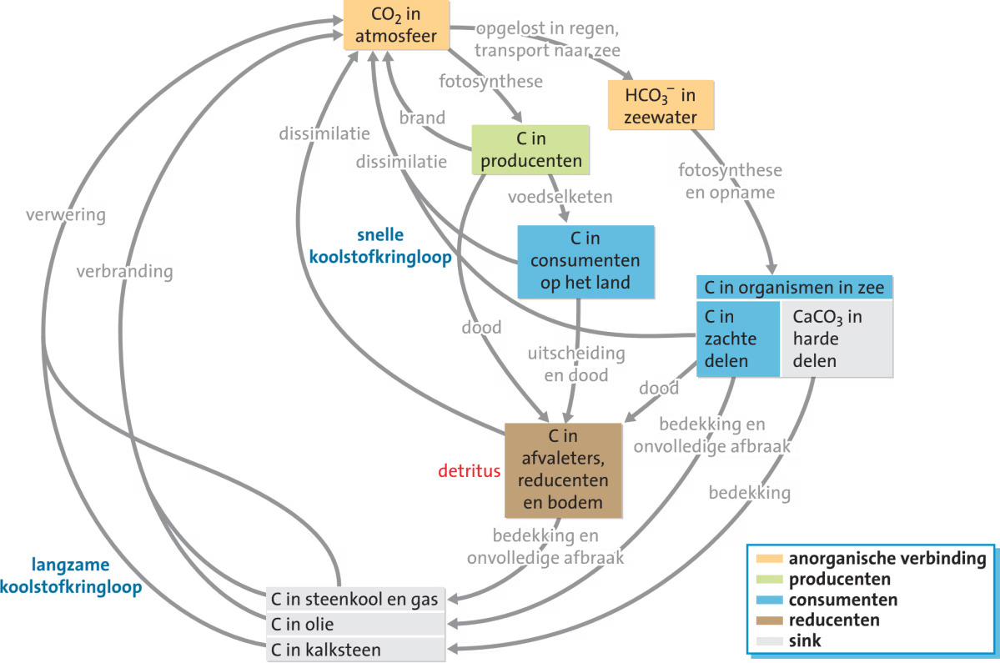

Als je fossiele brandstoffen verbrandt, veranderen deze sinks in **koolstofsources**: de opgeslagen koolstof komt dan versneld vrij als $\ce{CO2}$. In de **snelle koolstofkringloop** gaat koolstof van producenten naar consumenten en reducenten. De sink bestaat uit **biomassa**: levende organismen, detritus en organische stof in de bodem, inclusief de **permafrost** (permanent bevroren ondergrond) rond de Noordpool.

$\ce{CO2}$ lost ook op in het oceaanwater. Dit maakt de oceaan een belangrijke sink, maar een hogere $\ce{CO2}$-concentratie verlaagt de pH van het zeewater, waardoor schelpdieren moeilijker hun schelp kunnen opbouwen.

De afgelopen jaren is er steeds meer $\ce{CO2}$ in de atmosfeer terechtgekomen, onder andere door **ontbossing**, het droogleggen van veengebieden en het smelten van de permafrost.

### Broeikaseffect

Broeikasgassen absorberen de warmtestraling die de aarde uitzendt en stralen een deel ervan terug: het **broeikaseffect**. Zonder dit effect zou de gemiddelde temperatuur op aarde zo'n 30 °C lager zijn. De belangrijkste **broeikasgassen** zijn waterdamp ($\ce{H2O}$), koolstofdioxide ($\ce{CO2}$), methaan ($\ce{CH4}$), lachgas ($\ce{N2O}$) en ozon ($\ce{O3}$).

Door menselijke activiteit neemt de concentratie broeikasgassen in de atmosfeer toe, en zo ontstaat het **versterkt broeikaseffect**.

Door **klimaatverandering** veranderen abiotische factoren, waardoor sommige soorten lokaal uitsterven of migreren en andere juist nieuwe gebieden binnentrekken. Dit verandert de **biodiversiteit**, en daarmee ook de **veerkracht** van ecosystemen.

### Stikstof

Planten nemen $\ce{NO3^-}$ en $\ce{NH4^+}$ uit de bodem op. Stikstofgas ($\ce{N2}$) kunnen ze niet rechtstreeks opnemen. **Stikstofbindende bacteriën** kunnen dat wel: ze zetten $\ce{N2}$ om in $\ce{NH4^+}$ (**stikstoffixatie**). Als de planten sterven, breken reducenten de N-houdende organische stoffen af: **groenbemesting**.

De hoeveelheid stikstof in ecosystemen is door menselijk handelen flink toegenomen (verbranding van fossiele brandstoffen en kunstmest): een **open kringloop**. $\ce{NO_x}$ uit verbranding reageert met water tot **zure regen** ($\ce{HNO3}$), waardoor de bodem verzuurt en giftige metalen vrijkomen die boomwortels aantasten. $\ce{NH3}$ uit kunstmest en dierlijke mest zorgt ook voor verzuring. Zowel $\ce{NH3}$ als $\ce{NO_x}$ kunnen reageren tot **fijnstof**.

Door stikstofverrijking van de bodem verdringen snelgroeiende planten zoals brandnetels andere soorten, waardoor de biodiversiteit afneemt.

**Eutrofiëring** is de verrijking van het oppervlaktewater met meststoffen ($\ce{NO3^-}$ en $\ce{PO4^{3-}}$), waardoor een explosieve algengroei (**algenbloei**) ontstaat. Andere waterplanten sterven af, en de afbraak van dode algen verlaagt het zuurstofgehalte (**hypoxie**), waardoor andere organismen doodgaan: **dode zones**.

### Omslagpunten

Plastics zijn niet **biologisch afbreekbaar** en **persistent**: ze hopen zich op in organismen en voedselketens. Door uv-straling vallen grotere stukken uiteen in **microplastics** en **nanoplastics**, die via plankton de voedselketen binnenkomen. Microplastics kunnen bij mensen en dieren ontstekingen veroorzaken, en nanoplastics kunnen de fotosynthese van algen verstoren.

Ecosystemen zijn redelijk in evenwicht en kunnen kleine veranderingen in biotische of abiotische factoren zelf opvangen: **zelfregulatie**. Als veranderingen zich opstapelen, wordt een ecosysteem steeds instabieler totdat het **omslagpunt** (of kantelpunt) er is. Er ontstaat dan een nieuw evenwicht met andere biotische en abiotische factoren, en vaak een kleinere biodiversiteit.

In een successiereeks herken je vaak meerdere omslagpunten. Soms willen natuurbeheerders een omslagpunt tegenhouden om een subclimaxstadium te bewaren. Door ecosystemen in verschillende evenwichtstoestanden naast elkaar te houden, vergroot je de biodiversiteit. De grootste biodiversiteit vind je waar ecosystemen in elkaar overgaan: het tussenliggende gebied vormt een **gradiëntecosysteem**.

### Duurzaamheid

**Duurzame ontwikkeling** betekent dat je de aarde zo gebruikt dat toekomstige generaties ook nog in hun behoeften kunnen voorzien. Er zijn 3 thema's van belang:

- **Energie**: de **energietransitie** is de overgang naar **hernieuwbare energiebronnen**, maar ook **energiebesparing** is daarin belangrijk.
- **Voedsel**: bij **biologische landbouw** gebruik je geen chemische bestrijdingsmiddelen of kunstmest. Bij **kringlooplandbouw** is de kringloop gesloten (**gesloten kringloop**). Een meer plantaardig dieet is duurzamer, en vis is niet zomaar een alternatief omdat veel vispopulaties **overbevist** zijn.
- **Grondstoffen**: de nadruk ligt op minder afval, geen wegwerpproducten, en meer **hergebruik** en **recyclen**.
