> **Wil je per hoofdstuk leren? Gebruik dan de losse samenvattingen: [H1 & H6](/4VWO/TW1/nat_h1&h6), [H2](/4VWO/TW2/nat_h2), [H4](/4VWO/TW3/nat_h4), [H5](/4VWO/TW4/nat_h5), [H7](/5VWO/TW1/nat_h7), [H8](/5VWO/P4/nat_h8), [H9](/5VWO/TW2/nat_h9), [H10](/5VWO/TW3/nat_h10).**

## Krachten en beweging

### Positie en snelheid

In een **x,t-diagram** zie je de positie op elk tijdstip. De helling op een punt is gelijk aan de snelheid op dat moment. Bij een constante snelheid (**eenparige beweging**) is het x,t-diagram een rechte lijn. Bij een versnelling of een vertraging (dus geen constante snelheid) is het x,t-diagram een kromme.

De **gemiddelde snelheid** bereken je met:

$$v_\text{gem} = \frac{\Delta x}{\Delta t}$$

Hierin is $\Delta x$ de verplaatsing (in $\mathrm{m}$) en $\Delta t$ het tijdsverschil (in $\mathrm{s}$). Voor een eenparige beweging geldt ook $s = vt$.

### Versnelling

Als de snelheid verandert, is er een **versnelling**. De versnelling geeft aan hoe snel de snelheid verandert.

$$a = \frac{\Delta v}{\Delta t}$$

Hierin is $a$ de versnelling (in $\mathrm{m}/\mathrm{s}^2$), $\Delta v$ de snelheidsverandering (in $\mathrm{m}/\mathrm{s}$) en $\Delta t$ het tijdsverschil (in $\mathrm{s}$).

In een **v,t-diagram** is de helling gelijk aan de versnelling. Bij een constante snelheid is de lijn horizontaal. Bij een constante versnelling is de lijn recht stijgend (**eenparig versneld**) of dalend (**eenparig vertraagd**). De **oppervlakte onder de grafiek** is gelijk aan de afgelegde afstand.

### Soorten krachten

Een kracht is een **vectorgrootheid** met een grootte, richting en aangrijpingspunt. Eigenlijk moet je een kracht noteren als $\vec{F}$, maar in de praktijk laat je het pijltje vaak weg.

Er zijn veel soorten krachten:

- **Spierkracht** ($F_\text{spier}$): de kracht vanuit je spieren.
- **Veerkracht** ($F_\text{v}$): de kracht van een uitgerekte of samengedrukte veer.

  $$F_\text{v}=Cu$$

  Hierin is $F_\text{v}$ de veerkracht (in $\mathrm{N}$), $C$ de veerconstante (in $\mathrm{N}/\mathrm{m}$) en $u$ de uitrekking (in $\mathrm{m}$). Hoe groter $C$, hoe stugger de veer.

- **Spankracht** ($F_\text{s}$): de kracht van een touw of kabel op een voorwerp.
- **Zwaartekracht** ($F_\text{z}$): de kracht tussen de aarde en een massa. Deze grijpt aan in het **zwaartepunt**.

  $$F_\text{z}=mg$$

  Hierin is $F_\text{z}$ de zwaartekracht (in $\mathrm{N}$), $m$ de massa (in $\mathrm{kg}$) en $g$ de valversnelling (in $\mathrm{m}/\mathrm{s}^2$, op aarde $\approx 9{,}81\,\mathrm{m}/\mathrm{s}^2$).

- **Normaalkracht** ($F_\text{n}$) en **gewicht** ($F_\text{gewicht}$): het gewicht is de kracht die het object op de grond uitoefent. De normaalkracht is de kracht van de grond op het object, loodrecht op het oppervlak. Op een horizontaal vlak geldt $F_\text{n} = F_\text{z}$.

- **Schuifwrijvingskracht** ($F_\text{w,s}$): hangt af van de normaalkracht en de ruwheid van de ondergrond. Er kan ook een schuifwrijving zijn zonder beweging. De wrijving past zich dan aan tot aan de **maximale schuifwrijving**.

  $$F_\text{w,s,max} = fF_\text{n}$$

  Hierin is $f$ de **wrijvingscoëfficiënt** (geen eenheid) en $F_\text{n}$ de normaalkracht (in $\mathrm{N}$).

- **Rolweerstandskracht** ($F_\text{w,r}$): hangt af van de vervorming van het rollende voorwerp (zoals een band).
- **Luchtweerstandskracht** ($F_\text{w,l}$): hangt af van de snelheid, het frontale oppervlak, hoe gestroomlijnd het voorwerp is en de luchtdichtheid.

  $$F_\text{w,l}=\frac{1}{2} \rho A c_\text{w} v^2$$

  Hierin is $\rho$ de luchtdichtheid (in $\mathrm{kg}/\mathrm{m}^3$), $A$ het frontale oppervlak (in $\mathrm{m}^2$), $c_\text{w}$ de stroomlijnfactor (geen eenheid) en $v$ de snelheid (in $\mathrm{m}/\mathrm{s}$).

### Krachten samenstellen en splitsen

Als er meerdere krachten op een voorwerp werken, kun je die samenvoegen tot 1 resulterende kracht (de **nettokracht**). Dit doe je met de **parallellogrammethode**: de 2 krachten vormen de zijdes van een parallellogram, en de diagonaal is de resulterende kracht. Als de hoek tussen de krachten 90° is, gebruik je de stelling van Pythagoras. Als 2 krachten niet op hetzelfde punt aangrijpen, verschuif je ze langs hun **werklijn** (de verlengde lijn van de kracht). Als je alleen de richting van 2 krachten en de resulterende kracht weet, kun je de **omgekeerde parallellogrammethode** toepassen.

Andersom kun je een kracht ook **ontbinden** in 2 **krachtcomponenten**. Bij een blokje op een helling ontbind je de zwaartekracht in een component langs de helling ($F_\text{z,x}$) en een component loodrecht op de helling ($F_\text{z,y}$), met hellingshoek $\alpha$:

$$F_\text{z,x}=F_\text{z} \sin(\alpha)$$
$$F_\text{z,y}=F_\text{z} \cos(\alpha)$$

De steilheid van een helling kun je uitdrukken in de hellingshoek $\alpha$ of het hellingspercentage. Omrekenen gaat via de tangens ($\tan(\alpha) \times 100\%$).

> Tip: leer niet deze formules uit je hoofd, maar maak een driehoek met de gegeven hoeken en pas SOS-CAS-TOA toe.

### Wetten van Newton

De snelheid verandert alleen als er een nettokracht aanwezig is. Bij een nettokracht van nul blijft de snelheid constant: dit noem je een **eenparige** beweging. Dit is de **eerste wet van Newton**.

Hoe groter de nettokracht, hoe groter de versnelling. Hoe groter de massa, hoe kleiner de versnelling bij dezelfde kracht. Dit is de **tweede wet van Newton**:

$$F_\text{res} = ma$$

Hierin is $F_\text{res}$ de resulterende kracht (in $\mathrm{N}$), $m$ de massa (in $\mathrm{kg}$) en $a$ de versnelling (in $\mathrm{m}/\mathrm{s}^2$).

De **traagheid** van een voorwerp geeft aan hoeveel moeite het kost om de snelheid te veranderen. een voorwerp met een grote massa heeft ook een grotere traagheid.

Elke kracht is een **wisselwerking** tussen 2 voorwerpen: een **actiekracht** en een **reactiekracht**. Beide krachten zijn even groot en tegengesteld gericht, maar heffen elkaar niet op omdat ze op verschillende voorwerpen werken. Dit is de **derde wet van Newton**:

$$\overrightarrow{F_{AB}}=-\overrightarrow{F_{BA}}$$

Hierin is $\overrightarrow{F_{AB}}$ de kracht van A op B (in $\mathrm{N}$) en $\overrightarrow{F_{BA}}$ de kracht van B op A (in $\mathrm{N}$).

### Vallen

Een zwaar voorwerp met een klein oppervlak valt sneller dan een licht voorwerp met een groot oppervlak. Dit komt omdat bij het zware voorwerp de zwaartekracht ($F_\text{z} = mg$) groter is, waardoor het langer duurt voordat de luchtweerstandskracht hieraan gelijk is en de nettokracht nul wordt (want bij een nettokracht van 0 verandert de snelheid niet meer, dus kan het voorwerp ook niet sneller gaan vallen).

Een **vrije val** is een val zonder luchtweerstandskracht. De versnelling is dan constant gelijk aan de **valversnelling** $g \approx 9{,}81\,\mathrm{m}/\mathrm{s}^2$, omdat $F_\text{z} = F_\text{res}$ geeft $mg = ma$, dus $g = a$. De versnelling hangt dan dus niet af van de massa van het voorwerp.

De luchtweerstandskracht neemt toe met de snelheid. Bij een val met luchtweerstand wordt de nettokracht steeds kleiner en neemt de versnelling af. Uiteindelijk is de nettokracht nul en beweegt het voorwerp met een constante **eindsnelheid** waarbij $F_\text{z} = F_\text{w,l}$. In het v,t-diagram zie je dat de helling steeds kleiner wordt totdat de lijn horizontaal is.

## Energie en arbeid

### Soorten energie

#### Kinetische energie

De **kinetische energie** ($E_\text{k}$) is de energie die een voorwerp heeft door zijn beweging. Deze hangt af van de massa en de snelheid: een voorwerp met grotere massa of snelheid heeft meer kinetische energie.

$$E_\text{k} = \frac{1}{2} m v^2$$

Hierin is $E_\text{k}$ de kinetische energie (in $\mathrm{J}$), $m$ de massa (in $\mathrm{kg}$) en $v$ de snelheid (in $\mathrm{m}/\mathrm{s}$).

#### Zwaarte-energie

Als je een voorwerp optilt, voeg je energie toe: er zit in een opgetild voorwerp meer energie dan in een voorwerp op de grond. Deze opgeslagen energie is **zwaarte-energie** ($E_\text{z}$). Deze kan weer vrijkomen als kinetische energie wanneer je het voorwerp laat vallen.

$$E_\text{z} = mgh$$

Hierin is $E_\text{z}$ de zwaarte-energie (in $\mathrm{J}$), $m$ de massa (in $\mathrm{kg}$), $g$ de valversnelling ($9{,}81\,\mathrm{m}/\mathrm{s}^2$) en $h$ de hoogte (in $\mathrm{m}$).

Zwaarte-energie is een vorm van **potentiële energie**: energie die is opgeslagen door de werking van een kracht.

Bij een **vrije val** zonder luchtweerstand wordt de zwaarte-energie omgezet in kinetische energie:

$$E_\text{z,boven} = E_\text{k,beneden} \rightarrow mgh = \frac{1}{2} m v^2 \rightarrow gh = \frac{1}{2} v^2$$

#### Veerenergie

Om een veer te spannen is er een kracht nodig die arbeid verricht op de veer. Een gespannen veer bevat opgeslagen **veerenergie**. Deze hangt af van de veerconstante en de uitrekking:

$$E_\text{v} = \frac{1}{2} C u^2$$

Hierin is $E_\text{v}$ de veerenergie (in $\mathrm{J}$), $C$ de veerconstante (in $\mathrm{N}/\mathrm{m}$) en $u$ de uitrekking (in $\mathrm{m}$).

### Arbeid

**Arbeid** is de hoeveelheid energie die door een kracht wordt overgedragen bij een verplaatsing. Een kracht verricht alleen arbeid als het voorwerp waarop die kracht werkt ook daadwerkelijk beweegt.

$$W = Fs$$

Hierin is $W$ de arbeid (in $\mathrm{J}$), $F$ de kracht (in $\mathrm{N}$) en $s$ de verplaatsing (in $\mathrm{m}$).

Alleen krachten in de richting van de beweging (of tegengesteld daaraan) verrichten arbeid. Bij een schuine kracht kijk je naar de component in de bewegingsrichting.

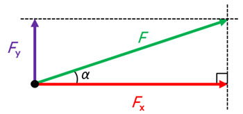

Voor een kracht onder een hoek $\alpha$ met de bewegingsrichting geldt:

$$W = Fs \cos(\alpha)$$

> Dit verklaart waarom alleen krachten in de bewegingsrichting arbeid verrichten: bij een hoek van $90^\circ$ is de arbeid 0, want $\cos(90^\circ) = 0$.

Je kunt de arbeid ook aflezen uit een F,s-diagram: de arbeid is de oppervlakte onder de grafiek.

Krachten verrichten **positieve arbeid** als (een component van) de kracht in de bewegingsrichting werkt. Dit zorgt voor een toename van de kinetische energie.  
Krachten verrichten **negatieve arbeid** als (een component van) de kracht tegen de bewegingsrichting in werkt. Dit zorgt voor een afname van de kinetische energie.

Wrijvingskrachten verrichten **wrijvingsarbeid**: ze zetten kinetische energie om in warmte. Om een beweging in stand te houden ondanks wrijving, is er dus voortdurend energie nodig.

Bij een eenparige beweging op een horizontale weg is de ingaande energie gelijk aan de wrijvingsarbeid:

$$\sum E_\text{in} = \sum E_\text{uit}$$

Hierin is $\sum E_\text{in}$ de energie die wordt toegevoerd (in $\mathrm{J}$) en $\sum E_\text{uit}$ de energie die verloren gaat door wrijving (in $\mathrm{J}$).

### Behoud van energie

Volgens de **wet van behoud van energie** kun je energie niet maken of vernietigen, alleen omzetten. De totale hoeveelheid energie blijft altijd gelijk:

$$\sum E_\text{begin} = \sum E_\text{eind}$$

Aan de hand hiervan kun je **energievergelijkingen** opstellen.

De verandering van de kinetische energie is gelijk aan de totale arbeid van alle krachten:

$$\sum W = \Delta E_\text{k}$$

Hierin is $\sum W$ de totale arbeid (in $\mathrm{J}$) en $\Delta E_\text{k}$ de verandering in kinetische energie (in $\mathrm{J}$).

#### Remmen en botsen

Bij remmen en botsen geldt dezelfde vergelijking. Als de eindsnelheid 0 is:

$$F_\text{rem} s = \frac{1}{2} m v_\text{begin}^2$$

Hieruit volgt dat de krachten bij botsingen kleiner zijn naarmate de botsafstand groter is. Daarom zijn veel veiligheidsmaatregelen bedoeld om de botsafstand te vergroten, zoals airbags, kreukelzones en de autogordel.

### Chemische energie

In brandstoffen is chemische energie opgeslagen. De **verbrandingswarmte** is de energie die per hoeveelheid brandstof vrijkomt bij verbranding.

$$E_\text{ch} = r_\text{v} V$$
$$E_\text{ch} = r_\text{m} m$$

Hierin is $E_\text{ch}$ de chemische energie (in $\mathrm{J}$), $r_\text{v}$ de verbrandingswarmte per volume (in $\mathrm{J}/\mathrm{m}^3$), $V$ het volume (in $\mathrm{m}^3$), $r_\text{m}$ de verbrandingswarmte per massa (in $\mathrm{J}/\mathrm{kg}$) en $m$ de massa (in $\mathrm{kg}$).

### Rendement

De **nuttige energie** is de energie die daadwerkelijk wordt gebruikt voor het gewenste doel. Het **rendement** geeft aan welk deel van de toegevoerde energie nuttig wordt omgezet.

$$\eta = \frac{E_\text{nut}}{E_\text{in}}$$

Hierin is $\eta$ het rendement (als factor of percentage), $E_\text{nut}$ de nuttige energie (in $\mathrm{J}$) en $E_\text{in}$ de totale toegevoerde energie (in $\mathrm{J}$).

De verbrandingsmotoren van benzineauto's hebben een rendement van ongeveer 30% tot 35%. Voor spieren is dat maximaal 25% en voor een elektromotor ongeveer 90% tot 95%.

### Vermogen en snelheid

**Vermogen** ($P$) is de arbeid die per seconde wordt verricht.

$$P = \frac{W}{t}$$

Hierin is $P$ het vermogen (in $\mathrm{W}$), $W$ de arbeid (in $\mathrm{J}$) en $t$ de tijd (in $\mathrm{s}$).

Bij een grotere snelheid zijn de weerstandskrachten groter en legt het voorwerp per seconde een grotere afstand af, waardoor het benodigde vermogen snel toeneemt. Door $W = Fs$ in te vullen:

$$P = \frac{Fs}{t} = Fv$$

Hierin is $F$ de kracht (in $\mathrm{N}$) en $v$ de snelheid (in $\mathrm{m}/\mathrm{s}$).

## Gravitatie en cirkelbewegingen

### Cirkelbanen

Bij een **eenparige cirkelbeweging** heeft de baansnelheid een constante grootte maar een steeds veranderende richting. Een veranderende richting is ook een snelheidsverandering, en daarvoor is een kracht nodig. Die kracht noem je de **middelpuntzoekende kracht**. Deze staat loodrecht op de baansnelheid en wijst altijd naar het middelpunt.

De middelpuntzoekende kracht is geen nieuwe kracht, maar een **rol** die een bestaande kracht vervult.

De benodigde middelpuntzoekende kracht hangt af van de massa, de baansnelheid en de straal:

$$F_\text{mpz} = \frac{mv^2}{r}$$

Hierin is $F_\text{mpz}$ de middelpuntzoekende kracht (in $\mathrm{N}$), $m$ de massa (in $\mathrm{kg}$), $v$ de snelheid (in $\mathrm{m}/\mathrm{s}$) en $r$ de straal van de cirkelbaan (in $\mathrm{m}$).

De **omlooptijd** is de tijd voor 1 ronde in de cirkelbaan:

$$T = \frac{2\pi r}{v}$$

Hierin is $T$ de omlooptijd (in $\mathrm{s}$), $r$ de straal (in $\mathrm{m}$) en $v$ de baansnelheid (in $\mathrm{m}/\mathrm{s}$). Dit volgt direct uit $t = s/v$ met $s = 2\pi r$ (omtrek van de cirkelbaan).

### Gravitatiekracht

De **gravitatiekracht** is een wisselwerking tussen 2 massa's. De kracht is voor beide massa's even groot, tegengesteld gericht, en werkt langs de verbindingslijn tussen de zwaartepunten.

<!-- > De gravitatiekracht op 2 massa's is even groot, ook al zijn hun massa's dat niet, zoals bij de maan en de aarde. Dit lijkt misschien vreemd, maar het is eigenlijk heel logisch. De aarde veroorzaakt een grote zwaartekrachtsversnelling, maar de maan heeft een kleine massa, dus is de kracht van de aarde op de maan: grote versnelling op kleine massa. De maan veroorzaakt juist een kleine zwaartekrachtsversnelling, maar de aarde heeft een grote massa, dus is de kracht van de maan op de aarde: kleine versnelling op grote massa. Grote versnelling op kleine massa geeft dezelfde kracht als kleine versnelling op grote massa, waardoor de gravitatiekrachten op beide voorwerpen even groot zijn. Credits naar Mika voor zijn uitleg want dit staat heel raar in het boek waardoor ik er niets van snapte -->

De gravitatiekracht hangt af van de massa van beide voorwerpen en de afstand tussen de massamiddelpunten:

$$F_\text{g} = G\frac{mM}{r^2}$$

Hierin is $F_\text{g}$ de gravitatiekracht (in $\mathrm{N}$), $G$ de **gravitatieconstante** ($6{,}674 \cdot 10^{-11}\,\mathrm{N}\,\mathrm{m}^2\,\mathrm{kg}^{-2}$), $m$ en $M$ de massa's van de 2 voorwerpen (in $\mathrm{kg}$) en $r$ de afstand tussen de zwaartepunten (in $\mathrm{m}$).

De zwaartekracht die je op aarde ervaart is de gravitatiekracht aan het aardoppervlak: $F_\text{z} = F_\text{g}$.

#### Baansnelheden van hemellichamen

Bij een cirkelbaan in het heelal geldt $F_\text{mpz} = F_\text{g}$ (de gravitatiekracht levert de middelpuntzoekende kracht). Hieruit volgt de baansnelheid:

$$\frac{mv^2}{r} = G\frac{mM}{r^2} \rightarrow v^2 = G\frac{M}{r} \rightarrow v = \sqrt{G\frac{M}{r}}$$

De baansnelheid is dus omgekeerd evenredig met de wortel van de baanstraal.

#### Satellieten

Veel satellieten staan vanaf de aarde gezien op een vaste plaats boven een punt op de aarde, anders zou je niet op een satelliet kunnen richten met een schotelantenne. De baan van deze satellieten is een **geostationaire baan**. Een geostationaire baan is alleen mogelijk boven en evenwijdig aan de evenaar. De hoogte en snelheid van zo'n satelliet zijn zo gekozen dat de omlooptijd precies gelijk is aan de rotatietijd van de aarde: 23 uur, 56 minuten en 4 seconden. <!-- Misschien denk je: huh, dat is toch 24 uur? Maar nee! De tijd dat de aarde precies 360 graden heeft gedraaid is 23 uur, 56 minuten en 4,0905 seconden (oftewel 23,9344696 uur), en dit noemen we de siderische dag. Maar de siderische dag is niet hetzelfde als een gewone dag van 24 uur. Want als de aarde 360 graden heeft gedraaid, staat de zon niet meer op dezelfde positie aan de hemel, omdat de aarde ook een stukje verder om de zon is gedraaid. De aarde moet dus net iets meer dan 360 graden draaien voordat de zon weer op zijn hoogste punt staat. Stel je voor dat de zon om 12 uur precies op zijn hoogste punt staat: als je dan 23 uur, 56 minuten en 4 seconden later kijkt, staat de zon net iets voorbij zijn hoogste punt. Als je trouwens elke siderische dag zou kijken waar de zon staat, en je begon op 1 januari, dan zou je halverwege het jaar precies om middernacht kijken (oke, niet precies want schrikkeljaren). Want de aarde heeft dan een half rondje om de zon gemaakt, en als jij altijd kijkt wanneer de aarde 360 graden heeft gedraaid, kijk je altijd in dezelfde richting ten opzichte van de sterren. Stel dat je altijd naar links kijkt: als de aarde op 1 januari links van de zon staat, kijk je na een half jaar, wanneer de aarde rechts van de zon staat, precies van de zon af! -->

### Gravitatie-energie

Bij kleine hoogteverschillen spreken we van **zwaarte-energie** ($E_\text{z} = mgh$). Bij grotere hoogteverschillen verandert de gravitatiekracht veel. Daarom spreken we dan van **gravitatie-energie** ($E_\text{g}$).

De arbeid om een voorwerp te verplaatsen van $r_1$ naar $r_2$ is gelijk aan de oppervlakte onder de $F_\text{g},r$-grafiek. De toename van de gravitatie-energie is even groot als de arbeid die verricht wordt tegen de gravitatiekracht.

Bij gravitatie-energie is het handig om het nulpunt 'in het oneindige' te leggen: een voorwerp op oneindige afstand heeft $E_\text{g} = 0$. Hierdoor heeft de gravitatie-energie altijd een negatieve waarde.

$$E_\text{g} = -G \frac{mM}{r}$$

Hierin is $E_\text{g}$ de gravitatie-energie (in $\mathrm{J}$), $G$ de gravitatieconstante, $m$ de massa van het voorwerp (in $\mathrm{kg}$), $M$ de massa van het hemellichaam (in $\mathrm{kg}$) en $r$ de onderlinge afstand (in $\mathrm{m}$).

#### Ontsnappingssnelheid

De **ontsnappingssnelheid** ($v_0$) is de minimale snelheid waarbij een omhooggeschoten voorwerp niet meer terugkomt. Bij de minimale ontsnappingssnelheid heeft het voorwerp in het oneindige geen kinetische energie meer en is de gravitatie-energie ook 0. Met de energievergelijking $E_{\text{k},A} + E_{\text{g},A} = E_{\text{k},B} + E_{\text{g},B}$, waarbij punt $A$ het aardoppervlak is en punt $B$ het oneindige:

$$\frac{1}{2}mv^2 - G\frac{mM}{R} = 0 \rightarrow v_0 = \sqrt{\frac{2GM}{R}}$$

Hierin is $v_0$ de ontsnappingssnelheid (in $\mathrm{m}/\mathrm{s}$), $M$ de massa van het hemellichaam (in $\mathrm{kg}$) en $R$ de straal van het hemellichaam (in $\mathrm{m}$). De ontsnappingssnelheid hangt niet af van de massa van het gelanceerde voorwerp.

> Een zwaarder voorwerp heeft wel meer energie nodig om te ontsnappen, maar het heeft bij dezelfde snelheid ook meer kinetische energie. Die twee houden elkaar precies in balans. Dit is hetzelfde als waarom alle voorwerpen even snel vallen: een zwaarder voorwerp wordt harder aangetrokken, maar heeft ook meer traagheid, zodat de versnelling gelijk blijft.

## Elektriciteit

### Lading en stroom

Elektriciteit is **bewegende lading**. Verschillende ladingen trekken elkaar aan, dezelfde ladingen stoten elkaar af. De kleinste lading is de **elementaire lading** $e$ ($1{,}6 \cdot 10^{-19}\,\mathrm{C}$). Stroom kan alleen bewegen als de stroomkring gesloten is. **Geleiders** zijn materialen die stroom doorlaten. **Isolatoren** laten geen stroom door.

In een metalen geleider zorgen **vrije elektronen** voor de stroom. In vloeistoffen kunnen ook **ionen** de stroom geleiden.

De **spanning** ($U$) is de elektrische energie per coulomb lading ($1\,\mathrm{V} = 1\,\mathrm{J}/\mathrm{C}$) en de **stroomsterkte** ($I$) is de hoeveelheid lading die per seconde langs een punt gaat ($1\,\mathrm{A} = 1\,\mathrm{C}/\mathrm{s}$). De stroom beweegt van plus naar min. De stroomsterkte meet je met een **stroommeter** (in serie) en de spanning met een **spanningsmeter** (parallel). Om schakelingen overzichtelijk te tekenen maak je gebruik van een **schakelschema**.

### Weerstand

De **weerstand** bepaalt hoeveel stroom er loopt bij een bepaalde spanning. Voor de weerstand geldt de **wet van Ohm**:

$$R = \frac{U}{I}$$

Hierin is $R$ de weerstand (in $\mathrm{\Omega}$), $U$ de spanning (in $\mathrm{V}$) en $I$ de stroomsterkte (in $\mathrm{A}$).

De **soortelijke weerstand** laat zien hoe goed of slecht een materiaal geleidt. Hoe langer en dunner de draad, hoe hoger de weerstand. De weerstand hangt vaak af van de temperatuur. Apparaten of draden waarbij de weerstand constant is, noem je **ohmse weerstanden**. Veel draden en apparaten hebben geen constante weerstand, omdat bij hogere spanningen de draden warm worden en dus een andere weerstand krijgen.

Een **schuifweerstand** is een speciale weerstand waarvan je de waarde makkelijk kan aanpassen. Een schuifweerstand kun je ook gebruiken om in een combinatieschakeling de spanning aan te passen. Een deel van de spanning wordt dan verdeeld over het lampje en het eerste deel van de schuifweerstand, en het andere deel gaat door het rechterdeel. Door de grootte van het rechterdeel aan te passen, verandert de spanning over het lampje.

De weerstand van **halfgeleiders** kan worden aangepast door atomen toe te voegen. Een voorbeeld is de **diode**: een halfgeleider die stroom in een richting doorlaat. In de doorlaatrichting neemt het aantal vrije elektronen toe, in de sperrichting is het aantal vrije elektronen klein en loopt er geen stroom.

Er zijn ook speciale halfgeleidende weerstanden waarvan de weerstand afhankelijk is van omgevingsfactoren:

| Component | Effect                                |
| :-------- | :------------------------------------ |
| **LDR**   | Meer licht → lagere weerstand         |
| **NTC**   | Hogere temperatuur → lagere weerstand |
| **PTC**   | Hogere temperatuur → hogere weerstand |

### Vermogen en rendement

Het **vermogen** is de hoeveelheid elektrische energie die per seconde wordt verbruikt.

$$P = UI$$

Hierin is $P$ het vermogen (in $\mathrm{W}$), $U$ de spanning (in $\mathrm{V}$) en $I$ de stroomsterkte (in $\mathrm{A}$).

$$W = Pt$$

Hierin is $W$ de energie (in $\mathrm{J}$), $P$ het vermogen (in $\mathrm{W}$) en $t$ de tijd (in $\mathrm{s}$). Energie kun je ook meten in $\mathrm{kWh}$ ($1\,\mathrm{kWh} = 3{,}6\,\mathrm{MJ}$).

Het **rendement** van een apparaat is de factor van de ingaande energie die wordt omgezet in nuttige energie.

$$\eta = \frac{W_\text{nut}}{W_\text{in}}$$

Hierin is $\eta$ het rendement (als factor, of als percentage doe je $\times 100\%$), $W_\text{nut}$ de nuttige energie (in $\mathrm{J}$) en $W_\text{in}$ de ingaande energie (in $\mathrm{J}$).

### Schakelingen in huis

In een huis zijn alle apparaten parallel aan elkaar geschakeld, zodat elk apparaat 230 V ontvangt. In een parallelschakeling wordt de stroomsterkte verdeeld tussen alle vertakkingen (**stroomdeling**). Elk apparaat heeft dus zijn eigen stroomkring. In een serieschakeling wordt de spanning juist over elk apparaat verdeeld (**spanningsdeling**). De stroomsterkte is dan overal hetzelfde.

|                   | Serieschakeling                     | Parallelschakeling                                                |
| :---------------- | :---------------------------------- | :---------------------------------------------------------------- |
| **Spanning**      | $U_\text{tot} = U_1 + U_2 + \ldots$ | $U_\text{tot} = U_1 = U_2 = \ldots$                               |
| **Stroomsterkte** | $I_\text{tot} = I_1 = I_2 = \ldots$ | $I_\text{tot} = I_1 + I_2 + \ldots$                               |
| **Weerstand**     | $R_\text{tot} = R_1 + R_2 + \ldots$ | $\frac{1}{R_\text{tot}} = \frac{1}{R_1} + \frac{1}{R_2} + \ldots$ |

In **combinatieschakelingen** gelden 2 wetten: de **wet van behoud van lading** (bij een splitsing blijft de totale stroom even groot) en de **wet van behoud van energie** (de energie van de bron is gelijk aan de totale energie die langs de schakeling wordt afgegeven). De formules pas je toe op de afzonderlijke delen.

Als er te veel apparaten op een **groep** worden aangesloten, kan de stroomsterkte boven 16 A uitkomen: **overbelasting**. Bij **kortsluiting** raken 2 elektriciteitsdraden, waardoor de stroom een "shortcut" neemt. De weerstand wordt dan heel klein en de stroomsterkte enorm groot. De **zekeringen** in de meterkast beveiligen elke groep door de stroom uit te zetten als de stroomsterkte te groot wordt.

Een **aardlekschakelaar** vergelijkt constant de ingaande en uitgaande stroomsterkte. Als het verschil groter is dan 30 mA, zet hij de stroom voor **het hele huis** uit. Zo beschermt hij je tegen stroom door je lichaam.

## Elektromagnetisme

### Magneten

Elke magneet heeft een noordpool en een zuidpool. Gelijke polen stoten elkaar af, ongelijke trekken elkaar aan. Dit is de **magnetische krachtwerking**. Elk voorwerp heeft heel veel kleine magneetgebiedjes, maar die staan vaak in een willekeurige volgorde, waardoor ze elkaar opheffen. Binnen sommige materialen staan deze gebiedjes wel dezelfde kant op, waardoor het materiaal **permanent** magnetisch is.

Als je een magneet bij een niet-magnetisch metaal houdt, gaan de magneetgebiedjes in het metaal met de magneet meewijzen, waardoor het metaal ook **tijdelijk** magnetisch wordt.

Een noordpool van een kompasnaald wijst altijd naar de zuidpool van een andere magneet. De **magnetische veldlijnen** geven voor elke plek aan naar welke richting het kompas zou wijzen. Deze veldlijnen zijn altijd gesloten (ze lopen buiten de magneet van noord naar zuid en binnen de magneet van zuid naar noord) en ze snijden elkaar nooit.

### Magnetische velden

Een **magnetisch veld** is een ruimte waarin magnetische veldlijnen lopen. In elk punt is de **richting van het magnetisch veld** de richting waarin de noordpool van een kompasnaald wijst (dus altijd naar de zuidpool van de magneet).

> Nu denk je misschien 'een kompas wijst toch naar het noorden, niet naar het zuiden?', en dat klopt, maar bij de **geografische noordpool** van de aarde (dus wat we allemaal 'de noordpool' noemen) ligt de **magnetische zuidpool** van de magneet in de aarde, maar we noemen het alsnog het noorden.

De **magnetische veldsterkte** ($B$) meet je in Tesla ($\mathrm{T}$). Hoe dichter de veldlijnen bij elkaar liggen, hoe sterker het magneetveld.

Binnen een **inhomogeen magneetveld** zijn de veldlijnen niet overal evenwijdig, waardoor er een nettokracht wordt uitgeoefend op een kompasnaaldje. In een **homogeen** magneetveld zijn de veldlijnen overal evenwijdig, waardoor er geen nettokracht wordt uitgeoefend (er vindt alleen draaiing plaats).

### Stroom(spoelen)

**Elektromagneten** zijn magneten die ontstaan door het lopen van stroom in een **spoel**. Deze magneten kun je dus aan en uit zetten.

De richting van het magnetisch veld bepaal je met de **rechterhandregel bij een spoel**: de gekromde vingers van je rechterhand geven de draairichting van de stroom aan, en je uitgestoken duim geeft de richting van de veldlijnen aan (binnen de spoel). De noordpool van de spoel is de plek waar de veldlijnen uit de spoel komen.

Rondom een losse rechte draad is ook een magneetveld. Dit magneetveld heeft geen begin of einde, en een rechte stroomdraad heeft dan ook geen magnetische polen. De richting bepaal je met de **rechterhandregel bij een stroomdraad**: je uitgestoken duim wijst in de richting van de stroom, en de gekromde vingers geven de draairichting van het magneetveld aan.

### Lorentzkracht

De **lorentzkracht** is een elektromagnetische kracht: de wisselwerking tussen elektrische stroom en een magneetveld.

$$F_\text{L} = BIl$$

Hierin is $F_\text{L}$ de lorentzkracht (in $\mathrm{N}$), $B$ de magnetische veldsterkte (in $\mathrm{T}$), $I$ de stroomsterkte (in $\mathrm{A}$) en $l$ de lengte van de stroomdraad in het magneetveld (in $\mathrm{m}$).

De richting van de lorentzkracht bepaal je met de **rechterhandregel voor de lorentzkracht**: de duim wijst in de richting van de stroom, de gestrekte vingers wijzen in de richting van het magneetveld, en de lorentzkracht wijst in de richting van de palm.

Een elektromotor maakt ook gebruik van de lorentzkracht. In een elektromotor zit een rotor met 1 of meer spoelen die kunnen draaien in een magneetveld. Door de lorentzkracht gaat de rotor draaien. Na een halve draaing moet de stroomrichting worden omgewisseld, anders zou de lorentzkracht de draaiing juist tegenwerken. Dit wordt gedaan met een sleepcontact.

### Inductie

De beweging van een staafmagneet wekt een **inductiespanning** op in een spoel. Door de magneet heen en weer te bewegen, ontstaat er wisselspanning.

De **magnetische flux** is het denkbeeldige aantal magnetische veldlijnen door een bepaald oppervlak. Hierbij telt alleen de component van het magneetveld die loodrecht op het oppervlak staat ($B_\perp$).

$$\Phi = B_\perp A$$

Hierin is $\Phi$ de magnetische flux (in $\mathrm{Wb}$), $B_\perp$ de loodrechte component van de magnetische veldsterkte (in $\mathrm{T}$) en $A$ het oppervlak (in $\mathrm{m}^2$).

Een verandering van de magnetische flux door de windingen van een spoel induceert een spanning. Hoe sneller de flux verandert en hoe meer windingen de spoel heeft, hoe groter de inductiespanning.

$$U_\text{ind} \propto N \frac{\mathrm{d}\Phi}{\mathrm{d}t}$$

Hierin is $U_\text{ind}$ de inductiespanning (in $\mathrm{V}$), $N$ het aantal windingen, $\Phi$ de magnetische flux (in $\mathrm{Wb}$) en $t$ de tijd (in $\mathrm{s}$).

Bij een toenemende flux door een gesloten kring is de inductiestroom de ene kant op. Bij afname van de flux is de inductiestroom omgekeerd.

## Golven

### Golven

Golven hebben een aantal eigenschappen:

- **Frequentie ($f$)**: het aantal trillingen per seconde.
- **Periode / trillingstijd ($T$)**: de tijd waarin precies 1 trilling plaatsvindt.
- **Amplitude ($A$)**: de maximale uitwijking van een golf.
- **Golflengte ($\lambda$)**: de afstand die een golf in 1 periode aflegt.
- **Golfsnelheid ($v_\text{golf}$)**: de snelheid waarmee de golf zich voortplant.

De golflengte hangt af van de frequentie en de golfsnelheid:

$$\lambda = \frac{v}{f}$$

Hierin is $\lambda$ de golflengte (in $\mathrm{m}$), $v$ de golfsnelheid (in $\mathrm{m}/\mathrm{s}$) en $f$ de frequentie (in $\mathrm{Hz}$).

De frequentie hangt samen met de periode:

$$f = \frac{1}{T}$$

Hierin is $f$ de frequentie (in $\mathrm{Hz}$) en $T$ de trillingstijd (in $\mathrm{s}$).

### Lopende golven

Een **lopende golf** beweegt zich door een tussenstof. De toppen en dalen van zo'n golf verplaatsen zich dus in de tussenstof.

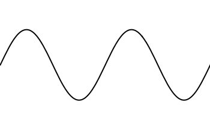

Er zijn 2 soorten lopende golven:

- **Transversale golven** bewegen op en neer. De trillingsrichting is dan loodrecht op de voortplantingsrichting, zoals golven in water.
- **Longitudinale golven** zijn drukgolven: ze bewegen heen en weer door uit te rekken en samen te trekken. De trillingsrichting is dan hetzelfde als de voortplantingsrichting, zoals geluidsgolven (zie animatie).

In lucht zijn alleen longitudinale golven mogelijk, omdat de deeltjes niet aan elkaar vast zitten.

### Trillingen weergeven

Een trilling kun je weergeven in een **oscillogram** (een u,t-diagram). In dit diagram zie je voor **1 bepaald punt** hoe de **uitwijking** verandert in de tijd. Je kunt hieruit de periode van de trilling aflezen.

Een **zuivere toon** bestaat uit 1 losse trilling (met ook 1 frequentie). Het u,t-diagram van een zuivere toon ziet eruit als een sinuslijn.

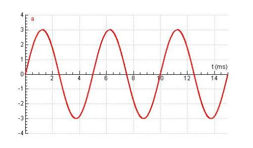

De formule die hoort bij het u,t-diagram van een zuivere toon is:

$$u(t)=A \sin\!\left(\frac{2 \pi}{T} t\right)$$

Hierin is $u$ de uitwijking (in $\mathrm{m}$), $A$ de amplitude (in $\mathrm{m}$), $T$ de trillingstijd (in $\mathrm{s}$) en $t$ de tijd (in $\mathrm{s}$).

De maximale snelheid van een trillend punt treedt op bij de evenwichtsstand, waar de helling van het u,t-diagram het grootst is:

$$v_\text{max} = \frac{2 \pi A}{T}$$

Hierin is $v_\text{max}$ de maximale snelheid (in $\mathrm{m}/\mathrm{s}$), $A$ de amplitude (in $\mathrm{m}$) en $T$ de trillingstijd (in $\mathrm{s}$).

Een **samengestelde toon** is een samenstelling van meerdere trillingen met verschillende frequenties. De toonhoogte wordt bepaald door de frequentie van de laagste toon (de **grondtoon**). Het u,t-diagram heeft nog wel een herhalend patroon, maar het is geen sinuslijn.

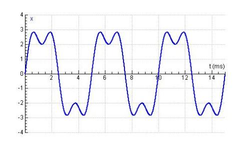

### u,x-diagrammen

Naast u,t-diagrammen kun je ook u,x-diagrammen maken. Bij een u,t-diagram zie je van **1 punt** de uitwijking door de tijd heen. Bij een u,x-diagram zie je de uitwijking van alle punten op 1 tijdstip. **Een u,x-diagram is dus een 'foto' van de golf.**

In een u,t-diagram kun je op de x-as de periode bepalen. In een u,x-diagram kun je op de x-as de golflengte bepalen.

### Massa-veersysteem

Een **massa-veersysteem** (een massa aan een veer) voert een **harmonische trilling** uit als je de massa uitwijkt en loslaat. Deze trilling noem je de **eigentrilling** (de trilling die ontstaat zonder externe krachten). De frequentie wordt bepaald door de massa en de veerconstante.

De trillingstijd van een massa-veersysteem is:

$$T = 2\pi \sqrt{\frac{m}{C}}$$

Hierin is $T$ de trillingstijd (in $\mathrm{s}$), $m$ de massa (in $\mathrm{kg}$) en $C$ de veerconstante (in $\mathrm{N}/\mathrm{m}$).

De veerkracht op een uitgeweken massa is:

$$\vec{F}_\text{v} = -C\vec{u}$$

Hierin is $\vec{F}_\text{v}$ de veerkracht (in $\mathrm{N}$), $C$ de veerconstante (in $\mathrm{N}/\mathrm{m}$) en $\vec{u}$ de uitwijking van de veer (in $\mathrm{m}$).

**Snaren** kunnen trillen op hun eigenfrequentie. Deze hangt af van de massa van de snaar en de spanning erop. Je kunt de massa van het trillende deel aanpassen door de snaar korter of langer te maken (denk aan hoe je je vinger op verschillende plekken op een gitaarsnaar zet). Een snaar gedraagt zich vergelijkbaar met een massa-veersysteem.

### Geluid

**Geluidsgolven** ontstaan door een trillend onderdeel in een geluidsbron. Geluid is een longitudinale golf.  
De snelheid van geluid verschilt per stof. Hoe sterker de binding tussen moleculen, hoe sneller het geluid. In lucht is de geluidssnelheid ongeveer $343\,\mathrm{m}/\mathrm{s}$ (bij kamertemperatuur).

Geluid heeft 2 belangrijke eigenschappen: de **frequentie** (bepaalt de toonhoogte) en de **amplitude** (maximale uitwijking, bepaalt de geluidssterkte).

Een **klankkast** versterkt geluid door mee te trillen met de bron (bijvoorbeeld een stemvork). De lucht in de klankkast gaat dan mee trillen, waardoor het geluid harder wordt.

**Resonantie** is het mee trillen van een object met een trillende bron. Dit gebeurt alleen als het object en de bron dezelfde **eigenfrequentie** hebben (zie Massa-veersysteem).

### Dopplereffect

Het **dopplereffect** treedt op als de geluidsbron en de waarnemer naar elkaar toe of van elkaar af bewegen. Als de bron naar de waarnemer toe beweegt, hoort de waarnemer een hogere frequentie, omdat de geluidsgolven worden "samengedrukt". Als de bron van de waarnemer weg beweegt, worden de geluidsgolven "uitgerekt", waardoor de frequentie lager klinkt.

### Fase

Als je 2 stemvorken met net een iets andere frequentie beide aanslaat, hoor je steeds dezelfde toonhoogte, maar de geluidssterkte varieert. Dit afwisselend luider en zachter worden noem je **zweven**.

Om zweven uit te leggen moet je kijken naar **fase**. De fase ($\varphi$) is het aantal trillingen dat een punt heeft gemaakt. De gereduceerde fase $\varphi_\text{red}$ is het deel van de trilling binnen de huidige periode (een getal tussen 0 en 1).

Door de verschillende frequenties komen de golven soms **in fase** aan en soms **uit fase**. Als de golven in fase ($\Delta \varphi_\text{red} = 0$) aankomen, versterken ze elkaar. Als ze uit fase ($\Delta \varphi_\text{red} = \frac{1}{2}$) aankomen, heffen ze elkaar op. Doordat de frequenties niet gelijk zijn, wisselen die momenten steeds af.

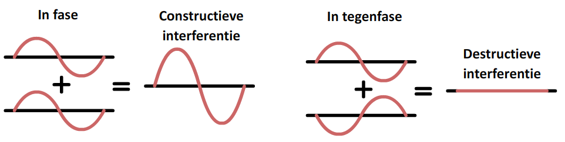

Het faseverschil tussen 2 tijdstippen voor 1 punt:

$$\Delta \varphi = \frac{\Delta t}{T}$$

Hierin is $\Delta \varphi$ het faseverschil, $\Delta t$ het tijdsverschil (in $\mathrm{s}$) en $T$ de trillingstijd (in $\mathrm{s}$).

Het faseverschil tussen 2 punten bij een lopende golf is constant:

$$\Delta \varphi = \frac{\Delta x}{\lambda}$$

Hierin is $\Delta \varphi$ het faseverschil, $\Delta x$ het afstandsverschil (in $\mathrm{m}$) en $\lambda$ de golflengte (in $\mathrm{m}$).

### Interferentie

Volgens het **superpositiebeginsel** mag je 2 golven die elkaar kruisen op dat punt optellen.

Als je 2 **coherente** puntbronnen naast elkaar zet, kunnen de golven met elkaar interfereren. Coherente bronnen hebben dezelfde frequentie en een constant faseverschil. Op elk punt in de ruimte tellen de uitwijkingen van beide golven zich op.

Op sommige plekken komen 2 toppen of 2 dalen tegelijk aan: de golven versterken elkaar maximaal. Op andere plekken komt een top van de ene bron tegelijk aan met een dal van de andere: de golven doven elkaar (gedeeltelijk) uit.

Door dit verschijnsel ontstaat een **interferentiepatroon** met **buiklijnen** (versterking, $\Delta \varphi = 0$) en **knooplijnen** (uitdoving, $\Delta \varphi = \frac{1}{2}$).

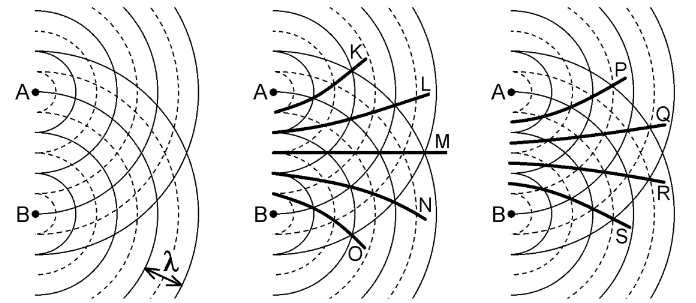

Om te bepalen of een punt op een buiklijn of knooplijn ligt, kijk je naar het **weglengteverschil**: het verschil in afstand van beide bronnen tot het punt.

Voor een **buiklijn** (golven komen in fase aan):

$$\Delta x = n\lambda$$

Hierin is $\Delta x$ het weglengteverschil (in $\mathrm{m}$), $n$ een geheel getal en $\lambda$ de golflengte (in $\mathrm{m}$).

Voor een **knooplijn** (golven komen in tegenfase aan):

$$\Delta x = n\lambda + \frac{1}{2}\lambda$$

Hierin is $\Delta x$ het weglengteverschil (in $\mathrm{m}$), $n$ een geheel getal en $\lambda$ de golflengte (in $\mathrm{m}$).

Als je de bronnen dichter bij elkaar brengt, divergeren de buik- en knooplijnen (gaan verder uit elkaar). Als je ze uit elkaar beweegt, convergeren ze (gaan dichter bij elkaar).

Op knooplijnen is de amplitude niet altijd helemaal nul. Dat kan alleen als de amplitude van beide golven op dat punt precies even groot is, wat alleen geldt als de golven dezelfde afstand hebben afgelegd.

### Staande golven

Een **staande golf** ontstaat door interferentie van 2 lopende golven met dezelfde frequentie, golflengte en amplitude die in tegengestelde richting bewegen.

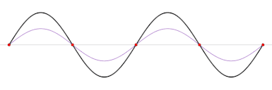

Op sommige punten versterken de golven elkaar maximaal: dit zijn de **buiken**. Op andere punten doven de golven elkaar volledig uit: dit zijn de **knopen**. Een staande golf staat dus stil.

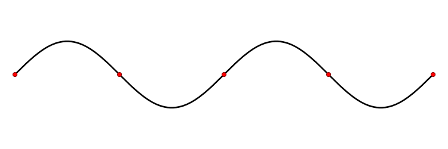

### Staande golven in buizen

Blaasinstrumenten werken met staande golven in een buis. In de buis zit een **luchtkolom** die gaat trillen door een geluidsbron (bijvoorbeeld je adem bij een fluit). De luchtkolom resoneert alleen bij frequenties die passen bij de lengte van de buis.

#### Open buis

Bij een **open buis** (beide uiteinden open) ontstaan aan de uiteinden altijd buiken, omdat de lucht daar vrij kan bewegen. De eenvoudigste staande golf is de **grondtoon**: dan ontstaat in het midden een knoop en past er precies een halve golf in de buis.

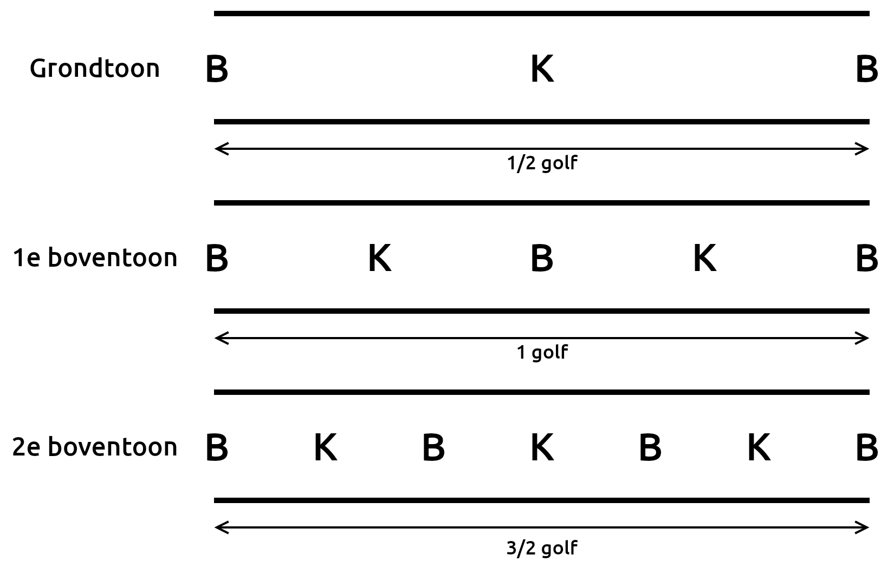

Naast de grondtoon kunnen er ook **boventonen** ontstaan. Bij de eerste boventoon past er precies 1 golf in de buis (met 2 knopen). Bij elke boventoon komt er een knoop en een buik bij.

Voor een open buis geldt:

$$l = n \frac{1}{2}\lambda$$

Hierin is $l$ de lengte van de buis (in $\mathrm{m}$), $n$ een geheel getal ($n=1$ voor de grondtoon, $n=2$ voor de eerste boventoon, etc.) en $\lambda$ de golflengte (in $\mathrm{m}$).

Bij elke boventoon past er een halve golflengte meer in de buis, waardoor de golflengte steeds korter wordt en de frequentie hoger. De frequenties hebben de verhoudingen:

$$f_0 : f_1 : f_2 : f_3 = 1 : 2 : 3 : 4$$

> **Snaren** gedragen zich hetzelfde als open buizen, maar dan met knopen in plaats van buiken aan de uiteinden (omdat de snaar daar is vastgemaakt). Bij de grondtoon ontstaat in het midden een buik.

#### Eenzijdig gesloten buis

Bij een **eenzijdig gesloten buis** ontstaat bij de gesloten kant altijd een knoop (de lucht kan daar niet bewegen) en bij de open kant altijd een buik. Bij de grondtoon past er dan een kwart golflengte in de buis.

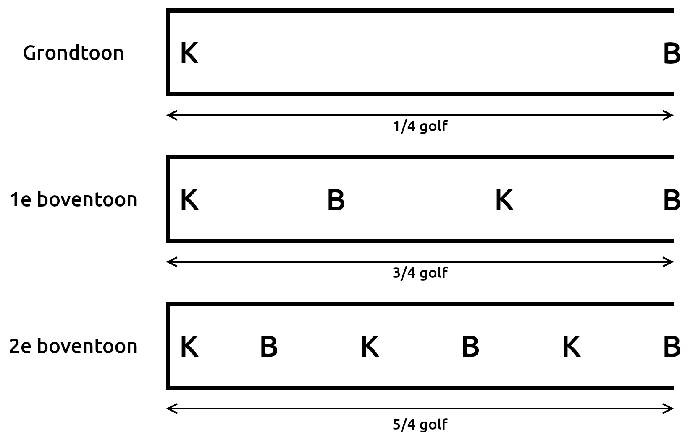

Voor een eenzijdig gesloten buis geldt:

$$l = (2n - 1) \frac{1}{4}\lambda$$

Hierin is $l$ de lengte van de buis (in $\mathrm{m}$), $n$ een geheel getal ($n=1$ voor de grondtoon, $n=2$ voor de eerste boventoon, etc.) en $\lambda$ de golflengte (in $\mathrm{m}$).

Bij een gesloten buis zijn alleen oneven veelvouden mogelijk (de knoop aan de gesloten kant en de buik aan de open kant staan dat toe). Bij de grondtoon past er $\frac{1}{4}\lambda$ in de buis, bij de eerste boventoon $\frac{3}{4}\lambda$, bij de tweede $\frac{5}{4}\lambda$, enzovoort. De frequenties hebben de verhoudingen:

$$f_0 : f_1 : f_2 : f_3 = 1 : 3 : 5 : 7$$

### Buiging

Wanneer een golf door een opening in een scherm gaat, kan deze **buigen** (uitwaaieren). **Sterke buiging treedt op wanneer de opening ongeveer even groot is als (of kleiner dan) de golflengte**. Bij een veel grotere opening buigt de golf nauwelijks.

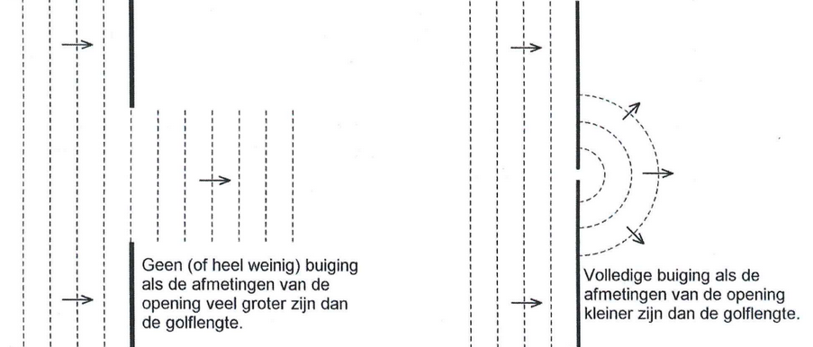

Een golfbundel waaiert tijdens het voortplanten steeds verder uit. Een grotere golflengte ten opzichte van de bundelbreedte zorgt voor sneller uitwaaieren.

#### Reflectie en obstakels

Als een golf tegen een obstakel aankomt in plaats van door een opening te gaan, krijg je **reflectie** (weerkaatsing). Het gedrag is vergelijkbaar met buiging, maar dan omgekeerd.

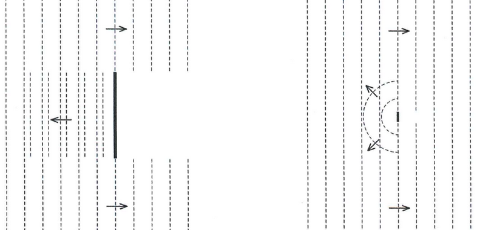

Als het obstakel groot is ten opzichte van de golflengte, ontstaat er achter het obstakel een "schaduw": de golven buigen niet om het obstakel heen. Als het obstakel klein is, buigen de golven er wel omheen en is de gereflecteerde golf bolvormig, alsof het obstakel een puntbron is geworden.

**Hoe groter de golflengte en hoe kleiner het obstakel, hoe meer buiging.**

## Straling

### Röntgenstraling

**Röntgenstraling** is een vorm van elektromagnetische straling. Net als zichtbaar licht bestaat het uit **fotonen** (energiepakketjes). Door de hoge frequentie heeft röntgenstraling relatief veel energie en kan het dwars door je lichaam heen gaan.

De fotonenergie is evenredig met de frequentie:

$$E_\text{f} = hf$$

Hierin is $E_\text{f}$ de fotonenergie (in $\mathrm{J}$), $h$ de constante van Planck ($6{,}626 \cdot 10^{-34}\,\mathrm{J}\,\mathrm{s}$) en $f$ de frequentie (in $\mathrm{Hz}$).  
Soms wordt **elektronvolt** ($\mathrm{eV}$) gebruikt als eenheid voor energie: $1\,\mathrm{eV} = 1{,}6 \cdot 10^{-19}\,\mathrm{J}$.

Het **ioniserend vermogen** is het vermogen om elektronen uit atomen los te maken.  
Het **doordringend vermogen** is het gemak waarmee straling door huid en weefsel dringt.

Op röntgenfoto's zie je donkere en lichte gebieden. Donkere gebieden ontstaan door **transmissie** (veel straling doorgelaten), lichte gebieden door **absorptie** (veel straling geabsorbeerd). Bij absorptie van fotonen wordt de energie gebruikt om atomen te ioniseren. Hoeveel straling wordt geabsorbeerd, hangt af van het materiaal en de dikte.

#### Halveringsdikte

De **intensiteit** is de hoeveelheid energie die per seconde door 1 vierkante meter gaat.

De **halveringsdikte** ($d_{1/2}$) is de materiaaldikte die **de helft van de straling doorlaat**. Deze hangt af van de stof en van de stralingsenergie.

Een laag met dikte $d_{1/2}$ laat 50% door. Een laag van 2 keer $d_{1/2}$ laat 25% door, bij 3 keer $d_{1/2}$ nog 12,5%, enzovoort. De doorgelaten intensiteit na $n$ halveringsdiktes is:

$$I = I_0 \left(\frac{1}{2}\right)^n$$

Hierin is $I$ de doorgelaten intensiteit, $I_0$ de invallende intensiteit en $n$ het aantal halveringsdiktes. De intensiteit staat vaak in $\mathrm{W}/\mathrm{m}^2$, maar soms in procenten.

$n$ is het aantal keren dat de dikte $d$ in $d_{1/2}$ past:

$$n = \frac{d}{d_{1/2}}$$

Invullen geeft:

$$I = I_0 \left(\frac{1}{2}\right)^{d/d_{1/2}}$$

### Kernstraling

Sommige stoffen zijn **radioactief**. Er zijn verschillende soorten **kernstraling** (straling afkomstig uit atoomkernen van radioactieve stoffen): $\alpha$-straling, $\beta$-straling en $\gamma$-straling.

|                       | $\alpha$-straling                          | $\beta$-straling                                          | $\gamma$-straling                          |
| --------------------- | ------------------------------------------ | --------------------------------------------------------- | ------------------------------------------ |
| Bestaat uit...        | 2 protonen en 2 neutronen (heliumkern)     | Elektronen of positronen                                  | Fotonen                                    |
| Doordringend vermogen | Klein (wordt al tegengehouden door papier) | Matig (wordt al tegengehouden door een dun laagje metaal) | Groot (kan zelfs door een dikke loodplaat) |
| Ioniserend vermogen   | Groot                                      | Matig                                                     | Klein                                      |

### Isotopen

De atomen van radioactieve stoffen hebben **instabiele** atoomkernen.  
Het **atoomnummer** ($Z$) is het aantal protonen in de kern en geeft dus ook de lading van de kern aan. Het **massagetal** ($A$) is het totaal aantal kerndeeltjes.

Bij radioactief verval gelden 2 **behoudswetten**: behoud van massa (massagetal) en behoud van elektrische lading (atoomnummer).

Je noteert een kern als $\ce{^{A}_{Z}X}$, bijvoorbeeld: $\ce{^{131}_{53}I}$.

Atomen van hetzelfde element met een verschillend aantal neutronen heten **isotopen**.

### Verval en activiteit

Bij het **vervallen** van een (instabiele) kern wordt er een $\alpha$-deeltje, een $\beta$-deeltje of een $\gamma$-foton uitgezonden (**emissie**).  
De **activiteit** van een radioactieve bron is het aantal kernen dat per seconde vervalt (eenheid: **becquerel** = vervallen kernen per seconde). De activiteit daalt na verloop van tijd omdat er steeds minder instabiele kernen zijn.

Dit verval is een toevalsproces. In werkelijkheid schommelt de activiteit een beetje.

De tijdsduur waarin de activiteit halveert, noem je de **halveringstijd** ($t_{1/2}$). De halveringstijd is een eigenschap van een isotoop.  
Aan de hand van de halveringstijd kun je de activiteit na $n$ halveringstijden berekenen:

$$A=A_0 \left(\frac{1}{2}\right)^n$$

Hierin is $A$ de activiteit (in $\mathrm{Bq}$), $A_0$ de beginactiviteit (in $\mathrm{Bq}$) en $n$ het aantal halveringstijden.

$n$ is hoe vaak de tijd in de halveringstijd past:

$$n=\frac{t}{t_{1/2}}$$

Hierin is $t$ het tijdstip en $t_{1/2}$ de halveringstijd (in dezelfde eenheid). Invullen geeft:

$$A = A_0 \left(\frac{1}{2}\right)^{t/t_{1/2}}$$

### Vervalvergelijkingen

In een **vervalvergelijking** staat de verandering die plaatsvindt bij radioactief verval.

- **Alfaverval**: de kern zendt een $\ce{^{4}_{2}He}$-deeltje uit:  
  $\ce{^{238}_{92}U -> ^{234}_{90}Th + ^{4}_{2}He}$

- **Bètaverval**:

  - Bij $\beta ^+$-verval ontstaat uit een proton een neutron en een **positron**.  
    $\ce{^{1}_{1}p -> ^{1}_{0}n + ^{0}_{1}e}$  
    $\beta ^+$-verval komt voor bij kernen met te weinig neutronen en een overschot aan protonen.

    $\ce{^{11}_{6}C -> ^{11}_{5}B + ^{0}_{1}e}$

    > Een positron is het **antideeltje** van het elektron: het heeft dezelfde massa en lading, maar die lading is positief. Positronen bestaan vaak maar heel kort. Als het uitgestoten positron op een elektron botst, vindt er **annihilatie** plaats: er ontstaan 2 fotonen in tegengestelde richting. Ook kunnen antideeltjes ontstaan uit materie en antimaterie (**paarvorming**).

  - Bij $\beta ^-$-verval ontstaat uit een neutron een proton en een elektron.  
    $\ce{^{1}_{0}n -> ^{1}_{1}p + ^{0}_{-1}e}$  
    $\beta ^-$-verval komt voor bij kernen met te weinig protonen en een overschot aan neutronen.

    $\ce{^{14}_{6}C -> ^{14}_{7}N + ^{0}_{-1}e}$

- **Gammastraling**: hierbij wordt een foton uitgezonden. De samenstelling van de kern verandert niet.

Ook **kernreacties** kun je beschrijven met een vergelijking.

- Bij **protonenstraling** ontstaan protonen, bijvoorbeeld bij het botsen van stikstof-14 en een $\alpha$-deeltje:  
  $\ce{^{14}_{7}N + ^{4}_{2}He -> ^{17}_{8}O + ^{1}_{1}p}$
- Bij **neutronenstraling** ontstaan juist neutronen:  
  $\ce{^{9}_{4}Be + ^{4}_{2}He -> ^{12}_{6}C + ^{1}_{0}n}$

### Aantal instabiele kernen

Het aantal instabiele kernen neemt op dezelfde manier af als de activiteit:

$$N = N_0 \left(\frac{1}{2}\right)^{t/t_{1/2}}$$

Hierin is $N$ het aantal kernen, $N_0$ het aantal kernen op $t=0$, $t$ het tijdstip en $t_{1/2}$ de halveringstijd (beide in dezelfde eenheid).

De activiteit is gelijk aan de helling van de raaklijn van een N,t-diagram (de afname per seconde):

$$A = -\left(\frac{\Delta N}{\Delta t}\right)_\text{raaklijn} \qquad A = -\frac{dN}{dt} \qquad A_\text{gem} = -\frac{\Delta N}{\Delta t}$$

Je kunt de afgeleide ook uitschrijven als:

$$A = \frac{\ln(2) N}{t_{1/2}}$$

Hierin is $A$ de activiteit (in $\mathrm{Bq}$), $\ln(2) \approx 0{,}693$, $N$ het aantal instabiele atoomkernen en $t_{1/2}$ de halveringstijd (in $\mathrm{s}$).

#### Atoommassa's

Soms moet je de massa van 1 enkel atoom weten. In Binas zie je de atoommassa in de **atomaire massa-eenheid** ($\mathrm{u}$): $1\,\mathrm{u} = 1{,}66 \cdot 10^{-27}\,\mathrm{kg}$.

### Dosis

UV-straling, röntgenstraling en gammastraling kunnen door hun ioniserend vermogen schadelijk zijn voor het lichaam. Hetzelfde geldt voor $\alpha$-straling en $\beta$-straling.  
De **dosis** is de geabsorbeerde stralingsenergie per kg, gemeten in **gray** ($\mathrm{Gy} = \mathrm{J}\,\mathrm{kg}^{-1}$):

$$D = \frac{E_\text{str}}{m}$$

Hierin is $D$ de dosis (in $\mathrm{Gy}$), $E_\text{str}$ de stralingsenergie (in $\mathrm{J}$) en $m$ de massa van het voorwerp (in $\mathrm{kg}$).

Maar niet elke soort straling doet evenveel schade. Om "schade" te meten gebruik je de **equivalente dosis**, gemeten in **sievert** ($\mathrm{Sv} = \mathrm{J}\,\mathrm{kg}^{-1}$):

$$H = w_\text{R} D$$

Hierin is $H$ de equivalente dosis (in $\mathrm{Sv}$), $w_\text{R}$ de **stralingsweegfactor** (dimensieloos) en $D$ de dosis (in $\mathrm{Gy}$).

> Ook al zijn $\mathrm{Sv}$ en $\mathrm{Gy}$ allebei gelijk aan $\mathrm{J}\,\mathrm{kg}^{-1}$, ze betekenen niet hetzelfde.

De stralingsweegfactor (zie ook Binas 27D3) verschilt per type straling:

| Soort             | $w_\text{R}$ |
| ----------------- | ------------ |
| $\alpha$-straling | 20           |
| $\beta$-straling  | 1            |
| $\gamma$-straling | 1            |
| röntgenstraling   | 1            |

Bij een hoge equivalente dosis is het effect van ioniserende straling vrijwel direct meetbaar. Bij een lagere equivalente dosis is er kans op tumorvorming op langere termijn.

### Stralingsbelasting

De **achtergrondstraling** bestaat uit **kosmische straling** (uit het heelal) en straling van radioactieve stoffen op aarde, in lucht en in (bouw)materialen.

In Nederland hebben we wettelijke **stralingsbeschermingsnormen** (**dosislimieten**) voor ioniserende straling (Binas 27D2). Deze normen geven aan welke **effectieve totale lichaamsdoses** voor verschillende bevolkingsgroepen aanvaardbaar zijn.

**Uitwendige bestraling** komt van bronnen buiten het lichaam.  
**Inwendige bestraling** ontstaat door opname van radioactieve stoffen, dan is er sprake van **besmetting**.

Het risico hangt af van de soort straling:

- **Alfa**- en **bètastraling**  
  Deze soorten geven bij elke botsing een beetje energie af, totdat de deeltjes stilstaan. De afstand die ze afleggen, noem je **dracht**.
- **Röntgen**- en **gammastraling**  
  De fotonen kunnen niet worden afgeremd maar kunnen wel worden geabsorbeerd door een atoom. De absorptie is nooit volledig.
- **Uitwendige bestraling**  
  Hierbij is $\alpha$-straling vrijwel ongevaarlijk (energie afgegeven in de hoornlaag van je huid). De $\beta$-deeltjes dringen dieper door, maar de $\gamma$-deeltjes kunnen de meeste schade veroorzaken.
- **Inwendige bestraling**  
  $\alpha$-deeltjes zijn hier wel erg gevaarlijk, omdat ze gemakkelijk atomen in vitale organen kunnen ioniseren.

Er zijn 3 belangrijke manieren om je tegen uitwendige straling te beschermen: **tijd**, **afstand** en **afscherming**.  
Maatregelen tegen besmetting zijn onder andere **grondig wassen**, **isolatie** (van een besmet persoon) en **evacuatie**.

### Medische beeldvorming

Ioniserende straling (en soms ook andere vormen van straling of golven) wordt gebruikt om het lichaam van binnen te bekijken.

#### Röntgenfoto

Maakt gebruik van röntgenstraling. Straling gaat makkelijker door zachte weefsels dan door botten, waardoor een beeld ontstaat.

- **Toepassing**: botbreuken, tanden, bloedvaten (met contrastmiddel)
- **Voordelen**: snel, goedkoop, weinig straling
- **Nadelen**: weinig detail, zachte weefsels slecht zichtbaar

#### CT-scan

Eigenlijk een geavanceerde röntgenfoto. Door veel opnames te nemen wordt een 3D-beeld gevormd.

- **Toepassing**: longen, botten, bloedvaten, tumoren
- **Voordelen**: veel details, doorsnedes mogelijk
- **Nadelen**: duur, hogere stralingsdosis

#### Scintigrafie

Een radioactieve stof (tracer) wordt ingespoten en zendt $\gamma$-fotonen uit. Een gammacamera vangt deze straling op en maakt een 2D-beeld.

- **Toepassing**: werking van organen zichtbaar maken
- **Voordelen**: laat processen in het lichaam zien
- **Nadelen**: duur, ingewikkeld door gebruik van radioactieve stoffen

#### SPECT-scan

Een 3D-versie van scintigrafie. De gammacamera draait om de patiënt heen.

- **Toepassing**: werking van organen
- **Voordelen**: tracerverdeling in 3D zichtbaar
- **Nadelen**: lage resolutie, weinig details

#### PET-scan

De positronen die vrijkomen bij het verval van een $\beta^+$-tracer annihileren snel met elektronen. Daarbij ontstaan 2 $\gamma$-fotonen in tegengestelde richting. Deze worden gedetecteerd en de precieze plek van uitzending wordt berekend.

- **Toepassing**: precieze locatie van processen in het lichaam, vaak voor hersenonderzoek
- **Voordelen**: tracerverdeling is heel precies zichtbaar
- **Nadelen**: isotopen vervallen snel, dus alles moet snel gebeuren (duur en complex)

#### Echografie

Maakt geen gebruik van straling, maar van **ultrasoon geluid**. De uitgezonden geluidsgolven kaatsen terug op grenzen tussen verschillende weefsels. Die echo's worden verwerkt tot een beeld.

- **Toepassing**: o.a. zwangerschappen
- **Voordelen**: goedkoop, veilig, zacht weefsel goed zichtbaar
- **Nadelen**: interpretatie van beelden kan lastig zijn

#### MRI-scan

Een MRI-scan maakt gebruik van sterke magnetische velden en radiogolven. De patiënt ligt in een tunnel met een krachtig magneetveld, dat invloed uitoefent op de waterstofatomen in het lichaam.  
De kernen van waterstofatomen (protonen) gedragen zich als kleine magneetjes. In het sterke magneetveld gaan ze zich uitlijnen: sommige in de richting van het veld, anderen ertegenin. Dit zorgt voor twee energieniveaus.  
Vervolgens wordt een korte radiogolf uitgezonden, precies afgestemd op het verschil tussen die energieniveaus. De waterstofkernen nemen de energie op en gaan trillen: **resonantie**. Na de puls vallen de kernen terug naar hun oorspronkelijke stand (**relaxatie**) en zenden ze een klein beetje radiostraling uit. Deze signalen worden verwerkt tot een beeld.  
De **relaxatietijd** is de tijd waarin ongeveer 63% van de atomen is teruggekeerd. Verschillende weefsels hebben andere relaxatietijden, waardoor ze van elkaar te onderscheiden zijn.

- **Toepassing**: hersenen, hart, longen en andere weefsels
- **Voordelen**: hoge detailgraad, geen straling
- **Nadelen**: lang, duur, veel lawaai
