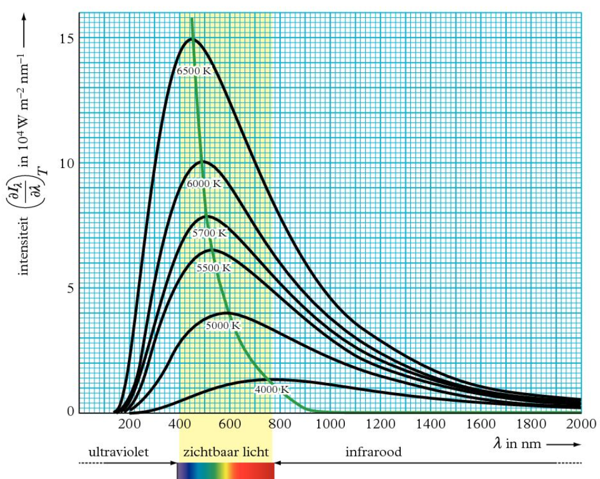
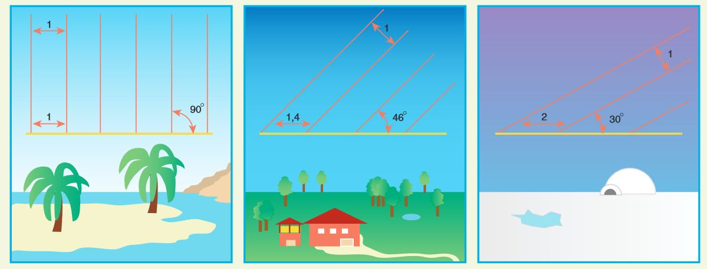

## Straling en energie

In steden kan het op warme dagen wel 5 graden warmer zijn dan op het platteland. Dit effect noem je het **urban heat island** (**UHI**).

De zon zendt 3 soorten elektromagnetische straling uit die invloed hebben op ons klimaat en het weer: zichtbaar licht, infraroodstraling (IR) en ultravioletstraling (UV).

Als er straling op een voorwerp valt, kunnen er 3 dingen gebeuren:

- **Transmissie** (t): een deel van de straling gaat door het voorwerp heen (denk aan *transparantie*)
- **Reflectie** (r): een deel van de straling wordt teruggekaatst
- **Absorptie** (a): een deel van de straling wordt opgenomen

Hieruit volgt dat $t + r + a = 1$, waarbij $t$, $r$ en $a$ de fracties zijn voor respectievelijk transmissie, reflectie en absorptie.

Elk voorwerp met een temperatuur boven 0 kelvin zendt straling uit, wat **emissie** heet. Als de absorptie van stralingsenergie even groot is als de emissie, is er sprake van een **stralingsevenwicht**. De temperatuur van het voorwerp blijft dan gelijk.

## Zwarte stralers

Een voorwerp dat alle straling absorbeert, wordt een **zwart lichaam** of **zwarte straler** genoemd. Hierdoor zendt een zwarte straler ook de meeste straling uit.

De hoeveelheid straling die een zwarte straler per seconde uitzendt, bereken je met de **stralingswet van Stefan-Boltzmann**:

$$P = A \sigma T^4$$

Hierin is $P$ het uitgestraald vermogen (in $\mathrm{W}$), $A$ het oppervlak (in $\mathrm{m}^2$), $\sigma$ de Stefan-Boltzmannconstante ($5{,}67 \cdot 10^{-8}\,\mathrm{W}\,\mathrm{m}^{-2}\,\mathrm{K}^{-4}$) en $T$ de temperatuur (in $\mathrm{K}$).

De straling die een zwarte straler uitzendt, is verdeeld over het hele EM-spectrum, waarbij de verdeling en de piek afhankelijk zijn van de temperatuur. De verdeling bij verschillende temperaturen is af te lezen uit een **Planckkromme**.

De golflengte van maximale intensiteit is te berekenen met de **verschuivingswet van Wien**:

$$\lambda_\text{max} = \frac{k_\text{w}}{T}$$

Hierin is $\lambda_\text{max}$ de golflengte met de hoogste intensiteit (in $\mathrm{m}$), $k_\text{w}$ de constante van Wien ($2{,}90 \cdot 10^{-3}\,\mathrm{m}\,\mathrm{K}$) en $T$ de temperatuur (in $\mathrm{K}$).

## Zonnestraling

De intensiteit van de zon aan de rand van de atmosfeer is de **zonneconstante**. Deze kun je berekenen met de **kwadratenwet**:

$$I = \frac{P_\text{bron}}{4\pi r^2}$$

Hierin is $I$ de intensiteit (in $\mathrm{W}/\mathrm{m}^2$), $P_\text{bron}$ het uitgestraald vermogen van de bron (in $\mathrm{W}$) en $r$ de afstand tot de bron (in $\mathrm{m}$).

Hoeveel straling daadwerkelijk het aardoppervlak bereikt, hangt af van de atmosfeer en de **zonshoogte** (de hoek die de zonnestralen met het aardoppervlak maken).

Op aarde wordt de zonshoogte bepaald door de **breedtegraad**. Hierdoor is het over het algemeen warmer op de evenaar en kouder op de polen.

## Lang- en kortgolvige straling

**Kortgolvige straling** heeft een golflengte van minder dan 300 nm en bevat meer energie per foton dan **langgolvige straling** (met een golflengte van meer dan 300 nm).

**Directe straling** komt direct van de zon op het aardoppervlak. **Diffuse straling** komt indirect op het aardoppervlak, doordat de straling eerst wordt verstrooid door de atmosfeer (bijvoorbeeld door wolken). De directe en diffuse straling samen vormen de **inkomende straling**.

### Kortgolvige straling

Van inkomende kortgolvige straling ($K_\text{in}$) wordt een deel gereflecteerd ($K_\text{r}$). De **netto kortgolvige straling** is de kortgolvige straling die niet gereflecteerd wordt:

$$K^* = K_\text{in} - K_\text{r}$$

Hierin is $K^*$ de netto kortgolvige straling (in $\mathrm{W}/\mathrm{m}^2$), $K_\text{in}$ de inkomende kortgolvige straling (in $\mathrm{W}/\mathrm{m}^2$) en $K_\text{r}$ de gereflecteerde kortgolvige straling (in $\mathrm{W}/\mathrm{m}^2$).

Het **albedo** ($A$) is het deel van de inkomende straling dat gereflecteerd wordt:

$$A = \frac{K_\text{r}}{K_\text{in}}$$

Hierin is $A$ het albedo (geen eenheid), $K_\text{r}$ de gereflecteerde kortgolvige straling (in $\mathrm{W}/\mathrm{m}^2$) en $K_\text{in}$ de inkomende kortgolvige straling (in $\mathrm{W}/\mathrm{m}^2$).

Het albedo hangt onder andere af van het type oppervlak. Sneeuw heeft een hoog albedo en weerkaatst dus veel straling.

Het gemiddelde albedo van het gehele aardoppervlak (**aardoppervlak albedo**) is lager dan het albedo van de aarde als planeet (**planetair albedo**), omdat wolken boven het aardoppervlak hangen en extra straling terugkaatsen naar de ruimte. Dit telt mee in het planetair albedo, maar niet in het aardoppervlak albedo.

### Langgolvige straling

Het aardoppervlak zendt langgolvige straling uit. De waarde van $L_\text{uit}$ is afhankelijk van de temperatuur van het aardoppervlak. Een groot deel van deze straling wordt geabsorbeerd door wolken en de atmosfeer, die vervolgens ook straling uitzenden.

De **netto langgolvige straling** is het verschil tussen de inkomende en de uitgaande langgolvige straling:

$$L^* = L_\text{in} - L_\text{uit}$$

Hierin is $L^*$ de netto langgolvige straling (in $\mathrm{W}/\mathrm{m}^2$), $L_\text{in}$ de inkomende langgolvige straling vanuit de atmosfeer (in $\mathrm{W}/\mathrm{m}^2$) en $L_\text{uit}$ de uitgaande langgolvige straling van het aardoppervlak (in $\mathrm{W}/\mathrm{m}^2$).

De netto langgolvige straling is afhankelijk van de temperatuur, de bewolking en de luchtvochtigheid. Op een bewolkte dag is de netto langgolvige straling ongeveer 0. Op een heldere dag is deze zelfs kleiner dan 0.

### Stralingsbalans

De stralingsbalans beschrijft de netto straling aan het aardoppervlak:

$$Q^* = K^* + L^* = K_\text{in} - K_\text{r} + L_\text{in} - L_\text{uit}$$

Hierin is $Q^*$ de totale netto straling (in $\mathrm{W}/\mathrm{m}^2$), $K^*$ de netto kortgolvige straling (in $\mathrm{W}/\mathrm{m}^2$) en $L^*$ de netto langgolvige straling (in $\mathrm{W}/\mathrm{m}^2$).

## Energiebalans

Als de netto straling op het aardoppervlak positief is, wordt de energie voornamelijk voor 3 processen gebruikt:

- Het opwarmen van de lucht (**voelbare warmtestroom**) ($H$)
- Het verdampen van water (**latente warmtestroom**) ($L_\text{v}E$)
- Het opwarmen van de bodem (**bodemwarmtestroom**) ($G$)

Naast $Q^*$ is er nog een energiebron: de **antropogene warmteflux** ($Q_\text{ant}$). Dit is warmte die vrijkomt door menselijke activiteit, zoals verkeer en industrie.

Samen vormen deze grootheden de totale energiebalans van het aardoppervlak:

$$Q^* + Q_\text{ant} = H + L_\text{v}E + G$$

Hierin is $Q^*$ de netto straling (in $\mathrm{W}/\mathrm{m}^2$), $Q_\text{ant}$ de antropogene warmteflux (in $\mathrm{W}/\mathrm{m}^2$), $H$ de voelbare warmtestroom (in $\mathrm{W}/\mathrm{m}^2$), $L_\text{v}E$ de latente warmtestroom (in $\mathrm{W}/\mathrm{m}^2$) en $G$ de bodemwarmtestroom (in $\mathrm{W}/\mathrm{m}^2$).

De verhouding tussen de voelbare en de latente warmtestroom is afhankelijk van de hoeveelheid water die aan het oppervlak aanwezig is. Dit is de **Bowen-verhouding** ($\beta$):

$$\beta = \frac{H}{L_\text{v}E}$$

Hierin is $\beta$ de Bowen-verhouding (geen eenheid), $H$ de voelbare warmtestroom (in $\mathrm{W}/\mathrm{m}^2$) en $L_\text{v}E$ de latente warmtestroom (in $\mathrm{W}/\mathrm{m}^2$).

Hoe hoger de Bowen-verhouding, hoe meer energie er naar het opwarmen van de lucht gaat en hoe minder naar het verdampen van water. In een woestijn is de Bowen-verhouding dus hoog, en in een moeras juist laag.

## Wind

Het **windprofiel** beschrijft het verloop van windsnelheden op verschillende hoogtes boven de grond.

$$U = \frac{u_*}{k} \ln\!\left(\frac{z}{z_0}\right)$$

Hierin is $U$ de windsnelheid op hoogte $z$ (in $\mathrm{m}/\mathrm{s}$), $u_*$ de wrijvingssnelheid (in $\mathrm{m}/\mathrm{s}$), $k$ de constante van Von Kármán ($\approx 0{,}4$, geen eenheid), $z$ de hoogte boven het oppervlak (in $\mathrm{m}$) en $z_0$ de ruwheidslengte (in $\mathrm{m}$).

De ruwheidslengte ($z_0$) beschrijft hoe ruw het oppervlak is. De wrijvingssnelheid ($u_*$) beschrijft de turbulentie en hangt af van de wrijvingskracht van de wind.

## Luchtvochtigheid

In de atmosfeer kan water voorkomen als gas, als vaste stof en als vloeistof.

De **dampdruk** ($e$) is de druk die de waterdampmoleculen in de lucht uitoefenen. De **verzadigingsdruk** ($e_\text{s}$) is de dampdruk wanneer de lucht volledig verzadigd is met waterdamp.

De **relatieve luchtvochtigheid** ($RV$) is de verhouding tussen de dampdruk en de verzadigingsdruk:

$$RV = \frac{e}{e_\text{s}}$$

Hierin is $RV$ de relatieve luchtvochtigheid (geen eenheid), $e$ de dampdruk (in $\mathrm{Pa}$) en $e_\text{s}$ de verzadigingsdruk (in $\mathrm{Pa}$).

Bij een hogere temperatuur wordt de verzadigingsdruk hoger, waardoor er meer waterdamp in de lucht kan zitten.

## Gevoelstemperatuur

Naast de werkelijke temperatuur bestaat er ook de **gevoelstemperatuur**. De gevoelstemperatuur geeft aan hoe warm of koud het voor mensen aanvoelt, en hangt volledig af van hoe ons lichaam energie uitwisselt met de omgeving.

Ons lichaam kan op 3 manieren energie afvoeren:

- Door warmtetransport naar de lucht rond het lichaam
- Door het verdampen van zweet
- Door het uitstralen van extra langgolvige straling (door een verhoging van de lichaamstemperatuur)

Welke temperatuur het lichaam ervaart, hangt af van de energie-uitwisseling met de omgeving. Die wordt bepaald door de luchttemperatuur, de luchtvochtigheid, de windsnelheid en de hoeveelheid directe straling van de zon.

Als het koud is, geeft de gevoelstemperatuur aan hoeveel energie het lichaam kwijtraakt aan de omgeving. Hier zijn vooral de luchttemperatuur en de windsnelheid van invloed, aangezien zweet en uitstraling nauwelijks een rol spelen omdat het lichaam bedekt is met kleding.

Als het warm is, geeft de gevoelstemperatuur aan hoe gemakkelijk het lichaam zijn overtollige warmte kwijt kan aan de omgeving. Hier hebben vooral de luchtvochtigheid, de windsnelheid en de inkomende straling invloed.

## Luchtkwaliteit

Onze atmosfeer bestaat uit 4 lagen: de troposfeer, de stratosfeer, de mesosfeer en de thermosfeer. In de onderste laag (troposfeer) leven wij en ontstaan alle weerverschijnselen. De temperatuur neemt met toenemende hoogte af, omdat er steeds minder straling vanaf het aardoppervlak is.

Verschillende stoffen in de atmosfeer hebben invloed op het klimaat en de luchtkwaliteit.

### Broeikaseffect

Een deel van de door de aarde uitgezonden straling wordt geabsorbeerd door **broeikasgassen** in de atmosfeer, zoals $\ce{CO2}$ en $\ce{H2O}$. Dit is het **natuurlijke broeikaseffect**. Dit effect is niet schadelijk. Het is zelfs nodig voor al het leven op aarde, want anders zou het hier veel te koud zijn. Het **versterkte broeikaseffect** is daarentegen wel rampzalig voor mens en natuur.

### Stratosferisch ozon

In de stratosfeer bevindt zich de **ozonlaag**. In deze laag neemt de temperatuur toe, doordat de ozonmoleculen UV-straling van de zon absorberen en omzetten in warmte. Ozon wordt natuurlijk opgebouwd en afgebroken via het **Chapman-mechanisme**:

**Opbouw:**

1. Een zuurstofmolecuul wordt door de opname van een UV-foton gesplitst in twee losse zuurstofatomen: $\ce{O2 ->[$E_\text{f}$] 2 O}$
2. Deze losse zuurstofatomen reageren met een zuurstofmolecuul tot ozon: $\ce{O + O2 -> O3}$

**Afbraak:**

1. Een ozonmolecuul wordt door de opname van een UV-foton gesplitst in een zuurstofmolecuul en een los zuurstofatoom: $\ce{O3 ->[$E_\text{f}$] O2 + O}$
2. Een los zuurstofatoom reageert met een ozonmolecuul tot twee zuurstofmoleculen: $\ce{O + O3 -> 2 O2}$

Door de uitstoot van CFK's (chloorfluorkoolwaterstoffen) ontstond er eind vorige eeuw een 'gat' in de ozonlaag (een sterk verminderde concentratie boven Antarctica). Dit kwam doordat CFK's onder invloed van zonlicht afbraken in chlooratomen, die vervolgens als katalysatoren werkten voor de afbraak van ozon.

## Fijnstof

**Fijnstof** bestaat uit deeltjes met een diameter van minder dan 10 micrometer. Het inademen van fijnstof is schadelijk voor de longen. In stedelijk gebied is de fijnstofproblematiek het grootst, omdat er veel uitstoot is (voornamelijk van het verkeer) en de afvoer van fijnstof slecht is.

## Smog

**Smog** is een samentrekking van de Engelse woorden *smoke* en *fog*.

**Wintersmog** ontstaat door de uitstoot van $\ce{SO2}$ en PM10 (fijnstof). De smog vormt dan een deken over de stad, omdat het in de winter vrijwel windstil is.

**Zomersmog** ontstaat door de vorming van troposferische ozon: $\ce{NO2 + O2 ->[$E_\text{f}$] NO + O3}$. Ozon in de troposfeer is schadelijk voor de gezondheid en werkt ook als broeikasgas.
