## Koolstofchemie

### Systematische naamgeving

Bij het maken van een systematische naam kijk je eerst naar de langste koolstofketen. Vervolgens kijk je naar alle aanwezige **functionele groepen**, zoals zuurgroepen, alcoholgroepen en aminegroepen. Deze groepen hebben allemaal een achtervoegsel.

Als je een stof hebt met 2 functionele groepen die beide een achtervoegsel hebben, zoals de stof in de afbeelding, moet je kijken naar de **belangrijkste** functionele groep. Deze krijgt dan het achtervoegsel, en de andere groepen krijgen een voorvoegsel. Welke groepen voorrang krijgen, staat in Binas 66D.

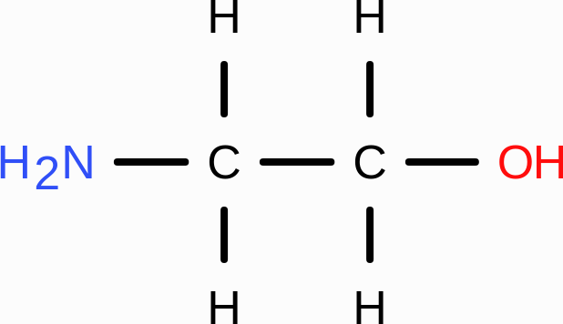

| Groep        | Voorvoegsel | Achtervoegsel |
| ------------ | ----------- | ------------- |
| Zuurgroep    | -           | -zuur         |
| Alcoholgroep | hydroxy-    | -ol           |
| Aminegroep   | amino-      | -amine        |

Alcoholgroepen zijn belangrijker dan aminegroepen, dus de naam van de stof in de afbeelding is 2-aminoethaan-1-ol.

#### Esters

We kennen **esters** al van de reactievergelijking $\ce{alcohol + zuur -> ester + water}$.

Bij de systematische naamgeving van esters kijk je niet naar de langste koolstofketen, maar naar welk deel van het ester het zuur was. Dit is de stam en krijgt het achtervoegsel -oaat. Vervolgens is de rest van de koolstofketen een zijgroep hiervan.

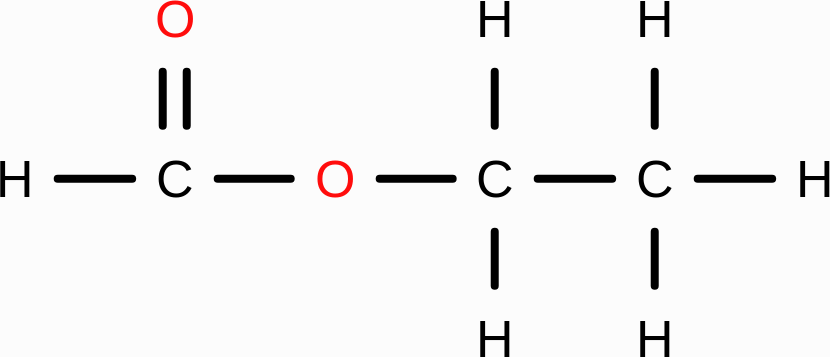

De stof in de afbeelding is dus ethylmethanoaat.

#### Ethers

**Ethers** zijn stoffen met een $\ce{O}$ in de koolstofketen. Ze worden benoemd met het voorvoegsel **alkoxy-**, waarbij "alk" de naam van de koolstofketen aan de $\ce{O}$ aangeeft: methoxy voor 1 koolstof, ethoxy voor 2 koolstoffen, enzovoort.

Bij de naamgeving kijk je ook hier naar de **langste** koolstofketen, die de stam vormt. De kortere keten die aan de $\ce{O}$ vastzit, geeft het alkoxy-voorvoegsel.

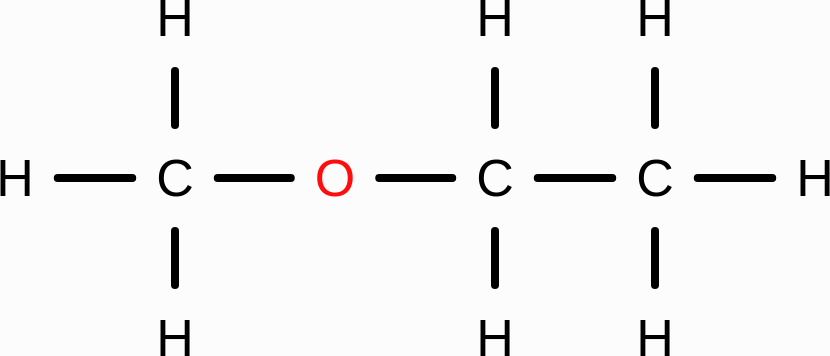

De afgebeelde stof is dus methoxyethaan.

#### Aldehyden en ketonen

Een **aldehyde** heeft een carbonylgroep ($\ce{C=O}$) met een extra $\ce{H}$ aan het **einde** van de keten ($\ce{-CHO}$). Een **keton** heeft een carbonylgroep **midden** in de keten.

Als voorvoegsel gebruiken ze beide **oxo-**. Aldehyden krijgen het achtervoegsel **-al** en ketonen krijgen **-on**.

### Isomerie

Bij **structuurisomeren** hebben 2 stoffen dezelfde molecuulformule maar een andere structuur.

Bij **ruimtelijke isomeren** (of **stereo-isomeren**) hebben stoffen dezelfde molecuulformule en zijn dezelfde atomen aan elkaar gebonden, maar hebben ze een andere ruimtelijke bouw.

#### Cis-trans isomerie

Enkelvoudige bindingen kunnen vrij ronddraaien. De 2 stoffen hieronder zijn dus hetzelfde.

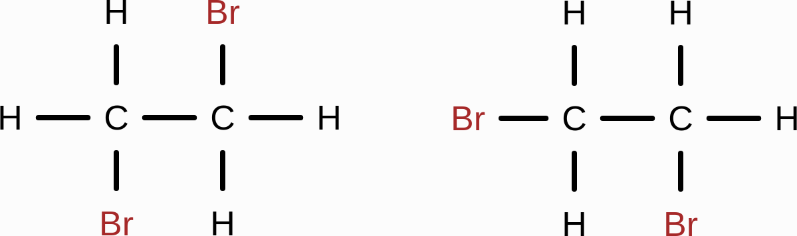

Dubbele bindingen en cycloverbindingen kunnen echter niet vrij rondraaien, waardoor de 2 stoffen hieronder niet hetzelfde zijn.

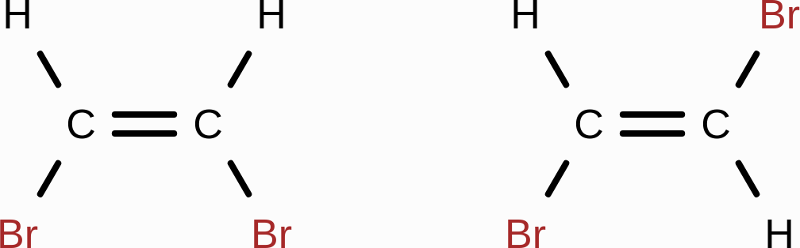

De linkerstof heet **cis**-1,2-dibroometheen en de rechter **trans**-1,2-dibroometheen. Cis betekent **aan dezelfde zijde** en trans **aan de overzijde**.

Ook bij cycloverbindingen kun je cis-trans isomerie hebben. Bij benzeen is cis-trans isomerie niet mogelijk: de benzeenring is vlak, waardoor er geen boven- en onderkant is.

#### Spiegelbeeldisomerie

2 moleculen kunnen ook elkaars spiegelbeeld zijn. De 4 buren van een C-atoom vormen namelijk een **tetraëder**: ze staan in 2 vlakken loodrecht op elkaar in 3D. Een dikke gevulde driehoek betekent dat het atoom naar voren komt, en streepjes dat het naar achteren gaat.

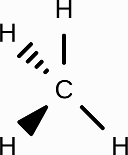

Voor spiegelbeeldisomerie heb je een C-atoom nodig met 4 verschillende buren. Dit C-atoom heet dan **asymmetrisch** of **chiraal** en duid je aan als C*.

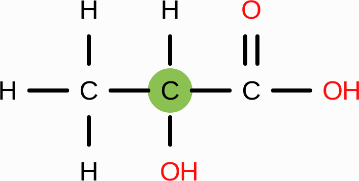

Het groen gemarkeerde C-atoom in de afbeelding is het asymmetrische koolstofatoom, want het heeft 4 verschillende buren: een $\ce{CH3}$-groep, een $\ce{OH}$-groep, een zuurgroep en een $\ce{H}$.

## Kunststoffen

Een **kunststof** is een materiaal dat is opgebouwd uit **polymeren**. Een polymeer is een lange keten van herhalende bouwstenen, die **monomeren** heten. Plastic is het bekendste voorbeeld hiervan.

Er zijn 2 belangrijke soorten kunststoffen: **thermoplasten** en **thermoharders**.

Thermoplasten vervormen makkelijk als je ze verwarmt. Op microniveau bestaan ze uit losse polymeerketens (lijnstructuur).

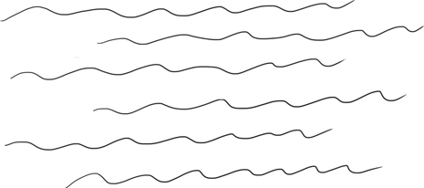

Thermoharders vervormen nauwelijks als je ze verwarmt. Op microniveau hebben ze een **netwerkstructuur** met **crosslinks**.

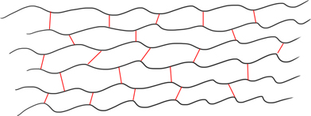

Dit kun je op microniveau verklaren: bij thermoharders zijn er meer en sterkere atoombindingen, waardoor het smeltpunt veel hoger ligt.

**Weekmakers** zijn stoffen die je aan een polymeer toevoegt om het soepeler te maken. Ze gaan tussen de polymeerketens in zitten, waardoor de ketens minder sterk aan elkaar trekken en makkelijker langs elkaar kunnen schuiven. Soms kan een polymeer zelfs volledig oplossen in een weekmaker, zoals piepschuim in aceton.

### Polymerisatie

Er zijn 2 manieren om polymeren te maken: **polyadditie** en **polycondensatie**.

#### Polyadditie

Bij polyadditie klapt de dubbele binding open, zodat de monomeren aan elkaar kunnen binden.

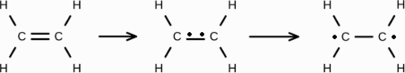

Vervolgens kunnen deze 2 eenheden aan elkaar binden.

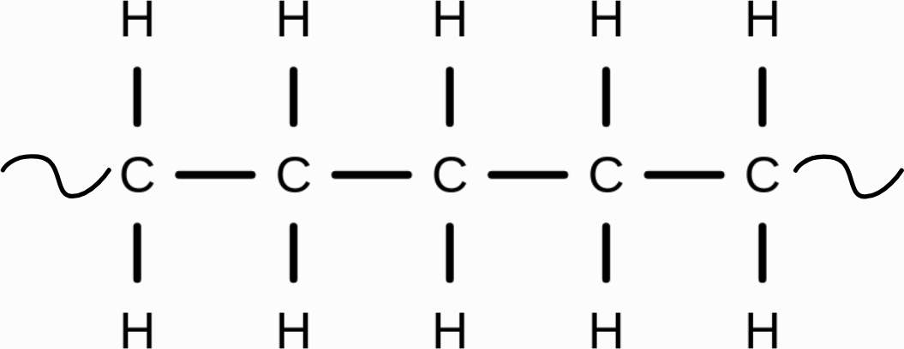

Zo ontstaat **polyetheen**: door veel etheenmoleculen aan elkaar te koppelen.

Het is handig om het molecuul in 3 regels te splitsen: de middelste regel bevat alleen de dubbele binding en de andere twee regels bevatten de zijgroepen.

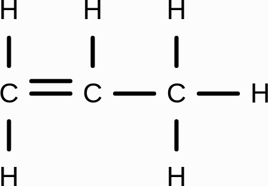

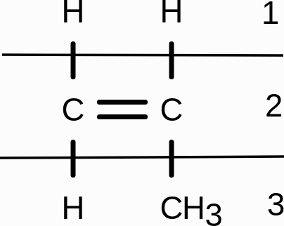

Als een molecuul 2 dubbele bindingen heeft, kunnen er 2 dingen gebeuren: de dubbele binding springt "naar het midden" (en je krijgt een lijnstructuur), of de dubbele bindingen staan op 2 aparte regels zodat de binding op meerdere plekken open kan klappen, en dan krijg je een thermoharder.

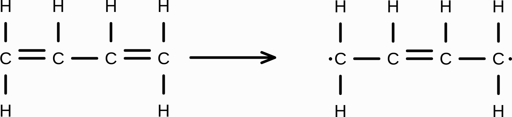

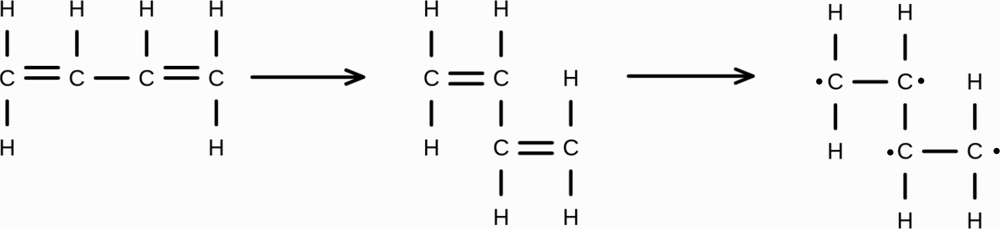

#### Polycondensatie

Bij **polycondensatie** maak je een polymeer via condensatiereacties. Bij een **condensatiereactie** "plak" je 2 moleculen aan elkaar door een kleiner molecuul (vaak water) weg te halen, zoals bij $\ce{alcohol + zuur -> ester + water}$.

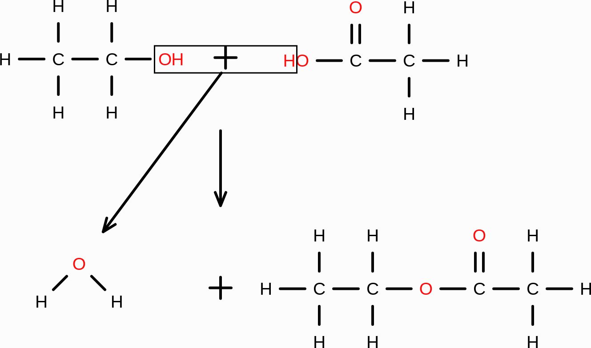

Voor polycondensatie heeft elk monomeer 2 alcohol- en/of zuurgroepen nodig, zodat het aan beide kanten kan reageren en de keten steeds verder groeit.

#### Copolymeren

Als je een polymeer maakt van 2 of meer verschillende monomeren, heet dat een **copolymeer**. De monomeren kun je op verschillende manieren afwisselen, zoals AABBAA, ABABAB of AABBAAB. Door de volgorde en verhouding te variëren kun je de eigenschappen van het polymeer aanpassen.

## Industrie en groene chemie

Om de chemische industrie te verduurzamen, gebruiken bedrijven de 12 principes van de **groene chemie** (ze staan ook in Binas 97A!):

1. Zo min mogelijk afval
2. Zo efficiënt mogelijk atoomgebruik (**atoomeconomie**: hoeveel atomen van de beginstoffen komen in het product terecht, berekend met $\frac{m_\text{product}}{m_\text{beginstoffen}}$, hoe hoger hoe beter)
3. Zo min mogelijk schadelijke productiemethoden
4. Zo min mogelijk schadelijke eindproducten
5. Zo min mogelijk oplosmiddelen en hulpstoffen
6. Zo min mogelijk energieverbruik, bij voorkeur bij lage temperaturen en drukken, en gebruikte energie zoveel mogelijk hergebruiken
7. Zo veel mogelijk hernieuwbare grondstoffen
8. Zo min mogelijk tussenstappen in reacties
9. Zo veel mogelijk katalyse
10. Afbraakproducten mogen niet giftig zijn en mogen niet ophopen in het milieu
11. Tussentijdse analyse om vervuiling vroeg te ontdekken
12. Zo min mogelijk risico op ongelukken, brand en explosie

De **E-factor** is een maat voor hoeveel afval een proces produceert per kilogram eindproduct:

$$\text{E-factor} = \frac{m_\text{afval}}{m_\text{product}} = \frac{m_\text{beginstoffen} - m_\text{product}}{m_\text{product}}$$

Hoe lager de E-factor, hoe milieuvriendelijker het proces. Een E-factor van 0 betekent geen afval.

### Blokschema's

In een **blokschema** worden chemische processen weergegeven als blokken, verbonden door pijlen die de **stofstromen** voorstellen.

Bij een reactie vindt een stofomzetting plaats. Dit herken je aan een stofstroom die van samenstelling verandert.

Bij een scheiding komt een mengsel via 1 stofstroom het blok binnen en verlaten de stoffen het blok via aparte stofstromen.
